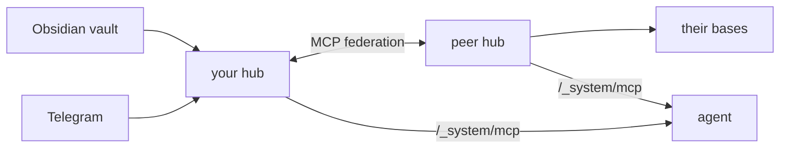

# trip2g

[](LICENSE)
[](https://golang.org)

**Open-source MCP knowledge mesh.** Self-host your knowledge bases, expose them to AI agents via MCP, and federate with peers — no SaaS in the middle.

Unlike Obsidian Publish or Quartz, trip2g is a live server: subscriptions, webhook agents, federation between hubs, and an MCP endpoint out of the box.

[Try the public hub →](#try-it-now) · [Self-host](#self-host) · [Docs](https://trip2g.com/en/user)


---

## Second brain network for your agents

> *A second brain isn't one person's vault — it's the shared knowledge of people who think about the same things.*

Each person runs a hub with their own notes. Agents reach into it directly via MCP. Hubs peer with each other, so one question fans out across the network — your bases plus the ones your trusted peers share with you.

```
   human A           human B           human C
      │                 │                 │
      ▼                 ▼                 ▼
   agent A           agent B           agent C
      │                 │                 │
      ▼                 ▼                 ▼
  ┌────────┐  MCP  ┌────────┐  MCP  ┌────────┐
  │ hub A  │ ◄───► │ hub B  │ ◄───► │ hub C  │
  └────────┘       └────────┘       └────────┘
       ▲                 ▲                 ▲
       └─── humans browse · agents query ──┘
```

Same hub serves the human (a website with subscriptions, RSS, Telegram) and the agent (MCP). Data lives where you put it. trip2g is a protocol, not a vendor.

---

## Try it now

Add the public knowledge hub to your MCP client:

```json
{
  "mcpServers": {
    "trip2g": {
      "url": "https://trip2g.com/_system/mcp"
    }
  }
}
```

Ask your agent anything. It searches all connected bases and returns answers with sources.

Want your own? [Free cloud instance](https://simplecloud.2pub.me) — no terminal needed.

---

## Core capabilities

**Markdown → website**
- Wikilinks (`[[note]]`), backlinks, outlinks — global resolution, just like Obsidian
- Composable page layouts via frontmatter: sidebars, magazine grid, TOC, custom note embeds
- Hybrid search: bleve full-text + OpenAI embeddings, merged via reciprocal rank fusion
- Custom domains, multi-language with `hreflang`, RSS output, sitemap

**MCP server** — built into every hub:

| Tool | Purpose |
|------|---------|
| `search` | Hybrid full-text + semantic search |
| `note_html` | Read a note (or a section) by id, path, or match |
| `similar` | Notes similar to a given note |
| `federated_search` / `federated_similar` / `federated_note_html` | Same, fanned out to peer hubs |
| `instructions` | Author-defined prompt for the agent |

Access is scoped to the caller's subscription. Custom tools can be defined in note frontmatter (`mcp_method:`).

**Webhook agents**
- *Change webhooks* — POST to an external agent on note create/update/remove. Agent writes notes back via API. Glob filtering, HMAC auth, depth tracking prevents recursion.
- *Cron webhooks* — run an agent on a schedule (`0 9 * * *`). Sync or async. Optional instruction context.

**Monetization**
- Subgraph paywalls — group notes into paid products, free notes stay public
- Crypto payments (NowPayments), Patreon and Boosty integration

**Obsidian plugin** — one-click sync, hash-based diff, only changed files are uploaded.

---

## Federation



Peer hubs with trusted people or orgs. Each hub controls access per base. One agent question reaches the union of all connected knowledge.

| Topology | Setup | Result |
|----------|-------|--------|
| Solo | One hub, many bases | All your notes, books, courses — one query |
| Friends | Each person runs a hub, hubs peer | Union of everyone's knowledge |
| Company | Central hub + per-employee hubs | Tribal knowledge and docs — queryable |
| B2B | Two star topologies, one bridge | Shared knowledge without merging systems |

---

## Sources

| Source | Status |
|--------|--------|
| Obsidian | ready — vault stays local, two-way sync |
| Telegram | ready — channel publish + history mirror |
| RSS output | ready — every base exposes feeds |
| Notion | planned |
| Google Drive | planned |
| Linear, Slack archive, RSS import | planned |

---

## Template system

Two paths — pick one per knowledge base.

**A. Default template** (no code, frontmatter-only). Built-in trip2g layout. Compose pages from widgets and content blocks via frontmatter:

```yaml
---
header: "[[Navigation]]"
left_sidebar: [TOC, inlinks]
content: [selfcontent, magazine]
magazine_include_files: "blog/**/*.md"
footer: "[[Footer]]"
---
```

Rendered through quicktemplate. Notes can also render as HTML, JSON, RSS via `content_type` frontmatter.

**B. Custom Jet templates** (full control). Drop your own `.html` files into a layouts folder and switch via `layout: path/to/template`. Templates have access to the markdown AST — iterate sections, render specific parts, customize layout down to HTML. Built on the [Jet template engine](https://github.com/CloudyKit/jet).

---

## Self-host

```bash
docker compose up
```

[Full guide →](https://trip2g.com/en/user/selfhosted) · MIT · SQLite, no external dependencies required.

---

## Tech stack

| | |
|---|---|
| Backend | Go, FastHTTP, gqlgen (GraphQL) |
| Database | SQLite + [Litestream](https://litestream.io) for streaming backup |
| Search | bleve (full-text) + OpenAI embeddings (semantic) |
| Markdown | [Goldmark](https://github.com/yuin/goldmark) — wikilinks, frontmatter |
| Templates | quicktemplate (default) + [Jet](https://github.com/CloudyKit/jet) (custom) |
| Frontend | [$mol](https://mol.hyoo.ru), TypeScript, Tiptap |
| Assets | S3-compatible (MinIO for dev) |

---

## License

MIT
