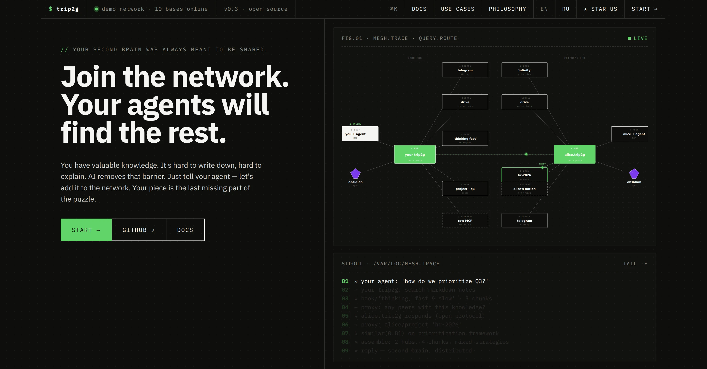
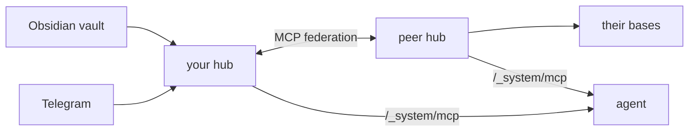
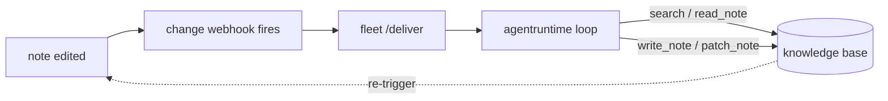

# trip2g

[](LICENSE)
[](https://golang.org)

**Markdown Operating System.** A self-hosted server where every note is a file, the shared knowledge base is the kernel, and the same note is served two ways: to a human as a web page, to an agent as an MCP call. Obsidian vaults and Telegram channels go in; a website, an MCP endpoint, hub-to-hub federation, and note-triggered agents come out.

trip2g is a live, multi-tenant server for markdown (Go, SQLite, MIT, no SaaS in the middle), not a local editor like Obsidian or a static build like Quartz.

[Try the public hub →](#try-it-now) · [Self-host](#self-host) · [Docs](https://trip2g.com/en/user)



---

## Everything is a note

> Unix made everything a file. trip2g makes everything a note.

One global namespace, path-addressed, shared by humans and agents. A note is a markdown file: the frontmatter is its metadata, the body is its content. The same note is served as a web page (the display server) and over MCP (the agent's syscall surface), and every edit is snapshotted into `note_versions` and mirrored to git. So the history is a readable diff, not a binary blob.

```
   human A           human B           human C
      │                 │                 │
      ▼                 ▼                 ▼
   agent A           agent B           agent C
      │                 │                 │
      ▼                 ▼                 ▼
  ┌────────┐  MCP  ┌────────┐  MCP  ┌────────┐
  │ hub A  │ ◄───► │ hub B  │ ◄───► │ hub C  │
  └────────┘       └────────┘       └────────┘
       ▲                 ▲                 ▲
       └─── humans browse · agents query ──┘
```

The same hub serves the human (a website with subscriptions, RSS, Telegram) and the agent (MCP). Your data stays in plain markdown you can move out any time.

---

## The map

trip2g borrows the operating-system vocabulary because the primitives line up. Each row is tagged by how real it is: **shipped** is running code on `main`, **branch** is running code on `feat/agent-runtime`, **planned** is a design doc.

| OS concept | trip2g primitive | Status |
|---|---|---|
| Filesystem | one path-addressed note namespace, humans and agents share it | shipped |
| Files | notes: markdown frontmatter (metadata) + body (content) | shipped |
| Snapshots | `note_versions` + DB-canonical git mirror (`gitapi`) | shipped |
| Filesystem over git | `git clone`/`pull`/`push` the vault over Smart HTTP (`/_system/git`) | shipped |
| Syscalls | MCP tools: `search`, `note_html`, `similar`, `federated_*` | shipped |
| Network stack | federation: fan one query out to peer hubs | shipped |
| Scheduler | cron webhooks (`next_run_at`) + goqite worker pools | shipped |
| Process dispatch | webhook delivery: note create/update/remove → POST | shipped |
| IPC | notes as an event bus: one agent's write fires the next | shipped |
| Display server | website rendering: default + Jet templates, mermaid, datachart | shipped |
| Output target | publish notes to a Telegram channel, links preserved | shipped |
| Standard input | forms in frontmatter, submissions stored per note | shipped |
| Permissions (users) | subgraphs + subscription ACLs, admins, API keys | shipped |
| Permissions (agents) | per-webhook `read_patterns`/`write_patterns` in a scoped token | shipped |
| Credential store | encrypted `secrets` / `federation_secrets` (AES-256-GCM) | shipped |
| Control surface | kanban board note (`layout: kanban`) | shipped (layout), branch (agent wiring) |
| Process executor | internal LLM run loop (`agentruntime`), tool allowlist + caps | branch |
| Package manager | role-as-note: drop a note, `fleet` registers the agent | branch |
| Resource limits | non-overridable token + step caps per run | branch |

---

## Try it now

Add the public knowledge hub to your MCP client:

```json
{
  "mcpServers": {
    "trip2g": {
      "url": "https://trip2g.com/_system/mcp"
    }
  }
}
```

Ask it a question. It searches all connected bases and returns answers with sources.

Want your own? [Free cloud instance](https://simplecloud.2pub.me), no terminal needed.

---

## Syscalls: the MCP server

Built into every hub. An agent never touches the database directly. It calls a small set of [tools over MCP](https://trip2g.com/en/user/mcp), and access is scoped to the caller's subscription.

| Tool | Purpose |
|------|---------|
| `search` | Hybrid full-text + semantic search |
| `note_html` | Read a note (or a section) by id, path, or match |
| `similar` | Notes similar to a given note |
| `federated_search` / `federated_similar` / `federated_note_html` | Same, fanned out to peer hubs |
| `instructions` | Author-defined prompt for the agent |

Custom tools can be defined in note frontmatter (`mcp_method:`).

---

## Network stack: federation



[Peer hubs](https://trip2g.com/en/user/federation) with trusted people or orgs. Each hub controls access per base. One agent question reaches the union of all connected knowledge. Loops are bounded the way IP packets are: each hub enforces `max_depth` against a per-hop counter (the `X-MCP-Federation-Depth` header), and every call carries a short-expiry, HMAC-signed token.

Each hub is itself a Markdown OS, so the network is a mesh between operating systems, the way the internet is a network between computers. The rows below are common shapes, not the only ones. The protocol does not assume a topology, so you can build any of them.

| Topology | Setup | Result |
|----------|-------|--------|
| Solo | One hub, many bases | All your notes, books, courses in one query |
| Friends | Each person runs a hub, hubs peer | Union of everyone's knowledge |
| Company | Central hub + per-employee hubs | Tribal knowledge and docs, queryable |
| B2B | Two star topologies, one bridge | Shared knowledge without merging systems |

---

## Process dispatch & scheduler: webhook agents

The kernel-side mechanism that runs an agent. Shipped on `main`.

- **[Change webhooks](https://trip2g.com/en/user/webhooks).** A note create/update/remove POSTs to an agent, and the agent writes notes back via the API. Glob filtering picks which notes fire it, HMAC signs the delivery, and `max_depth` stops recursion.
- **Cron webhooks.** Run an agent on a schedule (`0 9 * * *`). A `next_run_at` column plus a per-minute system cron drive it, and goqite worker pools give per-queue concurrency and priority. Sync or async, with optional instruction context.

The agent itself can live anywhere. These webhooks just deliver the event and accept note writes back.

---

## Userland: the agent fleet

> *In development on `feat/agent-runtime`, not yet on `main`.*

The core idea: a note edit spawns a scoped, server-side agent run. Unlike a local editor or a static builder, the agent runs on the hub, scoped to the note's glob patterns, not on your laptop.

An agent is a note. Its frontmatter is the config: `model`, `tools`, `read_patterns`/`write_patterns`, `trigger_on`, `for_each`, `max_depth`, `timeout_seconds`. Its body is the instruction, a Jet template that can reference the changed note(s). A `fleet` daemon watches an agents folder, parses each role note, and registers it as a change webhook pointed back at itself. Drop a note to install an agent, remove the note to uninstall it.



When a watched note changes, trip2g fires the webhook and the fleet runs a scoped loop (`agentruntime`): the model gets the instruction plus in-scope context and calls `search` / `read_note` / `write_note` / `patch_note`. Reads and writes are enforced against the role's glob patterns, a non-overridable token-and-step cap limits the run, and `max_depth` breaks re-trigger loops. trip2g stays a plain event source. The instruction, scope, and triggers all live in the note.

The plumbing this rides on (change/cron webhooks, scoped tokens, delivery jobs) is shipped on `main`. The in-note LLM executor (`agentruntime`) and the fleet reconciler (`internal/fleet`, `cmd/fleet`) are what `feat/agent-runtime` adds.

---

## Control surface: the kanban board

A board is a note with [`layout: kanban`](https://trip2g.com/en/user/kanban), and cards are lines like `- ship the docs @status:doing @assigned:bob`. Editing a card is a note edit, so the same trigger that drives any agent can drive a triage agent that reads the board and `patch_note`s cards in place. The note is both how a human directs work and the agent's input and output.

The kanban layout (`docs/_layouts/kanban.html`) and the standalone `kanban_template` ship on `main`. Wiring a board to the fleet is part of `feat/agent-runtime`.

---

## Display server: templates and renderers

Two paths, pick one per knowledge base.

**A. Default template** (no code, frontmatter only). Compose pages from widgets and content blocks:

```yaml
---
header: "[[Navigation]]"
left_sidebar: [TOC, inlinks]
content: [selfcontent, magazine]
magazine_include_files: "blog/**/*.md"
footer: "[[Footer]]"
---
```

Rendered through quicktemplate. Notes can also render as HTML, JSON, or RSS via `content_type` frontmatter.

**B. [Custom Jet templates](https://trip2g.com/en/user/templates)** (full control). Drop your own `.html` files into a layouts folder and switch via `layout: path/to/template`. Templates get the markdown AST, so you can iterate sections, render specific parts, and customize down to HTML. Built on the [Jet template engine](https://github.com/CloudyKit/jet).

On top of either path sit renderer extensions that the backend loads per note, only when a note asks for them: [mermaid](https://trip2g.com/en/user/mermaid) diagrams and a [`datachart`](https://trip2g.com/en/user/chartdata) widget that turns a referenced CSV into a chart (via ECharts). A note declares what it needs, and the page ships only those scripts.

---

## Telegram: notes become channel posts

The same notes publish to a Telegram channel, on a schedule or instantly. trip2g keeps the links intact: a wikilink to a note that has its own post points at that post, and a note that is not posted yet falls back to its page on the website, so nothing dangles. Edit the note and re-sync, and the channel post updates itself. [Full guide →](https://trip2g.com/en/user/telegram)

---

## Forms: structured input

A note can collect input, not just show it. Put a `form:` block in the frontmatter and trip2g renders a form on the page, accepts submissions through the GraphQL API, and stores each one against the note.

```yaml
---
title: Say hello
form:
  fields:
    - name: email
      type: email
      required: true
    - name: message
      type: text
      max_length: 2000
---
```

Field types and validators live in the frontmatter, Cloudflare Turnstile guards public forms by default, and `can_submit` limits who may post. Submissions land in the admin panel and a GraphQL API, and each one emails the vault admins. Define a spec once and reuse it with `form_ref:`, or attach a form to a whole folder with frontmatter patches. In OS terms, this is the note's standard input. [Full guide →](https://trip2g.com/en/user/forms)

---

## Git: the vault is a repo

trip2g serves the whole knowledge base over git Smart HTTP at `/_system/git`. Clone it, pull it, and push to it like any repository. The database is canonical; the git tree is not a checkout sitting on disk, `gitapi` materializes it on demand at the moment you interact with the endpoint, and a push is applied back into the notes. So you can back up the vault with `git clone` (the full history comes down with it) and script changes with a commit instead of the API.

---

## Monetization

Group notes into paid products with [subgraph paywalls](https://trip2g.com/en/user/monetization), while free notes stay public. Payments go through crypto (NowPayments), Patreon, or Boosty.

---

## Sources

| Source | Status |
|--------|--------|
| [Obsidian](https://trip2g.com/en/user/two-way-sync) | ready: vault stays local, two-way sync |
| [Telegram](https://trip2g.com/en/user/telegram) | ready: channel publish + history mirror |
| [RSS output](https://trip2g.com/en/user/rss) | ready: every base exposes feeds |
| Notion | planned |
| Google Drive | planned |
| Linear, Slack archive, RSS import | planned |

---

## Self-host

```bash
docker compose up
```

trip2g runs as one process on SQLite, with no database server to stand up, so a hub starts the same on a laptop, a small VM, or a container. When you need high availability, add read-only replicas that scale reads horizontally while a single leader takes the writes (on the `feat/read-replica` branch).

[Full guide →](https://trip2g.com/en/user/selfhosted) · MIT · runs on SQLite alone; semantic search needs an embeddings API (OpenAI or any compatible endpoint), while full-text search works offline.

---

## Tech stack

| | |
|---|---|
| Backend | Go, FastHTTP, gqlgen (GraphQL) |
| Database | SQLite + [Litestream](https://litestream.io) for streaming backup |
| Search | bleve (full-text) + embeddings via any OpenAI-compatible API (semantic) |
| Markdown | [Goldmark](https://github.com/yuin/goldmark): wikilinks, frontmatter |
| Templates | quicktemplate (default) + [Jet](https://github.com/CloudyKit/jet) (custom) |
| Charts & diagrams | mermaid, ECharts (`datachart`) |
| Frontend | [$mol](https://mol.hyoo.ru), TypeScript |
| Assets | S3-compatible (MinIO for dev) |

---

## Inspiration

The OS framing is adapted from [*Markdown as an Operating System*](https://leverageai.com.au/markdown-as-an-operating-system/) and from Unix's [*everything is a file*](https://en.wikipedia.org/wiki/Everything_is_a_file). Three lines we took to heart:

- **Markdown is the universal substrate.** One file every tool and every model already reads; render the website, the feed, and the git history from it.
- **The file is the interface between processes.** An agent writing a note fires the next agent, so coordination needs no separate queue API.
- **Human-readable diffs are the audit log.** Every edit is a `note_version` and a commit you can read in five seconds and revert.

---

## License

MIT
