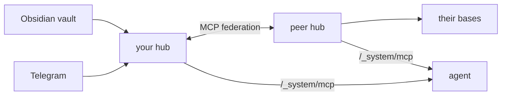

# trip2g

[](LICENSE)
[](https://golang.org)

**Open-source MCP knowledge mesh.** Self-host your knowledge bases, expose them via MCP, and federate with peers — no SaaS in the middle.

Unlike Obsidian Publish or Quartz, trip2g is a live server: subscriptions, webhook agents, federation between hubs, and an MCP endpoint out of the box.

[Try the public hub →](#try-it-now) · [Self-host](#self-host) · [Docs](https://trip2g.com/en/user)


---

## Try it now

Add the public knowledge hub to your MCP client:

```json
{
  "mcpServers": {
    "trip2g": {
      "url": "https://trip2g.com/_system/mcp"
    }
  }
}
```

Ask your agent anything. It searches all connected bases and returns answers with sources.

Want your own? [Free cloud instance](https://simplecloud.2pub.me) — no terminal needed.

---

## Core capabilities

**Markdown → website**
- Wikilinks (`[[note]]`), backlinks, outlinks — global resolution, just like Obsidian
- Composable page layouts via frontmatter: sidebars, magazine grid, TOC, custom note embeds
- Full-text search (bleve) + semantic search (pluggable embeddings)
- Custom domains, multi-language with `hreflang`, RSS feeds, sitemap

**MCP server** — built into every hub:
```
search_notes   full-text + semantic search
get_note       retrieve by id or slug
list_notes     list notes accessible to the caller
```
Access is scoped to the caller's subscription level.

**Webhook agents**
- *Change webhooks* — POST to an external agent on note create/update/remove. Agent writes notes back via API. Glob filtering, HMAC auth, depth tracking prevents recursion.
- *Cron webhooks* — run an agent on a schedule (`0 9 * * *`). Sync or async. Optional instruction context.

**Monetization**
- Subgraph paywalls — group notes into paid products, free notes stay public
- Crypto payments (NowPayments), Patreon and Boosty integration

**Obsidian plugin** — one-click sync, hash-based diff, only changed files are uploaded

---

## Federation



Peer hubs with trusted people or orgs. Each hub controls access per base. One agent question reaches the union of all connected knowledge.

| Topology | Setup | Result |
|----------|-------|--------|
| Solo | One hub, many bases | All your notes, books, courses — one query |
| Friends | Each person runs a hub, hubs peer | Union of everyone's knowledge |
| Company | Central hub + per-employee hubs | Tribal knowledge and docs — queryable |
| B2B | Two star topologies, one bridge | Shared knowledge without merging systems |

---

## Sources

| Source | Status |
|--------|--------|
| Obsidian | ready — vault stays local, two-way sync |
| Telegram | ready — channel publish + history mirror |
| Notion | in progress |
| Google Drive | in progress |
| Linear, Slack archive, RSS | planned |

---

## Template system

Every page is a Jet template. Configure layout per-note via frontmatter — no code changes:

```yaml
---
header: "[[Navigation]]"
left_sidebar:
  - TOC
  - inlinks
content:
  - magazine
  - selfcontent
magazine_include_files: "blog/**/*.md"
magazine_sort_property: published_date
footer: "[[Footer]]"
---
```

Notes can render as any content type — HTML, JSON, RSS — via `content_type` frontmatter.

---

## Self-host

```bash
docker compose up
```

[Full guide →](https://trip2g.com/en/user/selfhosted) · MIT · SQLite, no external dependencies required.

---

## Tech stack

| | |
|---|---|
| Backend | Go, FastHTTP, gqlgen (GraphQL) |
| Database | SQLite (+ [Litestream](https://litestream.io), optional) |
| Search | bleve (full-text) + pluggable embeddings (semantic) |
| Markdown | Goldmark — wikilinks, frontmatter |
| Templates | Jet template engine |
| Frontend | [$mol](https://mol.hyoo.ru), TypeScript, Tiptap |
| Assets | S3-compatible (MinIO for dev) |

---

## License

MIT
