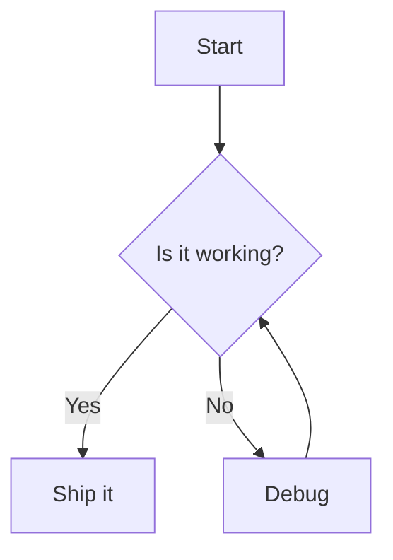
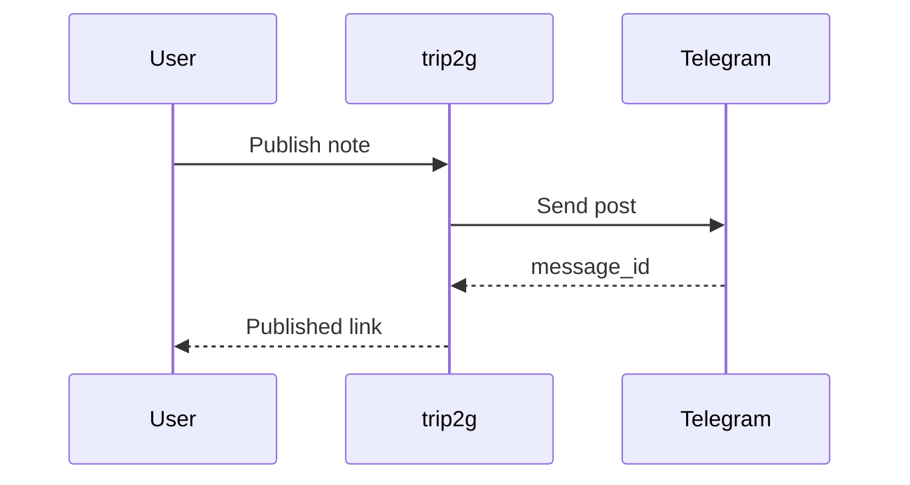
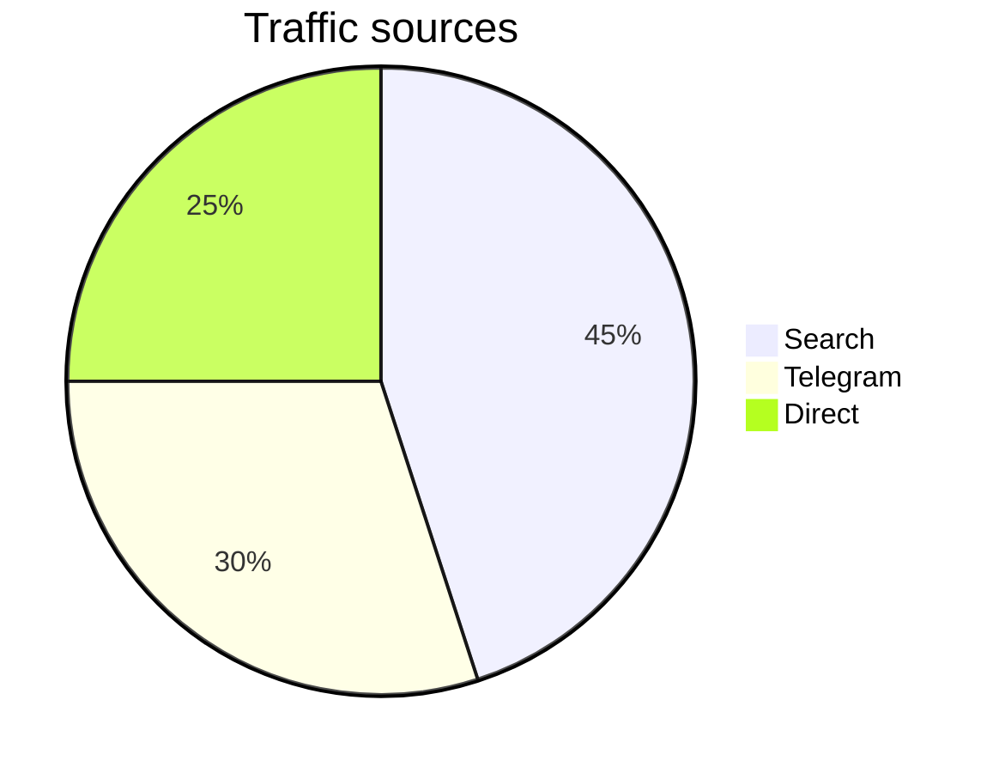

# Mermaid diagrams

Obsidian renders ` ```mermaid ` fenced blocks as diagrams out of the box, and so
does trip2g. Write the diagram in a `mermaid` code block — trip2g loads the
mermaid renderer only on pages that actually contain one, so diagram-free pages
pay nothing.

## Flowchart



## Sequence diagram



## Pie chart


