# User Docs — Mermaid Diagrams Plan

_Created 2026-06-21. Source: the `docs-visuals-analysis` multi-agent run over `docs/{en,ru}/user/`._

## Goal

Add Mermaid diagrams to the highest-value user-doc pages. The analysis kept **29 diagrams** (20 high, 9 medium) out of 80 raw ideas — dropping decorative two-node flows and comparisons that are better as Markdown tables. Ready-to-paste, syntax-checked code for every kept diagram is in [§ Diagrams](#diagrams-ready-to-paste) below.

## Conventions

- Mermaid renders inside <code>```mermaid</code> fences — see `docs/en/user/mermaid.md` for the supported diagram types.
- **Label line breaks use `<br/>`, never `\n`** (literal `\n` shows as text). All code below is already cleaned.
- **Insert faithfully** — every diagram must reflect only what the page already describes; invent no product behavior.
- **ASCII-art spots are replacements**, not additions: protocol "pipeline" + "federation", `mcp` "How it works", `llm-wiki` "Two modes" already ship ASCII art — swap the block for the diagram.
- Locate by **heading/section**, not by the line numbers in the table (those are EN snapshots and drift).

## Scope of the first pass

This pass inserts each diagram into the language the analysis sourced it from: **EN pages + the RU-only pages** (`oauth`, `Импорт из Telegram`, `Публикация через аккаунты`, `change_webhooks`, `cron_webhooks`). RU twins of EN pages are **not** edited yet — they need localized labels and several are flagged for rewrite in the docs audit. See [RU parity follow-up](#ru-parity-follow-up).

## Not doing

- **Datacharts** — none recommended. No numeric/time-series data on these pages; the existing `*.datachart.csv` fixtures already cover the only quantitative datasets.
- **Admin screenshots via e2e** — fully analyzed (admin-screen → doc-page manifest + a dual-use Playwright `toHaveScreenshot()` / `CAPTURE_DOCS` harness), but **deferred: too complex for now**. The manifest and harness plan are recoverable from the `docs-visuals-analysis` run if revisited.

## Priority table

| Priority | Page | Type | Location |
|---|---|---|---|
| high | federation.md (+ru) | sequenceDiagram | "Adding a private peer" — two-step HMAC key exchange |
| high | federation.md (+ru) | flowchart | "Federation graph" — turn the 7-status table into a debug tree |
| high | two-way-sync.md (+ru) | stateDiagram | "Status indicator" — the colored-dot lifecycle |
| high | protocol.md (+ru) | flowchart | "The pipeline" — replace the ASCII art |
| high | search.md (+ru) | flowchart | Intro — hybrid BM25 + vector merged by RRF |
| high | monetization.md (+ru) | flowchart | "How access works" — access decision tree |
| high | user_management.md (+ru) | flowchart | Unassigned-note visibility — the security pitfall |
| high | oauth.md (RU-only) | sequenceDiagram | "Как это работает" — email-must-match invariant |
| high | webhooks.md / change_webhooks.md | sequenceDiagram | Signed change-webhook round-trip + `expected_hash` |
| high | forms.md (+ru) | flowchart | "Submitting via GraphQL" — server decision tree |
| high | mcp.md (+ru) | sequenceDiagram | "How it works" — replace the ASCII box |
| high | llm-wiki.md (+ru) | flowchart | "Two modes of agent retrieval" — replace 2 ASCII blocks |
| high | telegram.md | flowchart | Top of page — setup-to-publish flow |
| high | telegram.md | flowchart | "Editing published posts" — live vs Reset |
| high | update_notes.md (+ru) | sequenceDiagram | Checkbox toggle (patch use case) |
| high | selfhosted.md (+ru) | flowchart | Service topology (Caddy / MinIO / trip2g) |
| high | getting-started.md (+ru) | flowchart | Top — onboarding roadmap |
| high | Импорт из Telegram.md (RU-only) | flowchart | "Как это работает" — naming + dedup + re-import |
| high | default-template.md (+ru) | flowchart | Header/footer/sidebar resolution order |
| high | templates.md (+ru) | flowchart | "How templates work" — Step 1 / Step 2 |
| medium | renderlayout.md (+ru) | sequenceDiagram | "AI agent workflow" — preview loop |
| medium | webhooks.md / cron_webhooks.md | flowchart | Cron — synchronous vs asynchronous (60s cutoff) |
| medium | forms.md (+ru) | sequenceDiagram | Turnstile two-pass submit |
| medium | protocol.md (+ru) | flowchart | "Federation" — replace ASCII art |
| medium | search.md (+ru) | flowchart | "Excluding notes from search" |
| medium | mcp.md (+ru) | flowchart | "Named entry points (?method=)" |
| medium | update_notes.md (+ru) | flowchart | `expectedHash` read-transform-write retry loop |
| medium | Публикация через аккаунты.md (RU-only) | flowchart | "Как работает публикация" — tag fan-out |
| medium | default-template.md (+ru) | flowchart | "Title display" — frontmatter vs H1 edge case |

## RU parity follow-up

After this pass, mirror each `(+ru)` diagram into its RU twin with **localized labels** (reuse the page's existing Russian terms; keep labels terse; never translate code/property names). Hold these back until handled:

- **`ru/user/telegram.md`** — a 70-word stub; rewrite the page before adding the setup/editing flows.
- Pages with no RU twin (`publishing`, the combined `webhooks`) — covered by the broader EN↔RU parity work in the docs audit.

## Status

- [x] First pass: EN + RU-only pages — **done 2026-06-21** (31 blocks across 22 pages; ASCII art replaced in protocol/mcp/llm-wiki)
- [ ] RU parity pass: mirror `(+ru)` diagrams with localized labels
- [ ] Render-check each diagram on the built site (catch any Mermaid syntax the platform rejects)

---

## Diagrams (ready-to-paste)
### 1. docs/en/user/federation.md (+ ru twin) — `sequenceDiagram` (high)

**Where:** ### Adding a private peer — the two-step HMAC key exchange (lines 59-87)

**Why:** The single most error-prone setup on any of these pages: who generates the secret, who pastes it, and which direction. A sequence diagram removes the who-does-what ambiguity that prose cannot.

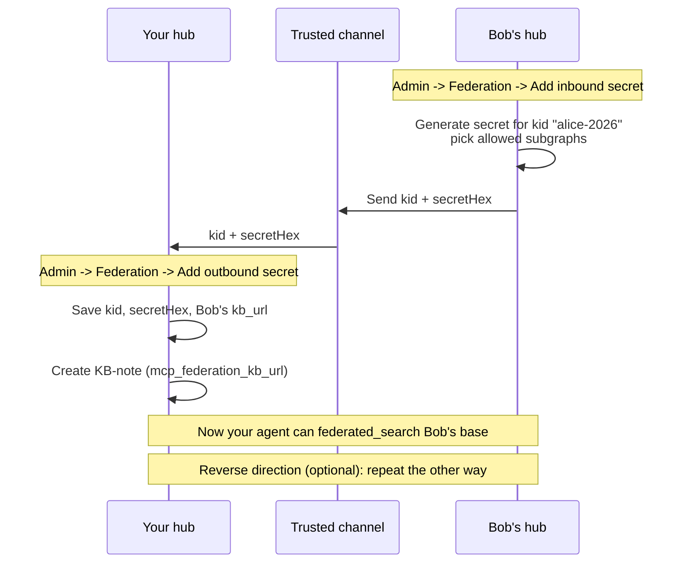
```mermaid
sequenceDiagram
    participant You as Your hub
    participant Ch as Trusted channel
    participant Bob as Bob's hub

    Note over Bob: Admin -> Federation -> Add inbound secret
    Bob->>Bob: Generate secret for kid "alice-2026"<br/>pick allowed subgraphs
    Bob->>Ch: Send kid + secretHex
    Ch->>You: kid + secretHex
    Note over You: Admin -> Federation -> Add outbound secret
    You->>You: Save kid, secretHex, Bob's kb_url
    You->>You: Create KB-note (mcp_federation_kb_url)
    Note over You,Bob: Now your agent can federated_search Bob's base
    Note over You,Bob: Reverse direction (optional): repeat the other way
```

### 2. docs/en/user/federation.md (+ ru twin) — `flowchart` (high)

**Where:** ### Federation graph (self-hosted panel) — the 7-status edge table (lines 124-140)

**Why:** Turns a 7-row status table into a diagnostic decision tree (KB-note? secret? matching inbound? granted subgraph?). Gives self-host operators a mental model for debugging a broken link — highest-value content on the page after the key exchange.

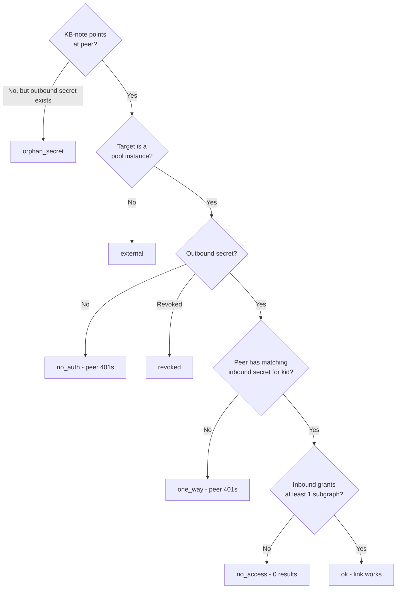
```mermaid
flowchart TD
    A{KB-note points<br/>at peer?} -->|No, but outbound secret exists| ORPH[orphan_secret]
    A -->|Yes| B{Target is a<br/>pool instance?}
    B -->|No| EXT[external]
    B -->|Yes| C{Outbound secret?}
    C -->|No| NA[no_auth - peer 401s]
    C -->|Revoked| REV[revoked]
    C -->|Yes| D{Peer has matching<br/>inbound secret for kid?}
    D -->|No| OW[one_way - peer 401s]
    D -->|Yes| E{Inbound grants<br/>at least 1 subgraph?}
    E -->|No| NAC[no_access - 0 results]
    E -->|Yes| OK[ok - link works]
```

### 3. docs/en/user/two-way-sync.md (+ ru twin) — `stateDiagram` (high)

**Where:** Section "Status indicator" — alongside/replacing the colored-dot legend (lines 38-46)

**Why:** The colored status dot IS a state machine; the legend only lists colors. A stateDiagram shows the actual lifecycle (server-changes/local-changes/both/conflict) and how each resolves back to synced — the strongest state-machine candidate across all groups.

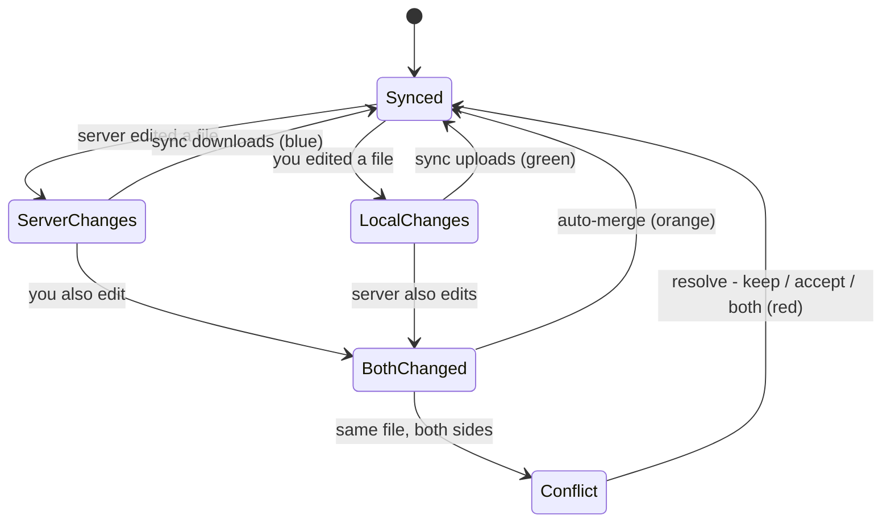
```mermaid
stateDiagram-v2
    [*] --> Synced
    Synced --> ServerChanges: server edited a file
    Synced --> LocalChanges: you edited a file
    ServerChanges --> BothChanged: you also edit
    LocalChanges --> BothChanged: server also edits
    BothChanged --> Conflict: same file, both sides
    ServerChanges --> Synced: sync downloads (blue)
    LocalChanges --> Synced: sync uploads (green)
    BothChanged --> Synced: auto-merge (orange)
    Conflict --> Synced: resolve - keep / accept / both (red)
```

### 4. docs/en/user/protocol.md (+ ru twin) — `flowchart` (high)

**Where:** Section "The pipeline" — replace the ASCII art block (lines 14-22)

**Why:** Drop-in replacement for existing ASCII art; strictly an upgrade. Makes the 'each stage independent, stop at website' branching visible at a glance, which the linear preformatted block cannot.

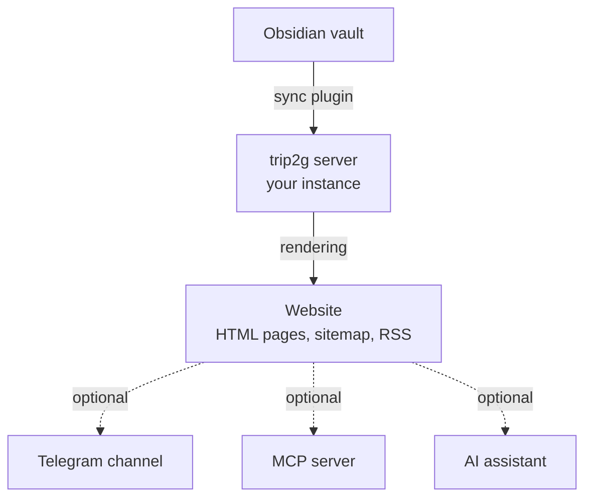
```mermaid
flowchart TD
    A[Obsidian vault] -->|sync plugin| B[trip2g server<br/>your instance]
    B -->|rendering| C[Website<br/>HTML pages, sitemap, RSS]
    C -.optional.-> D[Telegram channel]
    C -.optional.-> E[MCP server]
    C -.optional.-> F[AI assistant]
```

### 5. docs/en/user/search.md (+ ru twin) — `flowchart` (high)

**Where:** Intro / how the two algorithms combine (lines 7-13, before 'What this means in practice')

**Why:** Textbook hybrid-search visual: one query fans into BM25+morphology and OpenAI vector simultaneously, merged by RRF into final ranking. Trivial to add and makes the 'two independent algorithms, merged by RRF' sentence tangible.

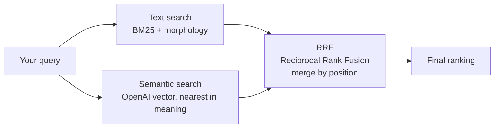
```mermaid
flowchart LR
    Q[Your query] --> T[Text search<br/>BM25 + morphology]
    Q --> S[Semantic search<br/>OpenAI vector, nearest in meaning]
    T --> R[RRF<br/>Reciprocal Rank Fusion<br/>merge by position]
    S --> R
    R --> F[Final ranking]
```

### 6. docs/en/user/monetization.md (+ ru twin) — `flowchart` (high)

**Where:** How access works (top of page, around free vs private notes section)

**Why:** Unifies three scattered prose sections (How access works / Paywall preview / How subscribers authenticate) into one access-decision tree — the conceptual spine of the whole page.

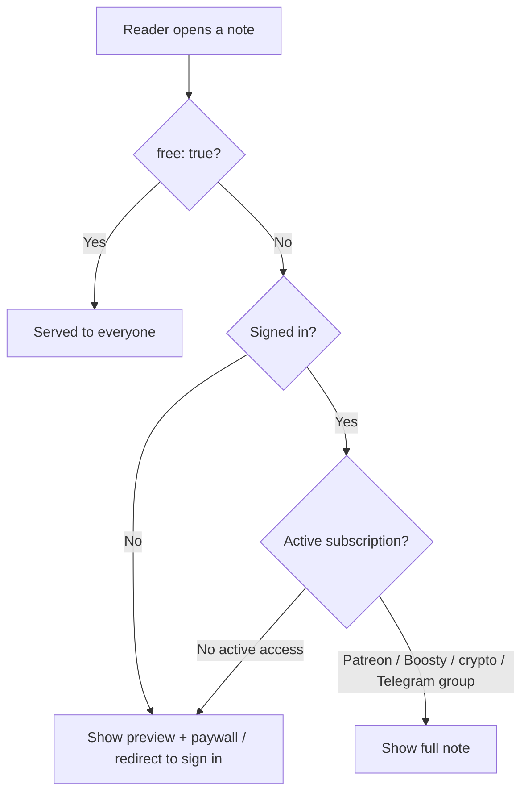
```mermaid
flowchart TD
    Open[Reader opens a note] --> Free{free: true?}
    Free -->|Yes| Public[Served to everyone]
    Free -->|No| Login{Signed in?}
    Login -->|No| Paywall[Show preview + paywall / redirect to sign in]
    Login -->|Yes| Sub{Active subscription?}
    Sub -->|Patreon / Boosty / crypto / Telegram group| Grant[Show full note]
    Sub -->|No active access| Paywall
```

### 7. docs/en/user/user_management.md (+ ru twin) — `flowchart` (high)

**Where:** Warning: notes without a subgraph are visible to all signed-in users (unassigned-note visibility section)

**Why:** Visualizes the page's explicit security pitfall: untagged notes leak to every signed-in user, and the frontmatter patch reassigns them to notes_without_subgraph (granted to nobody) to hide them. The security warning that newcomers most need to internalize.

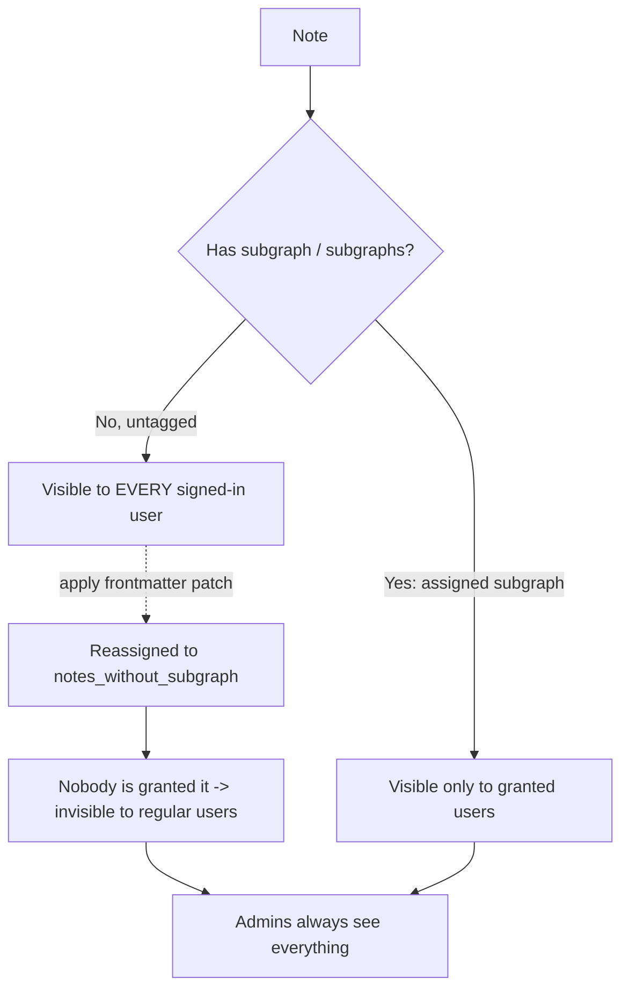
```mermaid
flowchart TD
    N[Note] --> Q{Has subgraph / subgraphs?}
    Q -->|No, untagged| Leak[Visible to EVERY signed-in user]
    Q -->|Yes: assigned subgraph| Gated[Visible only to granted users]
    Leak -. apply frontmatter patch .-> Patched[Reassigned to notes_without_subgraph]
    Patched --> Hidden[Nobody is granted it -> invisible to regular users]
    Hidden --> AdminNote[Admins always see everything]
    Gated --> AdminNote
```

### 8. docs/ru/user/oauth.md (+ advanced.md OAuth section) — `sequenceDiagram` (high)

**Where:** Как это работает — admin pre-adds user, then OAuth email must match

**Why:** Makes the key invariant visual: OAuth does NOT grant access automatically — the provider email must match a pre-registered user. This rule is easy to miss in prose and causes real lockouts.

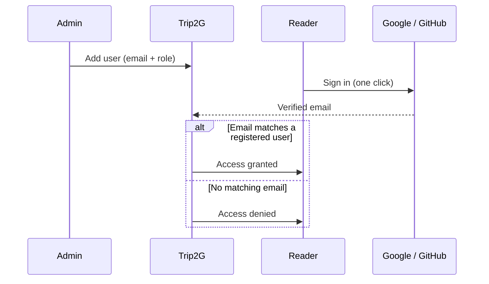
```mermaid
sequenceDiagram
    participant Admin
    participant trip2g as Trip2G
    participant Reader
    participant Provider as Google / GitHub

    Admin->>trip2g: Add user (email + role)
    Reader->>Provider: Sign in (one click)
    Provider-->>trip2g: Verified email
    alt Email matches a registered user
        trip2g->>Reader: Access granted
    else No matching email
        trip2g->>Reader: Access denied
    end
```

### 9. docs/en/user/webhooks.md + docs/ru/user/change_webhooks.md — `sequenceDiagram` (high)

**Where:** Change webhooks intro / payload + 'Applying changes from your service' (RU: ### Как это работает)

**Why:** The request/response contract is split across three prose sections (payload, signature, applying changes). One sequence diagram shows the full signed round-trip incl. expected_hash verification — the page's core mechanism.

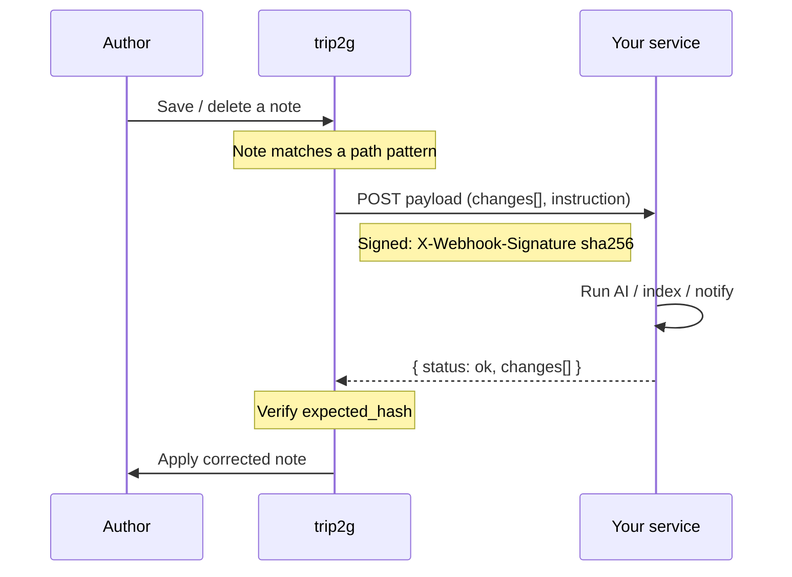
```mermaid
sequenceDiagram
    participant Author
    participant trip2g
    participant Service as Your service

    Author->>trip2g: Save / delete a note
    Note over trip2g: Note matches a path pattern
    trip2g->>Service: POST payload (changes[], instruction)
    Note right of trip2g: Signed: X-Webhook-Signature sha256
    Service->>Service: Run AI / index / notify
    Service-->>trip2g: { status: ok, changes[] }
    Note over trip2g: Verify expected_hash
    trip2g->>Author: Apply corrected note
```

### 10. docs/en/user/forms.md (+ ru twin) — `flowchart` (high)

**Where:** Submitting via GraphQL — after the response __typename table

**Why:** Unifies can_submit permission, Turnstile gating, and field validation into one server-side decision tree ending in the four response payloads. Currently spread across three sub-sections; consolidates exactly what the server returns and why.

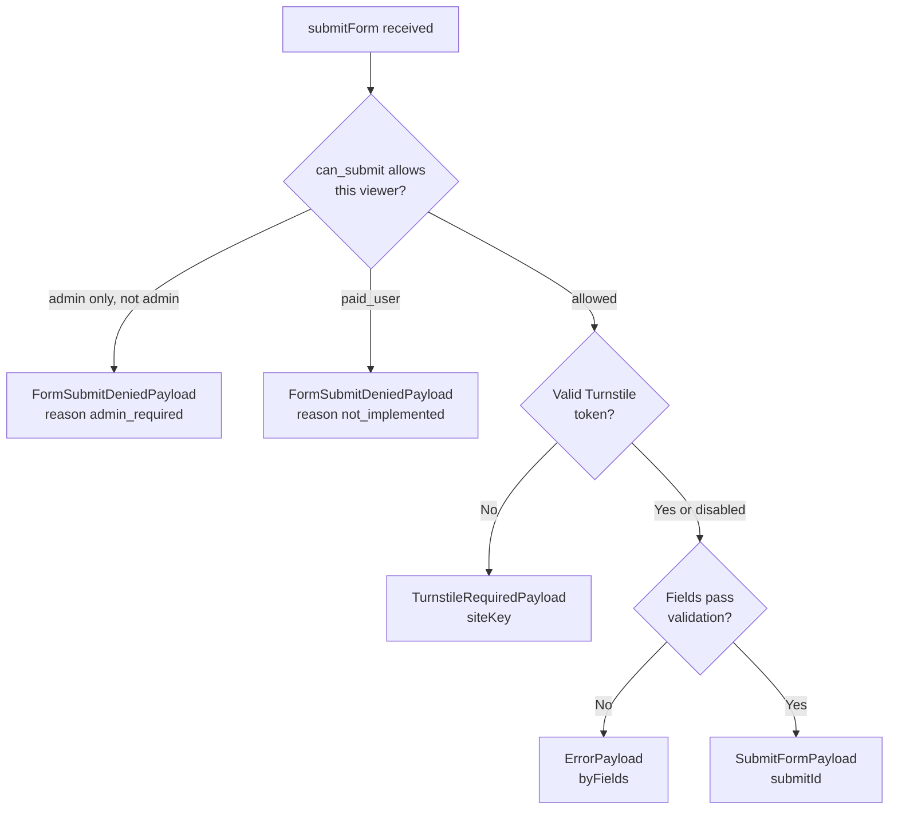
```mermaid
flowchart TD
    A[submitForm received] --> B{can_submit allows<br/>this viewer?}
    B -->|admin only, not admin| R1[FormSubmitDeniedPayload<br/>reason admin_required]
    B -->|paid_user| R2[FormSubmitDeniedPayload<br/>reason not_implemented]
    B -->|allowed| C{Valid Turnstile<br/>token?}
    C -->|No| R3[TurnstileRequiredPayload<br/>siteKey]
    C -->|Yes or disabled| D{Fields pass<br/>validation?}
    D -->|No| R4[ErrorPayload<br/>byFields]
    D -->|Yes| R5[SubmitFormPayload<br/>submitId]
```

### 11. docs/en/user/mcp.md (+ ru twin) — `sequenceDiagram` (high)

**Where:** ### How it works — replace the ASCII box + numbered steps (lines 11-24)

**Why:** Drop-in ASCII replacement and strict upgrade. Shows the actual ordered question-to-answer round trip (ask -> vector search -> notes + author instructions -> grounded answer) instead of static topology.

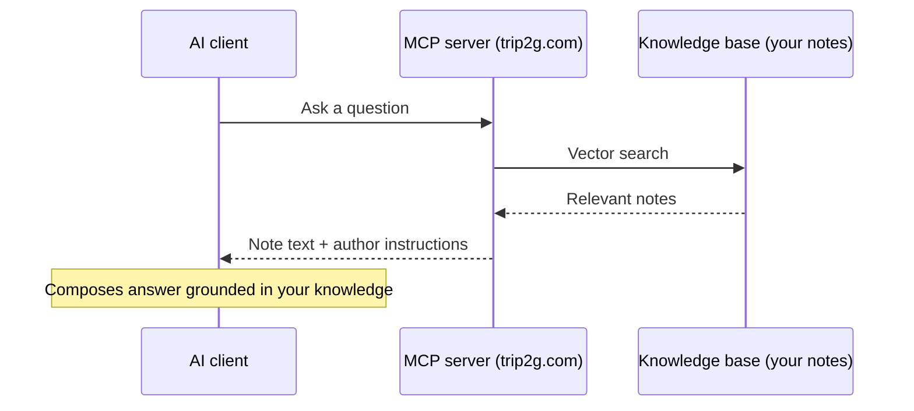
```mermaid
sequenceDiagram
    participant Client as AI client
    participant MCP as MCP server (trip2g.com)
    participant KB as Knowledge base (your notes)

    Client->>MCP: Ask a question
    MCP->>KB: Vector search
    KB-->>MCP: Relevant notes
    MCP-->>Client: Note text + author instructions
    Note over Client: Composes answer grounded in your knowledge
```

### 12. docs/en/user/llm-wiki.md (+ ru twin) — `flowchart` (high)

**Where:** ### Two modes of agent retrieval — replace the two ASCII flow blocks (Mode A 54-60, Mode B 68-76)

**Why:** Replaces two plain-text arrow lists with one branching diagram comparing index-first traversal (Mode A) vs search/RAG-assisted retrieval (Mode B) from a single question. Makes the mode choice tangible.

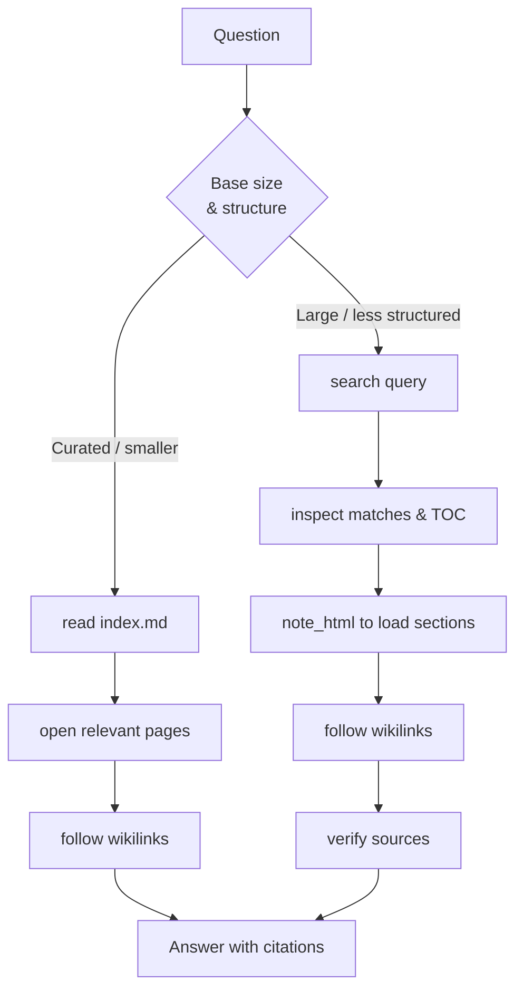
```mermaid
flowchart TD
    Q[Question] --> Mode{Base size<br/>& structure}
    Mode -->|Curated / smaller| A1[read index.md]
    A1 --> A2[open relevant pages]
    A2 --> A3[follow wikilinks]
    A3 --> AC[Answer with citations]
    Mode -->|Large / less structured| B1[search query]
    B1 --> B2[inspect matches & TOC]
    B2 --> B3[note_html to load sections]
    B3 --> B4[follow wikilinks]
    B4 --> B5[verify sources]
    B5 --> AC
```

### 13. docs/en/user/telegram.md (+ ru twin) — `flowchart` (high)

**Where:** Top of page / before 'Set up a bot' — overall setup-to-publish flow

**Why:** telegram.md is a long linear procedure; a one-glance setup-to-publish map (BotFather -> admin panel -> channel admin -> note frontmatter -> sync -> instant/queued -> live) orients the reader before the step-by-step.

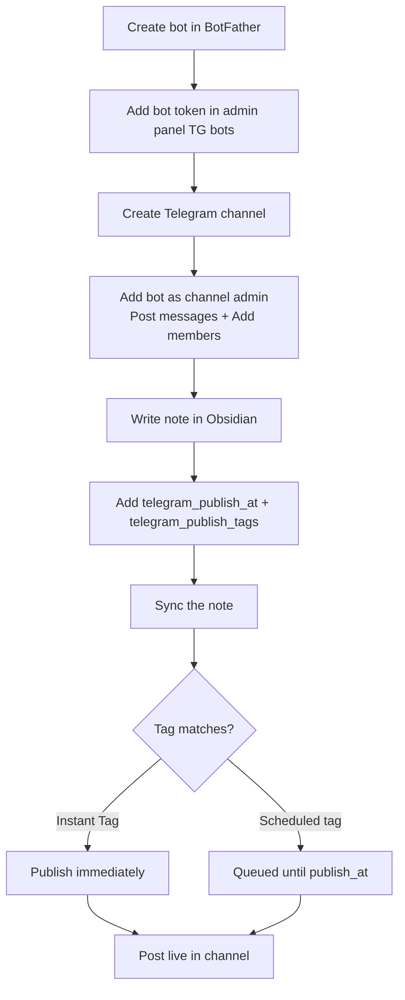
```mermaid
flowchart TD
    A[Create bot in BotFather] --> B[Add bot token in admin panel TG bots]
    B --> C[Create Telegram channel]
    C --> D[Add bot as channel admin<br/>Post messages + Add members]
    D --> E[Write note in Obsidian]
    E --> F[Add telegram_publish_at + telegram_publish_tags]
    F --> G[Sync the note]
    G --> H{Tag matches?}
    H -->|Instant Tag| I[Publish immediately]
    H -->|Scheduled tag| J[Queued until publish_at]
    I --> K[Post live in channel]
    J --> K
```

### 14. docs/en/user/telegram.md (+ ru twin) — `flowchart` (high)

**Where:** Section 'Editing published posts' — what updates live vs what needs Reset

**Why:** Collapses a two-list can/cannot section into one actionable path: text/formatting/links propagate on re-sync; media/post-type/photo-count/rename require Reset -> edit -> sync. A frequent real-world stumbling point.

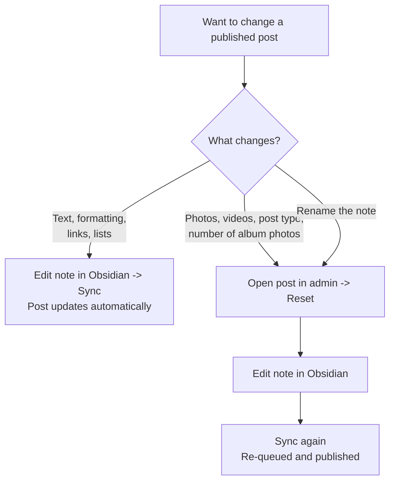
```mermaid
flowchart TD
    E[Want to change a published post] --> Q{What changes?}
    Q -->|Text, formatting,<br/>links, lists| A[Edit note in Obsidian -> Sync<br/>Post updates automatically]
    Q -->|Photos, videos, post type,<br/>number of album photos| B[Open post in admin -> Reset]
    Q -->|Rename the note| B
    B --> C[Edit note in Obsidian]
    C --> D[Sync again<br/>Re-queued and published]
```

### 15. docs/en/user/update_notes.md (+ ru twin) — `sequenceDiagram` (high)

**Where:** Checkbox toggle (patch use case) — after the numbered 'How it works' list

**Why:** Ties the data-line/find/replace mechanics together incl. the PatchNotFound branch on duplicate task text. A reader-driven round trip that prose describes only piecemeal.

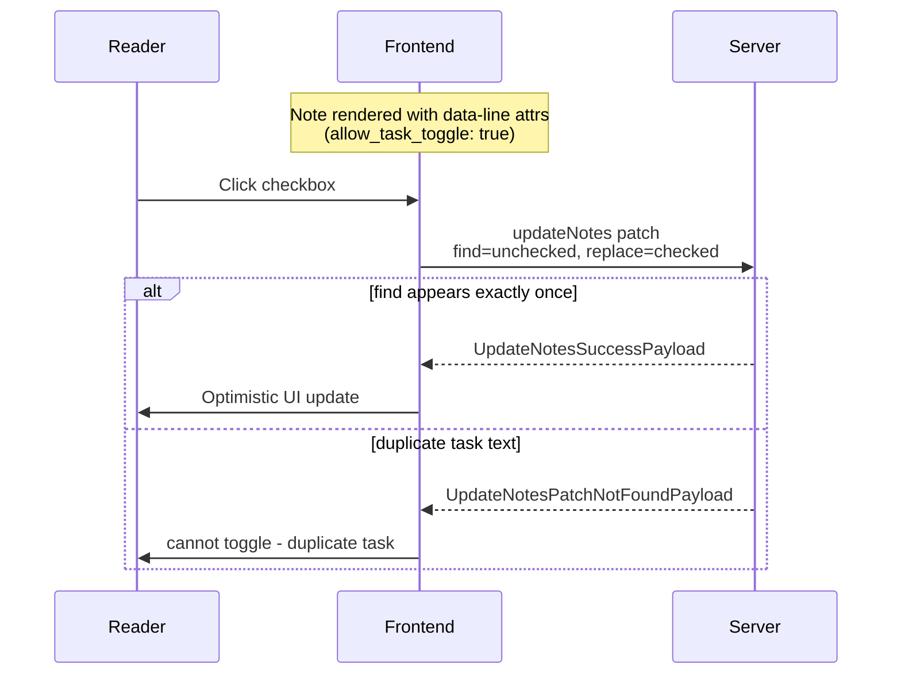
```mermaid
sequenceDiagram
    participant Reader
    participant Frontend
    participant Server

    Note over Frontend: Note rendered with data-line attrs<br/>(allow_task_toggle: true)
    Reader->>Frontend: Click checkbox
    Frontend->>Server: updateNotes patch<br/>find=unchecked, replace=checked
    alt find appears exactly once
        Server-->>Frontend: UpdateNotesSuccessPayload
        Frontend->>Reader: Optimistic UI update
    else duplicate task text
        Server-->>Frontend: UpdateNotesPatchNotFoundPayload
        Frontend->>Reader: cannot toggle - duplicate task
    end
```

### 16. docs/en/user/selfhosted.md (+ ru twin) — `flowchart` (high)

**Where:** Section 'What this setup runs' / 'Caddyfile' — service topology (lines 13-21, 222-258)

**Why:** The Caddy/MinIO/trip2g hostname-to-port mapping is the single most confusing part of the self-host page. A topology diagram clarifies why only Caddy exposes ports and how the two public hostnames map to internal services.

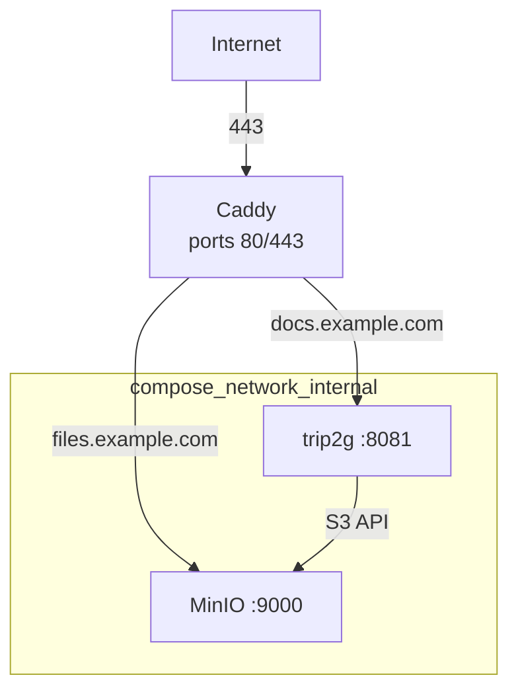
```mermaid
flowchart TD
    Net[Internet] -->|443| Caddy[Caddy<br/>ports 80/443]
    Caddy -->|docs.example.com| T[trip2g :8081]
    Caddy -->|files.example.com| M[MinIO :9000]
    T -->|S3 API| M
    subgraph compose_network_internal
        T
        M
    end
```

### 17. docs/en/user/getting-started.md (+ ru twin) — `flowchart` (high)

**Where:** Top of page, after intro paragraph (line 8) — onboarding roadmap before 'How the service works'

**Why:** Gives newcomers a skimmable map of the entire setup (instance -> sign in -> admin panel -> BRAT plugin -> API key -> connect -> publish -> make public) so they know how many steps remain. High value for the most-read page.


```mermaid
flowchart LR
    A[Get an instance] --> B[Sign in by email]
    B --> C[Configure admin panel]
    C --> D[Install plugin via BRAT]
    D --> E[Create API key]
    E --> F[Connect plugin to site]
    F --> G[Create _index note]
    G --> H[Sync]
    H --> I[Add free: true]
    I --> J[Page is public]
```

### 18. docs/ru/user/Импорт из Telegram.md — `flowchart` (high)

**Where:** Section 'Как это работает' — naming + dedup + re-import logic

**Why:** Captures the easy-to-miss branching dedup rules: title from first 7 words (strip emoji/formatting), append message ID on collision, skip if already imported, attach metadata. Prose hides the branching.

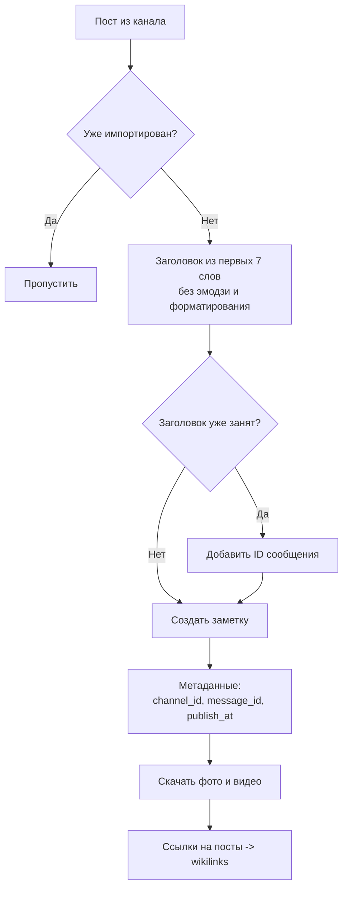
```mermaid
flowchart TD
    P[Пост из канала] --> S{Уже импортирован?}
    S -->|Да| SK[Пропустить]
    S -->|Нет| T[Заголовок из первых 7 слов<br/>без эмодзи и форматирования]
    T --> C{Заголовок уже занят?}
    C -->|Да| ID[Добавить ID сообщения]
    C -->|Нет| K[Создать заметку]
    ID --> K
    K --> M[Метаданные:<br/>channel_id, message_id, publish_at]
    M --> ML[Скачать фото и видео]
    ML --> WL[Ссылки на посты -> wikilinks]
```

### 19. docs/en/user/default-template.md (+ ru twin) — `flowchart` (high)

**Where:** Section 'Functional notes: header, footer, and sidebars' — the resolution-order list (lines 28-33)

**Why:** Turns a 4-step priority list (per-note frontmatter -> glob section -> _header.md/_footer.md auto-load -> absent) into a visible top-to-bottom resolution path. Core mechanic of the template page.

```mermaid
flowchart TD
    Start([Resolve a section]) --> A{Per-note frontmatter?<br/>header: [[my-header]]}
    A -->|set| UseA[Use that note]
    A -->|none| B{Matching glob section?<br/>header_includes: blog/*}
    B -->|matches| UseB[Use highest-priority match]
    B -->|none| C{Auto-load file exists?<br/>_header.md / _footer.md}
    C -->|yes| UseC[Use the auto-load note]
    C -->|no| None[Section absent]
```

### 20. docs/en/user/templates.md (+ ru twin) — `flowchart` (high)

**Where:** Section 'How templates work' (lines 13-41) — the Step 1 / Step 2 flow

**Why:** Makes the 'markdown stays clean, template decides presentation' idea concrete: note + layout frontmatter feed the Jet engine in _layouts/, which emits the full HTML page. Entry-point concept for the templating docs.

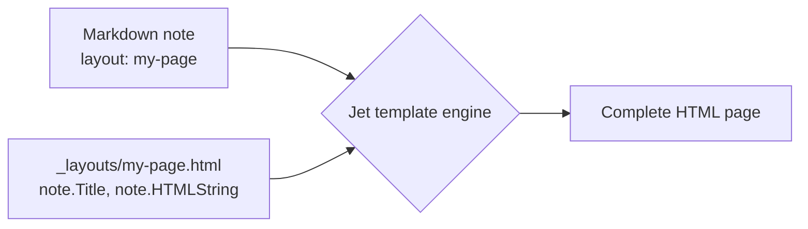
```mermaid
flowchart LR
    Note[Markdown note<br/>layout: my-page] --> Engine{Jet template engine}
    Layout[_layouts/my-page.html<br/>note.Title, note.HTMLString] --> Engine
    Engine --> Page[Complete HTML page]
```

### 21. docs/en/user/renderlayout.md (+ ru twin) — `sequenceDiagram` (medium)

**Where:** Section 'AI agent workflow' (lines 240-251)

**Why:** Captures the iterative POST/preview loop: agent posts layout+note, server renders into in-memory ring buffer (nothing written to vault), returns previewURL + warnings; agent fixes Jet errors and re-posts; human opens the link. The page's signature workflow.

```mermaid
sequenceDiagram
    participant Agent
    participant API as /_system/renderlayout
    participant Buffer as Ring buffer (10, in-memory)
    participant Human

    Agent->>API: POST { layout.src, note.src }
    API->>Buffer: store rendered HTML (nothing written to vault)
    API-->>Agent: { previewURL, warnings }
    alt warnings non-empty
        Agent->>Agent: read Jet error, fix template
        Agent->>API: POST again
    else all warnings empty
        Agent-->>Human: share previewURL
        Human->>API: GET ?preview_id=xxx
        API-->>Human: rendered HTML
    end
```

### 22. docs/en/user/webhooks.md + docs/ru/user/cron_webhooks.md — `flowchart` (medium)

**Where:** Cron webhooks — Synchronous vs asynchronous responses (replace/precede the two JSON blocks)

**Why:** The 60-second cutoff is the deciding factor between sync (return changes, trip2g applies) and async (202 Accepted, write back later via API token) and is currently buried in prose.

```mermaid
flowchart TD
    A[Cron fires: POST to your endpoint] --> B{Task finishes<br/>under 60s?}
    B -->|Yes| C[Return status: ok + changes]
    C --> D[trip2g applies changes]
    B -->|No| E[Return 202 Accepted]
    E --> F[Agent keeps working]
    F --> G[Write back later via API token]
```

### 23. docs/en/user/forms.md (+ ru twin) — `sequenceDiagram` (medium)

**Where:** Spam protection -> turnstile (after the 'How it works' bullet list)

**Why:** The two-pass submit flow is non-obvious from the bullet list: first submit returns TurnstileRequiredPayload{siteKey}, the layout renders the widget and resubmits with the token, then the server accepts.

```mermaid
sequenceDiagram
    participant Visitor
    participant Page
    participant Server

    Visitor->>Page: Fill form, click Submit
    Page->>Server: submitForm (no token)
    Server-->>Page: TurnstileRequiredPayload { siteKey }
    Page->>Visitor: Render Turnstile widget
    Visitor->>Page: Solve captcha
    Page->>Server: submitForm (turnstileToken)
    Server-->>Page: SubmitFormPayload { submitId }
    Page->>Visitor: Redirect to success_url
```

### 24. docs/en/user/protocol.md (+ ru twin) — `flowchart` (medium)

**Where:** Section 'Federation: connecting nodes' — replace ASCII art block (lines 150-157)

**Why:** Drop-in ASCII replacement; edge labels make the per-edge auth method (no auth / HMAC) concrete for federation topology. Pairs with the federation.md hub diagram.

```mermaid
flowchart TD
    Agent[Your agent] --> Hub[Your trip2g hub]
    Hub -->|no auth| Public[Public base]
    Hub -->|HMAC key| Private[Private peer]
    Hub -->|HMAC key| Adapter[External adapter<br/>GitHub / Telegram]
```

### 25. docs/en/user/search.md (+ ru twin) — `flowchart` (medium)

**Where:** ### Excluding notes from search (lines 22-42)

**Why:** Compresses three separately-described exclusion rules (underscore-prefixed path/filename, search:false direct or via patch glob) into one checklist a reader can follow to predict indexing.

```mermaid
flowchart TD
    N[Note] --> U{Filename or any<br/>path folder starts with _ ?}
    U -->|Yes| EX[Excluded - system note]
    U -->|No| SF{search: false in frontmatter?<br/>direct or via frontmatter patch glob}
    SF -->|Yes| EX
    SF -->|No| IDX[Indexed - appears in search]
```

### 26. docs/en/user/mcp.md (+ ru twin) — `flowchart` (medium)

**Where:** ### Named entry points (?method=) (lines 148-183)

**Why:** Shows how one knowledge base serves multiple agent personas: each ?method= URL selects a different initialize-instructions note, with access control gating premium personas behind a subgraph while tools stay constant.

```mermaid
flowchart LR
    A[/_system/mcp] --> D[mcp_method: initialize<br/>default persona]
    B[/_system/mcp?method=wiki] --> W[mcp_method: wiki<br/>free: true -> public]
    C[/_system/mcp?method=premium_advisor] --> P{Subscriber?}
    P -->|Yes| PA[mcp_method: premium_advisor<br/>in-depth advisor]
    P -->|No| E[Method not found 401]
    D --> T[Same tool set]
    W --> T
    PA --> T
```

### 27. docs/en/user/update_notes.md (+ ru twin) — `flowchart` (medium)

**Where:** Conflict detection with expectedHash — after the bullet list describing the check

**Why:** Makes the read-transform-write retry loop explicit: write with expectedHash, on mismatch get UpdateNotesHashMismatchPayload{actualHash}, re-fetch and retry. The loop is hard to see in prose.

```mermaid
flowchart TD
    A[Read note + content hash] --> B[Transform content]
    B --> C[updateNotes with expectedHash]
    C --> D{Hash still<br/>matches?}
    D -->|Yes| E[UpdateNotesSuccessPayload<br/>change applied]
    D -->|No| F[UpdateNotesHashMismatchPayload<br/>actualHash]
    F --> A
```

### 28. docs/ru/user/Публикация через аккаунты.md — `flowchart` (medium)

**Where:** Section 'Как работает публикация' — one tag fanning out to channels via bot and/or account

**Why:** Makes the 'один тег -> несколько каналов' and dual-sender (bot + account on the same channel) behavior concrete — the page's central routing concept.

```mermaid
flowchart LR
    N[Заметка с тегом Новости] --> R{Каналы с этим тегом}
    R --> C1[Канал A]
    R --> C2[Канал B]
    C1 --> B1[Бот]
    C2 --> B2[Бот]
    C2 --> A2[Аккаунт]
    B1 --> T1[Пост в канале A]
    B2 --> T2[Пост в канале B через бота]
    A2 --> T3[Пост в канале B через аккаунт]
```

### 29. docs/en/user/default-template.md (+ ru twin) — `flowchart` (medium)

**Where:** Section 'Title display' (lines 269-286)

**Why:** Captures the title-resolution rule incl. the both-set edge case where frontmatter title wins but an in-content H1 still suppresses the template's own title element. A subtle behavior worth a diagram.

```mermaid
flowchart TD
    Start([Determine page title]) --> T{title frontmatter set?}
    T -->|yes| UseT[Title = frontmatter value<br/>used in title tag, OG, listings]
    T -->|no| H{Leading H1 in body?}
    H -->|yes| UseH[Title = H1 text<br/>no separate title element rendered]
    H -->|no| File[Title = filename]
    UseT --> H1check{Leading H1 also present?}
    H1check -->|yes| Skip[Template skips its own title element<br/>shows only the in-content H1]
    H1check -->|no| Render[Template renders its title element]
```

