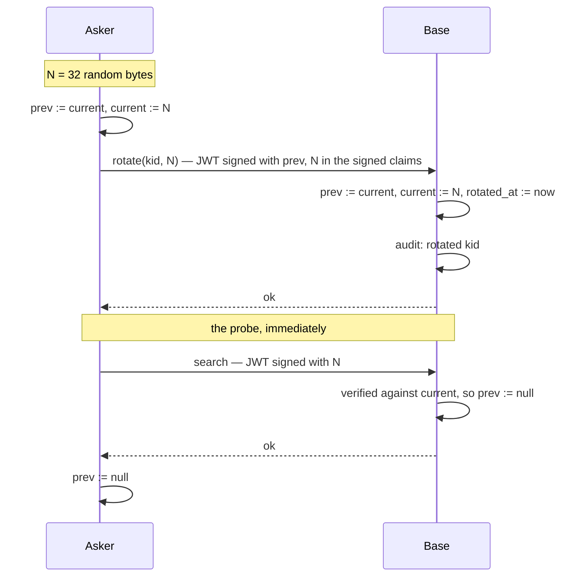
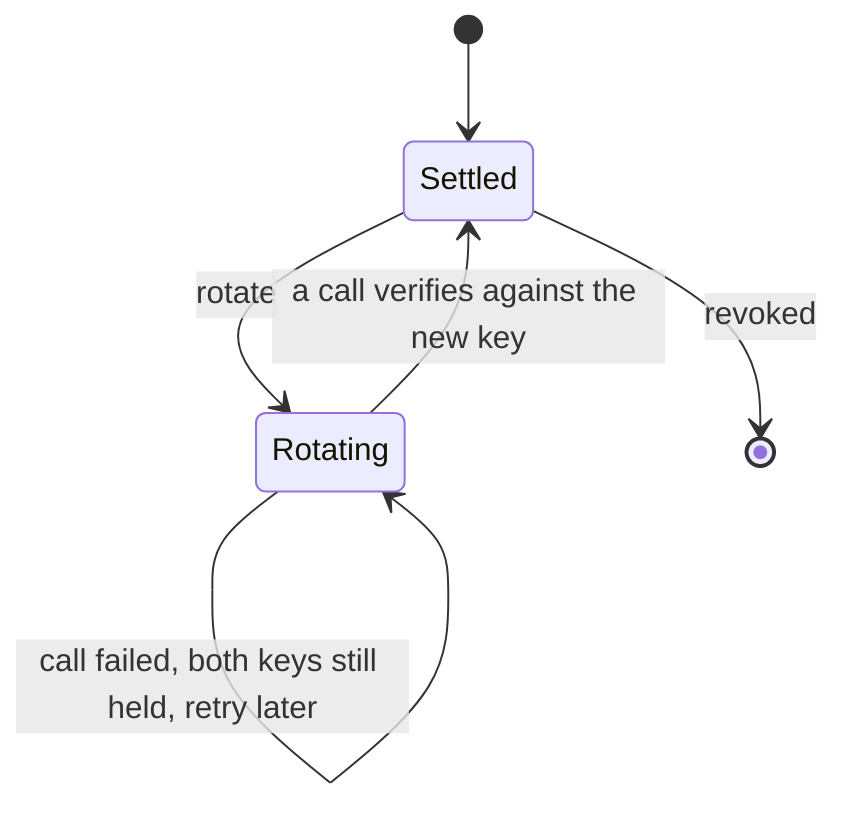

# Federation key rotation

A federation secret is shared by handing it to the other operator out of band —
a chat message, usually. From that moment the credential exists in a place
neither instance controls, and it stays valid for as long as the pairing does.
Where an LLM agent relays the handover on someone's behalf, the same bytes also
reach its transcript and, if it journals, its notes.

Rotation makes that copy worthless. The asker replaces the shared secret with a
fresh one immediately after installing it, so the bytes that travelled through
the chat are dead by the time anyone could read the log. The same operation,
called again later, is ordinary key hygiene.

## One operation, three callers

There is no separate "bootstrap exchange". There is one primitive — **replace
the secret, authenticated by the current one** — and the first call happens to
consume the key that came from the chat.

| Caller | When |
|---|---|
| `createOutboundFederationSecret` with rotation on | right after the row is written |
| Admin → Federation → Rotate | whenever an operator wants |
| Scheduler | on a period, unattended |

The flag on the mutation is therefore not a mode. It says one thing about the
peer: whether it can rotate at all. Public bases carry no secret, and adapters
(GitHub, Telegram) speak the same auth without implementing this, so both
install with rotation off and keep a long-lived key by design.

## What each side stores

Both sides hold the same two values against one row. No row is ever added for a
rotation, and `kid` never changes — scope lives in `federation_secret_subgraphs`
keyed on `kid`, so it follows the pairing across any number of rotations without
being touched.

| Column | Meaning |
|---|---|
| `secret_crypt` | the current key (existing column, meaning unchanged) |
| `prev_secret_crypt` | the key rotated away from, or null |
| `rotated_at` | when the last rotation happened, or null |

One rule, applied by both sides in their own direction:

- **Signing:** sign with the current key. On an authentication failure, retry
  signing with the previous one.
- **Verifying:** check the current key. On mismatch, check the previous one, and
  only while it is still inside the grace window.

Because the rule is symmetric, a rotation that half-landed is not a broken link
in either direction — it is a link that takes one extra attempt.

## The happy path

The probe is what closes the window rather than a timer. A rotation that
verifies on the next call clears the old key on the base within milliseconds, so
the state where two keys are accepted is an exception, not a resting state.

## When something drops

| What happened | Base holds | Asker holds | What heals it |
|---|---|---|---|
| Response lost after the base committed | current = N, prev = old | current = N, prev = old | nothing to heal: the asker already signs with N and it verifies |
| The call never reached the base | current = old, prev = null | current = N, prev = old | the asker's call with N fails, it retries with old, which verifies; the rotation is attempted again |
| The base committed, the asker crashed before writing | current = N, prev = old | current = old | the asker signs with old, which the base still accepts as previous, and rotates again |
| Grace elapsed with no successful call | current = N, prev refused | current = old | the link is down until an operator re-establishes it — the case the grace window is sized to prevent |

Nothing in this table requires an operator except the last row, and nothing
requires a second round trip.

**A failed probe decides nothing.** If it does not come back — a timeout, a
momentary 500, anything — the asker keeps both keys and retries later. The probe
exists to shorten the window, and it is never allowed to conclude that a
rotation did or did not happen.

## Retiring the previous key

Two things retire it, and both are needed.

**A successful verification against the current key** clears it. That is proof
the other side holds the new key, and it is the normal path.

**The grace window** is the backstop. Without it a peer that stops calling
leaves the previous key valid forever — and after the very first rotation, the
previous key is exactly the one that travelled through the chat. A rotation that
merely adds a second accepted key and never drops it would defeat the whole
mechanism. So `prev_secret_crypt` is refused once `now - rotated_at` exceeds the
window, whatever else happens.

The window is short by design. It covers a lost response and requests already in
flight, not an outage.

## Choosing the probe

Any authenticated call proves the key: presenting a bearer the base cannot
verify is an error, not a silent downgrade to the anonymous layer
(`internal/case/mcp/endpoint.go`, `authenticateAnonymousRequest`). So the probe
only has to be cheap.

`search` with a trivial query is the cheapest one that is always there.

**Not `instructions`.** The federation client can call it
(`internal/federation/client.go`), but there is no `instructions` entry in
`builtinToolHandlers` (`internal/case/mcp/resolve.go`) — it exists only on a
peer that happens to carry a note with `mcp_method: instructions`. On every
other peer it answers method-not-found, which a probe would read as a failed
rotation.

## Guards

- **HTTPS only.** The new key travels on the wire, and the hub does not enforce
  TLS (see "Limits and known constraints" in the user documentation). Over
  `http://` rotation would move the secret from one channel nobody controls to
  another, while leaving the operator believing the first one is now safe. A
  rotation call against a non-`https` `kb_url` is refused rather than downgraded.
- **The SSRF-safe dialer.** This makes the server POST to an address supplied in
  a mutation, so it goes through the same client the federation calls already
  use (`ssrfsafe.DialTimeout`, `internal/federation/client.go`), not a fresh one.
- **The new key rides in the signed claims.** `signOutbound` signs
  `{iss, iat, exp, rid}` today and does not bind the request body at all, so a
  key carried in the body would be rewritable inside the 30-second window. This
  is the one change to the JWT that peers other than trip2g can see, which is
  where a protocol version field belongs.
- **32 bytes, and a degenerate value is refused.** The asker generates the key,
  so the base validates what it is given rather than trusting it.

## What the audit log records

The base writes one entry per rotation through the existing `auditlogger`: which
`kid`, when, and the request id. No new table.

Worth a warn-level line as well: a call that verified against the *previous* key
means a rotation did not fully land. It is not an error — the link is working —
but a peer that keeps producing them is a peer whose rotations never confirm.

## What this deliberately does not do

**No second row per kid.** `revokeFederationSecret` takes a row id, and
`FederationSecretByKID` picks the newest live row, so with two rows an operator
revoking the current key silently promotes the older one — revocation would
resurrect the credential it meant to kill. Two columns on one row cannot do
that: revoking the row kills both keys at once.

**No new kid per rotation.** Scope keys on `kid`; a new one orphans it, and the
pairing loses the name an operator recognises it by.

**No two-call handshake.** An init/confirm pair buys recoverability, which the
grace window already buys, at the price of a second round trip and a pending
state on both sides.

**No key derived from the current one.** It would let the asker recompute the
new key after a crash without storing it — and let anyone holding the key from
the chat compute the next one, which is the thing being defended against.

## Not covered

The base cannot tell an operator that someone *else* used the handover first. A
call signed with neither key is indistinguishable from any other bad signature,
so an asker whose install fails learns "this does not work", not "your chat
leaked". Answering that would mean keeping the original bootstrap beyond its
grace, which costs more than it is worth here: the asker's install fails either
way, and the operator's next step — ask the base to revoke the kid and re-issue
— is the same for both causes.
