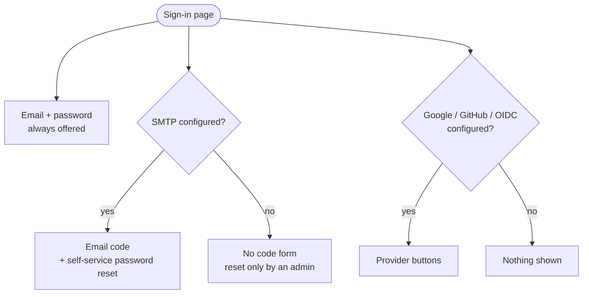
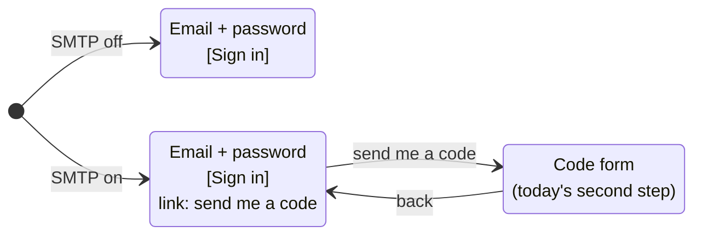
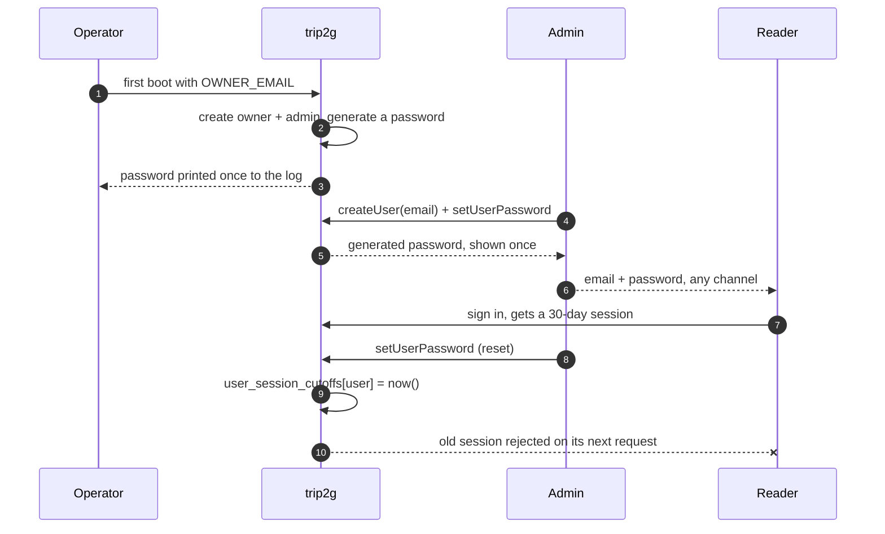

# Password sign-in

Design, not yet built. Written 2026-10-08 against `a8efb2e8`.

## Why

An instance that runs without a mail provider has no way for a person to sign
in on their own: email codes go nowhere, and a HAT link lives at most 60
minutes. The case that started this: an operator needs to give about 20 outside
people read access to part of a knowledge base, on an instance with email sign-in
switched off.

Password sign-in fixes that with nothing to configure. There is still no sign-up:
the admin creates the account and hands over the password, and the admin can
change it or revoke access.

## The decision in one picture

| Method | Shown when | Default on a fresh install |
|---|---|---|
| Email + password | always | on |
| Email code | SMTP is configured | off until SMTP is set |
| Google / GitHub / OIDC | the provider is configured (already so today) | off |

Email code becomes a configured method, like OAuth already is. Today the code
form shows whenever `emailSignInEnabled` is true, SMTP or not
(`cmd/server/config.go:46`), so on an instance without SMTP it shows a form
whose codes go nowhere. Tying it to SMTP removes that.

## The sign-in screen

The email field is shared: email is the login for both methods. The server
never answers "does this address have a password?". That would tell anyone
which accounts exist.

## Account lifecycle

### Bootstrap

`createOwnerIfNotExists` (`cmd/server/boot.go:176`) already creates the owner
and the admin row from `OWNER_EMAIL`. If the owner has no password yet, it also
generates one and logs it once, at Warn, the way `LogSignInCodes` does today.
`login-link` keeps working as the way in when the log is gone.

### Reset

| Email (SMTP) | Who resets |
|---|---|
| on | the reader themselves: request a link by email, behind captcha + rate limit; or the admin |
| off | the admin only (`setUserPassword`) |

Captcha is Turnstile and needs its own keys (`TURNSTILE_SITE_KEY`). Without
them `requestemailsignin` runs without a captcha today. So the password form and
the reset request need a built-in rate limit that works with no keys.

## Revoking access

| What the admin wants | How | Takes effect |
|---|---|---|
| Close a subgraph to one person | `revokeUserSubgraphAccess` | next request, `canreadnote` reads grants from the DB |
| Lock the person out entirely | `banUser` (exists) | next request, ban validator |
| Kill sessions after a leaked password | `setUserPassword` writes a cutoff | next request, cutoff validator |

### Session cutoffs

A session is a stateless 30-day JWT (`internal/usertoken/token.go:77`). A
password change alone does not end it, so the reset writes a cutoff:

- table `user_session_cutoffs(user_id primary key, valid_after datetime)`,
  sparse: a row only for users whose sessions were cut;
- an in-memory map loaded whole and reset on write, the same shape as
  `internal/userbans`, so no DB read per request;
- one more check in the validator next to the ban
  (`cmd/server/auth.go:27`): reject a token whose `iat` is before
  `valid_after`;
- `iat` added to the claims in `usertoken.Store`. Tokens issued before the
  change have none, count as issued at zero, and fall at the first cutoff.

The ban stays as it is. It is checked on every request in one place, whatever
issued the session. Seven paths issue sessions today (email, HAT, purchase
token, Telegram, OIDC, Google, GitHub), and password makes eight. Moving the ban
to sign-in time would need a check in each of them.

## Data

| Change | Note |
|---|---|
| `users.password_hash` | nullable; argon2id or bcrypt |
| `user_session_cutoffs` | new, see above |
| JWT `iat` | no migration |

Both migrations need confirmation before they are written.

## Upgrading

Changelog warning: after the upgrade, an instance without SMTP shows the
password form instead of the code form, and nobody has a password yet except
the owner, whose password is in the boot log. Admins set passwords for their
readers, or configure SMTP to bring the code form back.

## Out of scope

Paid offers create users by email from the payment and give them no password.
Those buyers sign in by code (SMTP) or by purchase token, as today. The flow is
not in active use and this design does not change it.

## Open questions

1. Does the operator need an env ceiling to forbid passwords (a
   `DISABLE_PASSWORD_SIGNIN` next to `DISABLE_EMAIL_SIGNIN`)?
2. `DISABLE_EMAIL_SIGNIN` and the admin setting `email_signin_enabled`: keep
   them on top of the SMTP rule, or drop them?
3. Does a password reset also revoke personal MCP tokens (`createUserToken`),
   which live in the DB and are revoked separately today?
4. Generated owner password: log only, or also accept one from env, so an
   operator such as coxswain can put it in its secret store?
5. Password rules: length only, or nothing beyond a minimum?
