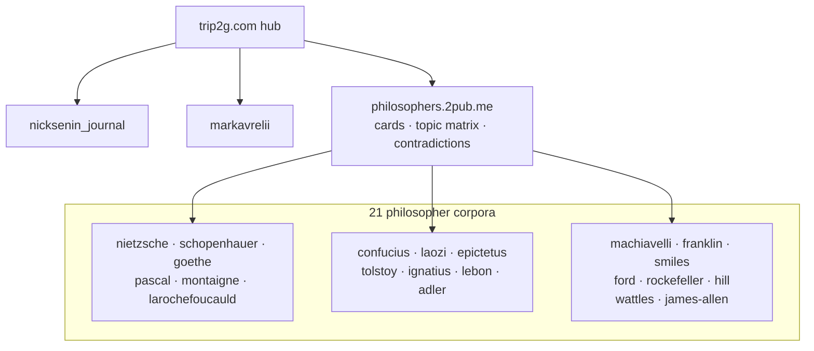

# Hub

Knowledge bases federated into this hub.

- [[en/hub/nicksenin_journal|Nick Senin Journal]]
- [[en/hub/markavrelii|Marcus Aurelius — Meditations]]
- [Philosophers Hub](https://philosophers.2pub.me) — routing layer over 21 philosopher corpora

## Current hub topology

A blind federated fan-out from this hub sees the philosophers hub as **one**
base (its cards and topic matrix). Corpus depth is reached deliberately via a
composite id: `federated_search(kb_id="philosophers/<slug>")`.

What federated search is and how it works — [[en/user/federation|MCP Federation]].
