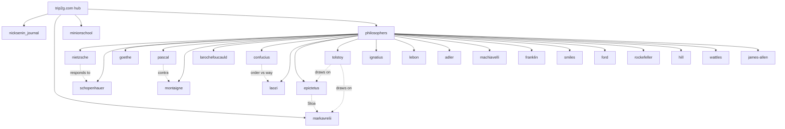

# Hub

Knowledge bases federated into this hub.

- [[en/hub/nicksenin_journal|Nick Senin Journal]]
- [[en/hub/markavrelii|Marcus Aurelius — Meditations]]
- [[en/hub/minionschool|Minion School]]
- [[en/hub/philosophers|Philosophers Hub]] — routing layer over 21 philosopher corpora

## Current hub topology

The root hub links `philosophers` as a single peer; that hub in turn federates
the 21 corpora. Dotted lines are cross-corpus influence links — a corpus points
at the neighbours it argues with, so an agent can follow an idea across bases.

A blind fan-out from the root hub sees `philosophers` as **one** base. To reach a
specific thinker, query the philosophers hub by that corpus's `kb_id` (e.g.
`federated_search(kb_id="nietzsche")` against `philosophers.2pub.me`).

What federated search is and how it works — [[en/user/federation|MCP Federation]].
