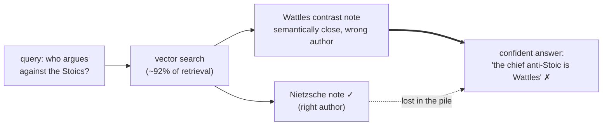
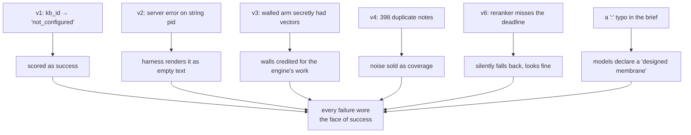

# Knowledge as a supply chain, not a landfill

**The short version.** I wanted to know whether a small model, handed a federated
knowledge graph over MCP, actually *uses* it — or just looks like it does. I ran
the study six times, and nearly every run broke a different way while the metrics
stayed green. What survived: models **navigate** a federated graph reliably and
cheaply. What did *not* survive: the comforting idea that a single big vector
store is strictly better. On one flat pile of 22 philosopher corpora, the better a
model retrieved, the more confidently it **misattributed** — put the right idea in
the wrong mouth. The wall between bases turned out to earn its keep not by helping
the model *find* things, but by keeping an answer attached to *whose* it is. If
you build on federated knowledge, that distinction is the whole game.

The raw traces, the broken runs, and every correction are public — this essay is
the interpretation, and I'd rather you read the process than trust the summary:
[federated_search_research](https://github.com/trip2g/federated_search_research_2026-07-10).
The base under test: **22 philosopher corpora, ~924 unique notes, ~390k words** of
verbatim-anchored philosophy — Nietzsche, Schopenhauer, Epictetus, Marcus
Aurelius, Confucius, Laozi, Pascal, Montaigne, Tolstoy and more.

## The pile that rots

Give an agent one folder and it works. Give it fifty topics in one folder and it
rots: nobody remembers what's where, the "single source of truth" drifts, and
every answer is a guess through mush. So people build a bigger folder. It rots
faster.

Federation is the other move: many small, well-kept bases, each owned by whoever
actually knows the subject, queried through one endpoint. The philosopher base is
maintained by the person who read the philosophers. HR's base by HR. A partner's
product base by the partner. The agent doesn't see fifty connections — it talks to
its hub, and the hub routes by `kb_id`.

That's the pitch. I didn't want the pitch; I wanted to know if it holds up when a
small, cheap model is the one doing the reading.

## Turn one: the model answered from memory, and the score said "great"

The first run pointed the harness at a hub that didn't actually resolve the
philosopher `kb_id`s. **37 of 44** targeted retrieval calls came back
`federation not configured`. The models shrugged and answered from parametric
memory — and the metrics ("did it finish?", "is there a quote?") happily scored
that as success. A skeptic-model review caught it; I verified it and kept the
broken run in the repo as evidence.

The lesson is the finding, and it recurs: **"the model produced an answer" is not
"the model used the knowledge."** A knowledge benchmark is only ever as valid as
the endpoint's real wiring.

## Turn two: the read came back empty, and nobody noticed

Fixed endpoint, re-run. Navigation looked *solid*: with a hub that resolves ids,
every model reached the right corpus ~5 times in 6, at a few tenths of a cent per
question. Picking the right base is not where small models struggle.

Then a re-audit found the second hole. When a model tried to open a full note by
the id a search result handed it, **128 of 130 of those reads came back empty** —
and, worse, the emptiness was manufactured on *our* side: the server was correctly
rejecting a string-shaped id, and the harness was reading only the JSON-RPC
`result` field, silently turning the error into `text: ""`. The model saw a
successful, empty read. The metric saw nothing wrong.

Same lesson, second surface: a failed retrieval that renders as
*successful-but-empty* is invisible to every downstream number — on the endpoint
side **and** the harness side. Check the error, don't just read the result. (Both
bugs are now fixed; the string-id one shipped as a real patch.)

## Turn three: I was wrong about the walls

Here's the correction I liked least, because it was mine. Comparing a *walled*
federated hub against a *flat* pile, I'd assumed both used plain keyword search, so
any difference was "the walls." A reader pushed back: doesn't the hub use vectors?

It does. One English paraphrase with no shared words — "the drive to dominate and
grow stronger" — returned the right *Russian* notes, ranked, with chunk-level
match ids. Only embeddings do cross-lingual retrieval like that. So my
"walls-vs-flat" comparison was quietly varying **two** things — the walls *and* the
retrieval engine — and I'd been ready to credit the walls for what the vectors did.

That killed the clean comparison and forced the real one: give **both** sides the
same vector+reranker retrieval, and see what the walls alone change.

## The turn that mattered: reach without attribution

So I built the honest version. One local instance, the whole flat pile, real
hybrid retrieval — BM25 + bge-m3 vectors fused, then a cross-encoder reranker —
and the same questions, the same judge, against the walled hub.

The flat hybrid store **confused models more than anything else tested.** Hard
misattributions across twelve runs per arm: naive keyword-flat **2**, walled hub
**7**, vector+reranker flat **9**. Correctness ran the other way: walled 8/12,
naive-flat 5/12, hybrid-flat 2/12.

The mechanism is the interesting part. Semantic search *fixed* the flat pile's
reach problem — vectors made up ~92% of what got retrieved, and the model landed
on relevant material by its second call. And that is exactly what created the
attribution problem: the better the reach, the more it pulled in
*conceptually adjacent, wrong-author* passages. In one run the model crowned a
minor self-help author the chief opponent of the Stoics, off a contrast note that
genuinely frames that debate — then attached the claim to the wrong thinker. Reach
went up; attribution went down.

That reframes what a `kb_id` wall is *for*. Models navigate a flat store fine.
They even retrieve better from it. What they lose is *whose idea this was*. **The
wall's surviving value is source identity, not navigation.** It doesn't help the
model find the note — it keeps the answer bound to the base, and the owner, it came
from. That is the empirical spine of everything below: federation earns its cost as
an **attribution boundary** — it keeps "who said this" attached to the answer — not as a better search box.

There's a mechanical reason the wall works where instructions don't. In a flat
store every boundary is *logical* — a folder name, a path prefix, a "please
don't use drafts" in the prompt — and logical boundaries are exactly what
models are worst at respecting: retrieval doesn't read your intentions, and a
model will cheerfully blend whatever the index returns. Federation moves the
boundary from convention into *topology*. To reach another base the model must
**do** something — route a call, name a `kb_id` — a deliberate act that cannot
happen by accident. And because crossing is an act, it leaves a trace: the
route itself is the audit log. You don't have to trust the model's account of
which sources fed the answer — the tool calls *are* the account (that's what
the [[search_visualizer|visualizer]] draws, hop by hop). A flat index asks the
model to be disciplined; a federation makes discipline the only way through
the door — and prints a receipt.

## The mirror: measuring ourselves against qmd

It's easy to make your own tool look good against a strawman. So I put the same
pile into [qmd](https://github.com/tobi/qmd) — a self-contained local hybrid
search engine (BM25 + a local embedding model + an LLM reranker) — and ran the
same questions through it.

The comparison immediately caught a real bug in *our* stack, not qmd's. qmd
content-addresses: identical bodies are stored and embedded once. Ours didn't — so
where qmd saw **946 unique documents**, our index had **1,344**, because 398 of
them were byte-identical duplicates: a folder of hub cards that had been copied
into every corpus. We were paying to embed the same note twenty times and then
serving it back twenty times as search noise — including the very contrast note
behind that misattribution above. On that axis, the competitor's architecture was
simply smarter, and the only reason I know is that I measured head-to-head. The
fix (collapse identical-content results; embed once per content hash) is written
up and in flight; the honest benchmark is what surfaced it.

And then it paid off in the more important way. On the same questions, qmd — a
completely different engine (an LLM reranker and an LLM query-expander instead of
our cross-encoder) — **produced the same failure.** It, too, let the success-and-
self-help corpora invade a question about will and drive; it, too, blended the
comparison notes; it, too, promoted the wrong opponent — where our stack had
crowned a minor author the chief anti-Stoic, qmd crowned *Tolstoy*. Same error
shape, different wrong name. On task accuracy the two were a wash. If anything qmd
pulled *more* off-corpus material (about 30% of its results vs our 19%), despite
its content-dedup.

That is the strongest evidence in the whole study, and it's evidence *against* a
convenient story. The confusion is **not an artifact of our engine.** A different,
arguably fancier hybrid stack, over the same flat pile, loses track of who said
what the same way. The problem the wall solves is real and engine-independent.

One honest disclosure about the comparison: these aren't identical pipelines. This
is default-tool versus default-tool, not a single-variable experiment — qmd's
recommended path even runs an extra stage we don't, an LLM that rewrites the query
before searching. That asymmetry cuts *toward* the humbler tool, not away from it:
qmd brought more machinery and still only tied on accuracy while costing far more.
The clean single-variable version — same models, isolate the reranker — is the
swap I describe next, and on this hardware it wouldn't run.

Where qmd and our stack *did* diverge was cost, and not in qmd's favor here:
its LLM-in-the-loop reranker runs ~150 seconds per uncached query on CPU (our
cross-encoder scores in about one), 62 minutes for five questions, and the run
OOM-crashed before it finished. Accuracy and throughput pulled opposite ways.

Then I closed the loop the paranoid way: I reconfigured our *own* engine onto
qmd's exact models — its embedding model and its LLM reranker — and re-ran. The
embedding swap was a quiet product win: a 1024→768-dimension change re-indexed
itself hands-off, because the model fingerprint is part of each note's content
hash, so every note re-enqueued automatically and the stale vectors were skipped.
The reranker was the opposite of a win. An LLM-as-reranker, on the CPU-only Linux
VM this all ran in, is about 25× slower than a cross-encoder — roughly 3.5 seconds
*per passage* — and at a normal candidate set it doesn't return inside the server's
request deadline at all. It isn't merely slow; on this hardware it's unservable for
interactive search, while the cross-encoder answers in about a second on the same
box. (The honest caveat: this is a CPU verdict. On a GPU or Apple-Silicon Metal
machine the LLM reranker would be far faster and might well be servable — the
point isn't "LLM rerankers are useless," it's that on commodity CPU the
cross-encoder is the pragmatic choice and the LLM reranker isn't.) And where we
could compare accuracy at all, it bought nothing: on the same questions the LLM
reranker matched the cross-encoder, misattribution and all.

That makes the boring default look like a deliberate one. Picking a cross-encoder
over an LLM reranker is a *deployability* decision — it scores on the CPU you
already have, no GPU required. qmd's recommended path puts a couple of small
language models in the loop (a query expander and an LLM reranker); it shines on
the Apple-Silicon machine it's built for, and it degrades to plain BM25 or vector
modes if you ask — but its full-quality default is effectively off-limits on a
cheap headless box. Same job, opposite hardware assumption. If your deployment
target is a modest self-hosted server, the non-LLM reranker is the one that runs
at all.

Later I ran the paranoid version of that caveat — the whole comparison again on
an Apple-Silicon Metal machine, same vault, same models. The CPU verdict flipped
exactly where you'd expect and held everywhere else. On Metal the "qmd is 4.5×
slower" gap collapsed to parity on a cold query — Metal absorbs its extra LLM
stage — and our resident server was actually *faster* per novel query (it pays
the model-load and query-expansion cost once, not per call). So qmd's real edge
was never its models. It's architectural, and it's borrowable: an `llm_cache`
keyed by content hash that makes a repeated or paraphrased search cost a fifth of
a second instead of ten (agents re-issue near-identical searches constantly — I
watched them do it all day), an in-process quantized model over llama.cpp that
gets Metal for free and needs none of the torch-allocator babysitting our stack
did, and batched embedding that indexes the vault in thirty-six seconds where we
take five minutes of per-note HTTP jobs. None of that is a reason to change
models. Which is the last finding, now measured instead of inferred: swapping our
engine onto qmd's exact model stack moved task accuracy by a single run out of
twenty-four — noise — and left the misattribution untouched, if anything a hair
worse. The confusion isn't the model's. It's a property of flat semantic
retrieval over this corpus, which is where this whole essay started. The mirror
told me the same thing from a new angle: the wall does the work the model can't.

There's a deeper reason the plain stack holds up: when the consumer is an agent
over MCP, the retrieval layer doesn't have to be clever, because the agent already
is. In the benchmark the models fired three to seven searches per question,
reformulating as they read — query expansion, done adaptively and in context. qmd
bakes a query-rewriting LLM into the engine; that pays off for a one-shot CLI
query with no model in the loop, and it's redundant the moment an agent is driving
(in our runs it ran *twice* — qmd's rewrite, then the agent's own — and still only
tied). The lesson generalizes: don't duplicate in the retrieval layer what the
agent does better above it. Keep the base a clean protocol — search, read, cite —
and let the intelligence live in the loop, not the index.

So the same failure now reproduces across **three independent retrieval stacks**
over the same pile — our cross-encoder, qmd's LLM reranker, and our engine wearing
qmd's models. That rules out the last convenient excuses. Not our engine, not our
models, not dirty data. **Confusion is a property of flat semantic retrieval over
this corpus, full stop.**

## The cheaper wall: make it cite

If the flat store always loses track of who said what, and the walled hub keeps it, the obvious
question is whether you *need* the walls — or just the attribution. So I ran the
clean pile one more way: I made the model cite. For every claim, name the source
note and whose corpus it's from; then check, deterministically, that the cited note
was actually retrieved and that its author matches the claim.

The result was the most encouraging number in the study. **Every judgeable citation
— 45 of 45, across both English and Russian — named the right thinker.** When the
output format forces a claim to carry its source, small models stop misattributing.
The check is free, and because it compares *paths*, not prose, it works in any
language — it sidestepped the whole cross-lingual grounding mess that defeated the
substring metric. The misattribution the judge still saw lived in the *un-cited*
sentences: the model blends when it's narrating freely, and it's accurate the moment
it's on the record.

That reframes the wall one last time. The wall is one way to keep attribution — a
structural one, where the base's identity travels with every result for free. But
it isn't the only way. **Requiring — and verifying — citations is the do-it-yourself
alternative.** What you cannot do is have neither. A naked flat store, asked to just
answer, blends; give it either a wall or a cite-and-check discipline, and the names come back
right.

## The base that refuses to lie

A supply chain has provenance *and* a quality gate. The philosopher corpora carry
both. Every quote is stamped with an authenticity status: `verified_primary` means
the line is verbatim in an ingested source and carries a `unit_id` you can check;
`verified_secondary_only`, `popular_but_unverified`, and `misattributed` mean it is
not.

You feel the gate the moment you ask for something famous that isn't in the text. I
watched a small model try to quote Nietzsche's "God is dead." The ingested Nietzsche
corpus is *Beyond Good and Evil*; that line is from *The Gay Science*. So the base
returned it flagged `verified_secondary_only` — real saying, not in this primary
text — and the model did the honest thing: it refused to present it as a verbatim
quote and said why. No fabricated citation, no confident line with the wrong
receipt. Ask instead for a line that *is* in the corpus — the mask that guards
depth — and it descends from the hub to the exact aphorism and hands you the
address: `bge.278`, verify it yourself.

That pairing is the whole thesis in one gesture. A landfill will hand you "God is
dead" attributed to *Beyond Good and Evil* without blinking, because a pile has no
notion of what it actually contains. A supply chain knows the difference between a
line it can source and a line it can't — and says so. The refusal is not a
limitation; it is the product.

## What the walls are actually selling

Put the turns together and the product story inverts from where most people start.

If your only goal is "answer questions over my documents," a single well-built
hybrid index is simpler and usually competitive — a dedicated local indexer like
qmd should be *expected* to match or beat a federation platform at the one thing
it specializes in. Sold as "smarter retrieval," federation loses to a fat index.

But here's the part that matters if you're already on a federation-capable
platform: you don't *pay* for the option you're not using. Run our platform as a
plain flat store and it matched the dedicated indexer on accuracy and beat it
soundly on speed (a cross-encoder in a second vs an LLM reranker that couldn't
finish). Federation is opt-in; the RAG underneath is on par with a specialized
tool. So the choice isn't "good RAG *or* federation" — you get competitive flat
retrieval by default, and the ownership/attribution layer when you actually need it,
at no retrieval penalty for carrying the capability.

Federation wins on the axis the fat index can't touch:

- **Ownership.** A partner's proprietary base, HR's base, a public reference — you
  cannot merge those into one index. Different owners, update cadences, rights.
- **Attribution.** The wall is what keeps "Nietzsche said X" from quietly becoming
  "a note semantically near Nietzsche said X." The experiment above is the receipt.
- **Trust boundary.** You can expose a *subgraph* to an agent or a partner without
  handing over the whole store. A flat index can't share selectively.
- **Heterogeneous engines.** One base runs vectors, one a wiki-LLM, one plain
  full-text — behind one protocol. We proved this the hard way: the standard
  embedding server has no ARM build, so ours became a small custom server speaking
  the same wire contract, and nothing downstream noticed. The base is defined by
  its protocol, not its engine.

The decision rule is blunt: **if you could merge all your bases into one, you may
have over-built — a flat index is simpler. If you can't merge them, because of
ownership, trust, or attribution, federation is the right and maybe only answer.**

## Postscript: what happens with no task at all

Everything above measures models under a task. We also ran the opposite probe —
released ten models into the same graph with *no* goal except curiosity, and
watched where they ended up. Identical models diverged; the graph's authored
meta-layer turned out to be a gravity well; the large model wandered like a
scientist while the small ones wandered like appetite. That experiment grew into
its own piece: [[en/thoughts/let-the-model-wander|Let the model wander]].

## The through-line

Run after run, the same shape: a retrieval that was broken, degraded, or noisy,
wearing the face of a successful one. `not_configured` scored as success. An error
rendered as empty. Vectors credited to walls. Twenty duplicates sold as coverage.
A reranker that couldn't answer inside the deadline. A tool description promising
a read form the server rejects. A confident sentence with the wrong name on it.

That's the real argument for owned, per-base, *inspectable* retrieval. You can only
trust a federated answer if each base fails **loudly** — a wrong id errors, a
missing note errors, a source is named and checkable — instead of failing silently
into a plausible paragraph. Knowledge you can trust isn't a landfill you search
harder. It's a supply chain: every claim traceable to the base, and the owner, it
came from.

*One protocol. A hundred implementations behind it. And a name on everything.*
