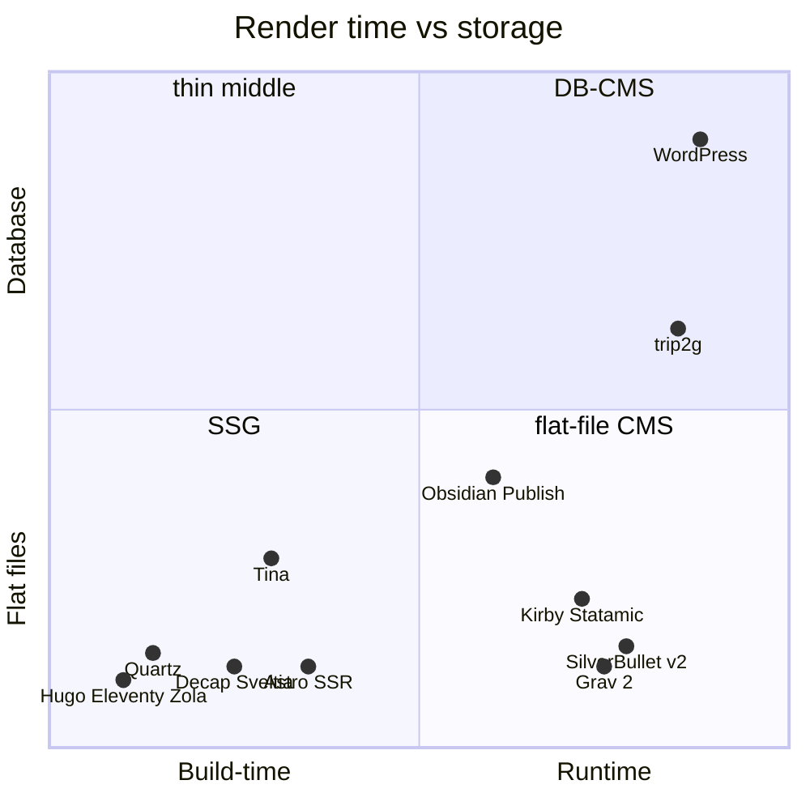
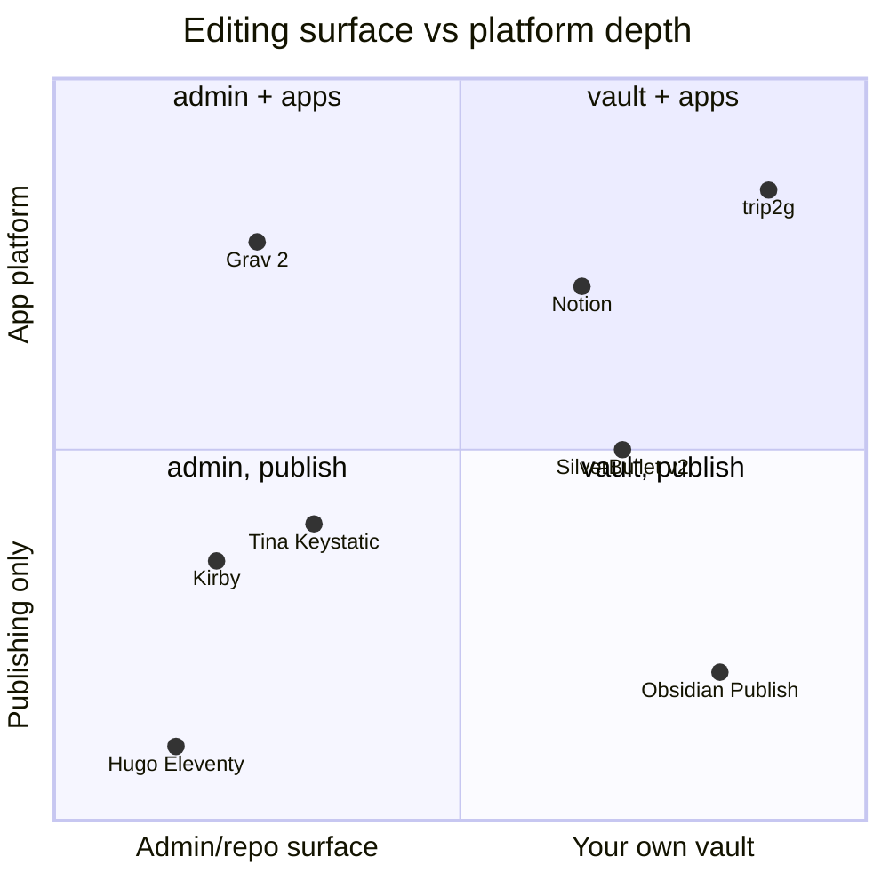
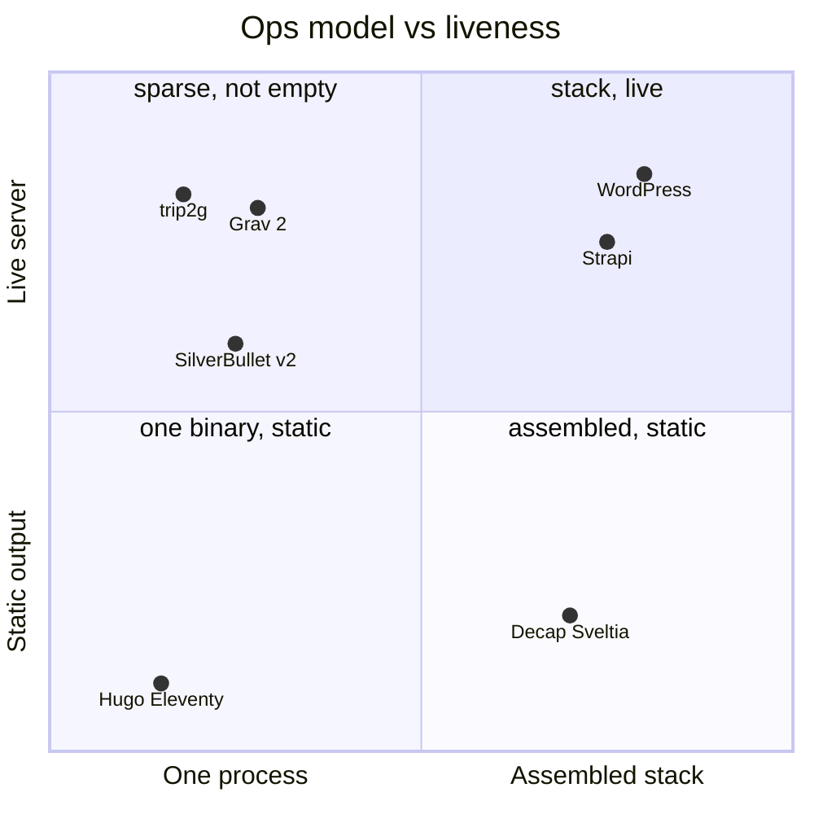
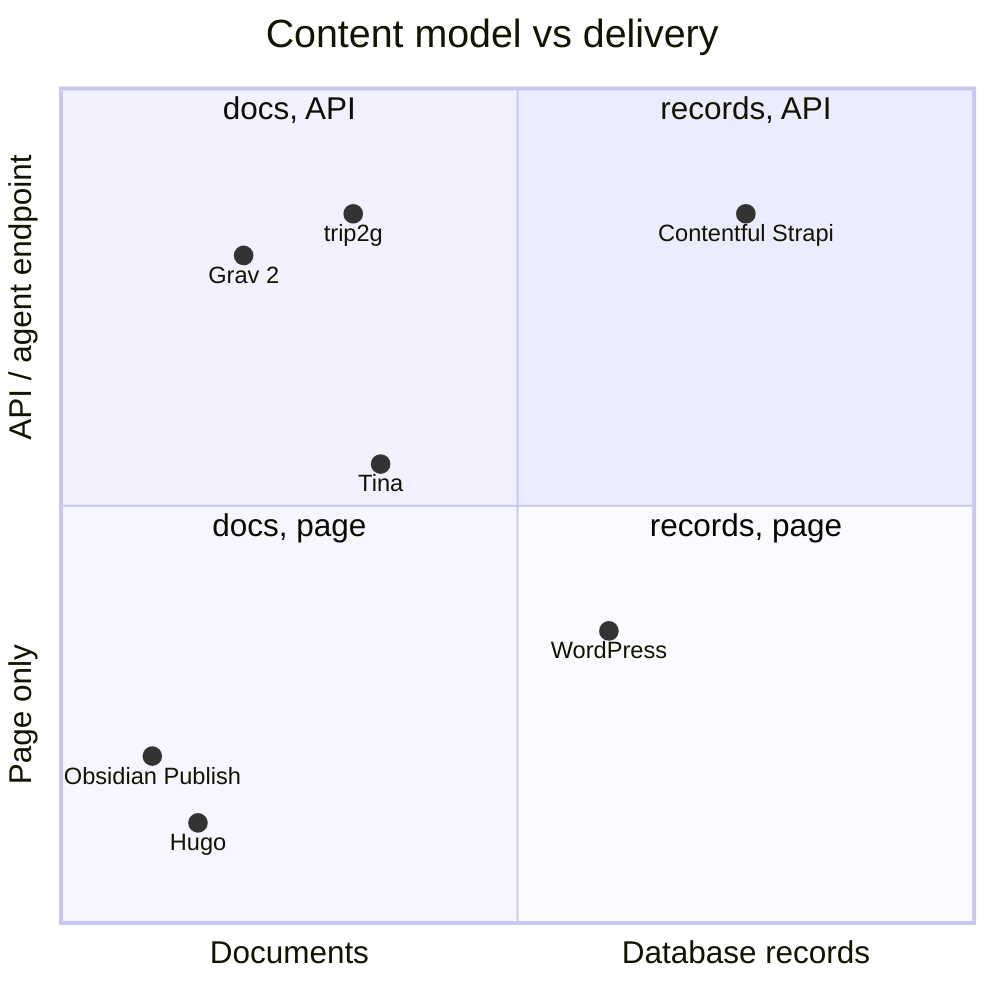
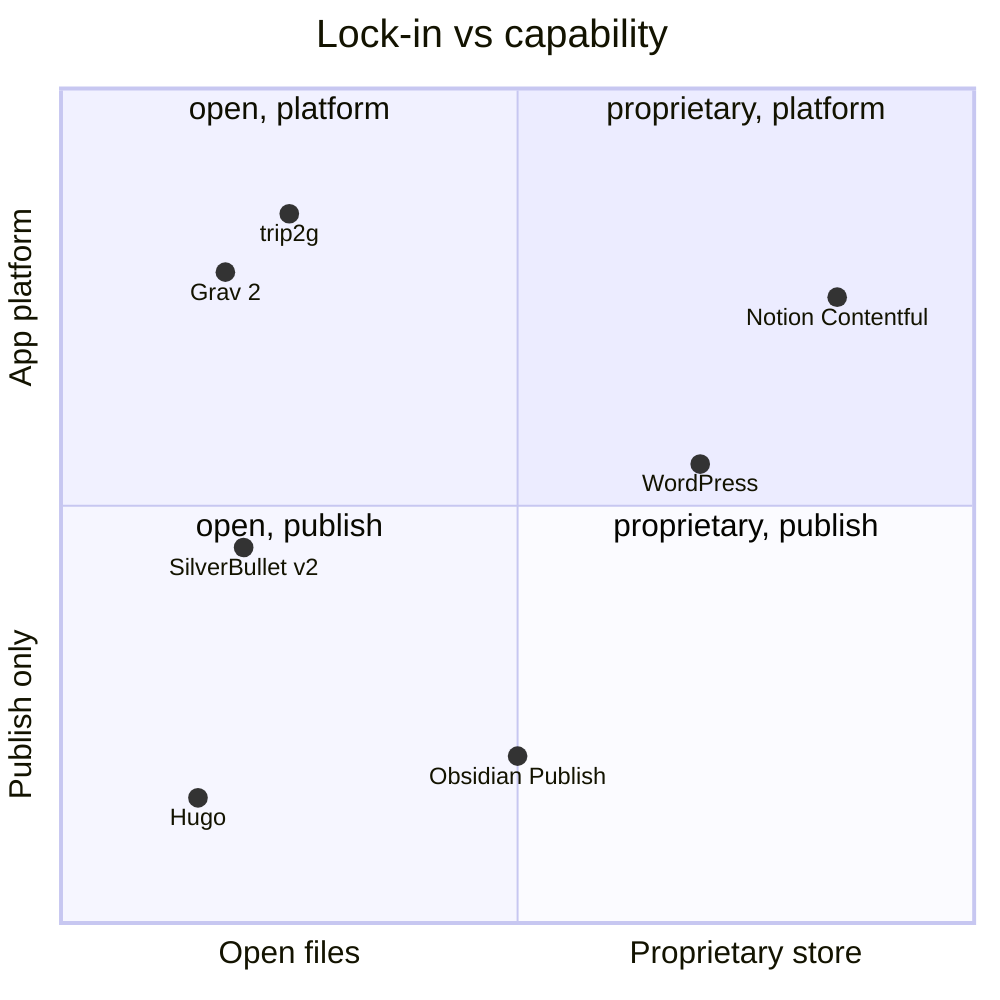
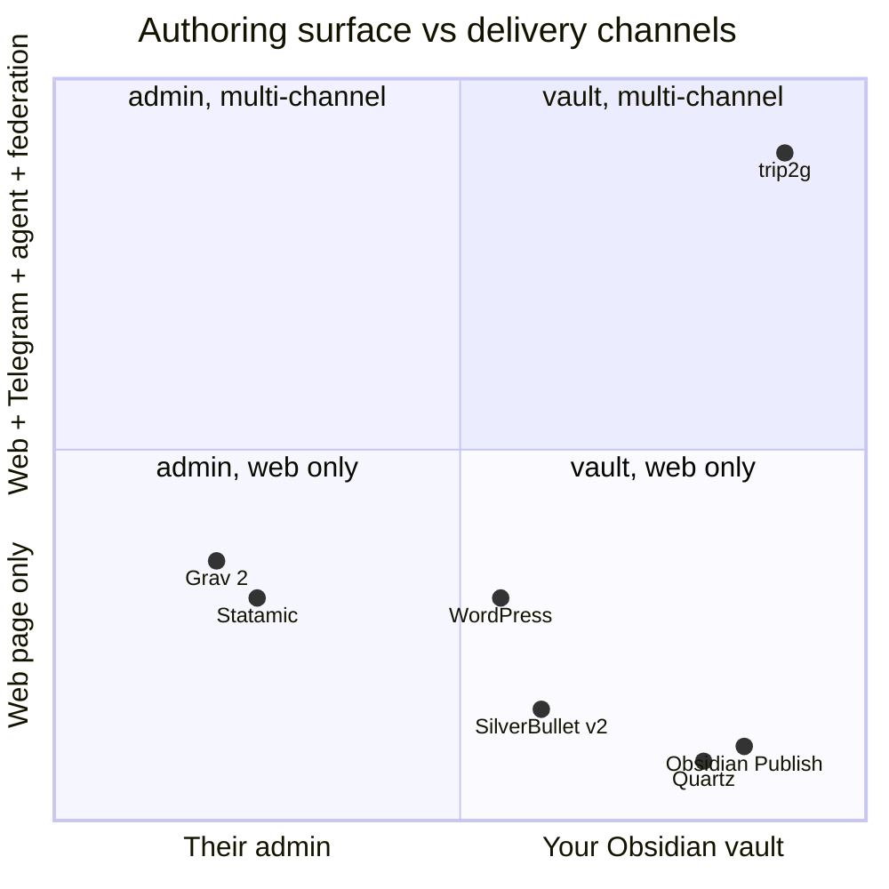

*What this is about: the same question as the first essay — what class trip2g belongs to and who its neighbors are — but after checking against the reality of July 2026. The short answer changed. trip2g is not "the empty middle of flat-file CMS": that middle has been claimed by Grav 2.0, which is more honestly flat-file and now ships the same AI story. The actual, narrow, and defensible niche is the intersection of two things that nobody else has: **the authoring surface is your personal Obsidian vault with two-way sync**, and the delivery is **not just web, but web + Telegram + agent (MCP) + federation between hubs**, over canonical SQLite. Everything else — write-API, app-shell, MCP — has been table stakes since June 2026, not differentiators.*

This is a fact-checked re-examination of [[en/thoughts/flat-file-cms|"Tool Class: a Live Server over Markdown Files"]]. The original essay stands; this is its review after Grav 2.0 moved the map.

## What changed from v1 / corrections

Short verdict: **the v1 thesis is half-obsolete a month later.** Grav 2.0 shipped on 22 June 2026 — and the three things the essay called "what no neighbor has at all" (an MCP endpoint, a targeted write-API, going beyond publishing) Grav now does out of the box, while remaining more honestly flat-file than trip2g. "The middle is almost empty" is an overstatement: the middle is thin, but it now contains a polished, funded tool that just shipped the exact AI story trip2g thought was its ace. The thesis survives only if the niche is narrowed from "empty middle of flat-file CMS" to "your personal Obsidian vault as the surface of a live server, publishing to multiple channels and federating."

Corrections in descending order of impact on the argument:

### 1. Grav 2.0 (22 June 2026) kills three "unique" trip2g differentiators

Grav 2.0 reached stable on 22 June 2026, bringing:
- **A first-party REST API in the core** — CRUD for pages (read, create, edit, move, copy, delete), frontmatter, media, config, users, plugins; authentication via API key / JWT / session; optimistic concurrency through **ETag** (two clients can't overwrite each other) — a direct analogue of the `updateNotes` version guard in trip2g;
- **A first-party MCP server** — "an AI agent can do everything a human can do in the admin panel, through the same API and the same permissions." That is word-for-word what v1 called "what no neighbor has at all";
- **Admin Next** — a SPA admin on SvelteKit 5, built entirely on top of the API, with **real-time collaborative editing**, dark theme, and a custom dashboard;
- and through all of this **everything stayed flat: files, no database, no build step, edits go live instantly**.

What this breaks in the essay:
- "MCP endpoint — something no neighbor has at all" → **false** from 22 June 2026.
- "Targeted write-API" as a differentiator → **no longer a differentiator**: Grav has a core REST API with ETag concurrency.
- "A live server with a write-API implies app-shell, which flat-file CMSes never promised" → **weakened**: Grav 2.0 is itself built api-first, with headless/decoupled as first-class.
- And the irony: **Grav is more honestly flat-file than trip2g.** Grav's canonical store is files, no database at all. trip2g's canonical store is SQLite. On the "genuine flat-file" axis, trip2g loses to Grav, not the other way around.

Sources: getgrav.org/blog/grav-2-stable-released, /blog/grav-2-api, alternativeto.net (news 06.2026).

### 2. "The middle is almost empty" — an overstatement

The middle (live server + files + small templates) already contains: **Grav 2.0** (now with API+MCP on top), **Statamic** (Laravel server, flat-file by default), **SilverBullet** (self-hosted runtime). The "one process AND live server" cell in diagram C is not empty — at minimum Grav (PHP, no DB) and trip2g are in it. Honest framing: the middle is **thin, but not empty**, and since June 2026 it has a direct competitor on the AI story.

### 3. Statamic — not pure flat-file, but a "files OR database" spectrum

Statamic (v5, on Laravel) stores content **in flat files by default, but can switch to a database** via an Eloquent driver. So "files-or-database as a choice" already exists with a neighbor — just configured rather than architected as "files outside / SQLite inside." This undermines the framing that trip2g's compromise is unique: what's unique is the specific form (the file surface as a representation of canonical SQLite), not the idea of living between files and a database.

### 4. SilverBullet v2 — not a server-render and not a publishing platform

The essay placed SilverBullet as "the closest neighbor," a "self-hosted Markdown platform with a runtime" on the "runtime, flat files" axis. The reality of v2 (2025): **local-first / browser-first PWA** — ~90% of the logic (rendering, editor, index, Space Lua) runs **in the browser**, the server is reduced to a file store. And it is **a private PKM, not a site publisher** — public publishing isn't available out of the box. So: (a) the runtime moved to the client, not the server; (b) as a "publishing neighbor" SilverBullet is weak — it's a notebook. The dot needs moving, and a caveat.

### 5. Minor factual corrections (don't change the argument, but needed for honesty)

- **Astro** is no longer purely build-time: with an adapter it provides SSR / on-demand / server islands — meaning a live server. The "SSG = no live server" pool isn't clean; Astro sits on the boundary.
- **TinaCMS** — not just git commits: there's a runtime data layer (GraphQL over a git + DB index) and live editing. But the public site is still served by the framework, not Tina — so "they don't serve the site themselves" holds for the family as a whole.
- **Decap CMS** is essentially frozen after the transfer from Netlify (2023); the active successor is **Sveltia** (targeting v1.0 for early 2026). Worth updating so Decap doesn't look like the current leader.
- **Aegea** was described correctly in v1 (runtime + MySQL, its own editor, baked-in design) — no corrections needed.
- **WordPress**: "files are an export artifact, not the source" — **confirmed, accurate** (content in MySQL, Gutenberg blocks are HTML with block metadata in comments inside `post_content`).

---

## Analysis: where trip2g actually stands

## What happened to the original thesis

v1 rested on four pillars: (1) trip2g occupies the empty middle between SSGs and DB-CMSes; (2) the editing surface is an Obsidian vault, not an admin panel; (3) the hybrid "files outside, database inside"; (4) on top: "what no neighbor has" — MCP, paid access, federation.

The July 2026 check left two of the four standing.

- **(1) empty middle** — overstatement. Grav 2.0, Statamic, SilverBullet are already there.
- **(4) MCP as a differentiator** — died 22 June 2026: Grav 2.0 ships a first-party MCP server on top of a core REST API.
- **(2) Obsidian vault as the surface** — **survived intact.** No neighbor lets you write through your existing local Obsidian vault with two-way sync. Grav uses admin panel / SFTP / git, SilverBullet has its own browser editor, Obsidian Publish does use your vault but it's proprietary hosting, publishing only, no server or API of your own.
- **(3) files/database hybrid** — survived partially. The idea of "living between files and a database" already exists with Statamic (files OR database by config). What's unique is not the idea but the form: the file surface as a *representation* of canonical SQLite with FTS, embeddings, and subscriptions. And this form has a cost: on the "genuine flat-file" axis trip2g sits further from files than Grav.

The honest pivot: move trip2g's differentiators off the axes where Grav 2.0 has now caught up (API, MCP, app-shell, platform depth) and onto the axes where it's still alone — **authoring surface (your vault) and delivery channels (web + Telegram + agent + federation)**.

## Two poles, a thin — but not empty — middle

The market is still split between two poles.

**The static generator pole** — Hugo, Eleventy, Zola, Jekyll: same Markdown and templates, but rendering at build time, output is static files on a CDN, no live server. One caveat versus v1: **Astro** is no longer purely build-time — with an adapter it has SSR, on-demand rendering, and server islands, meaning a real runtime. The pole's boundary blurred here.

**The database-CMS pole** — WordPress and headless platforms (Contentful, Strapi). There's a live server, but content is in a database or in a proprietary cloud, editing is in a web admin, files are an export artifact. "Files aren't the source" is an accurate characterization here: in WordPress a post is a row in MySQL, in Gutenberg it's HTML with block metadata in comments inside `post_content`. That holds, no dispute.

The middle — live server, files on disk, small templates, edit in place — is still thinner than the poles. But calling it empty is no longer accurate. In it:

- **Grav 2.0** (PHP, Markdown + Twig, flat-file without a database) — and from 22 June 2026 this isn't a "niche PHP engine" but an api-first CMS with REST API, MCP server, and a SvelteKit SPA admin. On the AI story: a direct competitor.
- **Statamic** (Laravel, Antlers/Blade) — flat-file by default but switchable to a database; Control Panel, REST/GraphQL, headless.
- **Kirby** (PHP, txt files, Panel) — paid, flat-file, headless mode.
- **SilverBullet** — self-hosted, but v2 moved to the browser and it's a notebook, not a publisher.

And even in this middle nobody made the key move trip2g made: **the editing surface is not "files on the server" and not a proprietary admin — it's your local Obsidian vault, syncing in both directions.**

Neighbors along other axes (updated from v1):

**Git-based / headless file-CMS** — Decap, TinaCMS, Keystatic, Sveltia, PagesCMS. Updates: **Decap is effectively frozen** after the transfer from Netlify, the active successor is **Sveltia** (v1.0 targeting early 2026). **TinaCMS** is not just git commits: there's a runtime layer (GraphQL over git + DB index) and live editing. But for the family as a whole the key point holds: **they don't serve the site** — they're an editor layer on top of a separate SSG / framework.

**Markdown runtimes and wikis** — SilverBullet (see above: v2 is browser-based, PKM, not a publisher), TiddlyWiki and DokuWiki (files + runtime, but that's a wiki), Obsidian Publish (your vault, but proprietary hosting, publishing only) and Quartz (a regular SSG for vaults, v4 in TypeScript).

**Content-source contrasts** — Notion-to-site (Super.so, Potion, Simple.ink): "your store becomes a site," but the source is proprietary, content locked in Notion. Aegea (Ilya Birman): runtime with MySQL, its own editor, baked-in design — polished, but single-purpose.

## Map A: render-time vs storage (corrected)

Corrections from v1: trip2g moved up on the "database" axis (its canonical store is SQLite — more accurate to place it above 0.55); Grav is broken out as its own point because post-2.0 it's significant on its own; SilverBullet labeled as client-side runtime.

*Diagram A: when the page renders and where content lives. Key correction — trip2g is higher on the "database" axis because its canonical store is SQLite; Grav 2.0 is the more honestly flat-file neighbor in the bottom-right.*

## Map B: where trip2g is still alone — the authoring surface

This is where the differentiator lives after Grav 2.0. On the "how much of a platform is this tool" axis, Grav 2.0 jumped up (API + MCP + SPA admin) and now stands at the same height as trip2g. What separates them is the **horizontal axis — the editing surface**: Grav uses admin panel / git, trip2g uses your Obsidian vault. The differentiator moved from "platform depth" to "where you write."

*Diagram B: where you write (their admin / repo ↔ your personal vault) and how far the tool goes beyond publishing. Grav 2.0 caught trip2g on the vertical (platform depth) but stayed on the left — you still write in their environment. trip2g and Obsidian Publish are the only ones on the right; but Publish only publishes, trip2g is a platform.*

## Map C: ops vs liveness (the cell is no longer empty)

Honest correction: the "one process AND live server" cell is not empty. Grav (PHP, no database) and trip2g (one Go binary) are both in it. SilverBullet is nearby, but its runtime has moved to the browser.

*Diagram C: how many pieces you assemble and whether the runtime is live. Correction from v1 — the quadrant renamed from "empty cell" to "sparse, not empty": Grav 2.0 now stands next to trip2g. The operational simplicity advantage remains, but it's no longer "an empty cell."*

## Map D: content model vs delivery (MCP no longer belongs to trip2g alone)

The key correction. v1 placed trip2g alone at the top of the "API/agent" axis. From 22 June 2026 Grav 2.0 is there too — it has a REST API and an MCP server. Two tools now share the top edge.

*Diagram D: documents ↔ database records and page ↔ API/agent. Correction — Grav 2.0 lifted to the top edge alongside trip2g: it now has MCP+REST over a document model too. "trip2g is unique in serving a document to an agent" no longer holds — Grav does it too.*

## Map E: lock-in vs capability (open files plus platform — no longer trip2g's alone)

Another correction. v1 held the top-left corner (open files + platform) for trip2g. Grav 2.0 moved there too: open files, no database, plus API/MCP/SPA. The differentiator shrank.

*Diagram E: how locked in the content is and how much the tool is a platform. Correction — Grav 2.0 sits directly below trip2g in the "open, platform" quadrant. Open files plus platform depth are no longer exclusive to trip2g.*

## Map F (new): what actually sets trip2g apart

Five maps from v1 measured where Grav 2.0 has now caught up. The real differentiator is on axes that weren't in v1: **authoring surface (their admin ↔ your Obsidian vault)** versus **delivery channels (web only ↔ web + Telegram + agent + federation)**. Here trip2g stands alone in the top-right corner.

*Diagram F: where you write and where you deliver. The only map where trip2g stands alone in the corner. Obsidian Publish and Quartz are also "your vault," but they deliver to web only. Grav / Statamic have richer API channels, but you write in their admin. The intersection {your vault} × {web + Telegram + agent + federation} is empty, and trip2g fills it.*

## Verified comparison table

Axes: **Rendering** (build ↔ runtime); **Storage** (files / database / proprietary cloud); **Editing surface**; **Write mechanism**; **Beyond publishing** (API/MCP/app); **Hosting**.

| Tool | Rendering | Storage | Editing surface | Beyond publishing | Hosting |
|---|---|---|---|---|---|
| **trip2g** | runtime | **SQLite canonical + files as view** | **local Obsidian vault (2-way sync)** | write-API, MCP, app-shell, **Telegram, federation** | self-host, 1 Go binary |
| **Grav 2.0** | runtime | flat-file, no DB | admin panel / SFTP / git | **REST API + MCP + SPA admin** (from 06.2026) | self-host, PHP |
| **Statamic 5** | runtime | **flat-file OR database (by config)** | Control Panel | REST/GraphQL, headless | self-host, Laravel |
| **Kirby** | runtime | flat-file (txt) | Panel | headless mode | self-host, PHP (paid) |
| **SilverBullet v2** | **browser (local-first)** | .md on server + IndexedDB | own browser editor | Space Lua, but it's a PKM | self-host |
| **WordPress** | runtime | **database (MySQL)** | wp-admin | REST API, headless | self-host/SaaS, PHP+DB |
| **Aegea** | runtime | **database (MySQL)** | own editor | none (single-purpose) | self-host, PHP+DB |
| **Strapi** | — (headless) | database (PG/MySQL/SQLite) | admin panel | REST+GraphQL | self-host/SaaS, Node |
| **Contentful** | — (headless) | **proprietary cloud** | web admin | API-first | SaaS only |
| **Hugo/Zola/Jekyll** | **build-time** | files | own file editor | none (static) | any CDN |
| **Astro** | build **or SSR** | files | own file editor | SSR/endpoints | CDN or server |
| **Decap (frozen)/Sveltia** | none (editor) | files in git | panel → git commit | doesn't serve site | self-host |
| **TinaCMS** | none (+ data runtime layer) | git + DB index | live editor → git | GraphQL layer, but framework serves the site | SaaS/self-host |
| **Keystatic/PagesCMS** | none (editor) | files in git | panel → git commit | doesn't serve site | self-host |
| **Obsidian Publish** | Obsidian cloud | local MD → their cloud | your vault | publishing only | **proprietary SaaS** |
| **Quartz v4** | **build-time** | MD → static | your vault | none (static) | self-host/CDN |
| **Notion-to-site (Super/Potion)** | static/cloud | **Notion (proprietary)** | Notion | publishing only | SaaS only |

## The narrowest honest niche formula

v1: "flat-file CMS in the empty middle, with MCP/write-API/app-shell that no neighbor has." That no longer passes scrutiny.

v2, narrow and defensible: **trip2g is what happens when your existing local Obsidian vault becomes a live server that publishes to multiple channels (web + Telegram), exposes write-API and MCP tools to an agent, hosts small applications, and federates with other hubs — on top of canonical SQLite that provides search, versioning, and subscriptions.**

What holds up under adversarial review, and what's rhetoric:
- **Holds:** authoring surface = your Obsidian vault with two-way sync (nobody else); multi-channel delivery (Telegram + web from one source); federation between hubs; Obsidian-native semantics (wikilinks, embeds). This is the moat — and it is NOT a "flat-file CMS" feature set.
- **No longer holds as a differentiator:** MCP endpoint (Grav 2.0 has one), targeted write-API (Grav REST+ETag), app-shell/platform depth (Grav api-first), "files-or-database hybrid" as an idea (Statamic does files-or-database).
- **Holds with a caveat:** "one binary + live server" — yes, but Grav (PHP, no DB) stands next to it, the cell isn't empty. And "flat-file CMS" as a self-description is weak: trip2g's canonical store is a database; it is more accurately described as a **DB-CMS with a file-based authoring surface**, not a flat-file CMS.

Put differently: stop selling "the empty middle" and "unique MCP." Sell the intersection that genuinely doesn't exist anywhere else — **write in your Obsidian, deliver to web, Telegram, an agent, and a federation from one live server.**

---

## Sources

Grav 2.0:
- https://getgrav.org/ , https://getgrav.org/features
- https://getgrav.org/blog/grav-2-stable-released
- https://getgrav.org/blog/grav-2-api
- https://getgrav.org/blog/grav-2-admin-next
- https://alternativeto.net/news/2026/6/flat-file-cms-grav-2-0-launches-with-rest-api-new-admin-and-mcp-server-for-ai-integration/

Kirby / Statamic:
- https://getkirby.com/ , https://statamic.dev/ (Eloquent/DB driver, Antlers/Blade, Control Panel, REST/GraphQL)

SilverBullet v2 / wikis / Obsidian:
- https://silverbullet.md/Architecture , https://v2.silverbullet.md/Architecture
- https://community.silverbullet.md/t/silverbullet-v2-the-path-forward/2036
- https://v2.silverbullet.md/Space%20Lua/Lua%20Integrated%20Query
- https://lwn.net/Articles/1030941/
- https://github.com/TiddlyWiki/TiddlyWiki5 , https://en.wikipedia.org/wiki/DokuWiki
- https://obsidian.md/pricing , https://obsidian.md/publish
- https://github.com/jackyzha0/quartz , https://quartz.jzhao.xyz

Git-CMS / SSG:
- https://github.com/decaporg/decap-cms , https://github.com/sveltia/sveltia-cms
- https://tina.io/docs/self-hosted/overview , https://keystatic.com/docs/reader-api , https://pagescms.org/docs/
- https://docs.astro.build/en/guides/on-demand-rendering/ , https://docs.astro.build/en/guides/server-islands/
- https://gohugo.io , https://www.11ty.dev , https://www.getzola.org , https://jekyllrb.com

WordPress / Notion / Aegea / headless:
- https://wordpress.org/about/requirements/ , https://developer.wordpress.org/block-editor/getting-started/fundamentals/markup-representation-block/
- https://super.so/ , https://potion.so/pricing , https://www.simple.ink/
- https://ilyabirman.ru/aegea/ , https://blogengine.ru/help/
- https://strapi.io/ , https://www.contentful.com/headless-cms/
