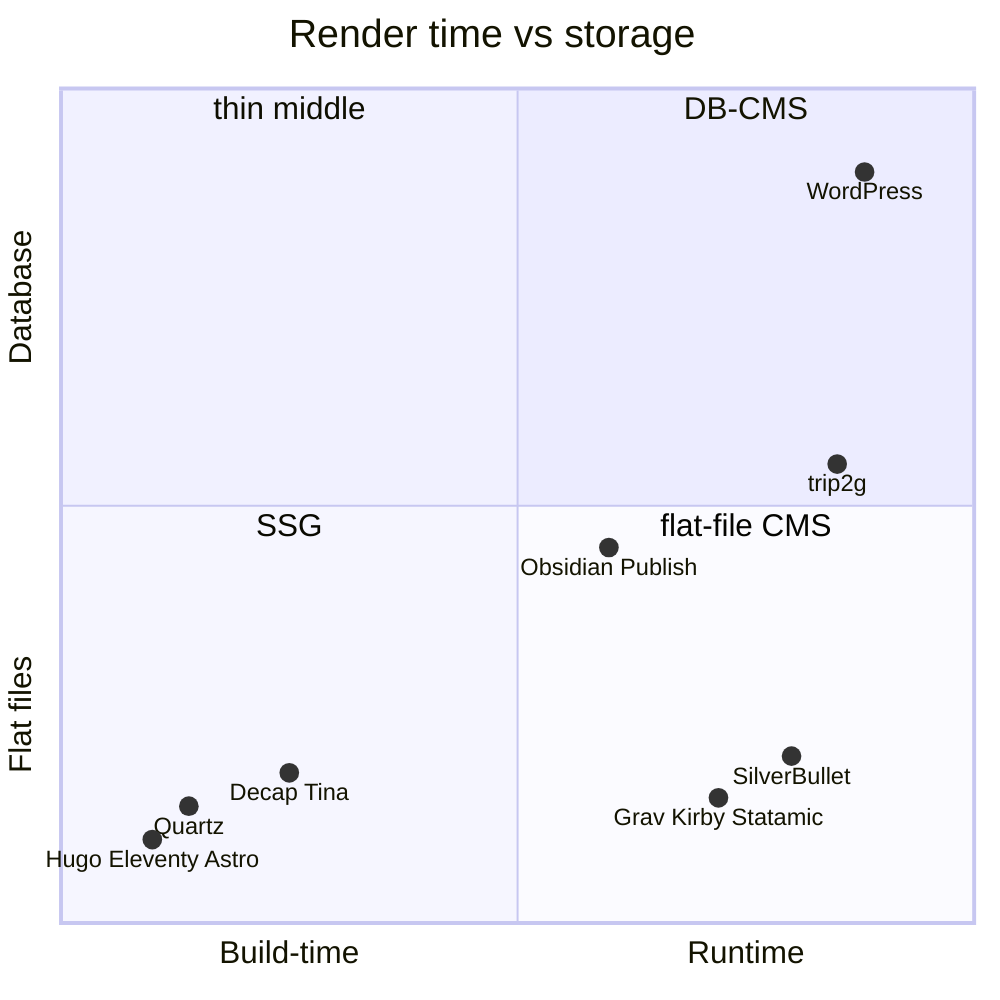
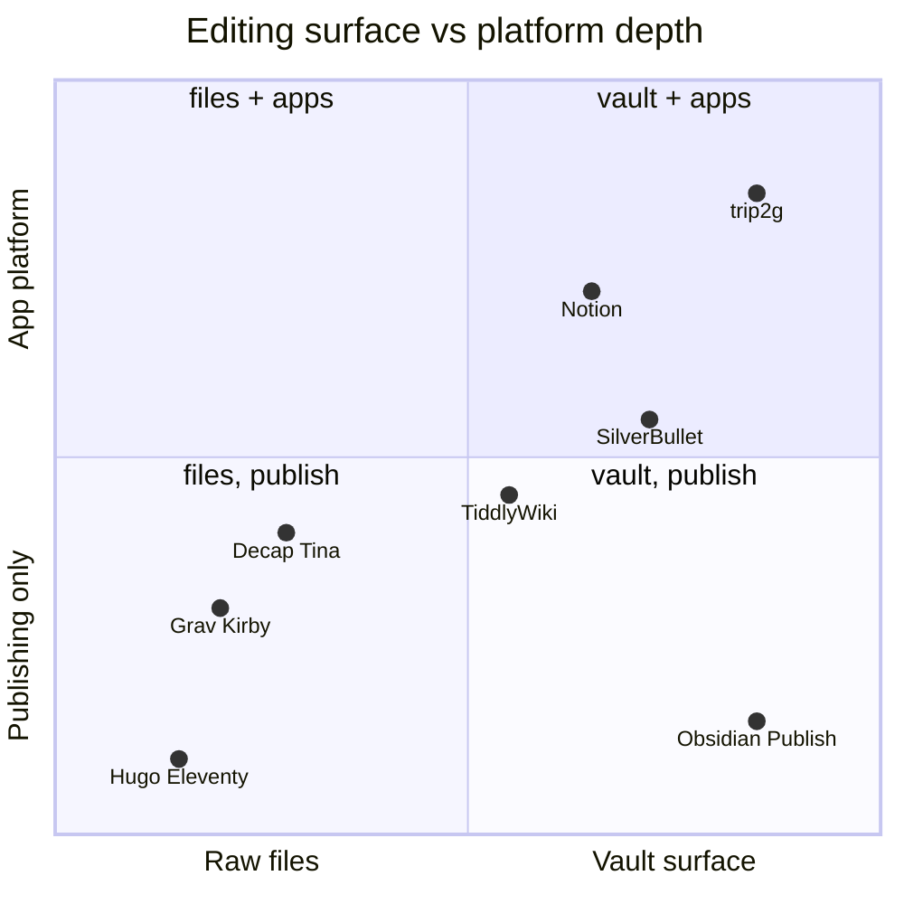
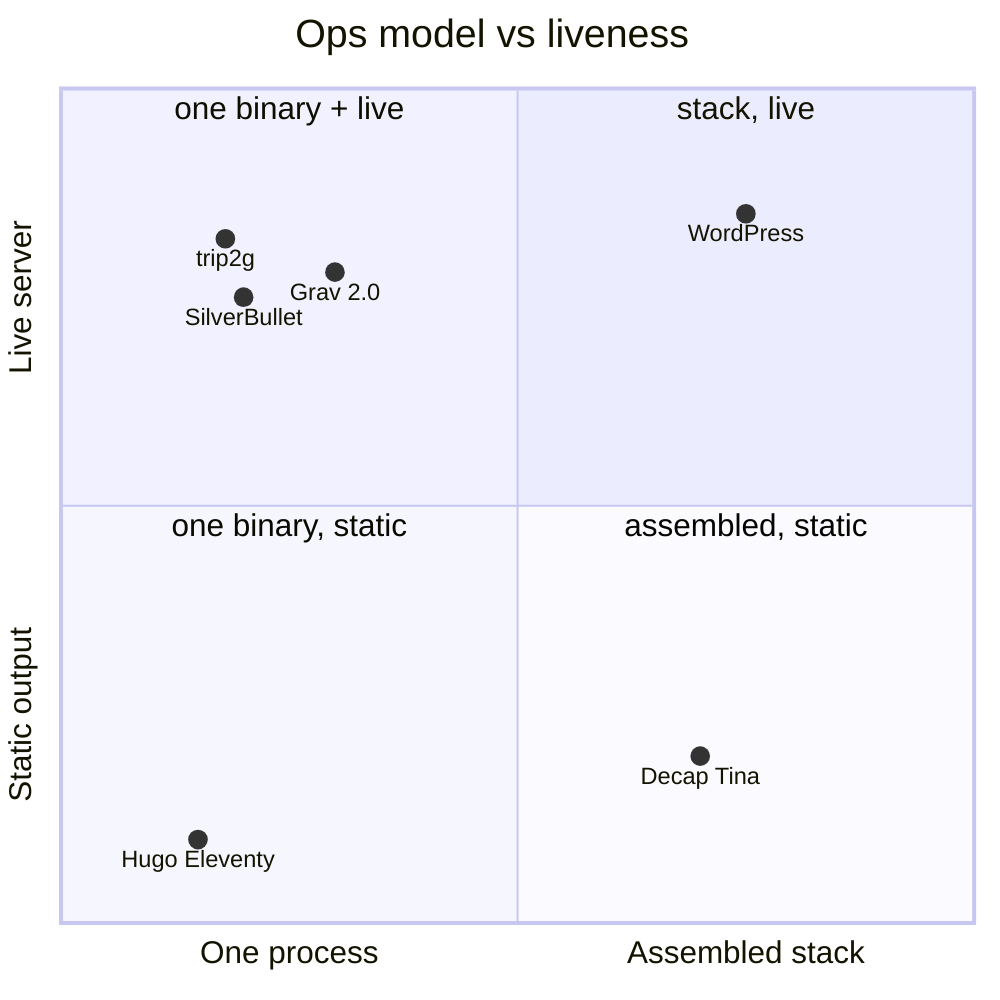
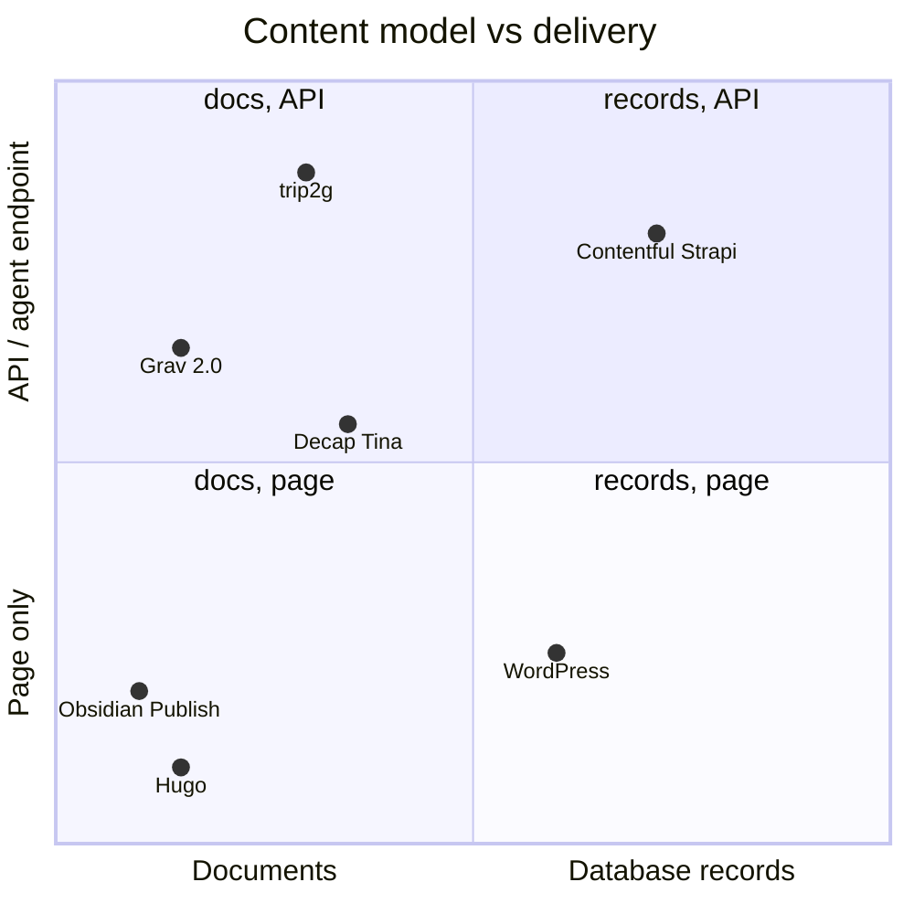
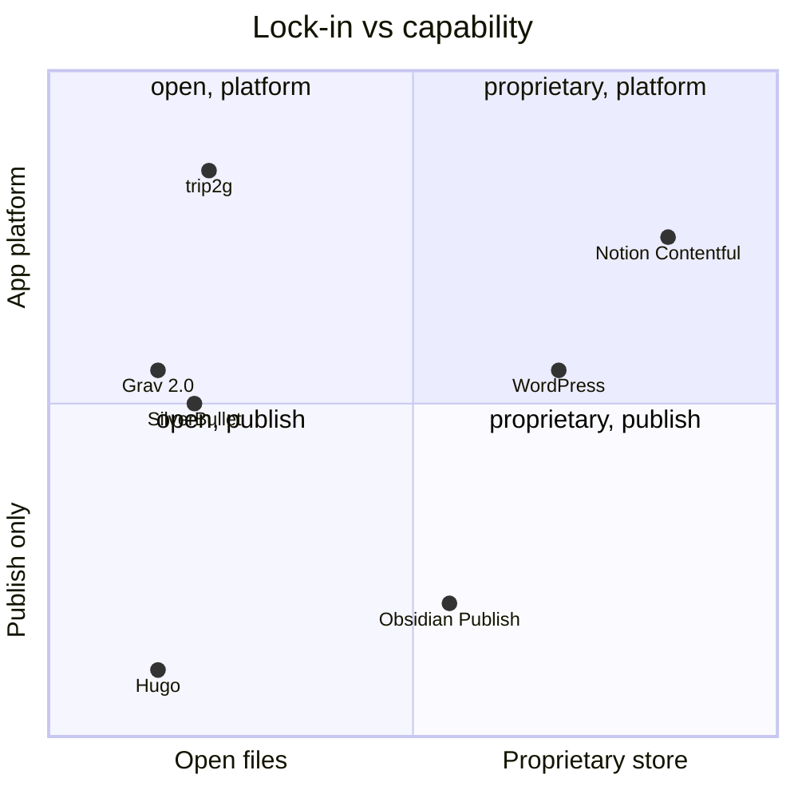

*What this is about: what class trip2g belongs to, who its neighbors are, and what in the positioning is honest versus marketing. Short answer: it's a flat-file CMS — content in files, rendering at runtime, no separate database server. The niche has existed for fifteen years but stayed thin: the market split into two poles — static generators and database-backed CMSes — and almost nobody occupied the middle. trip2g stands in that middle, with two differences: the editing surface is a local Obsidian vault with sync, and under the hood it's not literal files but SQLite. A hybrid: you edit like files, the server works like a database.*

## The feeling that started it all

There's a simple need that had no simple tool for years: "make a small site from HTML and templates." Almost any site is notes, pages, a bit of navigation. You want something like nginx plus an API that can save individual files in place. Put in Markdown, get a page. Edit a template, the page changes. No database, no build pipeline, no deploy ceremony.

Tools for this exist. The class is called flat-file CMS (also database-less or file-based CMS): content lives in Markdown files, templates render at runtime on the server, editing happens through a panel or API, no separate database. Lineage: [**Grav**](https://getgrav.org) (PHP, Markdown + Twig), [**Kirby**](https://getkirby.com), [**Statamic**](https://statamic.com), and smaller ones — [Automad](https://automad.org), [WonderCMS](https://www.wondercms.com), [Bludit](https://www.bludit.com), [Pico](https://picocms.org), [HTMLy](https://www.htmly.com). Almost all from the PHP era: drop a folder on shared hosting and it works.

But the class stayed niche. Why is visible if you look at where the market split.

## Two poles, a thin middle

The publishing market split in two.

**Pole one — static generators**: [Hugo](https://gohugo.io), [Eleventy](https://www.11ty.dev), [Astro](https://astro.build), [Zola](https://www.getzola.org), [Jekyll](https://jekyllrb.com). Same Markdown, same templates, but rendering happens at build time. The output is static files on a CDN. One downside, but a structural one: no live server. Nothing to accept writes via API, nothing to check a subscription, nothing to answer an agent. Any change means a rebuild and redeploy.

**Pole two — database-backed CMS**: [WordPress](https://wordpress.org) and its descendants. There's a live server, but content lives in a database, editing happens in a web admin, files are an export artifact rather than the source. Plus a separate database process to maintain.

The middle — live server, files on disk, small templates, edit in place — went to that thin flat-file CMS layer. And even inside it, nobody made the key move: **the files are not "files on the server" but your local Obsidian vault** that syncs. Grav and Kirby's editing surface is their admin panel or SFTP. You still write in their environment, not yours.

There are two more families of neighbors along other axes.

**Git-based / headless file-CMS**: [Decap](https://decapcms.org) (formerly Netlify CMS), [TinaCMS](https://tina.io), [Keystatic](https://keystatic.com), [Sveltia](https://github.com/sveltia/sveltia-cms), [PagesCMS](https://pagescms.org). This is exactly the second half of the formula — "an API that saves files": the editing panel commits Markdown to git. But they don't serve the site themselves — they're a layer glued to a framework and SSG pipeline. There's no server doing the rendering.

**Markdown runtimes and wikis**: [**SilverBullet**](https://silverbullet.md) — the closest neighbor, a self-hosted Markdown platform with a runtime and templating; [TiddlyWiki](https://tiddlywiki.com), [DokuWiki](https://www.dokuwiki.org) (also files + runtime, but that's a wiki, not a site platform); [Obsidian Publish](https://obsidian.md/publish) and [Quartz](https://quartz.jzhao.xyz) — vault publishing, but Publish is proprietary hosting without your own server, and Quartz is a regular SSG.

Two more contrasts — not neighbors in the class but its opposite by content source. **Notion-to-site** ([Super.so](https://super.so), [Potion](https://potion.so), [Simple.ink](https://simple.ink)) turn Notion into a website: the same niche as trip2g — "your store becomes a site" — but the source is proprietary, content locked in Notion rather than your files. trip2g is the open version of the same move: Obsidian and `git clone` of everything. **[Эгея](https://blogengine.ru)** (Ilya Birman) — a polished self-hosted blog engine: runtime with a database, its own browser editor, one baked-in design with no themes. It sits opposite trip2g on two axes at once: you write in its editor, not in files, and there are no templates. Both points show what trip2g trades on — not polishing one thing to a shine, but open files and the right to template anything.

All of this on one chart:

*Diagram A: when the page renders (build time ↔ runtime) and where content lives (flat files ↔ database). trip2g is at runtime, on the boundary between files and database.*

## Where trip2g stands — and an honest caveat

trip2g brings both halves of the formula into one process: a live server that renders templates at runtime (like Grav), plus a targeted write-API (`updateNotes` — upsert, patch, find/replace on a note), plus sync with a local vault. One Go binary, no separate database process — operationally closer to nginx than to WordPress.

Now the caveat, without which the positioning would be marketing. **trip2g is not a pure flat-file CMS.** Under the hood it's SQLite, and the database is canonical: `note_versions`, full-text index, embeddings, subscriptions. Files are the *authoring surface*, not the physical store. The vault on your disk and the git mirror are views of the database, not the other way around.

So this is a hybrid: **edit like files — server works like a database.** The UX of flat files (any editor, readable diffs, `git clone` of everything) with the reliability and speed of a database (transactions, indexes, versions, search). Pure flat-file CMSes have the opposite arrangement: the store is honestly flat, but concurrent writes, history, and search are perennial pain that each one solves with workarounds. trip2g makes a different trade-off and doesn't pretend the server files are literal.

## The second angle: app-shell

A custom layout in trip2g is a full HTML page with admin-level trust, which means you can put an SPA inside it.

This isn't a hypothesis — two components already work this way: the kanban board and the theme editor. Both are SPAs inside a layout note that talk to trip2g's own GraphQL. Data for such an app comes from two paths:

- **From notes.** The kanban stores its model directly in Markdown notes and saves through `updateNotes`. Notes become the application's database — with versioning and a git mirror for free.
- **From your own Postgres alongside.** Deploy [PostGraphile](https://www.graphile.org/postgraphile/) or [PostgREST](https://postgrest.org), have Caddy reverse-proxy `/api`, bridge authorization — and the SPA inside a trip2g layout works against a full relational database. The honest cost: you lose the simplicity of one binary, the stack is assembled from parts again.

This gives a second positioning formula: trip2g is also an app-shell. "Bring your SPA — I'll provide hosting, authorization, routing, assets; data comes from my notes or from your Postgres." Plus: an MCP endpoint (those same notes as tools for an agent), paid access, and federation between hubs.

Grav 2.0 (released June 2026) now ships a first-party REST API, a native MCP server, and a SvelteKit SPA admin — while staying purely flat-file with no database. It is trip2g's closest neighbor in spirit, and the more honest flat-file of the two: Grav's canonical store is files, not SQLite. What remains specific to trip2g: the Obsidian vault as authoring surface with two-way sync, the file-UX-over-SQLite hybrid, and multi-channel delivery — web, Telegram, and federation — from one binary.

*Diagram B: what serves as the editing surface (raw files ↔ vault/notes) and how far the tool goes beyond publishing (site only ↔ platform with write-API and agents). Notion is the contrast point: similar surface and platform depth, but proprietary storage with no files.*

## Three more axes

trip2g's position doesn't read off one chart — it holds along several axes at once, and each one separates it from different neighbors. The three diagrams below fill in what A and B don't show.

**Operational model.** How many processes you need to run and whether the server is live. Here trip2g sits with SSGs in terms of simplicity (one binary), but by liveness it's on WordPress's side. That cell — "one process AND a live server" — is sparsely populated: Grav 2.0 (flat-file, no DB) is the closest neighbor, alongside SilverBullet.

*Diagram C: how many pieces you need to assemble (one process ↔ assembled stack) and whether there's a live runtime (static output ↔ server). trip2g — "one binary AND a live server"; Grav 2.0 occupies the same cell — flat-file PHP, no DB, live.*

**Content model and delivery.** What lives inside — documents or database records — and how it's served: as a page or via a programmatic interface. Classic CMSes and SSGs serve pages from documents. Headless CMSes serve records via API. trip2g is unusual in that the same document is served *both* as a page to humans *and* as a tool to an agent via MCP.

*Diagram D: what content looks like inside (documents ↔ database records) and how it's served (page only ↔ API/agent endpoint). trip2g serves the same document as both a page and an MCP tool — the top edge of the document model.*

**Lock-in versus capability.** How locked in the content is (open files ↔ proprietary format) versus how far the tool goes beyond publishing (site only ↔ platform with apps). [Notion](https://www.notion.so) and [Contentful](https://www.contentful.com) give platform depth at the cost of lock-in. SSGs give openness without the platform. trip2g targets the top-right corner: open Markdown files, `git clone` of everything — and at the same time an app-shell.

*Diagram E: how locked in the content is (open files ↔ proprietary store) and how much the tool is a platform (publish only ↔ apps). trip2g — open files plus app-shell, whereas platform depth usually comes at the cost of lock-in.*

## When this is not your tool

An honest list, so the positioning doesn't become "suits everyone."

- **Purely static site with no writes.** If you need a blog once a week and nothing live — Hugo on a CDN is simpler, cheaper, and more indestructible. A live server is something you have to run somewhere.
- **You need literal flat files on the server.** If the requirement is "files on the server's disk are the system," use Grav or SilverBullet. In trip2g what's canonical on the server is SQLite; files are outside, with you.
- **Large application with a relational model.** App-shell with Postgres alongside works, but that's already an assembled stack: Caddy, PostGraphile, an auth bridge. On that terrain you're honestly competing with a regular web framework — and often it will win.
- **A team without a Markdown culture.** The editing surface is a vault and files. People who need a WYSIWYG editor for ten editors at once will be more comfortable with a classic CMS.

## Conclusion

The class formula: **flat-file CMS whose surface is a local Obsidian vault and whose server is a single binary with a targeted write-API.** The hybrid "files outside, database inside" is not a compromise but a choice: the UX of files, the reliability of a database. And because the server is live and the API writes in place, the same tool turns out to be an app-shell for small applications — from a kanban on notes to an SPA with Postgres alongside. The middle ground between Hugo and WordPress is no longer empty — Grav 2.0, SilverBullet, and others occupy it too. What remains specific to trip2g: the Obsidian vault as authoring surface with two-way sync, the file-UX-over-SQLite hybrid, and multi-channel delivery — web, Telegram, and federation — from one binary.
