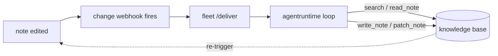

*What this is: trip2g read as a literal operating system, notes as the filesystem, MCP as syscalls, federation as the network, agents as processes. Every row in the map is tagged by how real it is, so you can see where the metaphor is earned and where it is not. Read it if you want to judge whether "Markdown OS" is a real claim or just a label.*

trip2g began as a way to publish an Obsidian vault as a website. Somewhere along the way it grew the shape of an operating system. Notes are the filesystem. The MCP endpoint is the system-call interface that agents go through. Federation is the network stack. A note edit can start an agent. All of that runs on `main` today, including the piece that makes the comparison land: agents as processes, merged as the `fleet` runtime after a spell on a feature branch. This is the honest version of the claim, with the remaining gaps marked as such.

The framing is borrowed. ["Markdown as an Operating System"](https://leverageai.com.au/markdown-as-an-operating-system/) puts it in one line: your operating system runs on binaries, your AI agents should run on Markdown. The older root is Unix, where everything is a file. trip2g's version is that everything is a note.

---

## Everything is a note

One namespace, addressed by path, shared by people and agents. A note is a markdown file. The frontmatter is its metadata, the body is its content. There is no second store where the "real" data lives. The website you read and the answer an agent gets back are two renderings of the same file.

Every edit is snapshotted into a `note_versions` row and mirrored into a git repository that trip2g keeps as a lazy, database-canonical copy. So the history of any note is a diff a person can read in a few seconds and revert. That is the whole substrate idea: pick the one format every editor, every diff tool, and every model already understands, then derive the website, the feed, and the audit log from it.

---

## The map

The operating-system words are not decoration. Each one points at a specific mechanism. Here is the mapping, tagged by how real it is. Shipped runs on `main`. The agent rows were the last to land: they lived on `feat/agent-runtime` until the fleet merged.

| OS concept | trip2g primitive | Status |
|---|---|---|
| Filesystem | one path-addressed note namespace | shipped |
| Files | notes: frontmatter is metadata, body is content | shipped |
| Overlay filesystem | frontmatter patches (Jsonnet) override notes without touching the source | shipped |
| Snapshots | `note_versions` plus a database-canonical git mirror | shipped |
| Filesystem over git | clone, pull, and push the vault over git Smart HTTP (`/_system/git`) | shipped |
| Syscalls | MCP tools: `search`, `note_html`, `similar`, `federated_*` | shipped |
| Network stack | federation, with a `max_depth` TTL on every query | shipped |
| Virtual hosts | per-domain routing via `route`/`routes` frontmatter | shipped |
| Scheduler | cron webhooks plus goqite worker pools | shipped |
| Process dispatch | change webhooks: a note edit POSTs an event | shipped |
| Permissions (people) | subgraphs and subscription access | shipped |
| Auth providers | email magic-link, Google/GitHub OAuth, OIDC SSO | shipped |
| Permissions (agents) | per-webhook read and write globs in a signed token | shipped |
| Credential store | encrypted secrets, AES-256-GCM | shipped |
| Capability ticket | HAT: signed short-TTL token, `ae=true` admin elevation | shipped |
| Display server | the website: default and Jet templates, mermaid, datachart | shipped |
| Page cache | anonymous rendered-page cache, version-keyed | shipped |
| Output target | publish notes to a Telegram channel, links preserved | shipped |
| Standard input | forms in frontmatter, submissions stored per note | shipped |
| Control surface | a kanban board note (`layout: kanban`), agent-driven | shipped |
| Kernel config | feature flags, validated at boot (panics on missing dep) | shipped |
| Process executor | the in-note agent loop (`agentruntime`): LLM or deterministic code | shipped |
| Package manager | role-as-note: `fleet` registers the agent | shipped |
| Resource limits | non-overridable token and step caps per run | shipped |

---

## Syscalls: the MCP server

An agent never opens the database. It calls a small set of tools over [[en/user/mcp|MCP]]: `search`, `note_html`, `similar`, and the `federated_*` variants that fan the same calls out to peer hubs. An `instructions` tool returns an author-defined prompt. Access is scoped to the caller's subscription, so two agents pointed at the same hub can see different notes.

You can define your own tool in a note's frontmatter with `mcp_method`. That is the kernel boundary. The knowledge base has one controlled interface, and everything an agent does passes through it.

---

## The network stack: federation

A hub can [[en/user/federation|peer]] with another hub. A `federated_search` on one hub runs the query locally and forwards it to its peers, then merges the results. Each hub decides, per base, what a given peer is allowed to see.

The calls are signed with HMAC-SHA256 and carry a short-lived token. Loops are bounded the way IP packets are: a per-hop depth counter (the `X-MCP-Federation-Depth` header) that each hub checks against its `max_depth`, so a question cannot bounce around the network forever. One agent's query reaches the union of everything the connected hubs agree to share, and none of them merge databases to do it.

This is where the old name for trip2g, a knowledge mesh, fits into the new one. Each hub is one Markdown OS. Federation is the link between them, and the mesh is the network those links form, the way the internet is a network between computers. The shape is up to you: a star with a central hub and satellites, a chain, a full mesh where everyone peers with everyone, or two stars joined by a single bridge. The protocol does not assume a topology, so you can build any of them.

---

## The scheduler and process dispatch

Two mechanisms here, both on `main`. A [[en/user/webhooks|change webhook]] fires when a note is created, updated, or removed: trip2g POSTs the event to an agent, the agent writes notes back through the API, a glob filter decides which notes trigger it, an HMAC signs the delivery, and `max_depth` stops a write from triggering itself in a loop.

A cron webhook runs an agent on a schedule. A `next_run_at` column plus a once-a-minute system cron drive it, and a goqite-backed worker pool runs the jobs with per-queue concurrency and priority. This is the part of the system that decides when something runs. It does not yet decide what the agent thinks.

---

## Userland: the agent fleet

This is the layer that earns the word "runtime," and it is on `main` now: `fleet` and `agentruntime` merged in mid-2026 and are exercised end to end in the test suite.

The idea is small. An agent is a note. Its frontmatter is the configuration: which model, which tools, the `read_patterns` and `write_patterns` that scope what it can touch, the `trigger_on` that says which notes wake it, a `for_each`, a `max_depth`, a `timeout_seconds`. Its body is the instruction, written as a Jet template that can reference the note that changed. A daemon called `fleet` watches a folder of these role notes and registers each one as a change webhook pointed back at trip2g itself. Drop a note into the folder and the agent is installed. Delete the note and it is gone. That is the package manager, and the package is a markdown file.

When a watched note changes, the webhook fires and `fleet` runs a scoped loop called `agentruntime`. The model gets the instruction and the in-scope context and calls `search`, `read_note`, `write_note`, `patch_note`, and `finish`. Reads and writes are checked against the role's glob patterns, so an agent allowed to write only to `reports/` cannot touch `roles/`. A token-and-step ceiling that the agent cannot raise caps the run. `max_depth` breaks the case where an agent's own write would wake it again. trip2g stays a plain event source. The instruction, the scope, and the triggers all live in notes you can read.

Not every agent needs a model. A role can declare `executor: code`: the fenced blocks in its body are the program (python, bash, or node), run sandboxed as a stdout-to-stdin pipeline, and the final stdout is parsed as writes that pass the same scope checks. An LLM agent can also get an `exec` tool for running snippets, but only when the operator starts `fleet` with `--allowed-programs`; by default it is off.

The plumbing under this, the webhooks and the scoped tokens and the delivery jobs, is shipped. So are the in-note agent loop and the `fleet` reconciler that sit on top of it.

---

## The display server: one note, many renderers

The same note renders for a person in more than one way. The default template composes a page from frontmatter, no code required. A [[en/user/templates|custom Jet template]] takes full control and gets the markdown AST, so you can iterate sections and lay out the page down to the HTML. On top of that sit renderer extensions that the backend loads per note, only when a note asks for them: [[en/user/mermaid|mermaid]] for diagrams, a [[en/user/chartdata|datachart]] widget that turns a referenced CSV into a chart, and the rest of the widget set. A note declares what it needs, and the page ships only those scripts.

---

## Another output: notes as Telegram posts

The website is not the only render target. The same notes publish to a [[en/user/telegram|Telegram channel]], scheduled or instant, and trip2g keeps the link graph intact across the boundary. A wikilink to a note that has its own post resolves to that post; a note that is not posted yet falls back to its page on the site, so a link never dangles. Edit the note, re-sync, and the channel post updates itself. The notes are the source, and the channel is one more rendering of them.

---

## Standard input: forms

A note can collect input, not only show it. Put a [[en/user/forms|`form:` block]] in the frontmatter and trip2g renders a form on the page, accepts submissions through the GraphQL API, and stores each one against the note. The field types and validators are declared in the frontmatter, Cloudflare Turnstile guards public forms by default, and `can_submit` decides who may post. Submissions land in the admin panel and an API, and each one emails the vault admins. This is the note's standard input: a controlled way for the outside world to write into a per-note inbox, the same way the rest of the system gives agents a controlled way in.

---

## The vault is a git repo

There is one more way into the filesystem. trip2g serves the whole knowledge base over git Smart HTTP at `/_system/git`, so you can `git clone` it, pull it, and push to it. The database stays canonical, and the git tree is not a checkout sitting on disk: `gitapi` materializes it on demand at the moment of a git interaction, and a push is applied back into the notes. This is the same substrate from a developer's side: back up the vault with a clone, get its full history in that clone, and change it with a commit instead of an API call. It also makes the audit-log idea literal, since what you clone is a real git history.

---

## The control surface: the kanban board

A board is a note with [[en/user/kanban|`layout: kanban`]]. A card is a line like `- ship the docs @status:doing @assigned:bob`. Editing a card is a note edit, which means the same trigger that drives any agent can drive a triage agent that reads the board and rewrites cards in place with `patch_note`. The note is both the thing a person edits to direct work and the thing the agent reads and writes.

The kanban layout, the standalone `kanban_template`, and the fleet wiring all ship today; an end-to-end test drives a board through a live agent.

---

## One process, and how to scale it

trip2g runs as a single process on SQLite. There is no database server to stand up, so a hub starts the same on a laptop, a small VM, or a container. That is the deliberate trade: one process you can run anywhere. When one process is not enough, the scaling path is read-only replicas that take the read load while a single leader takes the writes, which gives high availability without turning the storage into a cluster. The replica work lives on the `feat/read-replica` branch.

---

## Where the metaphor breaks

An honest map shows its edges. trip2g is not an editor. It leaves editing to Obsidian and Telegram and only takes over once a note is saved, so if you came expecting an operating system with its own shell and windows, the front door is somebody else's app. The "package manager" row is thinner than it sounds: it is `fleet` turning a note into a webhook record, not a registry with versions and dependencies. Agents get code execution only on the operator's terms: the `exec` tool exists but stays off until `fleet` is started with an explicit program allowlist, so by default there is no shell. There is also a gap between the word and the hardware: the production hubs run on a single small VM that already feels resource pressure, so "runs agent processes" is a promise the current box keeps only at small scale.

---

## Why "operating system" and not "platform"

The word is risky. "OS" has been worn smooth by a decade of Notion and Obsidian templates sold as a "Life OS" or a "Second Brain OS," where the OS part means a folder structure and some linked pages. That is not the claim here. The claim is literal and testable: there is a shared namespace, a controlled call interface, a scheduler, a network stack with a TTL, permission bits per agent, and a process model. For each one you can point at the table, the migration, the token, or the run loop. The metaphor is worth using only because it survives that test, on every row of the table.

What makes the framing more than a relabel is the combination, not any single feature. Obsidian, Logseq, Foam, Dendron, and org-mode are local editors. Quartz is a static build. SilverBullet and a Node-hosted TiddlyWiki are live servers, but single-user. Notion and Tana are closed, not markdown-native, and they neither self-host nor federate. trip2g is a self-hosted server that serves many tenants, exposes an MCP interface, federates hub to hub, runs agents on note edits, and bundles subscriptions and Telegram. None of the others hold more than two of those at once. The OS framing is a way to name that bundle precisely.

---

## Three ideas we kept

From the article and from Unix, three lines did real work in the design.

Markdown is the substrate. One file that every tool and model already reads, with the website, the feed, and the git history derived from it rather than stored apart.

The file is the interface between processes. An agent that writes a note thereby wakes the next agent. Coordination needs no queue API, because the note is the message.

The diff is the audit log. Every change is a `note_version` and a commit. An agent's action arrives as a reviewable diff over a scoped token, not a line in a log file you have to trust.

None of this required calling trip2g an operating system. But once the primitives were in place, the word was already describing them.
