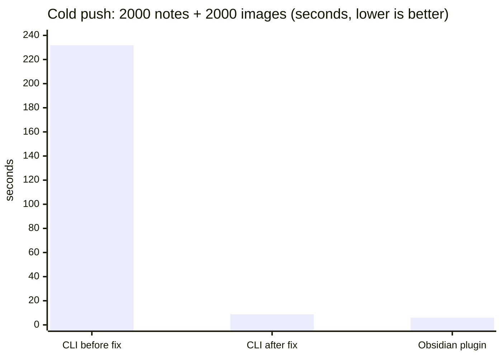
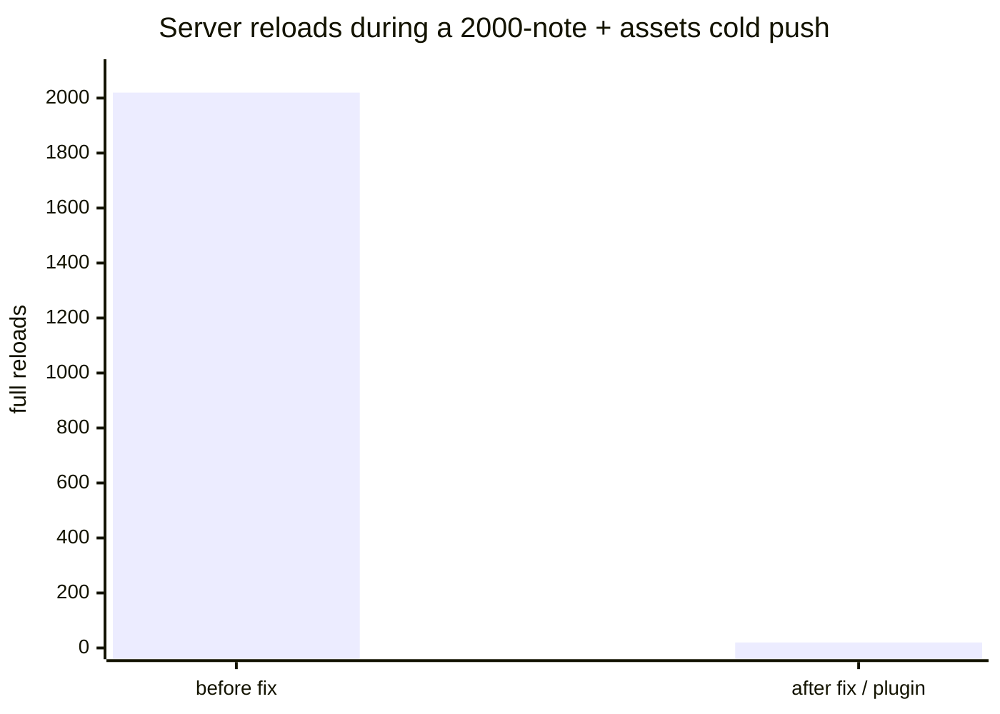

We re-reviewed trip2g's Obsidian sync, expecting to tune a slow hashing path. Then we built a benchmark and measured. The slow part was somewhere else entirely — one missing flag that turned a 3-second push into a 4-minute one.

The headline: a cold push of 2000 notes with 2000 small images.

| Scenario | Time |
|----------|------|
| 2000 notes, **no** assets | 3.3 s |
| 2000 notes + 2000 images — **before** fix | **231.8 s** |
| 2000 notes + 2000 images — **after** fix | **8.8 s** |
| Same, measured in the live Obsidian plugin | 6.0 s |

All numbers come from an isolated benchmark stack (vector search off, local server). The story is below.

---

## The setup

We wanted to know where sync actually spends time, not where we guessed it did. So we built a throwaway stack: a trip2g server with vector search disabled, a generated vault of 2000 deterministic Markdown notes, and a script that drives the sync CLI through real scenarios — cold push, idle re-sync, a small change, two-way. The CLI shares the exact `classify`/`execute` code the Obsidian plugin uses, so its numbers transfer.

Before measuring, a static read of the code had produced a prime suspect: a per-file `mtime`/hash cache that was read but never written, so every sync re-hashed all 2000 files. Obviously the bottleneck. Right?

---

## The dead cache was real — and almost free

The cache bug was real: the write side genuinely was missing, so every idle sync re-hashed all 2000 files. We expected this to dominate.

Then we measured it in isolation, with no process-startup noise:

| Operation (2000 notes) | Time |
|------------------------|------|
| Re-hash every local file ("the dead cache") | **18 ms** |
| Classify all 2000 (hash + fetch server hashes + compare) | 38 ms |
| Fetch all 2000 server hashes (~80 KB) | 10.5 ms |

Eighteen milliseconds. The notes are small, SHA-256 is fast, and 4 MB of text hashes in a blink. The "obvious" bottleneck was noise. The idle re-sync the CLI reports as ~0.4 s is almost entirely Node/`tsx` process startup — a cost the long-running plugin never pays.

Lesson one, already: the cache fix is still worth doing (it scales with note size and matters over a slow network), but it was nowhere near the top of the list. We only knew because we measured.

---

## The real cost: assets, and one missing flag

The first benchmark used plain notes. Sync was fast across the board. So we made the workload realistic and gave every note a tiny 1×1 PNG.

Cold push went from 3.3 s to **231.8 s**.

A 70× blow-up from 138 KB of images. The cost was not the bytes — it was ~116 ms of pure overhead *per asset*. The server log explained it: every single `uploadNoteAsset` call ran a full reload of all notes (`PrepareLatestNotes`). Two thousand uploads, two thousand full reloads.

The cause was one missing field. The upload mutation accepts `skipCommit`, which batches the work and defers the reload to a single final commit. The Obsidian plugin sent it. The **CLI and browser-sync did not** — so they paid a full server reload on every asset.

We added `skipCommit: true` to the CLI and browser uploads. Cold push: **231.8 s → 8.8 s**, a 26× speedup. The reload count dropped from ~2020 to ~20 (one per 100-note push batch, plus the final commit).

The most important part: this was a **CLI/bulk-sync bug, not a plugin bug**. The live Obsidian plugin already sent `skipCommit` and cleared the same 2000-asset push in **6.0 s** — we verified it directly, watching the server logs show 20 reloads, not 2000. If your pain was `obsidian-sync` from the command line or CI, this is your 26×. If you use the plugin interactively, you were already fine.

---

## A crash hiding behind a feature that nobody used yet

While wiring up real-time sync (below), we found a latent crash in the server's in-process event bus. On unsubscribe it closed the subscriber's channel; a publish racing that close would `send on closed channel` and panic the **entire server** — not just the subscription.

It had never fired because nothing subscribed yet. The moment a real client connects and disconnects routinely, every disconnect-during-save is a coin-flip panic.

The first patch was a one-liner (stop closing the channel). The shipped fix is the idiomatic version: a per-subscriber `done` channel that `Publish` selects on, so it never sends to a departed subscriber and never closes the data channel. Race-tested under stress, clean.

---

## Real-time sync — honestly, a UX win, not a speed win

The backend already had a `noteChanges` subscription over Server-Sent Events; the plugin just never consumed it. So we built the client: the plugin now holds a live connection and pulls server changes the instant they happen, instead of waiting up to a minute for the next poll.

It is tempting to sell this as "faster sync." It isn't, and here is the honest reason: the query it would replace, `notePaths`, is **not slow**. The content hash it returns is a precomputed database column — fetching all 2000 is a ~10 ms indexed read of ~80 KB. Live-pull replaces a *timer*, not a query. You still need that query for cold start and for catching up after the connection drops.

What live-pull actually buys you:

- **Instant updates** instead of up-to-60-second lag — the real value for multi-device and agent-driven editing.
- **Less idle traffic** — no 80 KB poll every minute over a session that might be mostly idle.

So we kept polling, just rarer: the 60-second check became a 5-minute reconciliation backstop (the event bus can drop under load, so a periodic full check stays as the safety net), with live events carrying freshness in between.

We verified the whole thing end-to-end, including the cases that can lose data:

- **Conflict** — edit a file locally, change it differently on the server: the local edit is **not** overwritten; you get a conflict prompt.
- **Delete** — hide a note on the server: the local file is **not** auto-deleted; you are asked first.
- **No echo loop** — one server change produces exactly one event; the plugin pulls without writing back.
- **Filtering** — a change outside your include globs never arrives.

---

## What we would do differently

Build the benchmark first. The static review mis-ranked the bottleneck by two orders of magnitude — it crowned an 18 ms cache fix and missed the 231-second asset path entirely, because plain-note tests never exercised assets. Realistic data (images, and lots of them) is what surfaced the real cost.

And measure the thing you are about to "optimize" before you optimize it. We almost shipped a cache rewrite that would have saved 18 ms, while the 26× win sat one boolean away in a mutation input.
