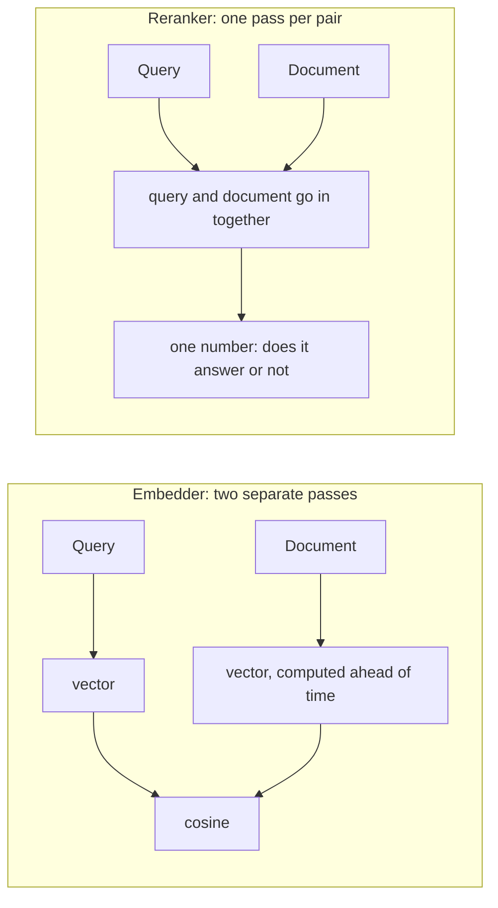
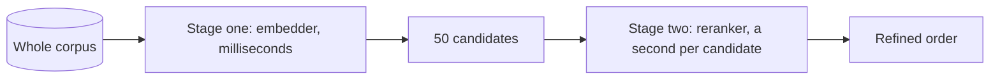

*What this is: what a reranker is, why search wants one, and how ours spent six weeks in production returning an error to every single call. 61,354 failures out of 61,359 requests, and nobody saw one of them. Also why we ended up switching it off rather than fixing it. Read it if you run hybrid search and are weighing a second stage.*

A search embedder encodes the query and the document separately. Text goes in, a thousand-odd numbers come out. The document was compressed into that vector back when nobody knew what would be asked. That is where both the speed and the bluntness come from: vectors are computed ahead of time, a search over millions takes milliseconds, and the fine interaction between a question and its answer is something such a model sees poorly.

A reranker is built the other way round. It is a cross-encoder: it takes the query together with the document and runs them through the model in a single pass, where the query tokens can see the document tokens. What comes out is not a vector but one number: how well this text answers this query.



The difference is visible by eye. Asked for "the capital of France", our reranker scores "Paris is the capital of France" at 0.9998 and "cats like fish" at 0.0000164.

You cannot precompute that: there are as many query and document pairs as there are queries, and the queries arrive in the future. So the reranker runs as a second stage. A cheap first stage pulls fifty candidates out of the whole corpus, an expensive second one refines their order.



This is the standard retrieve-then-rerank shape, and we built it.

---

## We shipped the careful version, and it measured well

The first attempt failed: the reranker simply replaced the first-stage order with its own, and on our corpus that measured strictly worse. We removed it and came back with blend mode, where the cross-encoder score is mixed into the existing order instead of replacing it. A strong first stage stays in charge and the second stage only nudges.

On a golden set of 60 hand-verified bilingual queries, blend scored 0.9491 nDCG@10 against 0.9263 without it. A gain of +0.023, and the largest part of it landed where the first stage was weakest: +0.057 on the cross-language direction, English query to Russian document. We enabled the reranker in the pool config on 8 July.

## For six weeks it returned an error on every request

We looked at its metrics on 21 August:

```
te_request_count{method="batch"}      61359
te_request_failure{err="batch_size"}  61354
te_request_success{method="batch"}        5
```

Five successful requests out of sixty-one thousand, and all five were our own test calls, made ten minutes before that reading.

The cause was one number. The server that hosts the cross-encoder runs with `--max-client-batch-size 8`, meaning no more than eight documents per request. The search config said `top_n: 50`, and the client dutifully posted all fifty candidates in a single request. The server answered `422 batch size 50 > maximum allowed batch size 8`. The code caught the error, logged a warning and returned the first-stage order, exactly as written.

We set that 8 ourselves, to save memory on the box. The bench stack (`docker-compose.vecbench.yml`) ran the same server with none of these flags, so it got the defaults, where the limit is 32, and it used `top_n: 20`. Twenty is under thirty-two, so on the bench everything worked. Nobody compared the two sets of flags.

## Why nobody caught it

The degradation was too gentle. Search did not fall over, answers kept arriving, and quality dropped by the same two hundredths of nDCG that no eye can see. A failure of the second stage looked exactly like an ordinary result page.

The server metrics existed all along, those 61,354, but they sat on its main port and Prometheus was not collecting them. Nowhere was there a counter separating "the rerank ran" from "the rerank fell over". We read those numbers for the first time six weeks later, and only because we were inside the server for an unrelated reason.

Graceful degradation needs a counter. A fallback path that cannot be told apart from success will hide a breakage for exactly as long as you do not check on it.

## The operation is linearly expensive, and that is the main thing about it

We measured the price on our own box. Fifty documents of 326 tokens took 48.5 seconds on CPU. That is roughly a second per candidate, and it grows with `top_n` linearly: twenty candidates give twenty seconds.

The window size barely matters. At 4096 tokens the same fifty documents took 48.5 seconds; at 512, between 50 and 58. A cross-encoder on CPU processes four pairs at a time regardless, and the wall it hits is arithmetic, not memory.

Twenty seconds on every search does not make search pricey. It makes it a different product. For an agent doing research and willing to wait, the trade is fine. For a person who just typed into a search box, it is not. We were buying +0.023 nDCG for twenty seconds of waiting.

## What we did

In the public sandbox the reranker is off. It was not running anyway, so switching it off changed no search result at all. It only removed sixty thousand pointless HTTP calls and wrote the reason down next to the flag, so nobody turns it back on blind.

For people running trip2g themselves, the flag is now two-level. `enabled` means "a sidecar exists and you may ask for it", not "always rerank". A separate `rerank` argument appeared in the MCP search tools and in GraphQL search, so an agent or a client decides per query whether the answer is worth the wait. The argument is not advertised at all when no reranker is configured. An argument the instance cannot honour is worse than a missing one, because the agent spends a turn discovering that it does nothing. Its description carries the price in candidates and what happens if you pass nothing.

If you want genuinely precise answers, put the reranker on a GPU. Same model, same shape, and only the arithmetic changes: a second per candidate becomes a fraction of one, and a trade that was unacceptable becomes obvious.

---

## What we took away

The stack where you measure quality and the one in production have to agree on their launch flags. Ours differed by two, and both were about how much data fits in a single request.

`top_n` works as the size of a request to a server, not just as a quality knob. Every service has a maximum; if `top_n` does not fit under it, nothing works at all.

The most expensive lesson: measure the price of a feature in the user's units. We discussed this reranker in nDCG for two attempts running. Measuring it in seconds of waiting settled the question in a single conversation.
