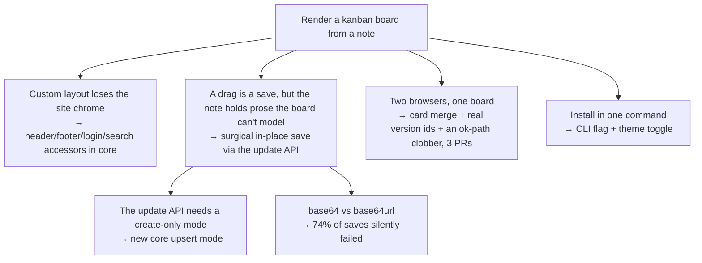

*What universal tools cost — to the people who build on them, and to the people who use them.*

A universal substrate makes any given use case possible but almost never cheap. Each door costs real work built on top of the substrate, and that cost is easy to underestimate before you start and easy to enjoy more than the actual work once you do. That second part is the trap: the tool invites you to build the tool instead of using it. Sociology has a name for the mechanism (goal displacement), maker culture has a mascot (the 3D printer that mostly prints parts for itself), every other garage holds a car that is never quite finished, and trip2g has a receipt: a "simple kanban template" that forced six rounds of changes into the core. Universality is a promise and a tax. The discipline is to pay the tax deliberately, when the content demands it, and to notice when you've started paying it for fun.

This is the companion to [[en/thoughts/universal-tools|Universal tools have no elevator pitch]]. That piece says: explain a substrate by picking a door. This one says: doors aren't free.

### The kanban receipt

In an Obsidian chat someone asked: can anything render a kanban board from notes? trip2g is a universal substrate, markdown in, anything out, so the honest answer was "sure, that's just a template." I offered to build it.

Here is what "just a template" actually cost, from the git log:

- **The template needed the site's chrome.** A custom layout replacing the whole page had no access to the standard header, footer, login, or search. So: header/footer accessors for custom layouts, a helper to embed the standard login and search widgets, and while in there, the template helpers got cleaned up to one consistent naming style. A whole core pull request before the board itself existed.
- **Dragging a card can't rewrite the whole note.** A board note holds prose the board doesn't model; a naive save would destroy it. So the template drove a surgical in-place save through the update API, which in turn needed a new create-only mode in the core, pinned and documented.
- **The hash contract bit anyway.** The template hashed content with plain base64; the server speaks base64url. About 74% of saves silently failed until live testing caught it. A one-character alphabet mismatch.
- **The template engine ate an HTML comment.** A `{{...}}` inside a comment in the layout broke rendering entirely. Template engines don't care that you were only commenting.
- **Two browsers, one board, data loss.** Live sync surfaced a genuinely hard problem: concurrent edits clobbered each other. Fixing it took a chain of three core-and-template pull requests: card-level merging, a core change so every save returns its real version id, and an ok-path clobber that only an adversarial review sweep found, fixed test-first. A fourth residual path is known and deferred.
- **Install had to be one command.** A CLI flag to install the template and seed a sample board, plus a theme toggle so the board respects the site's light and dark mode.

Total: one "simple template" produced changes across the layout engine, the save/versioning contract, the sync semantics, and the CLI, over roughly two weeks, with two bugs (the comment-eating template engine, base64url) that only live usage could find. The board shipped, and it's genuinely good — [`trip2g/kanban_template`](https://github.com/trip2g/kanban_template), curl-installable, live-sync-safe, with a [[en/user/kanban-demo|live demo board]] on this site. But nothing about it was free. The universality was already "in the design"; the door still had to be built, hinges and all.

![[kanban-board.png|The board that "was just a template": rendered by trip2g from a plain markdown note]]

That's the tax in one sentence: **the substrate guarantees the door is possible, not that it exists.**

### Is there research on this?

Partly. Some of it is named academic theory, some is well-sourced folk wisdom. Worth being honest about which is which.

**Goal displacement — real, academic.** Robert K. Merton, "Bureaucratic Structure and Personality" (1940, later in *Social Theory and Social Structure*): rules conceived as means to a goal become ends in themselves, and the organization optimizes the means while the goal starves. It was coined for bureaucrats, but the mechanism is exactly tool-tinkering: the vault was a means to thinking, and now you maintain the vault. Closest thing to a theory of this whole essay.

**Parkinson's Law of Triviality (bike-shedding) — real, named, half-satirical.** C. Northcote Parkinson, 1957: the committee approves the nuclear reactor in minutes and debates the bike shed for 45, because everyone can hold a bike shed in their head. Tool-building is the bike shed of knowledge work: tractable, visibly productive, fully understood, unlike the actual writing.

**Yak shaving — real term, folk concept.** Coined by Carlin Vieri at the MIT AI Lab (1993–98), after a Ren & Stimpy episode; popularized by Seth Godin. The recursive prerequisite chain: to write the note you fix the template, to fix the template you patch the core, to patch the core you fix the hash encoding. The kanban receipt above is a yak-shaving log. Drawn as a tree:



Each box is a prerequisite the board genuinely needed. The tree shape is why the estimate was wrong: you price the root and pay for the branches. Note the difference from goal displacement: yak shaving is prerequisites you genuinely need; displacement is when you stop needing them and keep going.

**Structured procrastination — real, published.** John Perry (Stanford philosopher), 1996 essay in the *Chronicle of Higher Education*; won the 2011 Ig Nobel in Literature. Procrastinators do difficult, valuable things as a way of not doing the more important thing. Building a beautiful publishing pipeline is a world-class way to not write.

**The Collector's Fallacy — named, community-coined.** Christian Tietze (zettelkasten.de): "to know about something isn't the same as knowing something." Collecting and organizing notes produces the reward signal of work without the work. The tinkering variant is the same fallacy one level up: configuring the system that would organize the notes that you would then not read.

**"Productivity porn" / the perfect-tool trap — folk, widely observed.** Ness Labs and others document PKM tinkering as "sophisticated procrastination": a state of permanent preparation that feels like progress. No controlled studies that I could find; a lot of convergent testimony.

**The 3D-printer case — folk, self-aware.** The RepRap project's founding ideal was a printer that prints its own parts; the community joke wrote itself. A representative confession: "I end up spending more time designing and printing upgrades to my 3D printers than I actually do printing non-printer parts." The self-replication ideal made the failure mode structural: the machine's most natural output is more machine.

**The eternal project — observation, not a study.** The pattern predates software entirely. There is always a car up on jacks in the garage: the Miata that will be track-ready next summer, the old pickup, the VW bus; the Soviet edition is the Zhiguli that has needed one more weekend of repair since 1989. Read as transportation economics, it's madness; a running car would be cheaper. Read correctly, the repair *is* the product. The garage is your own corner, the ritual is the leisure, "I keep it running myself" is the identity. The dev-world editions are easy to list: the homelab rack running Proxmox and k8s to self-host what a free tier would do; the mechanical keyboard that gets built and lubed more than typed on; the dotfiles and the neovim config polished for years, r/unixporn as a genre ("ricing" is the community's own word); Emacs, per the old joke, a great operating system lacking only a decent editor. Nobody has published a controlled study of project-car husbandry, but it rhymes with what hobby psychology does say about process-over-outcome motivation and flow: people seek bounded, masterable worlds, and an endlessly improvable machine is exactly that. This is the piece the procrastination framings miss. The tinkering is often not a detour from the reward. It is the reward.

So: no single paper titled "why universal tools make you build the tool." But the components are all named, and they compose. Merton explains the drift (means become ends), Parkinson explains the direction (toward the tractable), Perry explains why it feels fine (you *are* working), Tietze explains the reward loop (visible artifacts without output), and the garage explains why you don't want to stop (the loop is the point).

### Two taxes, one substrate

The kanban story and the Obsidian-spaceship story look similar but tax different people.

**The builder's tax is structural and honest.** A substrate is primitives, and primitives don't do use cases; compositions do. Every door someone wants (a board, a magazine layout, a canvas renderer) is real engineering built on top, and the substrate's generality often makes it *harder*, because the door must coexist with everything else the substrate promises (here: arbitrary prose in the same note, live sync, versioning, permissions). "It's just a template" undercounted by an order of magnitude precisely because the substrate was general enough to say yes. This tax is unavoidable. The only choice is when to pay it.

**The user's tax is psychological and sneaky.** The same openness that makes eleven doors possible makes door-building the most seductive activity in the building. Someone builds a spaceship out of Obsidian, forty plugins, a dataview dashboard for their dashboards, and writes nothing. The printer prints printer parts. The homelab gains a second rack to self-host services with exactly one user. The keyboard gets its switches lubed instead of its keys pressed. The project car spends a fourth spring up on jacks. The vault gets a better template for the notes that don't get written.

And here the "procrastination" frame stops being enough. The person in the garage isn't failing to obtain a car; there is a car, more or less. What they're obtaining is a bounded, masterable world of their own: a corner where the problems are tractable, the progress is visible, and nobody moves the requirements. That's the common product behind all the local names — the man cave, the homelab, the rice, the perfect setup — and it's a genuinely good thing to have; the trouble is only that it wears the costume of the work. The output was the pretext, the tinkering is the reward, and that's exactly why it's so hard to stop: you can't willpower your way out of something that is quietly paying you. This is goal displacement wearing a hobbyist's smile, a failure mode of the *user*, invited by the *design*. Constrained tools don't offer it: nobody tinkers a typewriter into a lifestyle, and nobody spends every weekend under a car that never breaks.

A universal tool vendor is in the strange position of selling both taxes as the feature. "You can build anything on this" is true, and it means "anything you want will need building" and "you may enjoy the building more than the anything."

### How to pay the tax on purpose

Not "avoid universality." The substrate bet is the right bet; [[en/thoughts/universal-tools|the positioning piece]] already argues why. But if you build on a substrate — or run one, or just live in one — three disciplines follow.

**Pay the tax when content pulls, not when the tool tempts.** The kanban board was worth building because a real person asked a real question and the result is a real, reusable door — and the core changes it forced (chrome accessors, in-place saves, sync correctness) made *every* future door cheaper. Build the door when someone is standing in front of it. Don't build doors speculatively; trip2g's design docs for canvas rendering, data views, and grid layouts sit unbuilt for exactly this reason, and that's correct.

**Count the tax honestly.** "You can render a kanban board" and "there is a kanban template you can install with one command" are different claims, and only the second one is a door. A door you haven't built yet is a wall with a sign on it — remember that when you evaluate a universal tool, and when you pitch one.

Here is the kanban tax, counted:

```datachart
{
  "data": {
    "source": "inline",
    "rows": [
      { "subsystem": "Layout engine", "changes": 2 },
      { "subsystem": "Save / versioning", "changes": 2 },
      { "subsystem": "Sync semantics", "changes": 3 },
      { "subsystem": "CLI / install", "changes": 2 }
    ]
  },
  "config": {
    "xAxis": { "type": "category" },
    "yAxis": { "type": "value" },
    "series": [{ "type": "bar", "encode": { "x": "subsystem", "y": "changes" } }]
  }
}
```

One template, changes in four subsystems. The door the substrate "guaranteed" still had to be built in every one of them.

And one more honest count. The kanban screenshot is an image; the diagram and the chart in this essay are not — they're fenced code blocks in this note, rendered by trip2g. Mermaid and datachart are two of its doors, and they're the opposite case from the unbuilt design docs: nobody needs their *why* explained. "Show a diagram", "show a chart" — the pitch is the name. They still paid the tax. Mermaid's "just render a fenced block" pulled a general mechanism into the core: the server now decides, per note, which widget scripts each page needs. Datachart's "just draw some bars" pulled a server-side fetch, a cache keyed to the note's version, and a chart library that loads only on pages with charts. Obvious doors, same hinges. What separates them from a sign on a wall is that you're looking at their output right now.

**Don't book the tinkering as the work.** The test that survives Merton and the garage both: does this change exist because content demanded it, or because building it feels better than writing? The kanban board passes: a real person asked, a real board shipped. Not everything on your list will. And when a change fails the test, the honest move isn't shame, it's naming it: this one's the project car, I'm doing it because I like it. That's allowed. Just don't book it as output.

The pick-a-door thesis and this one are the same coin. Doors are how you explain a substrate; the tax is what doors cost. A substrate with no built doors can't be explained at all, and a maker who only builds doors never ships anything through them.

*And if the tax I keep describing sounds like too much tool for one garden — that's the door being built next: an agent that tends the garden for you, no Obsidian required. [fleetbox.cc](https://fleetbox.cc) — coming soon.*

---

**Sources**

- Merton, goal displacement: [overview](https://polsci.institute/comparative-politics/criticisms-weber-bureaucratic-model-merton-crozier-michels/), [Merton 1957 text](https://clarotesting.wordpress.com/wp-content/uploads/2022/06/merton-r.-social-theory-social-structure-glencoe-il-free-press-1957.pdf)
- Parkinson's Law of Triviality: [Wikipedia](https://en.wikipedia.org/wiki/Law_of_triviality)
- Yak shaving origin (Vieri, MIT AI Lab): [Wiktionary](https://en.wiktionary.org/wiki/yak_shaving), [Hanselman](https://www.hanselman.com/blog/yak-shaving-defined-ill-get-that-done-as-soon-as-i-shave-this-yak)
- Perry, structured procrastination: [structuredprocrastination.com](https://structuredprocrastination.com/), [Stanford Daily on the Ig Nobel](https://stanforddaily.com/2011/10/04/philosophy-prof-wins-ig-nobel-prize-for-structured-procrastination/)
- Tietze, Collector's Fallacy: [zettelkasten.de](https://zettelkasten.de/posts/collectors-fallacy/)
- Productivity porn: [Ness Labs](https://nesslabs.com/productivity-porn)
- RepRap upgrades-over-objects: [RepRap](https://reprap.org/), [Atlas Obscura](https://www.atlasobscura.com/articles/the-utopian-promise-of-reprap-the-3d-printer-that-can-almost-print-itself)
