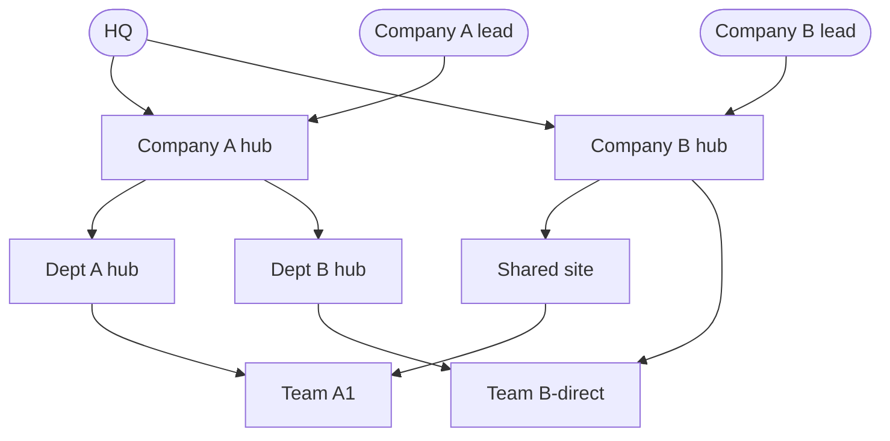

Model any org or team boundary with two independent controls: who can search whom, and what they see when they do. A federation edge grants the right to search a peer. A subgraph decides which notes that search returns. Set them separately and every base keeps its private context sealed — even from a parent that has a valid edge to it.

This page shows the pattern through a worked example. For the mechanics — KB-notes, inbound/outbound secrets, subgraph scope — see [[en/user/federation]].

### Two axes you set independently

Context separation in trip2g lives on two axes that you configure apart from each other.

**An edge says who may search.** A federation edge is a directed link `A → B`. It lets A's agent search B. Direction matters: `A → B` does not give B the right to search A. Each edge is a KB-note on A (`mcp_federation_kb_url` pointing at B) plus a scoped secret pair the two sides exchange once.

**A subgraph says what's visible during that search.** Every note can carry a `subgraph:` label. The edge's secret is scoped to one or more subgraphs, and the peer returns only notes in those subgraphs. A note in a subgraph the edge doesn't grant is never returned — not even over a valid, authenticated link.

The two axes are orthogonal, and that is the whole point. You can grant search access while exposing only a curated slice and sealing the rest.

**Example.** Give a partner an edge to your base, scope their secret to your `shared-research` subgraph. They can search you, and they see your research notes — nothing else.

**Anti-example.** That same partner runs a search that would match your `client-contracts` note. The note is in a private subgraph their edge doesn't include. They get zero results. The edge is valid; the note stays put.

"An edge = who may search. A subgraph = what's visible while doing so."

### A worked org example

Take an organization with two companies under a shared owner. Ten knowledge bases, eleven directed edges. Each base is its own trip2g instance with its own `/_system/mcp` endpoint, its own notes, and its own admin.

The roles:

| Base | Role |
|------|------|
| HQ | Owner — sees into both companies |
| Company A lead | Top of Company A, enters from the side |
| Company B lead | Top of Company B, enters from the side |
| Company A hub | Company A's hub |
| Company B hub | Company B's hub |
| Dept A hub | Department hub under Company A |
| Dept B hub | Department hub under Company A |
| Shared site | A shared site under Company B |
| Team A1 | Leaf team |
| Team B-direct | Leaf team |

The arrows point in the direction of search — `A → B` means "A can search B".

**Legend.** An arrow `A → B` means "A can search B". Every base also holds a 🔒 private context that no arrow crosses.

Every node also holds a **private note** — its own internal context. No edge in this graph reaches any of them. That is the headline guarantee, and the rest of this page is variations on it.

### What each role can reach

| Role | Reaches | Cannot reach |
|------|---------|--------------|
| HQ | Both companies, down to the leaf teams | Anyone's private context |
| Company A lead | Company A's whole tree | Company B; anyone's private context |
| Company B lead | Company B's tree | Company A; anyone's private context |
| Dept A hub | Team A1 | Everything outside its branch; private context |
| Team A1, Team B-direct | Nothing — they are leaves | Everything; private context |

Read the table top to bottom and the same line repeats: nobody reaches anyone's private context. Reach widens or narrows by role; the private boundary never moves.

### What the topology demonstrates

**Side entry — partial visibility by design.** The Company A lead enters the graph through one edge into Company A's hub. From there they reach all of Company A and nothing in Company B. You didn't configure a deny rule for Company B — there is simply no edge. Visibility is what you grant, not what you forbid.

**Diamonds — a base can belong to more than one context.** Team A1 is reachable two ways: through Dept A hub and through the Shared site. Team B-direct is reachable through Dept B hub and through Company B hub. A single base can sit inside several contexts at once without being copied into any of them.

**Direction — search is one-way unless you make it two.** HQ searches the companies. The companies do not search HQ. Each edge grants exactly one direction. To let a child query its parent, you add a separate reverse edge with its own secret. Most org boundaries are one-way, and that is the default.

**Private isolation — the guarantee that holds the whole thing together.** Every base keeps a private note that no edge returns. A parent with a valid, authenticated edge to a child still cannot see the child's private context. The edge grants access to a public subgraph; the private subgraph is excluded from that scope, so a search across the edge passes the private note by. Dept A hub can search Team A1 all day and never see Team A1's private note.

Each base stays autonomous. Its own notes, its own admin, its own private context. Federation is scoped routing — there is no shared index and nothing is copied between bases.

### How you'd set this up

The edges and subgraphs in this example are ordinary federation configuration. The pattern is always the same per edge `A → B`:

1. On B (the base being searched), add an inbound secret and scope it to the public subgraph only — leave the private subgraph out. This single choice is what seals B's private context.
2. On A (the searcher), add the matching outbound secret and a KB-note whose `mcp_federation_kb_url` points at B's `/_system/mcp`.
3. Label B's private notes with a `subgraph:` the inbound secret does not grant.

Repeat for each of the eleven edges. For diamonds, the leaf simply has two inbound secrets — one per parent. For a reverse direction, run the same three steps the other way.

The exact admin steps, the secret exchange, and the scope panel are in [[en/user/federation]]. This page is the map; that page is the manual.

### Related

- [[en/user/federation]] — the mechanics: KB-notes, secrets, subgraph scope, the federation graph panel
- [[en/user/mcp]] — how the local MCP server and subgraph access control work
- [[en/user/advanced]] — subgraphs and access control in the wider product
