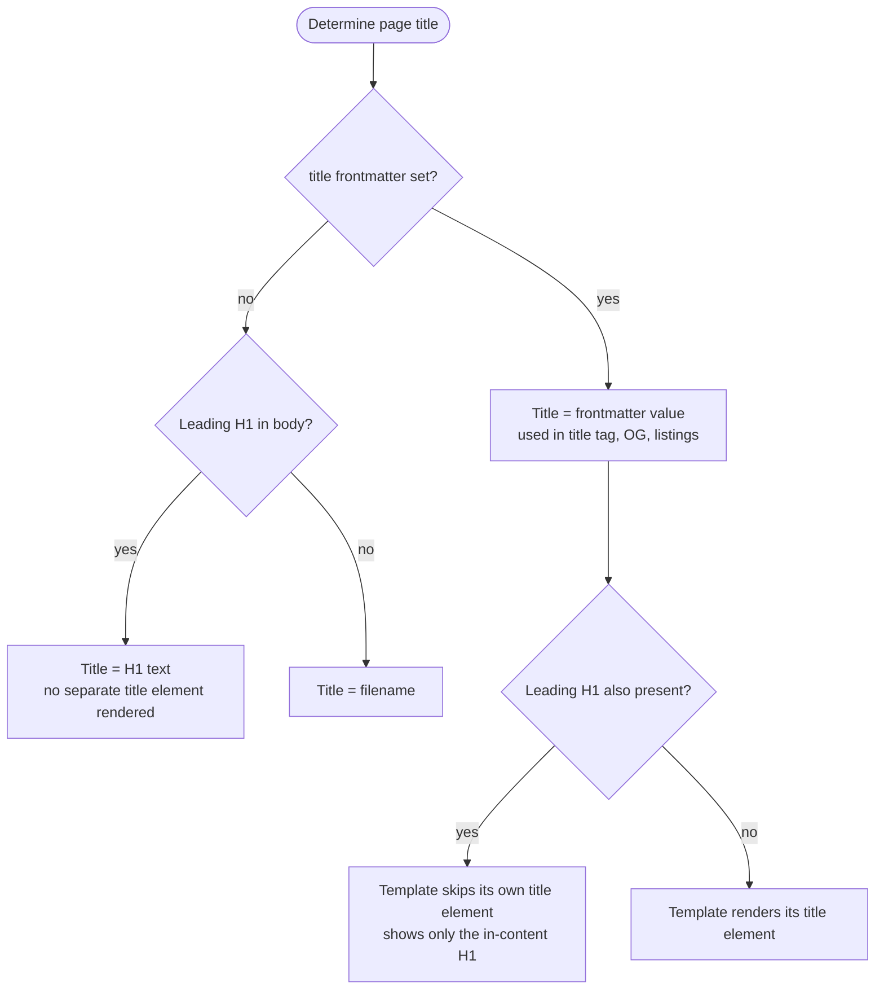

This site is built with the default template — what you're looking at right now is it in action.

The default template is the built-in page layout that trip2g uses when you don't specify a custom template. It provides a complete publishing setup with header, footer, sidebar navigation, table of contents, backlinks, and a magazine-style grid for displaying related notes.

You control the layout entirely through frontmatter — no HTML required.

### What the default template includes

Every page rendered with the default template has these optional sections:

- **Header** — site logo and navigation (pulled from a markdown note)
- **Left sidebar** — table of contents, backlinks, or custom navigation
- **Right sidebar** — outgoing links, custom widgets, or empty
- **Content area** — your note's markdown rendered as HTML
- **Magazine grid** — cards showing related notes (featured, grid, or list layout)
- **Footer** — site footer with columns (pulled from a markdown note)

### Functional notes: header, footer, and sidebars

The header, footer, and sidebars are ordinary markdown notes from your vault. You write them like any other note, and trip2g places them in the right position on each page.

Trip2g resolves which note to show in each section in this order:

1. **Per-note frontmatter** — `header: [[my-header]]` on a note wins unconditionally
2. **Glob sections** — a note declares which paths it acts as header/footer/sidebar for
3. **Auto-load fallback** — `_header.md`, `_footer.md`, `_left_sidebar.md`, `_right_sidebar.md`
4. Section absent

```mermaid
flowchart TD
    Start([Resolve a section]) --> A{Per-note frontmatter?<br/>header: [[my-header]]}
    A -->|set| UseA[Use that note]
    A -->|none| B{Matching glob section?<br/>header_includes: blog/*}
    B -->|matches| UseB[Use highest-priority match]
    B -->|none| C{Auto-load file exists?<br/>_header.md / _footer.md}
    C -->|yes| UseC[Use the auto-load note]
    C -->|no| None[Section absent]
```

#### Auto-load (recommended for most sites)

If your vault contains a note named `_header.md`, trip2g automatically uses it as the header on every page — no configuration needed in individual notes.

The same applies to:
- `_footer.md` — footer for all pages
- `_left_sidebar.md` — left sidebar for all pages
- `_right_sidebar.md` — right sidebar for all pages

Example `_header.md`:

```markdown


- [Home](/)
- [Docs](/docs)
- [About](/about)
```

No frontmatter is required. The header extracts:
- **First image** — becomes the site logo
- **First list** — becomes the navigation links

Example `_left_sidebar.md`:

```markdown
### Getting Started

- [Quick Start](/docs/quick-start)
- [Installation](/docs/install)

### Advanced

- [Custom Templates](/docs/templates)
- [API Reference](/docs/api)
```

Use `###` (h3) headings for group labels in sidebars, not bold text. The sidebar UI renders `###` headings as proper section labels; bold text does not receive the same visual treatment.

#### Glob sections (different headers for different site sections)

When you need different headers or sidebars for different parts of your site, add glob fields to a note's frontmatter — and it will automatically apply to the matching pages.

Add `{section}_includes` to any note's frontmatter to make it a glob section:

```yaml
---
header_includes:
  - blog/*
  - articles/**
header_excludes:
  - blog/premium/*
header_include_property: published
header_exclude_property: draft
header_priority: 10
content: [self]
free: true
---

# Blog Header

- [[Blog Home]]
- [[Categories]]
- [[Archive]]
```

This file serves as the header for any note whose path matches `blog/*` or `articles/**`, unless the note is in `blog/premium/*`, lacks a `published` frontmatter key, or has a `draft` key.

**Glob section frontmatter fields**

Replace `{section}` with one of: `header`, `footer`, `left_sidebar`, `right_sidebar`.

| Field | Type | Required | Default | Notes |
|-------|------|----------|---------|-------|
| `{section}_includes` | string or array | yes (to activate) | — | Glob patterns (doublestar). A single string or a list. |
| `{section}_excludes` | string or array | no | none | Glob patterns to exclude. Applied after includes. |
| `{section}_include_property` | string | no | — | Only match notes that **have** this frontmatter key |
| `{section}_exclude_property` | string | no | — | Skip notes that **have** this frontmatter key |
| `{section}_priority` | integer | no | `0` | Higher number wins when multiple files match |

The `content` field works exactly as on any note: `self` renders the file's own markdown body, `[[Link]]` embeds another note, etc.

**One file, multiple roles**

A single file can serve as header and footer simultaneously:

```yaml
---
header_includes: "**"
footer_includes: "**"
content: [self]
free: true
---

Default header and footer for all pages.
```

**Sidebar widgets via glob sections**

A glob sidebar section can specify widgets for matched pages using the `content:` key. Use `self` to also render the section note's own body (navigation, links, etc.):

```yaml
---
right_sidebar_includes: "docs/**/*.md"
content:
  - self       # render this note's body in the sidebar
  - TOC
  - inlinks
  - similar
---

Navigation links or any other content here.
```

When a matched page is rendered, the right sidebar will show: this note's body, then TOC, then backlinks, then similar notes.

**Hiding glob sections from listings**

Prefix the filename with `_` to hide it from the site's magazine and note listings:

```
_blog-header.md     ← hidden from listings, active as glob section
blog-header.md      ← visible as a regular note AND active as glob section
```

Both work as glob sections. The underscore prefix only affects listing visibility.

#### Per-note frontmatter override

To set the header, footer, or sidebar for a specific page, reference it directly in that note's frontmatter:

```yaml
---
header: [[_header]]
footer: [[_footer]]
left_sidebar:
  - TOC
  - Backlinks
right_sidebar: false
---
```

**Hide the header:** `header: false`
**Hide the footer:** `footer: false`
**Hide the left sidebar:** `left_sidebar: false`
**Hide the right sidebar:** `right_sidebar: false`

**Available sidebar widgets:**

- `TOC` — interactive table of contents (headings from the current note)
- `Backlinks` or `inlinks` — notes that link to this note
- `outlinks` — notes that this note links to
- `similar` — semantically similar notes (requires vector search to be enabled)
- `[[PageName]]` — embed another note by title
- `path/to/file.md` — embed a note by file path

#### Complete example: documentation site

A site with a shared default header and a separate sidebar for the API section.

**`_header.md`** — applies to all pages (auto-load):

```markdown


- [Home](/)
- [Docs](/docs)
- [Blog](/blog)
```

**`_api-sidebar.md`** — left sidebar only for the API section (glob section):

```yaml
---
left_sidebar_includes: "docs/api/**"
left_sidebar_priority: 10
content: [self]
free: true
---

### API Reference

- [[Authentication]]
- [[Endpoints]]
- [[Rate Limits]]
```

**`docs/api/endpoints.md`** — a regular note, no layout frontmatter needed:

```yaml
---
title: Endpoints
---

API endpoint documentation...
```

Result: `docs/api/endpoints.md` gets `_header.md` as its header (from auto-load) and `_api-sidebar.md` as its left sidebar (from the glob match). Notes outside `docs/api/` get only the header.

#### Relationship to frontmatter patches

Both frontmatter patches and glob sections can assign headers and sidebars across many notes. The difference:

- **Frontmatter patches** inject frontmatter fields into notes at load time. The note ends up with `header: [[x]]` as if you'd written it yourself.
- **Glob sections** are resolved at render time from the section file's own frontmatter. Individual notes stay untouched.

For most use cases, glob sections are simpler: define the matching rules once in the section file and you're done. Frontmatter patches remain useful when you need to set other properties alongside the layout (e.g., `free: true` and `header:` together on a whole folder).

→ [[en/user/frontmatter-patches|Frontmatter patches documentation]]

### Content blocks

The `content` property controls which sections appear in the main content area:

```yaml
---
content:
  - self
  - magazine
---
```

**Available content blocks:**

- `self` or `selfcontent` — this note's article with title and body
- `magazine` — grid of related notes (see magazine layout section below)
- `[[PageName]]` — embed another note by title
- `path/to/file.md` — embed a note by file path

**Default behavior:**
- If you don't set `content`, only the note itself is shown (`self`)
- If the note is the site root with no index page, `magazine` is shown

### Title display

Trip2g determines what to show as the page title using this priority:

1. **`title` frontmatter field** — always wins if set
2. **First H1 heading in the content** — if the note starts with `# Heading`, that text becomes the title and no separate title element is rendered above the content (the heading stays in place inside the body)
3. **Filename** — used as a fallback when neither of the above is set

The H1 detection means you can write natural markdown without frontmatter and the heading does double duty — it's both the visual H1 and the page title used in `<title>`, OpenGraph tags, and listings.

```markdown
# My Article Title

Body text starts here...
```

This note gets the title "My Article Title" without any frontmatter. The `<h1>` is rendered inside the article body — no duplicate title element is added above it.

If a note has **both** a `title` frontmatter field and a leading `# Heading`, the frontmatter `title` still wins as the title value — it's what goes into `<title>`, OpenGraph tags, and listings. The in-content H1 is detected anyway, so the template skips its own title element. The page shows exactly one heading at the top — the in-content `# Heading` — and never two stacked titles, even if its text differs from the frontmatter `title`.



### Magazine layout

The magazine displays related notes as cards in a three-tier visual hierarchy:

| Tier | Position | Cards | Style |
|------|----------|-------|-------|
| Featured | First | 1 | Large, full-width |
| Grid | 2nd–5th | 4 | Medium, 4-column grid |
| List | 6th+ | Unlimited | Minimal, vertical list |

Activate the magazine on an index or category page:

```yaml
---
title: Blog
content:
  - magazine
magazine_include_files: "blog/**/*.md"
magazine_sort_property: priority
---
```

#### Magazine properties

**`magazine_include_files`** — Glob pattern for which notes to include

```yaml
magazine_include_files: "blog/*.md"          # All posts in blog/
magazine_include_files: "posts/**/*.md"      # Recursively all .md in posts/
magazine_include_files: "docs/**/README.md"  # All README.md files
```

Default: `**/*.md` (all notes)

**`magazine_exclude_files`** — Glob pattern for which notes to exclude from the magazine

```yaml
magazine_exclude_files: "**/*Telegram.md"   # Exclude Telegram versions by name
magazine_exclude_files: "drafts/**"         # Exclude drafts folder
magazine_exclude_files: "archive/*.md"      # Exclude archived posts
```

Applied after `magazine_include_files`. Not set by default — no notes are excluded.

**`magazine_exclude_property`** — Exclude notes that have a specific frontmatter field

```yaml
magazine_exclude_property: telegram_publish_at
```

Notes with this field are hidden from the magazine. Useful when Telegram versions of notes live alongside web versions in the same folder.

**`magazine_sort_property`** — Sort cards by a custom frontmatter field

```yaml
magazine_sort_property: priority
```

Notes that have this field are listed first (sorted by value descending), then the rest sorted by creation date descending.

Example:

```yaml
---
title: Featured Post
priority: 100
---
```

**`magazine_include_property`** — Only show notes with a specific frontmatter field

```yaml
magazine_include_property: featured
```

Only notes with `featured: true` (or any truthy value) in their frontmatter will appear.

#### Excluding Telegram notes from the magazine

When you publish to both web and Telegram, the Telegram versions often sit in the same folder. Two ways to exclude them:

**By filename pattern** — if Telegram notes follow a naming convention (e.g. `My Post. Telegram.md`):

```yaml
---
title: Daily Reports
content:
  - magazine
magazine_include_files: "reports/**/*.md"
magazine_exclude_files: "**/*Telegram.md"
---
```

**By frontmatter property** — if Telegram notes have `telegram_publish_at` in frontmatter:

```yaml
---
title: Daily Reports
content:
  - magazine
magazine_include_files: "reports/**/*.md"
magazine_exclude_property: telegram_publish_at
---
```

Both approaches can be combined.

#### Magazine cards

Each magazine card shows:

- **Thumbnail** — the first image in the note (if any)
- **Title** — from frontmatter
- **Description** — from the `description` frontmatter field (or the first paragraph if no description is set)
- **Link** — to the full note

### Examples

#### Landing page with magazine grid

```yaml
---
title: Home
content:
  - self
  - magazine
magazine_include_files: "**/*.md"
magazine_sort_property: featured_on_home
left_sidebar: false
right_sidebar: false
---

# Welcome

Explore our latest content below.
```

Mark notes to feature on the homepage:

```yaml
---
title: Important Topic
featured_on_home: true
---
```

#### Documentation site

```yaml
---
title: Documentation
content:
  - self
left_sidebar:
  - _sidebar.md
right_sidebar:
  - TOC
  - outlinks
---
```

#### Blog with featured section

```yaml
---
title: Blog
content:
  - magazine
magazine_include_files: "blog/**/*.md"
magazine_sort_property: featured
---
```

Blog posts:

```yaml
---
title: Latest News
featured: 50
description: Summary of recent updates
---
```

### Flexibility through frontmatter patches

Manually adding `header`, `footer`, `left_sidebar`, and `lang` to every note doesn't scale. Frontmatter patches let you set those properties once for an entire folder.

For example, this documentation site is configured like this:

```yaml
# All pages are public
**/*.md → {free: true}

# Russian sidebar for the entire RU section
ru/user/**/*.md → {left_sidebar: "ru/user/_sidebar.md"}

# Russian header and footer
ru/**/*.md → {header: "[[ru/_header]]", footer: "[[ru/_footer]]"}
```

No individual note knows about the template — everything is injected from outside via patches.

→ [[en/user/frontmatter-patches|Full frontmatter patches documentation]]

### Switching to a custom template

If you need more control than frontmatter provides, create a custom template. See [[templates]] for the full template system.

```yaml
---
layout: my-custom-template
title: My Page
---
```

Any note can use either the default template (by omitting `layout`) or a custom one.

---

## Telegram post links

If a note has been published to a Telegram channel, the template shows a blue "Read in Telegram" button above the title. Clicking it opens the Telegram post directly.

The button appears automatically in three cases.

### 1. Published via trip2g

When you publish a note to Telegram through trip2g's publishing system, the button appears automatically. If the note was published to multiple channels, each channel gets its own button with the channel name.

No frontmatter needed — trip2g tracks sent messages in the database.

### 2. Imported from Telegram

Notes imported from a Telegram channel already have the link in frontmatter:

```yaml
---
telegram_publish_channel_id: "1234567890"
telegram_publish_message_id: 42
telegram_publish_message_link: https://t.me/c/1234567890/42
---
```

The `telegram_publish_message_link` field is set automatically during import. The button uses this URL directly.

For public channels the link format is `https://t.me/channelname/42` — in this case the button shows the channel name: "Read on @channelname".

### 3. Alternatives (cross-linking to Telegram version)

If you have a web version and a separate Telegram version of the same content, use the `alternatives` frontmatter field:

```yaml
---
title: My Article
alternatives:
  - "[[My Article. Telegram]]"
---
```

The linked note (`My Article. Telegram`) must either have `telegram_publish_message_link` in its frontmatter or be published via trip2g's publishing system. The template resolves the wikilink, extracts the Telegram link, and shows the button on the parent page.

This is useful when you publish a shorter or differently formatted version to Telegram and want to link between the two.

### Priority

The template checks sources in this order:
1. **Database** (published via trip2g) — checked first, supports multiple channels
2. **Frontmatter `telegram_publish_message_link`** — fallback for imported notes
3. **Alternatives** — resolved from linked notes
