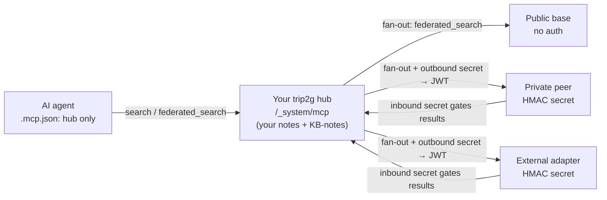
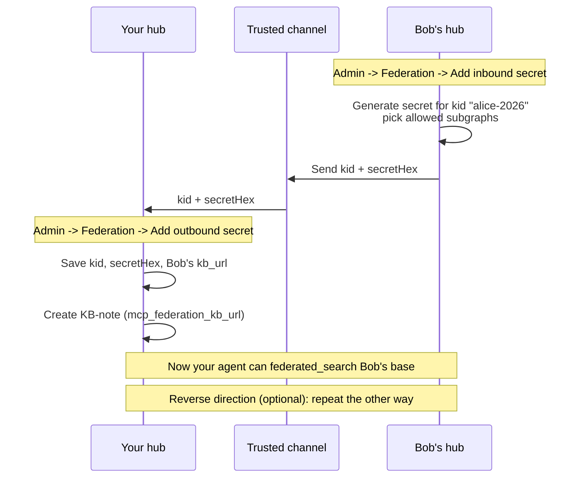
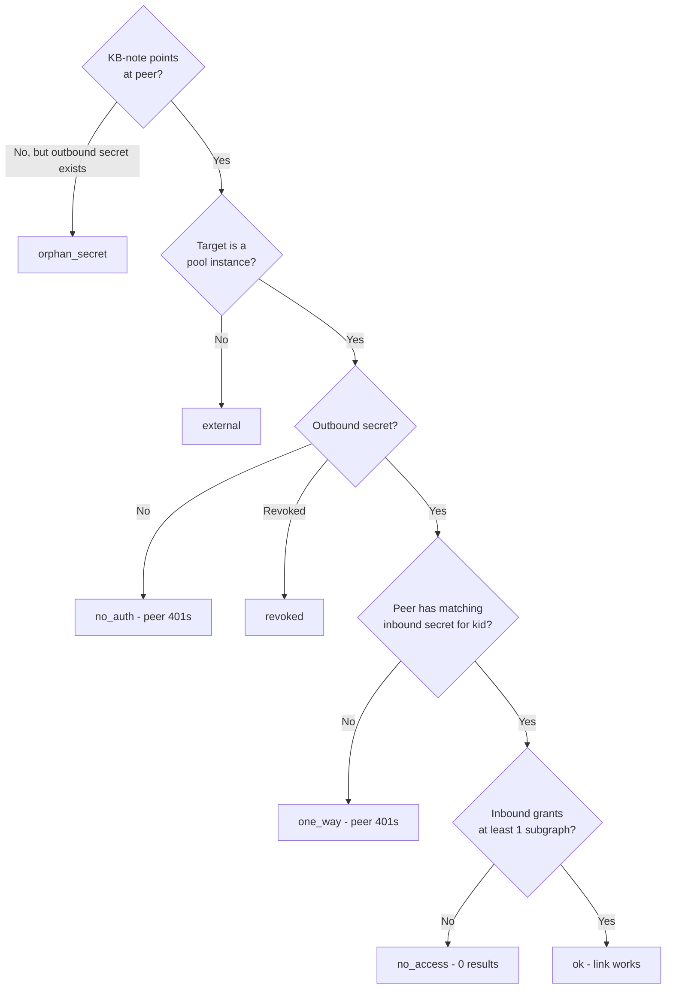

MCP federation connects your trip2g knowledge base to other MCP-compatible bases so your AI agent can search across all of them through a single endpoint. You point your agent at your own hub once; from there it reaches public reference bases, private peer instances, and external adapters (GitHub, Telegram) transparently.



*Federation topology: one MCP endpoint for the agent; the hub fans a query out to all configured peers and merges results.*

### How it works

```
┌─────────────────────────┐
│  Your AI agent          │
│  .mcp.json: your hub    │
└────────────┬────────────┘
             │
┌────────────▼────────────┐
│  Your trip2g hub        │
│  /_system/mcp           │
│  • your own notes       │
│  • KB-notes pointing at │
│    peers and adapters   │
└─┬──────────┬───────────┬┘
  │          │           │
  ▼          ▼           ▼
Public     Partner    External
base       peer       adapter
(no auth)  (HMAC)     (HMAC)
```

The hub stores no remote content. It holds your notes plus routing metadata: KB-notes in your vault and federation secrets in the admin.

### Core concepts

**KB-note:** a regular Obsidian note with `mcp_federation_kb_url` in its frontmatter. That single field registers a peer base. The note body is free text describing when to use this base; the agent reads it during search and uses it as context.

**Federation secret:** a shared HMAC key that authenticates your hub to a private peer (and vice versa). Public bases need no secret at all.

**kb_id:** a short slug identifying a peer, used when you want to target a specific base instead of fanning out across all of them. Defaults to the URL hostname; you can override it with `mcp_federation_kb_id`.

### Adding a public peer

Create a note anywhere in your vault with the following frontmatter:

```yaml
---
mcp_federation_kb_url: https://philosophers.example.com/_system/mcp
mcp_federation_kb_id: philosophy
---
Use when: finding philosophical references for engineering decisions.
Don't use when: anything time-sensitive or domain-specific.
```

Sync. Done. The agent can now reach that base via `federated_search` with `kb_id="philosophy"` or automatically when it fans out across all configured bases.

`mcp_federation_kb_id` is optional. If you omit it, the kb_id defaults to the URL hostname (`philosophers.example.com`).

### Adding a private peer (two-step exchange)

Private peers authenticate with a shared HMAC secret. The setup is a one-time key exchange: each side generates a secret for the other.



**Step 1: Bob generates a secret for you.**

Bob opens Admin → Federation → Add inbound secret. He picks a short key ID (`alice-2026`), optionally selects which of his subgraphs you may access, and clicks Generate. The admin shows the secret hex once. Bob sends you the `kid` and `secretHex` over a trusted channel (a direct Telegram message is fine).

**Step 2: You paste it as an outbound secret.**

In your admin → Federation → Add outbound secret, enter:
- `kid`: the key ID Bob gave you (e.g. `alice-2026`)
- `secretHex`: the hex bytes Bob gave you
- `kb_url`: Bob's MCP endpoint (`https://bob.team.io/_system/mcp`)

**Step 3: Create the KB-note.**

```yaml
---
mcp_federation_kb_url: https://bob.team.io/_system/mcp
mcp_federation_kb_id: bob
---
Use when: Bob's work-status updates, our shared design notes.
```

**Step 4: Wire the reverse direction (optional).**

If Bob also wants to query your base, repeat the process the other way: you generate an inbound secret, send Bob the `kid` and `secretHex`, and Bob pastes it as outbound on his side with your `/_system/mcp` URL.

Each direction is independent. You can give Bob read access to your `team-status` subgraph without giving him anything else.

### Federated tools

Your hub always exposes six MCP methods regardless of how many peers are connected:

| Method | Description |
|--------|-------------|
| `search(query)` | Local search on your own notes |
| `similar(note_id)` | Local similar-note lookup |
| `note_html(note_id)` | Local note content |
| `expand(pid, toc_path?)` | Walk a local note's table of contents level by level (see [[en/user/expand]]) |
| `federated_search(query, kb_id?)` | Search across peers (fan-out or targeted) |
| `federated_similar(note_id, kb_id)` | Similar notes on a specific peer |
| `federated_note_html(note_id, kb_id)` | Note content from a specific peer |
| `federated_expand(kb_id, pid, toc_path?)` | Walk a remote note's table of contents on a specific peer; same interface as [[en/user/expand\|expand]], applied to a remote base |

`federated_search` without `kb_id` fans out to all accessible peers in parallel and merges results. With `kb_id="bob"` it targets Bob's base only. With `kb_ids=["bob","philosophy"]` it hits exactly those two.

When the agent's local `search` surfaces a KB-note, it returns a `kind: "federation_kb"` marker with an inline instruction telling the agent to call `federated_search` with that `kb_id`. The agent assembles context incrementally as it queries, without an upfront dump.

### Permissions

Federation reuses your existing subgraph access control.

**Outbound (what peers see from you).** When Bob's hub calls yours with a valid JWT, your instance checks which subgraphs his `kid` is scoped to and filters results accordingly. Notes outside that scope are invisible to him, the same as they would be to any other reader without access.

**Inbound (what you see from peers).** KB-notes are regular notes, so you can assign them to a subgraph. If you later open your hub to colleagues, they only see KB-notes whose subgraph they have local access to.

**KB-note visibility tiers.** Because a KB-note is just a note, the same visibility rules apply:

| KB-note frontmatter | Anonymous MCP caller | Authenticated subscriber | Admin |
|---------------------|---------------------|--------------------------|-------|
| `free: true` | ✓ routes through | ✓ routes through | ✓ routes through |
| _(none)_ | ✗ "not configured" | ✓ routes through | ✓ routes through |
| `subgraphs: team` | ✗ "not configured" | only if subscribed to `team` | ✓ routes through |

A KB-note with no `free:` and no `subgraphs:` is not admin-only: it is visible to any authenticated subscriber. To make a KB-note visible only to admins, put it in a dedicated subgraph that no non-admin users have access to (e.g. `subgraphs: admin-only`). The `federated_search` response for an inaccessible `kb_id` is always "not configured", identical to a `kb_id` that does not exist, so the peer's existence is not disclosed.

### Federation graph (self-hosted panel)

When running trip2g behind simplepanel, the admin panel has an **Admin → Federation** page that visualises the current state of all pool instances as a directed graph. Each node is an instance; each edge is a discovered federation link.

Edge colours reflect the connection status:

| Status | Meaning |
|--------|---------|
| `ok` | KB-note + outbound secret + matching non-revoked inbound secret with at least one subgraph granted. The link works. |
| `no_auth` | KB-note exists but no outbound secret. The agent will try to call the peer; the peer will reject with 401. Add an outbound secret. |
| `orphan_secret` | Outbound secret recorded but no KB-note points to the peer. The agent never discovers this route. Add a KB-note. |
| `one_way` | Outbound secret exists and KB-note exists, but the peer has no matching inbound secret for this `kid`. The peer will reject with 401. Ask the peer to add an inbound secret for your `kid`. |
| `no_access` | Link is established but the inbound secret grants zero subgraphs, so the peer can call but receives no results. Expand the scope. |
| `revoked` | The outbound secret has been revoked. The route is broken and should be cleaned up. |
| `external` | Target URL is not a pool instance (points to a public or external base). Informational only. |



The graph also lists **Issues**: misconfigurations detected at crawl time, with severity (`error` / `warning` / `info`) and per-edge descriptions. Use the Issues list to diagnose broken links without reading logs.

### Revoking access

Admin → Federation → find the row → Revoke. The row goes grey. Any future request from that `kid` gets a 401 response. No coordination with the peer is needed; their calls start failing immediately.

To reduce scope without full revocation, remove individual subgraphs from the `kid` in the Manage scope panel.

### Limits and known constraints

- **Auth:** HMAC-SHA256 only in the current version. No mTLS, no OAuth.
- **Fan-out timeout:** 2 seconds per peer call. Slow or unreachable peers are skipped; you get results from the rest.
- **Depth cap:** fan-out recursion stops at depth 3 (configurable via `MCP_FEDERATION_MAX_DEPTH` on self-hosted). This prevents loops when peers also have peers.
- **TLS:** not enforced by the hub. Use HTTPS peer URLs in production.
- **No replay cache:** JWT expiry is 30 seconds. Acceptable for personal-hub scale.

### Troubleshooting

**"federation_not_configured" in the agent response:** no KB-notes exist in your vault, or the KB-note's `mcp_federation_kb_url` frontmatter field is missing or misspelled.

**401 errors in your hub logs:** the outbound secret does not match what the peer expects, or the peer has revoked your `kid`. Re-exchange secrets with the peer.

**Peer returns no results but no error:** the peer's subgraph scope for your `kid` is empty. Bob needs to add at least one subgraph to your `kid` in his Admin → Federation → Manage scope.

**Fan-out takes the full 2 seconds:** one or more peers are unreachable. Check your hub logs (`mcp:federation` prefix) for per-peer timeout warnings. Remove or fix the unreachable KB-note.

### Related

- [[en/hub/_index|Hub]]: knowledge bases federated into this hub
- [[en/user/mcp|MCP Server]]: how the local MCP server works
- [[en/user/selfhosted|Self-hosted]]: `MCP_FEDERATION_MAX_DEPTH` and other environment variables
- [[en/user/advanced|Advanced]]: subgraphs and access control
