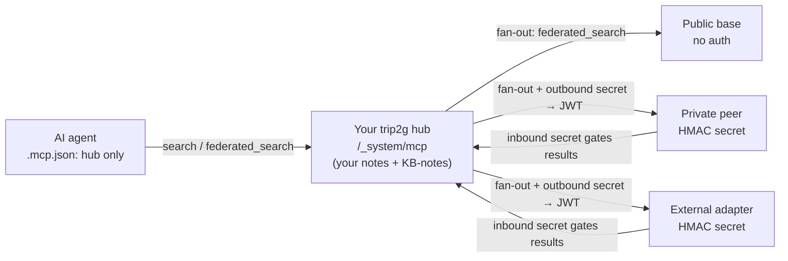
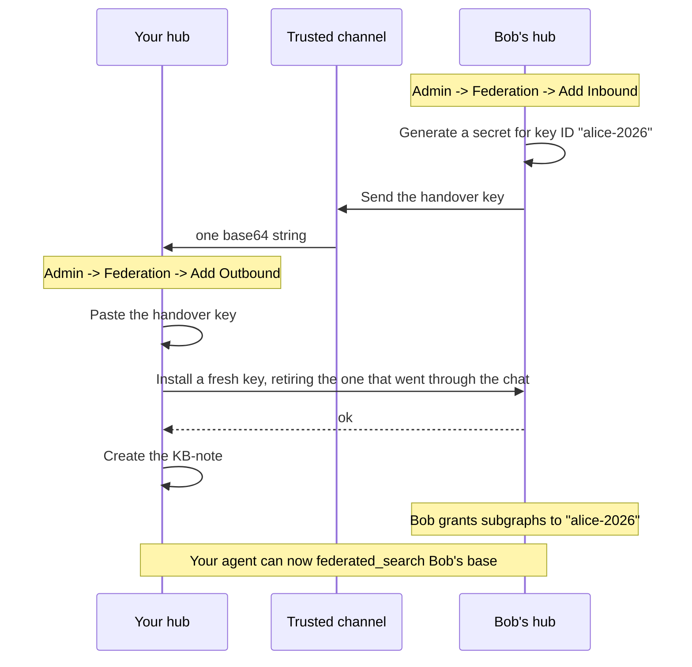
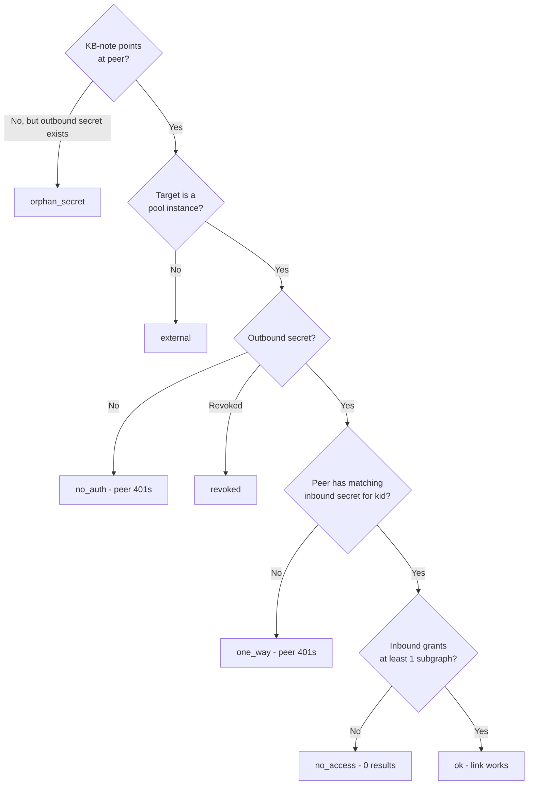

MCP federation connects your trip2g knowledge base to other MCP-compatible bases so your AI agent can search across all of them through a single endpoint. You point your agent at your own hub once; from there it reaches public reference bases, private peer instances, and external adapters (GitHub, Telegram) transparently.



*Federation topology: one MCP endpoint for the agent; the hub fans a query out to all configured peers and merges results.*

### How it works

```
┌─────────────────────────┐
│  Your AI agent          │
│  .mcp.json: your hub    │
└────────────┬────────────┘
             │
┌────────────▼────────────┐
│  Your trip2g hub        │
│  /_system/mcp           │
│  • your own notes       │
│  • KB-notes pointing at │
│    peers and adapters   │
└─┬──────────┬───────────┬┘
  │          │           │
  ▼          ▼           ▼
Public     Partner    External
base       peer       adapter
(no auth)  (HMAC)     (HMAC)
```

The hub stores no remote content. It holds your notes plus routing metadata: KB-notes in your vault and federation secrets in the admin.

### Core concepts

**KB-note:** a regular Obsidian note with `mcp_federation_kb_url` in its frontmatter. That single field registers a peer base. The note body is free text describing when to use this base; the agent reads it during search and uses it as context.

**Federation secret:** a shared HMAC key that authenticates your hub to a private peer (and vice versa). Public bases need no secret at all.

**Handover key:** one base64 string holding three things that only work together: the key ID, the `/_system/mcp` address of the instance that issued it, and the secret. It is what one operator sends the other. It is an envelope, not protection. The secret inside is plain, so the key still has to travel over a channel you would trust with a password.

**kb_id:** a short slug identifying a peer, used when you want to target a specific base instead of fanning out across all of them. Defaults to the URL hostname; you can override it with `mcp_federation_kb_id`.

### Adding a public peer

Create a note anywhere in your vault with the following frontmatter:

```yaml
---
mcp_federation_kb_url: https://philosophers.example.com/_system/mcp
mcp_federation_kb_id: philosophy
---
Use when: finding philosophical references for engineering decisions.
Don't use when: anything time-sensitive or domain-specific.
```

Sync. Done. The agent can now reach that base via `federated_search` with `kb_id="philosophy"` or automatically when it fans out across all configured bases.

`mcp_federation_kb_id` is optional. If you omit it, the kb_id defaults to the URL hostname (`philosophers.example.com`).

### Adding a private peer

Private peers authenticate with a shared HMAC key. Setting one up takes two operators and one value passed between them.



**Step 1: Bob issues a key for you.**

Bob opens Admin → Federation → Add Inbound, types a short key ID (`alice-2026`) and an optional description, and clicks Generate Secret. The page then shows the handover key with a Copy button, and the raw secret separately below it. Neither is shown again once he navigates away.

Bob sends you the handover key over a channel he would trust with a password. A direct Telegram message is fine. He does not need to send anything else: the key already carries his address and his key ID, so there is no second field for either of you to drop or transpose.

**Step 2: You install it.**

Open your Admin → Federation → Add Outbound, paste the handover key into the first field, and click Add Outbound. Leave Key ID, Secret Hex and KB URL empty. Those three are the manual path for a peer that sent you separate values instead of a packed key, and when both are filled the packed key wins.

Before the row is stored, your hub calls Bob's and replaces the handed-over secret with a fresh random one, so the bytes that travelled through the chat stop being the live credential. If Bob's hub refuses or does not answer, nothing is stored at all and the form reports why. See [Key rotation](#key-rotation).

**Step 3: Bob grants scope.**

A new inbound key starts with access to nothing. Bob opens the key's row in his admin and picks subgraphs under Subgraph Access. Until he does, your searches through that key authenticate and come back empty, which looks exactly like a query that matched nothing.

**Step 4: Create the KB-note.**

```yaml
---
mcp_federation_kb_url: https://bob.team.io/_system/mcp
mcp_federation_kb_id: bob
---
Use when: Bob's work-status updates, our shared design notes.
```

**Step 5: Wire the reverse direction (optional).**

If Bob also wants to query your base, repeat the process the other way: you add an inbound secret, send Bob its handover key, and Bob pastes it into his Add Outbound form.

Each direction is independent. You can give Bob read access to your `team-status` subgraph without giving him anything else.

### Key rotation

The secret in a handover key has been through a chat window by the time it is installed. It sits in someone's message history, and if an AI agent relayed it, in that agent's transcript too. Rotation replaces it, so those copies stop being usable.

**At install.** Adding an outbound secret rotates by default. Your hub asks the peer to adopt a fresh 32-byte key, and only writes the row once the peer confirms. A peer that refuses or stays silent leaves nothing stored: there is no link to protect yet, so the cheap failure is to ask the other operator for a new handover key and try again.

**Later, on demand.** An outbound key's page has a Rotate key button, and the same operation is available as `rotateFederationSecret(kid:)` in the GraphQL API. Inbound rows have no button: an inbound key is the other side's credential for calling you, so rotating it is their move.

**The grace window.** Both sides briefly accept the key they rotated away from, for five minutes. That is what keeps a rotation whose response was lost from breaking the link: your hub signs with the new key, the peer refuses, your hub retries with the previous one and gets through. Retrying the rotation then proposes the same key again, which a peer that already applied it answers as a no-op. The old key is dropped as soon as any call verifies against the new one, usually within milliseconds, so the window is an exception rather than a resting state.

**Peers that cannot rotate.** Rotation is a call your hub makes to the peer, and the peer has to implement it. Adapters and older instances do not, and they answer with a refusal. The GraphQL input carries `rotate: false` for those, which stores the handed-over key as it is and never asks. The admin form has no switch for it, so installing a peer that cannot rotate goes through the API.

**HTTPS.** A rotation moves a new secret over the wire, so it is refused against a `http://` peer address. The exception is a deployment that has already declared it federates over addresses that are not on the public internet, via `--mcp-federation-allow-private` or dev mode; there the refusal does not apply.

### What a peer granted you

Your hub can ask a peer what the pairing between you actually is. The request is a signed GET to the peer's `/_system/mcp/federation`, and the answer names the key ID, the subgraphs that key may read, and whether the peer can rotate:

```json
{
  "version": 1,
  "kid": "alice-2026",
  "subgraphs": [
    { "name": "team-status", "human_description": "Weekly status notes for the platform team" }
  ],
  "rotation": true
}
```

An outbound key's page in the admin asks this every time you open it, and lists the result under "Granted by the peer". An empty list is a real answer, not a failure: the pairing authenticates and sees nothing, and the page says so in those words rather than showing an empty table. A peer that will not answer at all shows the error it returned instead.

A caller without a valid signature gets a 401 and no detail.

### Describing a subgraph

Each subgraph carries a one-sentence description, edited at Admin → Subgraphs → the subgraph → "What this subgraph is". It travels to a peer beside the subgraph name, so an operator you granted access to reads what they were given instead of guessing at a slug. Leave it empty and the peer sees a blank; nothing is invented on their screen.

### Reading the secrets list

Admin → Federation lists every key with its direction, so an inbound credential and an outbound one are never confused for each other. Direction follows the KB URL: a key with no URL is one a peer signs with to call you, and a key with one is a key you sign with to call out.

The list also carries a Rotated At column, and a key's own page spells it out in words. "Never" there means the key is still the one it was created with, which for an outbound key means the one that came out of band.

### Federated tools

Your hub exposes the same MCP methods regardless of how many peers are connected:

| Method | Description |
|--------|-------------|
| `search(query)` | Local search on your own notes |
| `similar(note_id)` | Local similar-note lookup |
| `note_html(note_id)` | Local note content |
| `expand(pid, toc_path?)` | Walk a local note's table of contents level by level (see [[en/user/expand]]) |
| `federated_search(query, kb_id?)` | Search across peers (fan-out or targeted) |
| `federated_similar(note_id, kb_id)` | Similar notes on a specific peer |
| `federated_note_html(note_id, kb_id)` | Note content from a specific peer |
| `federated_expand(kb_id, pid, toc_path?)` | Walk a remote note's table of contents on a specific peer; same interface as [[en/user/expand\|expand]], applied to a remote base — a section without subsections comes back as content, as `federated_note_html` would return it |
| `federated_instructions(kb_id)` | A peer's own guidance, to read before searching it |

`federated_search` without `kb_id` fans out to all accessible peers in parallel and merges results. With `kb_id="bob"` it targets Bob's base only. With `kb_ids=["bob","philosophy"]` it hits exactly those two.

When the agent's local `search` surfaces a KB-note, it returns a `kind: "federation_kb"` marker with an inline instruction telling the agent to call `federated_search` with that `kb_id`. The agent assembles context incrementally as it queries, without an upfront dump.

Rotation is not on this list and never appears in `tools/list`. It is dispatched only for a caller that has already proved a pairing, so to anyone else the method does not exist. That keeps it out of reach of an agent reading the tool list and deciding to try it.

### Permissions

Federation reuses your existing subgraph access control.

**Outbound (what peers see from you).** When Bob's hub calls yours with a valid JWT, your instance checks which subgraphs his `kid` is scoped to and filters results accordingly. Notes outside that scope are invisible to him, the same as they would be to any other reader without access.

**Inbound (what you see from peers).** KB-notes are regular notes, so you can assign them to a subgraph. If you later open your hub to colleagues, they only see KB-notes whose subgraph they have local access to.

**What a pairing may ask about itself.** A peer holding a valid key can do two things beyond searching. It can read its own pairing at `/_system/mcp/federation`, which returns its key ID, the subgraphs you granted it with their descriptions, and nothing about your other peers. And it can replace its own key, which is rotation. The key ID always comes from the verified signature, never from an argument, so a peer can only ever describe or rotate the pairing it authenticated with.

**KB-note visibility tiers.** Because a KB-note is just a note, the same visibility rules apply:

| KB-note frontmatter | Anonymous MCP caller | Authenticated subscriber | Admin |
|---------------------|---------------------|--------------------------|-------|
| `free: true` | ✓ routes through | ✓ routes through | ✓ routes through |
| _(none)_ | ✗ "not configured" | ✓ routes through | ✓ routes through |
| `subgraphs: team` | ✗ "not configured" | only if subscribed to `team` | ✓ routes through |

A KB-note with no `free:` and no `subgraphs:` is not admin-only: it is visible to any authenticated subscriber. To make a KB-note visible only to admins, put it in a dedicated subgraph that no non-admin users have access to (e.g. `subgraphs: admin-only`). The `federated_search` response for an inaccessible `kb_id` is always "not configured", identical to a `kb_id` that does not exist, so the peer's existence is not disclosed.

### Federation graph (self-hosted panel)

When running trip2g behind simplepanel, the admin panel has an **Admin → Federation** page that visualises the current state of all pool instances as a directed graph. Each node is an instance; each edge is a discovered federation link.

Edge colours reflect the connection status:

| Status | Meaning |
|--------|---------|
| `ok` | KB-note + outbound secret + matching non-revoked inbound secret with at least one subgraph granted. The link works. |
| `no_auth` | KB-note exists but no outbound secret. The agent will try to call the peer; the peer will reject with 401. Add an outbound secret. |
| `orphan_secret` | Outbound secret recorded but no KB-note points to the peer. The agent never discovers this route. Add a KB-note. |
| `one_way` | Outbound secret exists and KB-note exists, but the peer has no matching inbound secret for this `kid`. The peer will reject with 401. Ask the peer to add an inbound secret for your `kid`. |
| `no_access` | Link is established but the inbound secret grants zero subgraphs, so the peer can call but receives no results. Expand the scope. |
| `revoked` | The outbound secret has been revoked. The route is broken and should be cleaned up. |
| `external` | Target URL is not a pool instance (points to a public or external base). Informational only. |



The graph also lists **Issues**: misconfigurations detected at crawl time, with severity (`error` / `warning` / `info`) and per-edge descriptions. Use the Issues list to diagnose broken links without reading logs.

### Revoking access

Admin → Federation → find the row → Revoke. The row goes grey. Any future request from that `kid` gets a 401 response. No coordination with the peer is needed; their calls start failing immediately.

Revoking kills the current key and the previous one together, so a revoked pairing cannot be reached through the grace window either.

To reduce scope without full revocation, remove individual subgraphs from the `kid` in the Subgraph Access panel.

### Limits and known constraints

- **Auth:** HMAC-SHA256 only in the current version. No mTLS, no OAuth.
- **Fan-out timeout:** 2 seconds per peer call. Slow or unreachable peers are skipped; you get results from the rest.
- **Depth cap:** fan-out recursion stops at depth 3 (configurable via `MCP_FEDERATION_MAX_DEPTH` on self-hosted). This prevents loops when peers also have peers.
- **TLS:** not enforced for search traffic. Rotation is the exception and refuses a non-HTTPS peer address. Use HTTPS peer URLs in production.
- **Rotation grace:** five minutes. During it the peer accepts both keys, which also means whoever holds the old key can rotate the pairing away from you. A successful call closes the window early.
- **No replay cache:** JWT expiry is 30 seconds. Acceptable for personal-hub scale.

### Troubleshooting

**"federation_not_configured" in the agent response:** no KB-notes exist in your vault, or the KB-note's `mcp_federation_kb_url` frontmatter field is missing or misspelled.

**Add Outbound reports that the peer refused the new key:** the peer answered and said no. Usually it is an adapter or an instance too old to support rotation. Install it through the API with `rotate: false`, or ask the operator to upgrade.

**Add Outbound reports that the peer did not answer:** the address is unreachable, or it is not the peer's `/_system/mcp` endpoint. Nothing was stored. Check the URL, then ask the other operator for a fresh handover key, because the first one was offered to whatever did answer.

**"rotation needs an https peer address":** the peer's KB URL starts with `http://`. Either give it a certificate, or, if it is on a private network you control, start the instance with `--mcp-federation-allow-private`.

**Rotate key says the peer did not answer:** the new key has been recorded on your side and the previous one is kept, so the link still works. Press Rotate again once the peer is back. The retry proposes the same key rather than a new one.

**401 errors in your hub logs:** the outbound secret does not match what the peer expects, or the peer has revoked your `kid`. Ask the peer for a new inbound secret and install its handover key.

**Peer returns no results but no error:** the peer's subgraph scope for your `kid` is empty. Open the outbound key's page and read "Granted by the peer": if it says the peer grants nothing, Bob needs to add at least one subgraph to your `kid` on his side.

**Fan-out takes the full 2 seconds:** one or more peers are unreachable. Check your hub logs (`mcp:federation` prefix) for per-peer timeout warnings. Remove or fix the unreachable KB-note.

### Related

- [[en/hub/_index|Hub]]: knowledge bases federated into this hub
- [[en/user/mcp|MCP Server]]: how the local MCP server works
- [[en/user/selfhosted|Self-hosted]]: `MCP_FEDERATION_MAX_DEPTH` and other environment variables
- [[en/user/advanced|Advanced]]: subgraphs and access control
