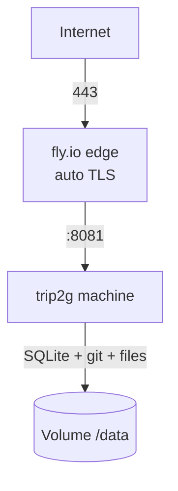

**TL;DR:** `fly launch` from this repo, add one volume, set two secrets — and trip2g runs on fly.io. One machine, one disk, files stored on the disk. No MinIO, no separate database, no second server.

---

trip2g is a single Go binary with SQLite, so it fits fly.io's "one machine + one volume" model perfectly. The repository already ships a ready [`fly.toml`](https://github.com/trip2g/trip2g/blob/main/fly.toml) and a [`scripts/deploy-fly.sh`](https://github.com/trip2g/trip2g/blob/main/scripts/deploy-fly.sh) helper, so you don't write any config yourself.

This is the simplest production path: assets live on the machine's disk through the built-in `local` storage backend, so there is nothing else to provision. Those files sit on the persistent volume and survive every `fly deploy` — but a single volume lives on one host in one zone. For storage that outlives the machine (and lets you run more than one machine), move files to S3 — see [File storage: disk or S3](#file-storage-disk-or-s3).



## What you need

- a [fly.io](https://fly.io) account (the free allowance is enough to start)
- `flyctl` installed: `curl -L https://fly.io/install.sh | sh`
- this repository checked out locally
- `fly auth login`

That's the whole prerequisite list. No domain, no S3 bucket, no email provider to begin with — fly gives you a free `https://<app>.fly.dev` hostname with TLS.

## The fast path: one script

From the repository root:

```bash
APP=my-notes OWNER_EMAIL=you@example.com ./scripts/deploy-fly.sh
```

The script does everything in order:

1. creates the app `my-notes` (if it doesn't exist yet);
2. creates a 1 GB volume `trip2g_data` mounted at `/data`;
3. generates and sets the two required secrets (`JWT_SECRET`, `DATA_ENCRYPTION_KEY`) and your `PUBLIC_URL` / `OWNER_EMAIL`;
4. builds the image on fly's remote builders and deploys.

Re-running is safe: an existing app, volume, or secret is reused, not recreated, so your sessions and data survive every redeploy.

When it finishes, open `https://my-notes.fly.dev` and sign in with `OWNER_EMAIL`.

## The manual path: four commands

If you prefer to see each step, do what the script does by hand. Pick an app name (it becomes your `.fly.dev` hostname).

```bash
# 1. Create the app
fly apps create my-notes --org personal

# 2. Persistent disk for SQLite, the git mirror and uploaded files
fly volumes create trip2g_data --region fra --size 1 -a my-notes

# 3. Secrets (PUBLIC_URL must match the app hostname)
fly secrets set \
  PUBLIC_URL=https://my-notes.fly.dev \
  OWNER_EMAIL=you@example.com \
  JWT_SECRET=$(openssl rand -hex 32) \
  DATA_ENCRYPTION_KEY=$(openssl rand -hex 16) \
  -a my-notes --stage

# 4. Build and deploy
fly deploy --remote-only -a my-notes
```

The committed `fly.toml` already sets everything else: ports, the `/data` mount, the `local` storage backend, and a health check on the internal port.

## First sign-in

trip2g sends a login code to `OWNER_EMAIL`. On a fresh deploy you have no email provider yet, so the code is written to the logs instead of being emailed:

```bash
fly logs -a my-notes
```

Find the line with your sign-in code, paste it into the login form, and you're in. On an empty instance trip2g then offers a link to download a preconfigured Obsidian vault ZIP — start there, then continue with [[en/user/getting-started|Getting started]].

To get real emails, add an SMTP provider (see below).

## Email sign-in with SMTP

For other people to sign in by email, point trip2g at any SMTP provider. [Resend](https://resend.com) works well and has a free tier — it exposes SMTP at `smtp.resend.com`, username `resend`, password = your API key:

```bash
fly secrets set \
  SMTP_HOST=smtp.resend.com \
  SMTP_PORT=465 \
  SMTP_USER=resend \
  SMTP_PASS=re_your_api_key \
  SMTP_STARTTLS=false \
  MAIL_FROM=no-reply@mg.example.com \
  -a my-notes
```

`MAIL_FROM` must belong to a domain you verified in Resend. Without a verified sender domain, delivery effectively only reaches your own address — enough if only the owner signs in by email.

## A custom domain

The `.fly.dev` hostname works out of the box. To use your own domain:

```bash
fly certs add docs.example.com -a my-notes
```

Add the DNS records fly prints (an `A`/`AAAA` or `CNAME`), then update `PUBLIC_URL` so links and email flows use the right host:

```bash
fly secrets set PUBLIC_URL=https://docs.example.com -a my-notes
```

## What `fly.toml` configures

| Setting | Value | Why |
|---------|-------|-----|
| `internal_port` | `8081` | the main HTTP port trip2g listens on |
| `[mounts]` → `/data` | volume `trip2g_data` | SQLite (`/data/data.sqlite3`), the git mirror (`/data/git`), uploaded files (`/data/storage`) |
| `STORAGE_BACKEND` | `local` | files served from disk — no MinIO or S3 needed |
| `[[checks]]` | port `8082`, `/livez` | trip2g serves health on the internal port |
| `[[vm]]` | `shared-cpu-1x`, `1gb` | comfortable headroom for the Go runtime |

Everything personal or secret (app name, `PUBLIC_URL`, `OWNER_EMAIL`, keys) lives in secrets, not in `fly.toml`, so the file stays reusable across deployments.

## Build from source (advanced)

The default `fly.toml` deploys a prebuilt image — that is the reliable path. Building the current branch from source on fly's **default** remote builder fails: the large telegram package (`gotd/td`) is OOM-killed during `go build` on the small builder.

If you need a from-source image, build it yourself and push it to fly's registry, then deploy that. Because the server is pure Go (`CGO_ENABLED=0`), it cross-compiles to `amd64` natively — no slow emulation for the Go step:

```bash
fly auth docker                       # let docker push to registry.fly.io
docker run --privileged --rm tonistiigi/binfmt --install amd64   # once, on a non-amd64 host
docker buildx build --platform linux/amd64 \
  -t registry.fly.io/<app>:src --push .
fly deploy --image registry.fly.io/<app>:src -a <app>
```

For a fast native build, pin the `frontend` and `builder` stages in the `Dockerfile` to `--platform=$BUILDPLATFORM` so they run on the host arch and cross-compile to `$TARGETARCH`.

## File storage: disk or S3

trip2g stores uploaded files (images and other note assets) through one of two backends:

| | `local` (default) | `minio` (S3) |
|---|---|---|
| Where files live | the machine's volume (`/data/storage`) | an S3 bucket, off the machine |
| Survives `fly deploy` | yes (same volume) | yes |
| Survives losing the machine/volume | no — single host, single zone | yes |
| Works with 2+ machines | no (each has its own volume) | yes |
| Setup | nothing | provision a bucket |

The default `local` backend is fine to start and survives normal redeploys. For production durability — or to scale past one machine — put files in S3. fly's own [Tigris](https://fly.io/docs/reference/tigris/) is the easiest S3:

```bash
# 1. Provision a Tigris bucket (sets AWS_* secrets on the app)
fly storage create -a my-notes --name my-notes-assets --yes

# 2. Point trip2g's S3 client at Tigris and switch the backend to minio.
#    Use the bucket name and the AWS_ACCESS_KEY_ID / AWS_SECRET_ACCESS_KEY
#    that the previous command printed.
fly secrets set \
  STORAGE_BACKEND=minio \
  MINIO_ENDPOINT=fly.storage.tigris.dev \
  MINIO_USE_SSL=true \
  MINIO_REGION=auto \
  MINIO_BUCKET=my-notes-assets \
  MINIO_ACCESS_KEY_ID=tid_... \
  MINIO_SECRET_KEY=tsec_... \
  -a my-notes
```

After the machine restarts, every uploaded file is written to the Tigris bucket instead of the disk. (If you used the committed `fly.toml`, it sets `STORAGE_BACKEND=local` in `[env]`; the secret above overrides it.)

## Backups

Whatever the storage backend, also back up the SQLite database. The volume takes daily fly snapshots; for off-site backups switch on `SIMPLE_BACKUP` (it reuses the same `MINIO_*` S3 settings):

```bash
fly secrets set SIMPLE_BACKUP=true -a my-notes
```

trip2g then uploads periodic SQLite backups to the bucket. See [[en/user/backup]] and [[en/user/litestream]] for the full backup story.

## Scaling up

- **More disk:** `fly volumes extend <volume-id> --size 10 -a my-notes`
- **More memory:** raise `memory` in the `[[vm]]` block and redeploy
- **A read replica:** that needs LiteFS and a second machine — see [[en/user/read-replica]]

## Common mistakes

- `PUBLIC_URL` doesn't match the real hostname → broken links and email URLs
- `DATA_ENCRYPTION_KEY` not exactly 32 characters → the server refuses to start
- deploying without the volume → data vanishes on every restart
- expecting emails before configuring SMTP → read the login code from `fly logs`
