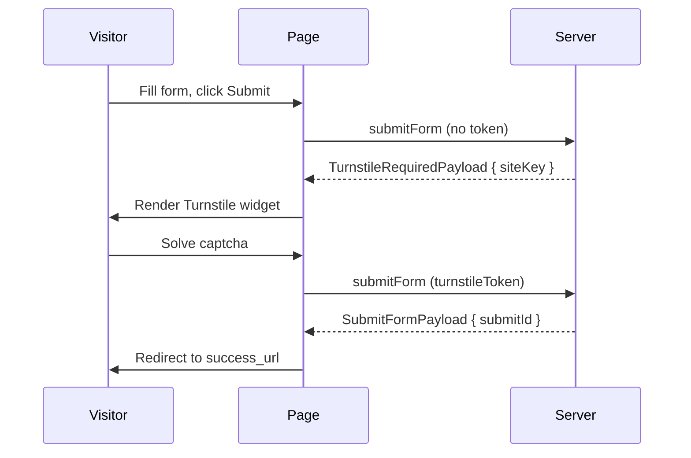
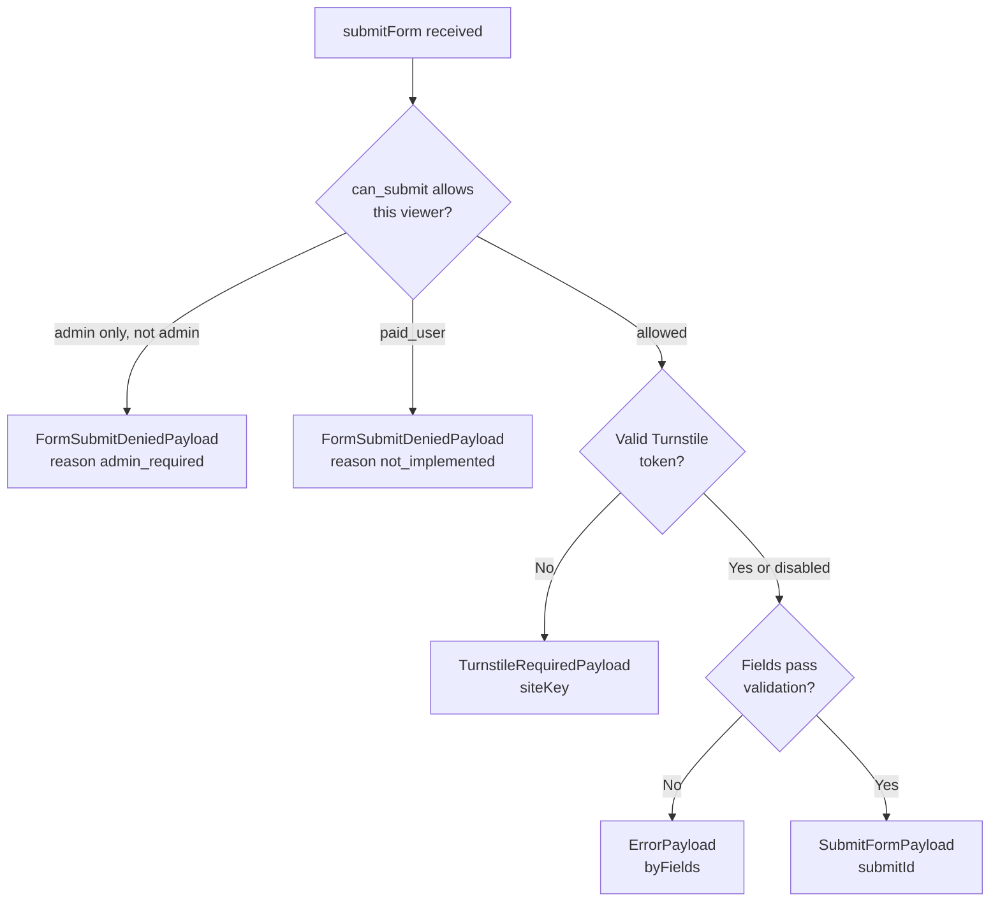

Declare a form in a note's frontmatter and trip2g embeds it on the page as a `<script id="form-spec">` block, accepts submissions through the GraphQL API, and stores them against the note. Use it for lead collection, homework submission, contact forms, or anything else that takes structured input attached to a page.

The note stays a normal note — visible at its permalink, indexed in search, exportable. The form is just a property of it.

### A minimal example

```yaml
---
title: Say hello
form:
  fields:
    - name: email
      type: email
      required: true
    - name: message
      type: text
      required: true
      max_length: 2000
---
```

That's it. On render, the page gets:

```html
<script id="form-spec" type="application/json">
  { "note_version_id": 1234, "forms": { "": { "fields": [...] } } }
</script>
```

The default template auto-renders the form at the end of the page. A custom layout can read the same JSON and lay things out however it likes (see [Custom layout](#custom-layout) below).

### Field types

| `type` | Maps to | Validators |
|---|---|---|
| `text` | string | `required`, `min_length`, `max_length`, `enum: ["a","b"]` |
| `email` | string | `required` (format validated server-side) |
| `int` | integer | `required`, `min`, `max`, `enum: [1,2,3]` |
| `bool` | boolean | `required`, `enum: [true]` (consent checkbox pattern) |
| `file` | — | not implemented yet — returns `file_upload_not_supported` |

Every field needs a `name` and a `type`. `required` defaults to `false`. `enum` accepts the same primitive type as the field — pick exactly one of the listed values.

### Who can submit — `can_submit`

```yaml
form:
  can_submit: admin    # guest (default) | admin | paid_user
```

| Value | Behaviour |
|---|---|
| omitted / `guest` | Anyone, including anonymous visitors |
| `admin` | Only authenticated admins can submit |
| `paid_user` | Accepted in spec but **not enforced yet** — server returns `not_implemented` on submit |

When a viewer is allowed to read the note but not to submit, the form still renders. On submit the server returns a `FormSubmitDeniedPayload`:

```json
{ "__typename": "FormSubmitDeniedPayload", "reason": "admin_required" }
```

The default layout shows a "sign in as admin" hint. A custom layout can branch on `reason` and offer whatever UX you want.

### Redirect on success — `success_url`

```yaml
form:
  success_url: /thanks
```

After a successful submit the layout navigates the browser to `success_url`. Relative URLs stay on the same domain; absolute URLs let you point at any page (e.g. an external receipt).

### Spam protection — `turnstile`

Cloudflare Turnstile is **on by default** on every form. To disable it, set `turnstile: false` explicitly:

```yaml
form:
  turnstile: false   # accept submissions without a captcha
```

How it works:

- When the form is submitted without a valid token, the server returns `TurnstileRequiredPayload { siteKey }`.
- The default layout reads `siteKey`, renders the Turnstile widget, and resubmits with the token in `turnstileToken`.
- Locally (no `turnstile-secret-key` configured) verification is a no-op — any submit succeeds. In production the secret key is set and the captcha gates every submit.



Combine with `can_submit: admin` for sensitive forms; on public forms the captcha is the only defence against anonymous spam.

### Multiple forms on one note — `forms:`

When one note hosts more than one form, use `forms:` (a map of named keys) instead of a single `form:`:

```yaml
forms:
  contact:
    fields:
      - name: email
        type: email
  survey:
    can_submit: admin
    fields:
      - name: rating
        type: int
        min: 1
        max: 5
```

The frontend addresses each form by its key — pass `formId: "contact"` or `formId: "survey"` when calling `submitForm`. A single inline `form:` block is equivalent to `forms` with the empty-string key.

### Reusing a spec — `form_ref:`

Instead of duplicating the same fields on many notes, define the spec once and point at it:

```yaml
# In a shared note, e.g. templates/comment_form.md
form:
  fields:
    - name: text
      type: text
      required: true
      max_length: 4000
```

```yaml
# Anywhere else
form_ref: "[[templates/comment_form]]"
```

Or by file path:

```yaml
form_ref: templates/comment_form.md
```

Submissions are still stored against the referencing note, but the spec lives in one place. Combine with [[en/user/frontmatter-patches|frontmatter patches]] to attach a form to every note in a folder without touching individual files:

```jsonnet
{ form_ref: "[[templates/comment_form]]" }
```

### Custom layout

A custom Jet layout has full access to the note via `note.FormSpecJSON()` — embed it as a `<script>` and read it from JS:

```jet
{{ block content() }}
  <article>{{ note.HTMLString() | unsafe }}</article>

  <form id="my-form"></form>
  <div id="my-status"></div>

  <script id="form-spec" type="application/json">
  {{ note.FormSpecJSON() | unsafe }}
  </script>
  <script>
    const spec = JSON.parse(document.getElementById('form-spec').textContent);
    const def = spec.forms[''];
    // build inputs from def.fields, then submit via fetch('/_system/graphql', {...})
  </script>
{{ end }}
```

There is a working example at `docs/_layouts/forms/example.html` with field rendering, validation messages, and the `success_url` redirect — copy it as a starting point.

### Submitting via GraphQL

The mutation is part of the public schema — any HTTP client can call it.

```graphql
mutation Submit($input: SubmitFormInput!) {
  submitForm(input: $input) {
    __typename
    ... on SubmitFormPayload          { submitId }
    ... on FormSubmitDeniedPayload    { reason }
    ... on ErrorPayload               { message byFields { name value } }
  }
}
```

Variables for a single inline form:

```json
{
  "input": {
    "noteVersionId": 1234,
    "formId": "",
    "fields": [
      { "name": "email",   "stringValue": "alice@example.com" },
      { "name": "rating",  "intValue":    5 },
      { "name": "agree",   "boolValue":   true }
    ]
  }
}
```

`noteVersionId` comes from the `note_version_id` field embedded in `<script id="form-spec">`. `formId` is `""` for an inline `form:` block; for `forms:` maps, pass the named key.

| Response `__typename` | Meaning |
|---|---|
| `SubmitFormPayload` | Accepted; `submitId` is the row id |
| `FormSubmitDeniedPayload` | `reason` = `admin_required` / `paid_required` / `not_implemented` |
| `ErrorPayload` | Validation failed; `message` describes it, `byFields[]` lists per-field issues |



Submissions enqueue an email to vault admins automatically.

### Reading submissions

#### Admin panel

The admin panel has a "Forms" section per note: list of submissions with timestamps, IPs, statuses, and the values per field. From there you can mark a submission as processed.

#### Via API key

To pull submissions programmatically, use an admin personal token (`Authorization: Bearer t2g_…`). The token must belong to an admin user — non-admin tokens get `unauthorized`. Send all queries to `/_system/graphql` with `Content-Type: application/json` and `Authorization: Bearer $TRIP2G_TOKEN`.

**Find which notes have submissions**

```graphql
query { admin { formNotes { notePathId path title submitCount } } }
```

Use this first to get the `notePathId` values you'll filter by.

**List submissions**

```graphql
query AdminFormSubmits($filter: AdminFormSubmitsFilterInput) {
  admin {
    formSubmits(filter: $filter) {
      totalCount
      nodes {
        id
        noteVersionId
        formId
        ip
        status
        createdAt
        processedAt
        comment
        fields {
          __typename
          ... on AdminFormStringValue { name value }
          ... on AdminFormIntValue    { name iv: value }
          ... on AdminFormBoolValue   { name bv: value }
        }
      }
    }
  }
}
```

Filter variables — all fields are optional:

| Field | Type | Description |
|---|---|---|
| `notePathId` | Int64 | Submissions for a specific note |
| `formId` | String | Filter by named form key (`""` for inline `form:`) |
| `status` | String | `"pending"` or `"processed"` |
| `processed` | Boolean | `false` = unprocessed only |
| `createdAt.gte` / `.lte` | DateTime | Date range |
| `limit` | Int | Page size |
| `offset` | Int | Pagination offset |

Example — unprocessed submissions for a specific note in May 2026:

```json
{
  "filter": {
    "notePathId": 123,
    "formId": "contact",
    "processed": false,
    "createdAt": { "gte": "2026-05-01T00:00:00Z", "lte": "2026-05-31T23:59:59Z" },
    "limit": 50,
    "offset": 0
  }
}
```

**Mark a submission as processed**

```graphql
mutation MarkProcessed($input: MarkFormSubmitProcessedInput!) {
  admin {
    markFormSubmitProcessed(input: $input) {
      __typename
      ... on MarkFormSubmitProcessedPayload {
        submit { id processedAt comment }
      }
      ... on ErrorPayload {
        message
        fields { name message }
      }
    }
  }
}
```

Variables:

```json
{ "input": { "id": 17, "comment": "answered via email" } }
```

The `comment` field is optional — useful for leaving a note on how you handled the submission.

### Bulk: enable a form on a whole folder

Pair forms with [[en/user/frontmatter-patches|frontmatter patches]] to roll out a comment form (or contact form) across a section without editing every note:

```jsonnet
// blog/**.md
{ form_ref: "[[templates/comment_form]]" }
```

All notes under `blog/` then expose the shared form. Add `exclude: ["blog/drafts/*"]` to skip work-in-progress notes.

### What's not implemented yet

- **`type: file`** — file uploads return `file_upload_not_supported` on submit. Use a separate object-storage upload step for now.
- **`can_submit: paid_user`** — recognised in frontmatter but server returns `FormSubmitDeniedPayload { reason: "not_implemented" }`. Use `admin` until this lands.
- **Captcha providers other than Cloudflare Turnstile** — hCaptcha and Yandex SmartCaptcha are on the roadmap (Turnstile is wired up and on by default; see "Spam protection" above).

### Related

- [[en/user/frontmatter-patches|Frontmatter patches]] — bulk-apply `form:` or `form_ref:` to a folder
- [[en/user/webhooks|Webhooks]] — get notified outside the admin panel when a submission arrives
- [[en/user/selfhosted|Self-hosted]] — running your own instance, where the GraphQL endpoint and API keys live
