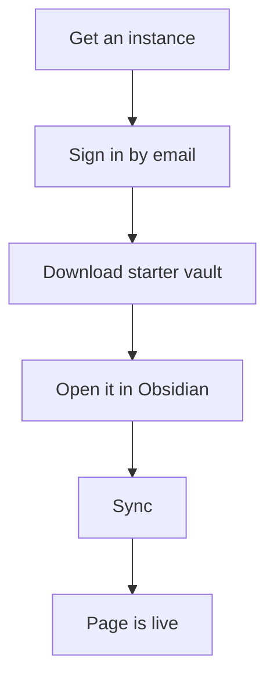

Your Obsidian vault becomes a website in under a minute. The fastest path: sign in to your instance, download the preconfigured starter vault, open it in Obsidian, press Sync. No plugin installs, no API keys to copy. Try the [demo](https://simplecloud.2pub.me) or see [[en/user/use-cases|how people use it]].

### Setup at a glance

### How the service works

The trip2g plugin uploads notes from a folder in your vault to your site. All notes are private by default — only you can see them when logged in as admin. Adding `free: true` to a note makes it visible to everyone on the internet.

### Sign in

Before signing in, you need an instance — a personal site that is already running. See [[en/user/hosting|Hosting options]] to get one.

1. Open the link and click Login
2. Enter your email address
3. Copy the code from the email and paste it on the site

Code didn't arrive? Check your spam folder. On a self-hosted instance without email configured, the code is printed in the server logs — run `docker compose logs trip2g` and look for the sign-in code.

### Path A — starter vault (recommended)

A fresh instance greets the admin with a welcome page and a **Download archive** button. The archive is a ready-to-use Obsidian vault: the sync plugin is already installed and connected — your site URL and a fresh API key are baked into its settings.

1. Click **Download archive** and unzip it
2. In Obsidian, choose **Open folder as vault** and pick the unzipped folder
3. Obsidian asks whether to trust the vault — choose **Trust author and enable plugins**. If you decline, the sync plugin stays disabled and nothing will sync.
4. Click the sync button in the Obsidian sidebar

Your notes are now on the site. Edit a note, sync again, refresh the page — it updates.

Two things to know:

- **The archive contains a private API key.** Don't share the zip. Each download creates a new key; you can review and revoke keys in the admin panel under API Keys.
- Already have content on the server? Two-way sync will offer to pull the current server content into the vault on first sync.

The vault also ships MCP configs (`.mcp.json`, `AGENTS.md`) so AI agents can search and read your notes — see [[en/user/agent-memory]]. For a full tour of the archive — its layout, the bundled sync script, and how to keep the API key safe — see [[en/user/onboarding-vault|The onboarding vault]].

### Path B — add sync to an existing vault

Use this path when you want to publish from a vault you already have. Consider a dedicated folder or a fresh test vault first: the plugin uploads everything in the configured folder, which may include personal notes you don't want to publish.

The trip2g sync plugin is not in the official Obsidian catalog yet. You install it through BRAT, a plugin that handles beta installations.

**Step 1: Install BRAT**

1. Open Obsidian Settings → Community plugins
2. Search for **BRAT** and install it
3. Enable the plugin

**Step 2: Add the trip2g plugin via BRAT**

1. Open BRAT settings
2. Click **Add beta plugin**
3. In the Repository field, paste: `https://github.com/trip2g/obsidian-sync`
4. In the Version field, select **Latest**
5. Click **Add plugin**

**Step 3: Create an API key**

1. Open your site's admin panel
2. Go to **API Keys**
3. Click **+ Add** → **Submit**
4. Copy the key

**Step 4: Connect the plugin to your site**

1. Open Obsidian Settings → trip2g sync
2. Click **Add sync directory**
3. Paste your site URL, e.g. `https://yourinstance.trip2g.com`
4. Paste the API key
5. Click **Test All Connections**

A green checkmark confirms the connection is working.

**Plugin settings:**

- **Sync folder** — the vault folder to sync. Use `/` to sync the entire vault.
- **Publish fields** — a property filter. If you enter `publish`, only notes with `publish: true` will sync. Leave blank to sync all files.

**How to sync:**

Click the sync button in the Obsidian sidebar, or run the command **trip2g sync: Sync**.

### Publish your first note

**Create the home page:**

1. Create a file named `_index` (the starter vault already has one — just edit it)
2. Write any text, for example: "Hello world"

The underscore prefix keeps `_index` at the top of the file list in Obsidian.

**Sync the note:**

Click the sync button. Open your site — you will see the text. Only you can see it because you are logged in as admin. Visitors (try an incognito window) see the page title and a sign-in wall, not the content.

**Make the page public:**

1. Add a property named `free` with type **Checkbox**
2. Check the box
3. Sync again

Obsidian remembers the property. It will appear in autocomplete suggestions next time.

Open your site — the page is now visible to everyone.

**Set a title:**

By default the page title matches the filename. For `_index` this looks odd. Add a `title` property with the text you want shown as the heading.

### Admin panel tips

**Drafts are visible by default:**

Out of the box, **Show Draft Versions** is on: synced notes appear on the site immediately. When you are ready for a review workflow, turn it off in Settings — then changes go live only through a [[en/user/releases|release]].

**Set your timezone:**

The system detects your timezone automatically and shows a button next to the Timezone field. Click it to fill in your zone, or type it manually (e.g. `Europe/Moscow`), then click **Submit**.

Timezone matters for Telegram scheduling: a post set to 9:00 will go out at 9:00 in your local time, not UTC.

**Navigating the admin panel:**

Panels open left to right. Use Shift + mouse wheel to scroll horizontally. The admin panel supports English and Russian.

### Next steps

- [[en/user/onboarding-vault|The onboarding vault]] — what's inside the archive and how to sync it from the terminal
- [[en/user/hosting|Hosting options]] — get a running instance if you don't have one yet
- [[en/user/publishing]] — control how notes appear on your site with frontmatter properties
- [[en/user/telegram]] — publish posts to a Telegram channel on a schedule
- [[en/user/monetization]] — restrict content to paying subscribers
- [[en/user/webhooks]] — automate actions when notes change (CI/CD, API)
- [[en/user/advanced]] — custom domains, CLI sync, SEO, and backups
- [[en/user/use-cases]] — examples: YouTuber, AI consultant, Telegram channel, project docs
