Your Obsidian vault becomes a website in under a minute. Write in Obsidian, sync, and notes are live — with Telegram publishing, monetization, and an AI assistant built in. Try the [demo](https://simplecloud.2pub.me) or see [[en/user/use-cases|how people use it]].

### Setup at a glance

```mermaid
flowchart LR
    A[Get an instance] --> B[Sign in by email]
    B --> C[Configure admin panel]
    C --> D[Install plugin via BRAT]
    D --> E[Create API key]
    E --> F[Connect plugin to site]
    F --> G[Create _index note]
    G --> H[Sync]
    H --> I[Add free: true]
    I --> J[Page is public]
```

### How the service works

The trip2g plugin uploads notes from a folder in your vault to your site. All notes are private by default — only you can see them when logged in as admin. Adding `free: true` to a note makes it visible to everyone on the internet.

### Create a test vault

Before connecting the plugin, create a fresh Obsidian vault for experimenting. The plugin uploads everything in the configured folder, which may include personal notes you don't want to publish. A dedicated vault lets you experiment freely without risk.

### Sign in

Before signing in, you need an instance — a personal site that is already running. See [[en/user/hosting|Hosting options]] to get one.

1. Open the link and click Login
2. Enter your email address
3. Copy the code from the email and paste it on the site

Code didn't arrive? Check your spam folder.

### Configure the admin panel

**Enable draft versions:**

By default, content goes live through a release process. While you are getting started, it is easier to see changes immediately.

1. Open the admin panel
2. Go to Settings → click **+ Change**
3. Enable **Show Draft Versions**

Your notes will now appear on the site right after syncing, without waiting for a release.

**Set your timezone:**

The system detects your timezone automatically and shows a button next to the Timezone field. Click it to fill in your zone, or type it manually (e.g. `Europe/Moscow`), then click **Submit**.

Timezone matters for Telegram scheduling: a post set to 9:00 will go out at 9:00 in your local time, not UTC.

**Navigating the admin panel:**

Panels open left to right. Use Shift + mouse wheel to scroll horizontally. The admin panel supports English and Russian.

### Install the Obsidian plugin

The trip2g sync plugin is not in the official Obsidian catalog yet. You install it through BRAT, a plugin that handles beta installations.

**Step 1: Install BRAT**

1. Open Obsidian Settings → Community plugins
2. Search for **BRAT** and install it
3. Enable the plugin

**Step 2: Add the trip2g plugin via BRAT**

1. Open BRAT settings
2. Click **Add beta plugin**
3. In the Repository field, paste: `https://github.com/trip2g/obsidian-sync`
4. In the Version field, select **Latest**
5. Click **Add plugin**

**Step 3: Create an API key**

1. Open your site's admin panel
2. Go to **API Keys**
3. Click **+ Add** → **Submit**
4. Copy the key

**Step 4: Connect the plugin to your site**

1. Open Obsidian Settings → trip2g sync
2. Click **Add sync directory**
3. Paste your site URL, e.g. `https://yourinstance.trip2g.com`
4. Paste the API key
5. Click **Test All Connections**

A green checkmark confirms the connection is working.

**Plugin settings:**

- **Sync folder** — the vault folder to sync. Use `/` to sync the entire vault.
- **Publish fields** — a property filter. If you enter `publish`, only notes with `publish: true` will sync. Leave blank to sync all files.

**How to sync:**

Click the sync button in the Obsidian sidebar, or run the command **trip2g sync: Sync**.

### Publish your first note

**Create the home page:**

1. Create a file named `_index`
2. Write any text, for example: "Hello world"

The underscore prefix keeps `_index` at the top of the file list in Obsidian.

**Sync the note:**

Click the sync button. Open your site — you will see the text. Only you can see it because you are logged in as admin. Open the site in an incognito window and the page is not accessible.

**Make the page public:**

1. Add a property named `free` with type **Checkbox**
2. Check the box
3. Sync again

Obsidian remembers the property. It will appear in autocomplete suggestions next time.

Open your site — the page is now visible to everyone.

**Set a title:**

By default the page title matches the filename. For `_index` this looks odd. Add a `title` property with the text you want shown as the heading.

### Next steps

- [[en/user/hosting|Hosting options]] — get a running instance if you don't have one yet
- [[en/user/publishing]] — control how notes appear on your site with frontmatter properties
- [[en/user/telegram]] — publish posts to a Telegram channel on a schedule
- [[en/user/monetization]] — restrict content to paying subscribers
- [[en/user/webhooks]] — automate actions when notes change (CI/CD, API)
- [[en/user/advanced]] — custom domains, CLI sync, SEO, and backups
- [[en/user/use-cases]] — examples: YouTuber, AI consultant, Telegram channel, project docs
