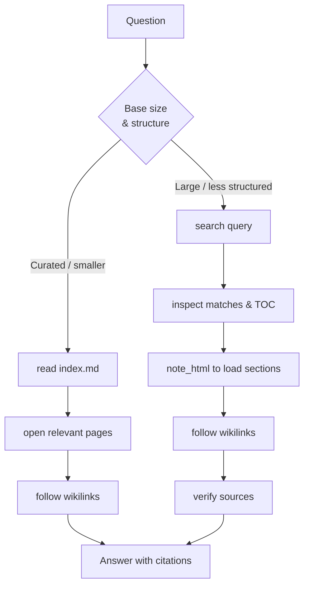

The wiki is the artifact, not the chat. Trip2G turns a markdown knowledge base into an MCP-accessible artifact that Claude, Cursor, Codex, and other agents can read, navigate, and update.

Agents often rediscover the same context every session. RAG retrieves chunks, but useful synthesis disappears back into the chat. An LLM Wiki keeps the synthesis as a durable artifact — a growing knowledge base your agents can navigate, not just query.

### What makes an LLM Wiki different

|  | Chat | RAG | LLM Wiki |
|---|---|---|---|
| Stores synthesis | No | No | Yes |
| Agent-navigable | No | Partial | Yes |
| Grows over time | No | With effort | Built-in |
| Agent instructions | No | No | Yes |
| Provenance | No | Partial | Yes |

Trip2G is the operational layer:

- **Markdown vault** — Obsidian notes published to a website
- **MCP access** — `search()`, `note_html()`, `instructions()` for any MCP client
- **Instruction pages** — `AGENTS.md`, `SCHEMA.md`, `_mcp_initialize.md` exposed as MCP methods
- **Index-first navigation** — agents follow `index.md` and wikilinks
- **Search/RAG** — vector search for large or less structured bases
- **Federation** — knowledge bases can reference each other

### 10-minute quickstart

**1.** Create a free Trip2G instance at trip2g.com and install the Obsidian sync plugin.

**2.** Create the starter folder structure in your vault (see below) or download the starter template.

**3.** Add your first source — paste any markdown content into `raw/`.

**4.** Fill in `index.md` with what this base covers, `AGENTS.md` with agent instructions, `SCHEMA.md` with the page structure.

**5.** Sync the vault and enable the MCP server in site settings.

**6.** Connect the MCP endpoint to your agent (Claude Desktop, Claude Code, Cursor, etc.).

**7.** Ask: *"Read index.md and explain what this base knows."*

### Two modes of agent retrieval

Agents can access an LLM Wiki in two ways. The mode is usually described in `AGENTS.md`.

#### Mode A — Index-first traversal

Best for curated or smaller bases where the structure is intentional. The agent walks the graph the same way a human would. Well suited for interconnected concept bases, decision logs, and research notes.

#### Mode B — Search/RAG-assisted retrieval

Best for large or less structured bases.



RAG retrieves. LLM Wiki compounds. Use both when needed — the base grows from each session's synthesis, making future retrieval more precise.

### Instruction pages

Trip2G exposes notes with `mcp_method` frontmatter as callable MCP tools. Three standard instruction pages:

**`AGENTS.md`** — how the agent should use this base:

```yaml
---
free: true
mcp_method: instructions
mcp_description: "How agents should use this knowledge base."
---

# Role
Answer questions using only this knowledge base.

## Workflow
1. search(query) — find relevant notes
2. note_html() — load the full note or a section via toc_path
3. Follow wikilinks to related notes
4. Answer with citations
```

**`SCHEMA.md`** — page types, frontmatter, and update rules:

```yaml
---
free: true
mcp_method: schema
mcp_description: "Page types, frontmatter and update rules for this LLM Wiki."
---

# Schema

## Page types
- concepts/  — definitions, one concept per page
- sources/   — raw material with provenance
- decisions/ — decisions made, rationale, date
- queries/   — questions asked and answers found
- comparisons/ — structured comparison tables
```

**`_mcp_initialize.md`** (optional) — session initialization:

```yaml
---
free: true
mcp_method: initialize
mcp_description: "Start a session with this knowledge base."
---

1. Read index.md to understand scope
2. Read SCHEMA.md to understand structure
3. Announce what you are ready to help with
```

### Starter folder structure

```
llm-wiki/
├── _index.md           — site home page (trip2g)
├── AGENTS.md           — agent instructions  (mcp_method: instructions)
├── SCHEMA.md           — structure and update rules  (mcp_method: schema)
├── _mcp_initialize.md  — session init, optional  (mcp_method: initialize)
├── index.md            — what this base knows (human-readable TOC)
├── log.md              — session log, synthesis, open questions
├── raw/                — unprocessed sources, transcripts, drafts
├── sources/            — processed sources with provenance
├── concepts/           — core concepts and definitions
├── queries/            — questions asked and answers found
├── comparisons/        — structured comparison pages
└── decisions/          — decisions with rationale and date
```

`index.md` and `log.md` are the two most important files. `index.md` tells the agent what exists; `log.md` accumulates the synthesis that would otherwise disappear into chat.

### Federation

A knowledge base can link to other bases. A KB-note in your vault registers a peer; the agent fans out to it via `federated_search`. Multiple domain-specific bases can combine into one hub your agent queries through a single MCP endpoint.

→ See [[en/user/federation|MCP Federation]]

### Related

- [[en/user/mcp|MCP Server]] — connecting clients, methods reference, access tokens
- [[en/user/federation|MCP Federation]] — linking multiple knowledge bases
- [[en/user/ai-agent-docs-setup|AI agent docs setup]] — build a docs site with an agent
- [[en/user/search|How search works]] — vector index and relevance
