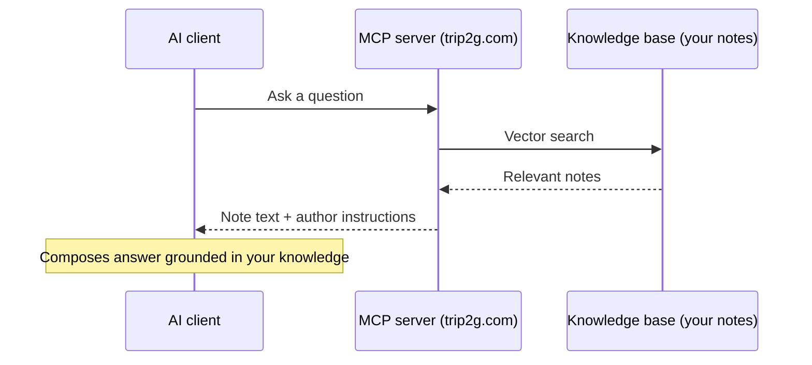

The MCP server turns your knowledge base into an AI consultant. Connect it to any MCP-compatible client — Claude Desktop, Claude Code, Cursor, GitHub Copilot, Gemini CLI — and chat with your knowledge base directly.

### How it works



### Methods

| Method | Description |
|--------|-------------|
| `search(query)` | Vector search across the knowledge base. Returns slim snippets — a heading breadcrumb and a precise `toc_path` per match, not the full table of contents |
| `expand(pid, toc_path?)` | Walk a note's table of contents level by level. Returns the direct children of a TOC node so you can drill down without loading the note. See [[en/user/expand]] for a detailed explanation |
| `note_html(path, toc_path?)` | Full note or a specific section |
| `similar(path)` | Notes similar to the given note |
| `instructions()` | Author-defined AI instructions |
| `editor_role()` | Answer style instructions |
| `graphql_introspection(pattern)` | Inspect the GraphQL schema — returns types and operations matching the pattern, plus types they reference. Requires admin tools enabled on the API key. See [[en/user/agent_admin]]. |
| `graphql_request(query, variables?)` | Execute any GraphQL query or mutation as admin. Requires admin tools enabled on the API key. See [[en/user/agent_admin]]. Example use case: [[en/user/version_requests\|recovering overwritten notes]]. |

#### Drill-down: search → expand → note_html

**TL;DR:** `search` returns slim results — a heading breadcrumb and a precise `toc_path` per match, not the whole table of contents. To navigate a note's structure, call `expand` to walk the TOC one level at a time, then `note_html(toc_path=[...])` to read the exact section you want. This keeps token usage low: you only load the sections you actually need.

#### `search` — slim snippets and match location

Each match returned by `search` carries:

- a **heading breadcrumb** (`title > section > subsection`) that locates the *approximate* section the snippet lives in;
- a precise **`toc_path`** field (string array) pointing to the innermost section that contains that snippet.

`toc_path` is a breadcrumb array that uniquely identifies a section. Heading titles can repeat under different parents; the array disambiguates them. For example, two sections both titled "Introduction" under "Chapter 1" and "Chapter 2" produce distinct paths: `["Chapter 1", "Introduction"]` and `["Chapter 2", "Introduction"]`.

Search results no longer include a full flat `toc` array. To explore a note's structure beyond the matched section, use `expand` (below).

#### `expand` — walk the table of contents level by level

`expand` returns the direct children of a TOC node (progressive disclosure), so an agent can navigate a note's structure without loading its content or its full table of contents. For a full explanation of the tool and its workflow, see [[en/user/expand]].

It accepts a note reference (`pid`, `note_id`, `href`, or `path`) and an optional `toc_path`:

- Omit `toc_path` (or pass `[]`) to get the **top-level sections**.
- Pass a `toc_path` to list **that section's subsections**.

```
expand(pid=42)                                  → top-level sections
expand(pid=42, toc_path=["Chapter 1"])          → subsections of Chapter 1
```

Each child node has:

```json
{
  "title": "Introduction",
  "level": 2,
  "path": ["Chapter 1", "Introduction"],
  "has_children": false
}
```

- `title` — the heading text.
- `level` — the heading level (1–6).
- `path` — the full breadcrumb to this node; pass it back as `toc_path` to expand it further or to read it with `note_html`.
- `has_children` — whether this node has subsections of its own. Use it to decide whether to keep drilling down with `expand` or to read the leaf with `note_html`.

#### `note_html` — retrieve a single section

`note_html` accepts an optional `toc_path` parameter. Pass a `path` value from a search match or an `expand` child to retrieve only that section's HTML instead of the full note.

```
note_html(pid=42, toc_path=["Chapter 1", "Introduction"])
```

This is useful when a note is long: locate the section via `search` or `expand`, then fetch just that section with `note_html`. Pass `match_id` from a search match instead for a focused chunk window around that specific hit.

#### Saving tokens with TOC navigation

Long notes can cost many tokens if loaded in full. The `toc_path` and `expand` mechanics let an agent fetch only the section it actually needs.

**How it works:**

- `search` returns slim matches — each carries a heading breadcrumb (approximate location) and a `toc_path` (the breadcrumb of the innermost section containing the match). It does **not** return the document's full table of contents.
- `expand` walks the TOC one level at a time. Each child reports `has_children`, so you can drill down only where you need to.
- `note_html` accepts `toc_path` — pass any `path` from a search match or an `expand` child to receive only that section's HTML, not the entire note.

**Recommended workflow:**

1. `search(query)` — get slim matches with a heading breadcrumb and `matches[].toc_path` (match location).
2. `note_html(pid=N, toc_path=match.toc_path)` — load only the matched section. *Or*, to explore the note's structure first:
3. `expand(pid=N)` — list top-level sections, then `expand(pid=N, toc_path=[...])` to drill into a section, following `has_children`.
4. `note_html(pid=N, toc_path=[...])` — read the exact leaf section you found.

For searching and retrieving notes across federated peer bases, see [[en/user/federation]]. Federated bases expose the same drill-down: `federated_search` → `federated_expand` → `federated_note_html`. The `federated_expand` interface mirrors [[en/user/expand|expand]] applied to a remote knowledge base.

### Setting up your own MCP knowledge base

#### Step 1. Publish your notes

Move notes to Obsidian and publish via trip2g. The service automatically builds a vector index for search.

#### Step 2. Add AI instructions

Create a note with instructions for the AI and add to its frontmatter:

```yaml
---
mcp_method: instructions
---
```

Example instructions:

```markdown
# Role
You are a virtual assistant powered by a personal knowledge base.
Your answers MUST be grounded in the knowledge base content.

## Workflow
1. search(query) → find relevant notes
2. Pick the 3 most relevant notes
3. Ask a clarifying question to confirm direction
4. Load content with note_html(path) — use toc_path from search results to fetch only the relevant section of long notes
5. Synthesize an answer through the lens of these notes
6. Cite sources with links
```

#### Step 2b. Add system instructions (initialize)

To send instructions automatically when a client connects, create a note with `mcp_method: initialize`:

```yaml
---
mcp_method: initialize
free: true
---
```

The client receives these instructions during the MCP handshake, before any tool calls. Add `free: true` if you want anonymous users to receive them as well.

#### Step 3. Configure access

Enable the MCP server in site settings. Access can be:
- **Open** — for everyone
- **Subscription-only** — for paying subscribers only

### Custom tools and discovery

Any note with a `mcp_method` frontmatter value (other than the reserved names `initialize`, `search`, `similar`, `note_html`, `expand`, `federated_search`, `federated_similar`, `federated_note_html`, `federated_expand`) becomes a callable tool. The tool appears in `tools/list` automatically — no configuration needed.

```yaml
---
mcp_method: wiki_guide
mcp_description: How to navigate this wiki
---
```

Add `mcp_description` to control the tool description shown to the AI. If omitted, the note title is used.

Access control applies: a note in a subscription-only subgraph is only visible to authenticated users with that subgraph. Anonymous users and non-subscribers will not see it in `tools/list` and cannot call it.

### Named entry points (`?method=`)

One knowledge base can serve multiple agent roles. Each role has its own instructions note, selected via the `?method=` URL parameter:

```
/_system/mcp?method=wiki
/_system/mcp?method=support
/_system/mcp?method=onboarding
```

When a client connects to `/_system/mcp?method=wiki`, the server sends the content of the note with `mcp_method: wiki` as the `initialize` instructions — instead of the default `mcp_method: initialize` note. All tools remain the same; only the system instructions change.

**Entry point access control** follows the same rules as regular notes. If the entry point note is in a paid subgraph, only subscribers can use that entry point. Anonymous users receive a `Method not found` error. This lets you gate premium agent personas behind a paywall.

**Example setup:**

```yaml
---
mcp_method: wiki
free: true
---
You are a wiki assistant. Search the knowledge base and answer concisely.
```

```yaml
---
mcp_method: premium_advisor
subgraphs: premium
---
You are a senior advisor. Provide in-depth analysis. Subscribers only.
```

Clients connect as:
- `/_system/mcp` — default persona (mcp_method: initialize)
- `/_system/mcp?method=wiki` — public wiki assistant
- `/_system/mcp?method=premium_advisor` — premium advisor (requires subscription)

```mermaid
flowchart LR
    A[/_system/mcp] --> D[mcp_method: initialize<br/>default persona]
    B[/_system/mcp?method=wiki] --> W[mcp_method: wiki<br/>free: true -> public]
    C[/_system/mcp?method=premium_advisor] --> P{Subscriber?}
    P -->|Yes| PA[mcp_method: premium_advisor<br/>in-depth advisor]
    P -->|No| E[Method not found 401]
    D --> T[Same tool set]
    W --> T
    PA --> T
```

### Personal access tokens

Personal access tokens let you authenticate to the MCP server without a browser session. Use them to integrate with CLI tools, scripts, or external applications.

#### Create a token

1. Go to **User → Tokens** in your account settings
2. Click **Generate token**
3. Enter a name (e.g., "Claude Desktop", "API script")
4. Choose expiration: **30 days**, **90 days** (default), **1 year**, or **Never**
5. Click **Generate**
6. Copy the token — it shows only once. Store it securely

#### Use the token

Two formats work:

**HTTP Bearer header:**
```bash
curl https://yoursite.com/_system/mcp/tools/call \
  -H "Authorization: Bearer t2g_…" \
  -H "Accept: application/json, text/event-stream" \
  -d '{"method":"search","params":{"query":"design"}}'
```

**Query parameter:**
```bash
curl 'https://yoursite.com/_system/mcp/tools/call?token=t2g_…' \
  -H "Accept: application/json, text/event-stream" \
  -d '{"method":"search","params":{"query":"design"}}'
```

#### Access control

- **Admin**: sees all notes and subgraphs
- **Regular user**: sees only notes in subgraphs you're subscribed to
- Tokens inherit your access — no additional privileges

#### Revoke a token

1. Go to **User → Tokens**
2. Find the token and click **Revoke**
3. The token stops working immediately (within ~30 seconds if cached)

### API key authentication

API keys (the same keys used by the Obsidian sync plugin) are accepted by the MCP endpoint. An agent that already has an API key from a pre-configured vault gets MCP access with no extra setup.

#### Use the key

```bash
curl https://yoursite.com/_system/mcp \
  -H "X-API-Key: <your-api-key>" \
  -H "Content-Type: application/json" \
  -H "Accept: application/json, text/event-stream" \
  -d '{"jsonrpc":"2.0","method":"tools/list","id":1}'
```

#### Access level

API key auth gives admin-level content access (all notes and subgraphs) by default — same notes a site admin sees.

#### Enable admin GraphQL tools

To also expose `graphql_introspection` and `graphql_request`:

1. Go to **Admin → API Keys**
2. Find the key
3. Enable **MCP admin tools**

Once enabled, the agent can inspect the GraphQL schema and call any mutation. See [[en/user/agent_admin]] for the full workflow and examples.

### Use cases

**Expert knowledge consultant** — an expert built a knowledge base on a topic. You connect their MCP and get a consultant that answers in the expert's style, citing their materials.

**Selling access to knowledge** — authors build bases with instructions and sell subscriptions. Subscribers get current knowledge, prompt updates, and a consultant in their own chat. Authors get recurring income and motivation to keep the base current.

### Privacy

- The MCP server returns only text from the knowledge base
- The server receives search queries but does not see your chat context, replies, or files
- Instructions run locally on your client, not on the knowledge base server
- No request history is stored
