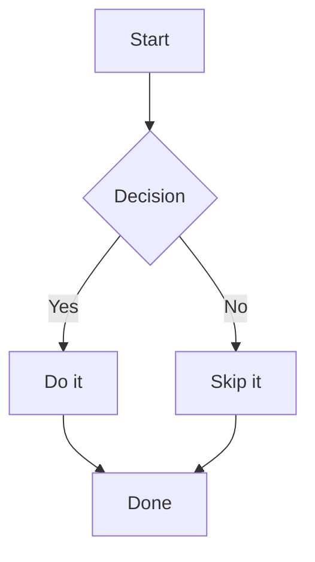
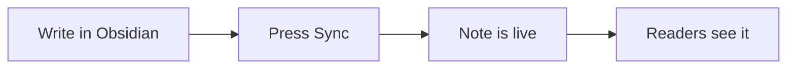
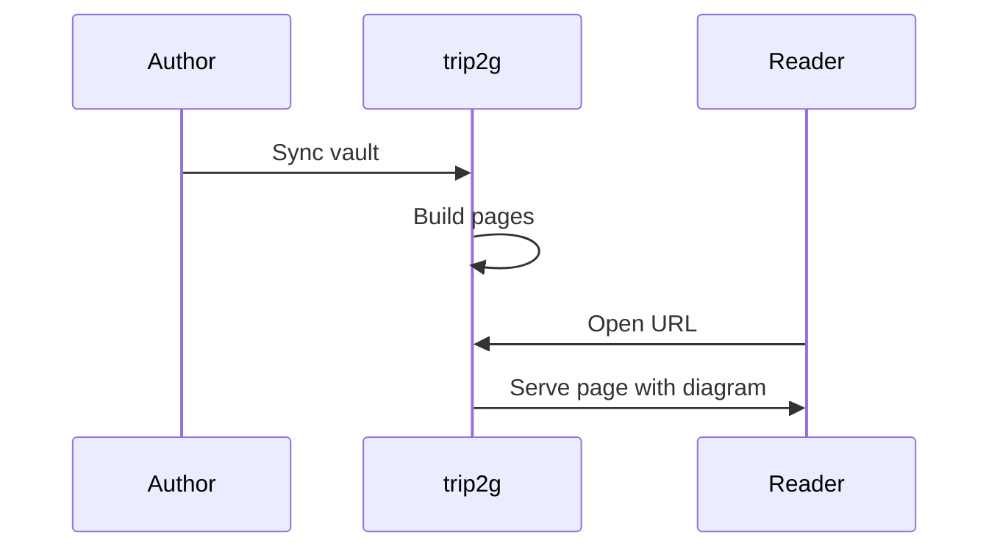
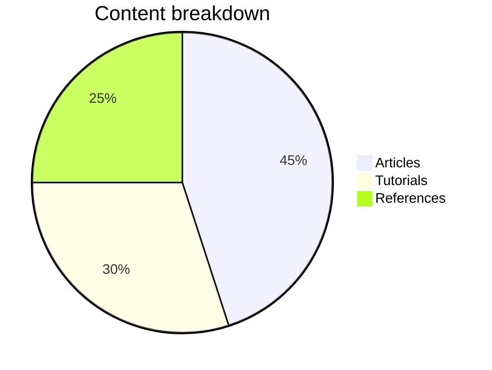

A `mermaid` code block in any note becomes a rendered diagram on the published page. Write diagrams the same way you write them in [Obsidian](https://help.obsidian.md/Editing+and+formatting/Advanced+formatting+syntax#Diagram).

## How to use it

Add a code block with the language identifier `mermaid` and paste your diagram syntax inside:

````

````

That block renders as a diagram for every reader who opens the page. All diagram types that Mermaid supports work — flowcharts, sequence diagrams, pie charts, Gantt charts, class diagrams, state diagrams, and more.

---

## Examples

### Flowchart

````

````


### Sequence diagram

````

````


### Pie chart

````

````


---

## Performance

The Mermaid renderer is a large JavaScript library. trip2g loads it lazily — only on pages that actually contain a `mermaid` block. Pages without diagrams pay no loading cost at all. This mirrors how [[en/user/chartdata|datachart]] loads ECharts.

Rendering happens in the reader's browser.

---

## Supported diagram types

Any diagram type from the [Mermaid documentation](https://mermaid.js.org/intro/) works:

| Type | Syntax keyword |
|------|---------------|
| Flowchart | `graph` / `flowchart` |
| Sequence diagram | `sequenceDiagram` |
| Pie chart | `pie` |
| Gantt chart | `gantt` |
| Class diagram | `classDiagram` |
| State diagram | `stateDiagram-v2` |
| Entity relationship | `erDiagram` |
| User journey | `journey` |

The full syntax reference is at [mermaid.js.org](https://mermaid.js.org/intro/).
