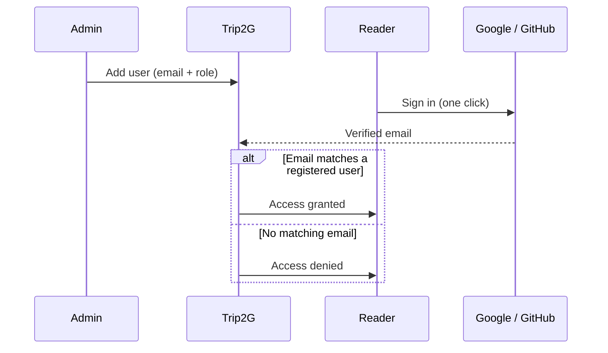

By default, readers sign in via a magic link sent to their email. OAuth lets them sign in with Google or GitHub in one click — no waiting for email, no switching apps.

The trade-off: OAuth requires a one-time setup where you register an application with Google or GitHub and enter the keys in the trip2g admin panel.

## How it works

OAuth does **not** grant access by itself. Access depends entirely on whether the provider email matches a user you have already registered in trip2g.

Two steps happen in sequence:

1. **You add the user in trip2g** — enter their email address and assign a role (reader or admin).
2. **The user signs in via OAuth** — their email at Google or GitHub must match the email you registered.

If the email matches, they get in. If it does not match any registered user, access is denied.



## Set up Google OAuth

### Step 1. Create a project

1. Open [Google Cloud Console](https://console.cloud.google.com/).
2. Create a new project or select an existing one.

### Step 2. Configure the OAuth consent screen

1. Go to **APIs & Services → OAuth consent screen**.
2. Click **Get started**.
3. Enter an app name (for example, the name of your site).
4. Enter a support email address.
5. Under **Audience**, choose **External** (any Google user) or **Internal** (your Google Workspace organisation only).
6. Complete the remaining fields and save.

### Step 3. Create credentials

1. Go to **APIs & Services → Credentials**.
2. Click **Create credentials → OAuth client ID**.
3. Select **Web application** as the application type.
4. Under **Authorized redirect URIs**, add:
   ```
   https://your-domain.com/_system/auth/google/callback
   ```
5. Click **Create**.
6. Copy the **Client ID** and **Client Secret**.

## Set up GitHub OAuth

1. Open [GitHub Developer Settings](https://github.com/settings/developers).
2. Click **New OAuth App**.
3. Fill in the form:
   - **Application name**: your site name
   - **Homepage URL**: `https://your-domain.com`
   - **Authorization callback URL**:
     ```
     https://your-domain.com/_system/auth/github/callback
     ```
4. Click **Register application**.
5. Copy the **Client ID**.
6. Click **Generate a new client secret** and copy the **Client Secret**.

## Enter keys in the admin panel

1. Sign in to the trip2g admin panel.
2. Go to **Admin panel → Google OAuth** or **GitHub OAuth**.
3. Enter the Client ID and Client Secret.
4. Save and activate the provider.


Once activated, the sign-in screen shows a **Sign in with Google** or **Sign in with GitHub** button next to the email field. Deactivating the provider removes the button; users fall back to email magic links.

## Security

The Client Secret is stored encrypted in the database. Even if a database backup is exposed, the secrets remain unreadable without the encryption key.

## Related

- [[en/user/monetization]] — control which notes are public vs subscriber-only
- [[en/user/user_management]] — add readers and assign roles
- [[en/user/advanced]] — custom domains, SEO, and other hosting settings
