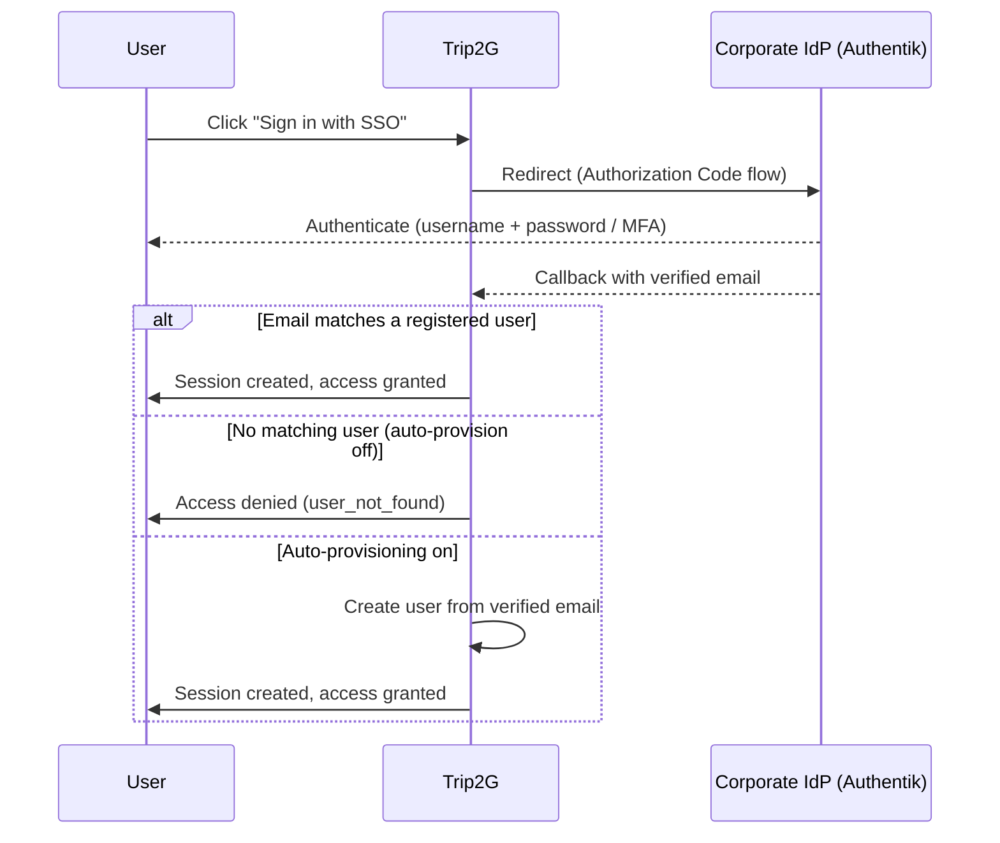

OIDC lets your staff sign in to trip2g with their company identity — one click against the corporate IdP, no separate trip2g password required. The immediate target is **Authentik**, but any standards-compliant OpenID Connect provider works.

## How it works

OIDC does **not** grant access by itself. Access depends on whether the IdP email maps to a trip2g user — unless you enable auto-provisioning.

Two steps happen in sequence:

1. **The user signs in via "Sign in with SSO"** — the browser goes to the IdP, authenticates, and returns a verified email.
2. **trip2g checks the email** — if it matches a registered user, the session is created; if not, access is denied (or the user is created automatically, if auto-provisioning is on).



Once an active OIDC provider is configured, a **"Sign in with SSO"** button appears on the sign-in page. The callback URL trip2g listens on is:

```
https://your-domain.com/_system/auth/oidc/callback
```

Register this exact URL in your IdP.

## Configure the IdP side (Authentik)

These steps are done once by the Authentik administrator.

### Step 1. Create a Provider

1. In Authentik, go to **Applications → Providers → Create**.
2. Choose **OAuth2/OpenID Provider**.
3. Fill in the form:
   - **Name**: for example, `trip2g`
   - **Authorization flow**: your organisation's standard flow
   - **Client type**: Confidential
   - **Redirect URIs**: add exactly `https://your-domain.com/_system/auth/oidc/callback`
4. Save. Authentik generates a **Client ID** and **Client Secret** — copy both.

### Step 2. Create an Application

1. Go to **Applications → Applications → Create**.
2. Link it to the provider you just created.
3. The **Application slug** becomes part of the issuer URL:
   ```
   https://authentik.company/application/o/<slug>/
   ```
   Note: the trailing slash is required — Authentik includes it in the `iss` claim.

### Step 3. (Optional) Add groups to the token

By default, Authentik does not include group memberships in the token. To enable the `groups` claim:

1. Go to **Customization → Property Mappings → Create → OAuth2 Scope Mapping**.
2. Set **Scope name** to `groups`.
3. Add the expression:
   ```python
   return [group.name for group in request.user.ak_groups.all()]
   ```
4. Attach this mapping to your Provider under **Advanced protocol settings → Scopes**.
5. When entering the OIDC provider in trip2g, add `groups` to the scopes field.

## Configure OIDC in trip2g

There are two ways to add the provider, depending on your deployment.

### Option A: Admin panel (per-instance, runtime)

Use this for standard deployments where an admin manages credentials through the UI.

1. Sign in to the trip2g admin panel.
2. Go to **Admin → OIDC** and create a new provider with these fields:

   | Field | Example value |
   |---|---|
   | Name | `Authentik` |
   | Issuer | `https://authentik.company/application/o/trip2g/` |
   | Client ID | from Authentik |
   | Client Secret | from Authentik |
   | Scopes | `openid email profile` (add `groups` if configured) |

3. Save, then set this provider as **active**.

Once active, the **"Sign in with SSO"** button appears on the sign-in screen.

### Option B: Environment variables (self-hosted, zero-touch)

Use this when you pre-bake SSO configuration into a corporate deployment and don't want it changeable at runtime.

Set the following environment variables before starting trip2g:

```bash
OIDC_ISSUER="https://authentik.company/application/o/trip2g/"
OIDC_CLIENT_ID="<client_id from Authentik>"
OIDC_CLIENT_SECRET="<client_secret from Authentik>"
```

Optional variables:

```bash
OIDC_AUTO_PROVISION="true"          # create users on first login
OIDC_ALLOWED_EMAIL_DOMAIN="company.com"   # restrict to this domain
OIDC_REQUIRED_GROUP="trip2g-users"  # restrict to this group
```

While these variables are set, trip2g uses an **env-managed** provider built directly from them, and it always takes precedence over anything configured in the admin panel. It is **locked**: it can't be changed or deleted from the panel — such attempts are simply ignored. Remove the variables and restart to disable it.

## Account policy

The account policy controls who gets in after the IdP confirms their identity.

| Setting | Behaviour |
|---|---|
| `auto_provision` off (default) | The OIDC email must match an existing trip2g user. Unknown email → access denied. Mirrors the Google/GitHub OAuth behaviour. |
| `auto_provision` on | A new trip2g user is created from the verified email on the first login. `email_verified` must be true for provisioning to proceed. |
| `allowed_email_domain` | Every login (existing user or new) is rejected unless the email domain matches. |
| `required_group` | Every login is rejected unless the user's token includes this group. Requires the `groups` scope mapping in Authentik. |

Domain and group gates apply to every login, not just the first one.

## Security

With Option A, the client secret is stored encrypted in the database — a database backup does not expose it without the encryption key. With Option B, the secret lives only in the environment and is never written to the database.

The env-managed provider (Option B) is immutable from the admin panel — it cannot be accidentally overwritten or deactivated by an admin.

## Related

- [[en/user/oauth]] — Google and GitHub OAuth sign-in
- [[en/user/user_management]] — add readers and assign roles
- [[en/user/monetization]] — control which notes are public vs subscriber-only
- [[en/user/advanced]] — custom domains, SEO, and other hosting settings
