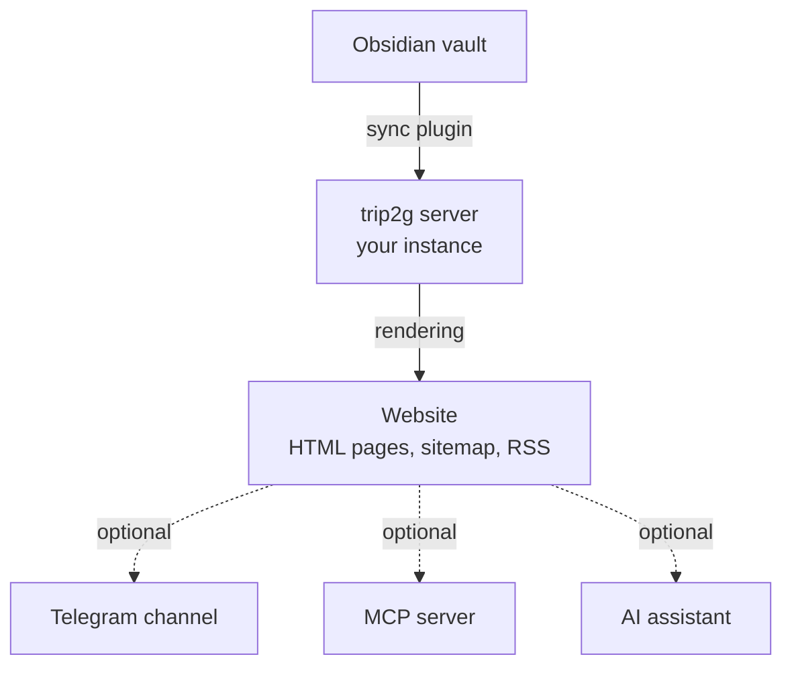
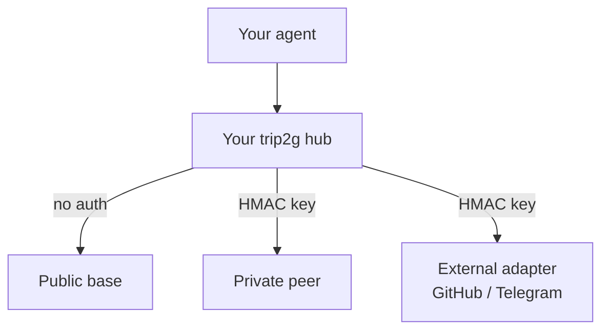

Your Obsidian vault becomes a website the moment you sync. That is the core of what trip2g does. Everything else — Telegram publishing, monetization, AI assistant, federation — is the same system running in a wider context.

This page explains the full end-to-end picture: what happens to a note from the moment you write it to the moment a reader or AI agent reads it.

## The pipeline



Each stage is independent. You can stop at "website" and never touch Telegram or AI. Or you can use all of it.

## Stage 1: writing in Obsidian

You write notes normally. The only trip2g-specific thing is frontmatter — YAML at the top of each file:

```yaml
---
title: "My note"
free: true
---
```

`free: true` makes the note visible to anyone, including anonymous visitors. Without it, visibility depends on who is reading:

| Frontmatter | Anonymous | Subscriber | Admin |
|-------------|-----------|------------|-------|
| `free: true` | ✓ | ✓ | ✓ |
| _(none)_ | ✗ | ✓ | ✓ |
| `subgraphs: tier-name` | ✗ | only if subscribed to `tier-name` | ✓ |

A note with no `free:` and no `subgraphs:` is "general knowledge" — hidden from anonymous visitors but readable by any authenticated subscriber. To restrict a note to a specific tier, use `subgraphs:`. Admins always see everything.

No other changes to your writing workflow are required.

Wikilinks (`[[Other note]]`) work as internal links on the published site. trip2g resolves them by filename, so you can reorganize folders without breaking links.

## Stage 2: sync

The trip2g Obsidian plugin uploads notes from your vault to your instance. You press Sync, or it runs automatically. The plugin sends only changed files — full vault on the first sync, then incremental diffs.

What gets uploaded:
- Note text and frontmatter
- Attachments (images, PDFs, audio)
- Folder structure

What stays local:
- Obsidian settings and plugins
- Any vault files outside your configured sync folder

## Stage 3: rendering

On the server, each note goes through a rendering pipeline:

1. **Frontmatter is parsed** — title, visibility, layout, Telegram settings, MCP flags
2. **Markdown is converted to HTML** — including wikilinks, embeds, callouts, and code blocks
3. **Wikilinks are resolved** — `[[Note name]]` becomes a clickable link to the correct page
4. **The template is applied** — header, sidebar, footer, and page layout as configured
5. **Search index is updated** — full-text and vector index for the AI assistant

The result is a standard HTML page served at a stable URL. The URL is derived from the note filename, or from a `slug` property in the frontmatter if you want a custom path.

## Stage 4: the website

Your site is a fully functional website:

- Each note is an HTML page at a stable URL
- Navigation comes from your `_header`, `_sidebar`, and `_footer` notes
- The home page is `_index.md`
- Sitemap and RSS feed are generated automatically
- Full-text search is built in

Readers access the site with a browser. Notes marked `free: true` are publicly accessible. Notes without that flag are behind login — visible only to subscribers, or to you as admin, depending on your access settings.

## Stage 5: Telegram (optional)

Publishing to a Telegram channel is controlled by frontmatter properties on each note:

```yaml
---
tg_post: true
tg_date: 2025-12-01 09:00
---
```

trip2g converts the note's content to Telegram-formatted text and sends it to your configured channel at the scheduled time. Images, videos, and audio in the note become media attachments in the post.

You write in Obsidian. trip2g handles the conversion and scheduling.

See [[en/user/telegram|Telegram publishing]] for formatting details and scheduling options.

## Stage 6: AI assistant via MCP (optional)

Every trip2g instance exposes an MCP (Model Context Protocol) endpoint at `/_system/mcp`. Any MCP-compatible AI client — Claude Desktop, Cursor, Claude Code, GitHub Copilot — can connect to it.

When a reader or agent asks a question:

1. The MCP server runs a vector search across your notes
2. Returns the most relevant notes, with section-level location data
3. The AI client composes an answer grounded in your content
4. Sources are cited with links back to your site

You control what the AI knows and how it behaves through two special note types:

- A note with `mcp_method: instructions` sets the AI's behavior rules
- A note with `mcp_method: schema` describes how your knowledge is organized

The AI assistant answers only from your published notes. It has no access to external sources unless you configure federation.

See [[en/user/mcp|MCP Server]] for setup details.

## The knowledge base node

A single trip2g instance is more than a website. It is a **knowledge base node**: content, a search index, AI instructions, access control, and a machine-readable interface — all in one.

Each node can be:

- **Public** — open to any reader or agent
- **Private** — access-controlled, for a team or paying subscribers
- **Personal** — your private notes, accessible only to your own AI agent
- **Paid** — content sold through Patreon or Boosty subscriptions

Agents interact with a node through a consistent set of MCP methods regardless of what the node contains:

| Method | What it does |
|--------|-------------|
| `search(query)` | Vector search across notes |
| `note_html(note_id)` | Full note or a specific section |
| `similar(note_id)` | Notes related to a given note |
| `instructions()` | Author-defined AI behavior rules |
| `schema()` | Structure of the knowledge base |

## Federation: connecting nodes (optional)

Multiple trip2g instances can be connected into a mesh. Your AI agent points at your own hub; from there it can transparently search peer bases — public references, private team wikis, external adapters for GitHub or Telegram — through a single `federated_search` call.



Each peer base keeps its own access control. You can give a colleague access to one subgraph of your notes without exposing everything else.

See [[en/user/federation|MCP Federation]] for setup instructions.

## Summary

| What you do | What trip2g does |
|-------------|-----------------|
| Write a note in Obsidian | Nothing yet |
| Press Sync | Uploads changed notes to your instance |
| Add `free: true` | Makes the note publicly readable |
| Add `tg_post: true` + a date | Schedules a Telegram post |
| Add `mcp_method: instructions` | Sets AI assistant behavior |
| Create a KB-note with `mcp_federation_kb_url` | Registers a peer base for federation |

The website is the foundation. Telegram, AI, and federation are channels that run on top of the same notes you already write.
