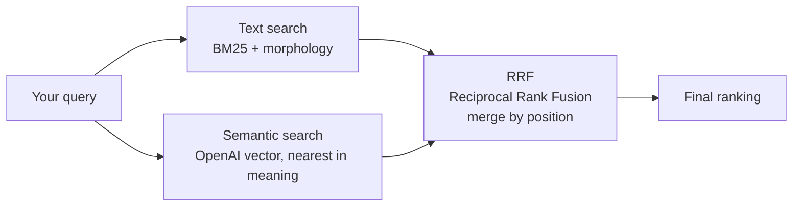
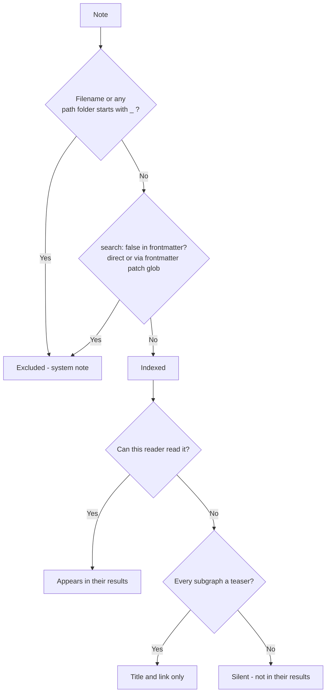

When you type a query, the system runs two independent algorithms simultaneously.

**Text search** finds notes that contain all the words from your query. Russian morphology is handled correctly: "tired" and "tiring" are treated as the same word. Technically this is a BM25 index with a morphological analyzer.

**Semantic search** works differently. Each note is pre-encoded by an OpenAI neural network into a numerical vector — a coordinate in a space of meanings. Your query is encoded the same way, and the system finds notes whose vectors are closest in meaning. This lets you find content where the exact words may not appear, but the topic matches.

The final ranking is built with RRF (Reciprocal Rank Fusion): results from both searches are merged by their positions in each list. This is a standard academic method for hybrid search, robust to differences in scoring scales.



### What this means in practice

- Searching "deploy docs automatically" can surface notes about CI/CD pipelines even if those exact words aren't there
- Short queries with common words still work because text search anchors the results
- Both Russian and English content is indexed; semantic search works across languages

### Notes the searcher cannot read

Search results are per-reader. A note the searcher has no access to — behind a paywall, in a subgraph they were never granted — is **not in their results at all**: no title, no address, no "closed" row. As far as that search is concerned, the note does not exist.

The one exception is a subgraph marked **Teaser**. Its closed notes come back into the results by title and link, with the body replaced by "Закрытый материал.", sorted below everything the reader can actually read. Following the link still lands on the paywall. See [[en/user/subgraphs#teaser_subgraphs|Teaser subgraphs]] for the flag and the rule that decides it when a note sits in several subgraphs.

This is a per-reader filter, not an index rule: the note stays indexed, and a reader with access finds it normally.

### Excluding notes from search

Some notes are excluded from search for everyone, whatever their access:

- Notes whose filename or any folder in the path starts with `_` (for example `_footer.md` or `_layouts/base.md`) are treated as system notes and never appear in search results.

To hide any other note, add `search: false` to its frontmatter:

```yaml
---
search: false
---
```

To exclude a whole section at once, use [[en/user/frontmatter-patches|frontmatter patches]]. For example, to hide all developer docs from search:

```yaml
# frontmatter-patches.yaml
- glob: "dev/**/*.md"
  patch:
    search: false
```



### MCP server search

The [[en/user/mcp|MCP server]] uses the same semantic search to let AI assistants query your knowledge base. The `search(query)` method runs a vector search and returns the most relevant notes.
