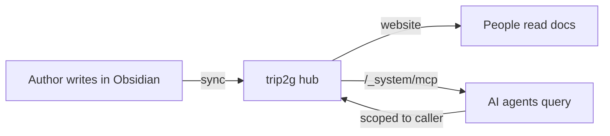

Give your team one knowledge base that people read as a website and agents query over MCP, from the same notes. Authors write in Obsidian, the base is served on your own server, and access is scoped per subscriber so an agent only sees what its caller is allowed to see. No copy of the docs is shipped to a vendor.

### The problem: AI hallucinates your company's facts

An assistant that does not know your internal docs will confidently invent policy, pricing, and process. That is not hypothetical, companies have been held to answers their chatbots made up. The fix is grounding: the agent must answer from your actual knowledge base, not from its training data.

Most teams try to bolt that on with two disconnected systems: a wiki humans edit, and a separate RAG pipeline that ingests a stale export of it into a vector store the AI queries. The pipeline drifts. The AI answers from last month's docs. And the permissions model from the wiki rarely survives the copy, so the agent can surface a page a given user should never see.

trip2g removes the second system. The notes your team edits *are* the thing the agent queries. There is no export step and no separate index to keep in sync, because search is built into the same server that serves the pages.

### MCP vs RAG vs file upload

Three common ways to give an agent your docs, and when each fits:

| Approach | What it is | Freshness | Access control | Best when |
|---|---|---|---|---|
| File upload | Paste or attach docs into the chat | Frozen at upload | None | A one-off question over a few files |
| Custom RAG pipeline | Export docs, embed into a vector DB, wire retrieval | Drifts unless re-indexed | You rebuild it | You need a bespoke retrieval stack |
| MCP server | The agent calls tools on the live KB | Always current | Enforced by the KB | An ongoing team KB the agent should always reflect |

trip2g is the MCP-server row: the agent queries the live base, and the base's own permissions apply.

### Which knowledge base

If your team already lives in Notion or Confluence, their MCP connectors are the path of least resistance, concede that. trip2g fits the team that wants a self-hosted base authored in Obsidian, with the same notes served to people and agents:

| KB | Hosting | Authoring | MCP access | Freshness |
|---|---|---|---|---|
| Notion | SaaS | web editor | official connector | live |
| Confluence | SaaS or self-hosted | web editor | official connector | live |
| Obsidian vault via trip2g | self-hosted | Obsidian | built in (`/_system/mcp`) | live via sync |
| Custom docs + RAG | yours | anything | you build it | you maintain it |

### How it works

An agent connects to one MCP URL and gets a small set of tools: `search` (hybrid full-text plus semantic), `note_html` to read a note or a single section, `similar`, and `instructions` the author defines. Access follows the caller's subscription, so an agent authenticated as a given teammate sees exactly that teammate's notes. The full tool reference is in [[en/user/mcp|MCP server]].

### Why the same notes for humans and agents matters

- **No drift.** Edit a note, and the next agent query sees the new text. No re-index job.
- **One permission model.** Subgraph and subscription ACLs govern both the website and MCP. You do not maintain access rules twice.
- **Auditable memory.** The knowledge is plain markdown with version history and a git mirror. You can read, diff, and correct what the agent knows.
- **Token-efficient reads.** Agents drill down with `search` then `expand` then a section read, instead of dumping whole notes. See [[en/user/token-economy-bench|the token-economy benchmark]].

### Set it up

1. Get an instance. Self-host with the [[en/user/selfhosted|single binary or Docker Compose]] so the base stays inside your infrastructure.
2. Put the docs in Obsidian and sync. Follow [[en/user/getting-started|Getting started]]. Existing markdown docs drop straight in.
3. Set access. Organize notes into subgraphs and grant team members access; anything not marked `free: true` stays private. Provisioning subscribers and admins can be scripted, see [[en/user/user_management|Managing users via GraphQL]].
4. Write an agent instruction note. A note with `mcp_method: instructions` tells the agent how to answer from your base. Example in [[en/user/mcp|MCP server]].
5. Enable the MCP server in site settings, then point each teammate's client (Claude Code, Claude Desktop, Cursor, Copilot, Gemini CLI) at `https://your-hub/_system/mcp`.
6. Verify. Have the agent call `search` for a term you know is in the docs, then read the returned note. If it answers with a citation, it is wired correctly.

### Access control, concretely

The concern with any AI-over-docs setup is a permissions leak. Here access is not bolted on:

- A regular user's token sees only notes in subgraphs they are subscribed to.
- Notes in a paid or private subgraph do not even appear in the agent's `tools/list`, so a premium persona can be gated behind a subscription.
- Personal access tokens inherit the person's access and nothing more. Revoking a token cuts access within seconds.

The token and access-level details are in [[en/user/mcp|MCP server]].

### Scale across teams with federation

If two teams each run a hub, you can [[en/user/federation|federate]] them: one agent query fans out across both bases without merging the systems or sharing raw storage. Each hub still enforces its own access per base. That covers the "company plus per-team hubs" and "two orgs, one bridge" shapes without a central data lake.

### Honest tradeoffs

- **You run the server.** A hosted wiki with an AI add-on needs no ops. trip2g is one Go binary on SQLite, but it is still yours to run or rent.
- **Authors write in markdown.** If your team will only use a WYSIWYG web editor, that is a real adoption cost. The upside is that docs stay portable files.
- **Semantic search needs an embeddings key.** Full-text works out of the box; vector search wants an OpenAI-compatible endpoint (see [[en/user/selfhosted|self-hosted setup]]).

Pick this when you want your internal docs to be both readable and directly queryable by the team's agents, on infrastructure you control, without a second RAG stack to babysit.

### Related

- [[en/user/mcp|MCP server]] — tools, access control, tokens, custom methods
- [[en/user/federation|MCP Federation]] — fan one query across peer hubs
- [[en/user/user_management|Managing users via GraphQL]] — provision teammates and subscriptions from a script
- [[en/user/selfhosted|Self-hosted]] — run the whole stack inside your infrastructure
- [[en/user/token-economy-bench|Token-economy benchmark]] — why section reads cut agent cost
