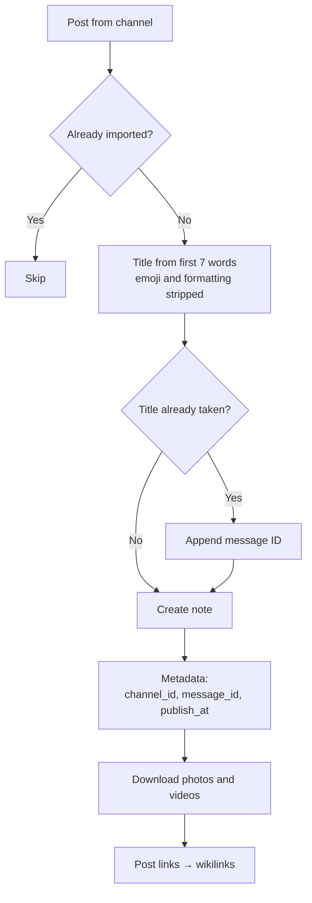

trip2g can import posts from a Telegram channel and turn each one into an Obsidian note. Run the import once to pull in your entire channel archive, then run it again later to pick up new posts — already-imported posts are skipped automatically.

### What gets imported

**Text:**
- Formatting is preserved: bold, italic, links
- Custom emoji are converted to Obsidian-compatible format

**Media:**
- Photos are downloaded and attached to the note
- Videos are downloaded and added as links

**Links between posts:**
- Links to other posts in the channel become wikilinks
- This works in both directions — a post can link to a later post and the link still resolves

### How it works

**Note title:**
The title comes from the first 7 words of the post. Emoji and markdown formatting are stripped. If another post produces the same title, the message ID is appended to make it unique.

**Metadata written to each note:**
- `telegram_publish_channel_id` — channel ID
- `telegram_publish_message_id` — message ID
- `telegram_publish_at` — original publish date

**Running the import multiple times:**
- Posts already present in the vault are skipped
- If you delete a note, re-running the import recreates it
- New posts added to the channel since the last import are imported on the next run

### Limitations

- Import requires a connected Telegram account with access to the channel
- Importing a large channel takes time — the process runs in the background

### Related

- [[en/user/telegram|Telegram publishing]] — publish notes from Obsidian to a channel
- [[en/user/telegram-emoji|Custom emoji]] — how custom emoji are stored and rendered
