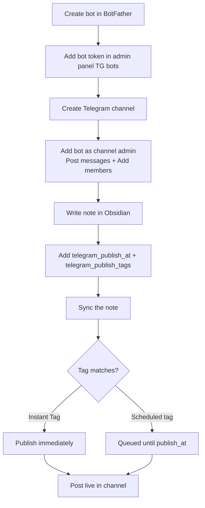
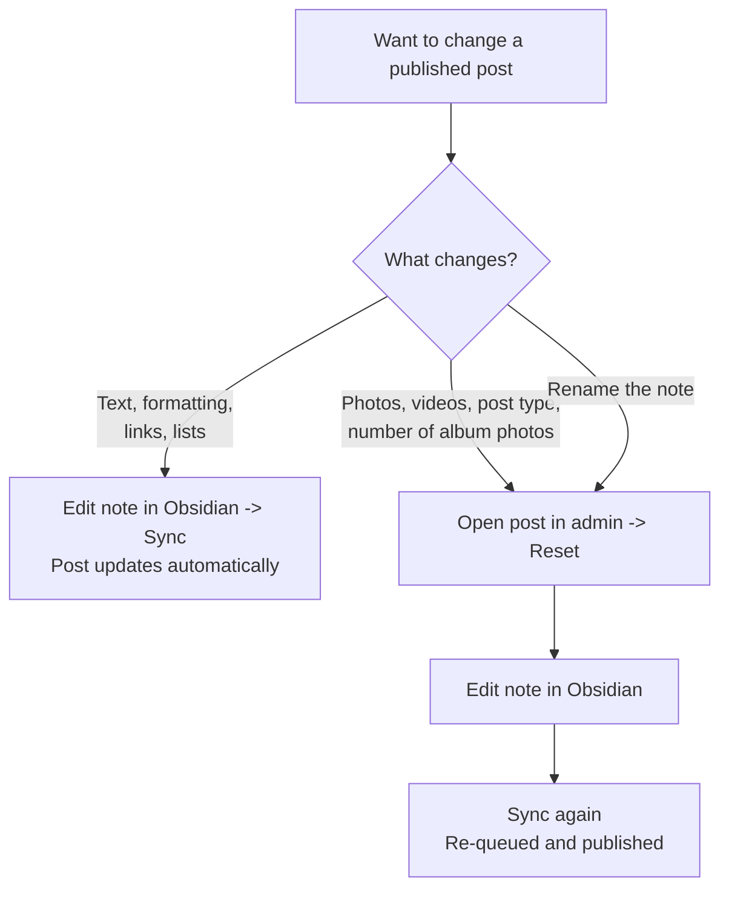

Write posts in Obsidian, publish to your Telegram channel on a schedule or instantly.

### How publishing works



### Set up a bot

**Create the bot:**

1. Open [@BotFather](https://telegram.me/BotFather) in Telegram
2. Send the command `/newbot`
3. Enter a display name for the bot
4. Enter a username ending in `_bot` (e.g. `myposts_bot`)
5. Copy the token — keep it private

**Add the bot to the admin panel:**

1. Open the admin panel
2. Go to **TG bots**
3. Click **+ Add**
4. Paste the token into the Token field
5. Enter a description, e.g. "Main bot"
6. The system will verify the token and show the bot's name
7. Refresh the page to see the bot in the list

### Connect a Telegram channel

**Create a channel** (public or private — either works).

**Add the bot as admin:**

1. Open the channel settings → Administrators
2. Add your bot
3. Grant two permissions only:
   - Post messages
   - Add members

Note: the "Add members" permission is currently required for the bot to connect. This is a known limitation that will be fixed.

If the channel does not appear in the admin panel, remove the bot from the channel and re-add it with the correct permissions.

### Schedule a post

Add two properties to a note, then sync:

**telegram_publish_at** — type must be **Date & time** (not plain Date)

```yaml
telegram_publish_at: 2025-01-15T09:00
```

**telegram_publish_tags** — type must be **List**

```yaml
telegram_publish_tags:
  - My channel
```

The system matches these tags to channels configured in the admin panel. A note publishes to every channel whose tags overlap.

Sync the note after adding the properties. The post will appear in the queue.

Set the tags before the first publish. Adding a tag to a note that is already published does not deliver it to the newly matched channel — publish state is tracked per note, not per channel. To reach the extra channel, open admin panel → **Telegram posts** → the post → Sent tab → **Reset**, then sync again. Reset deletes the post from every channel it already reached and re-sends it with new message IDs, so links to the old post break.

### Preview a post instantly

Instant Tags exist for one job: see the finished post in a channel of your own before your readers see it. Give a private test channel an Instant Tag, and a note carrying that tag arrives there the moment you sync it, without waiting for the schedule.

1. Open the admin panel → your bot
2. Find the section **Publish to this groups**
3. In the **Instant Tags** field, select the tags

Notes with those tags publish to that channel as soon as they are synced.

What to expect:

- The note still needs both `telegram_publish_at` and `telegram_publish_tags`. Instant Tags change when a note is delivered, not whether it needs a date. A note missing either property is skipped.
- Every sync of a changed note sends a new message to the test channel, and the earlier ones stay. Instant posts are never edited, so you get a fresh render each time — including media, which Telegram does not let an edit replace.
- The preview does not use up the schedule. The note stays unpublished, and the real post goes out at its own time.

Without Instant Tags: copy the note, give the copy a tag that only the test channel uses, and set its `telegram_publish_at` to a time in the past — yesterday's date is enough. The copy goes out on the next scheduler run. Nothing to configure, but the copy is a real note — it gets its own page on the site, and you keep the two versions in sync by hand.

### Check post status

Go to admin panel → **Telegram posts**.

- Date in the past → post already sent
- Date in the future → post is queued

Click a queued post to send it immediately. Click a sent post → open the Sent tab → click **Reset** to delete it from the channel and re-queue it.

### Editing published posts

After a post is published, sync an updated note and the post updates in the channel automatically.



**What can be edited:**

- Text content
- Formatting (bold, italic, code)
- Links and lists

**What cannot be changed:**

- Photos and videos — Telegram freezes media after publication
- Post type — you cannot add media to a text post or remove media from a photo post
- Number of photos in an album

To change media or post type: go to admin panel → find the post → click **Reset** → edit the note in Obsidian → sync again.

**Renaming notes:** The system identifies posts by file path and name. Renaming a note creates a second post. If you must rename a published note, reset it first, rename, then sync.

### Post types and limits

The system determines post type from the note's content automatically:

| Post type | Condition | Text limit |
|-----------|-----------|------------|
| Text post | No media in note | 4,096 characters |
| Photo post | 1 media file | 1,024 characters (caption) |
| Album | 2–10 media files | 1,024 characters (caption) |

The limit is measured on visible text — formatting tags are not counted. If the limit is exceeded, the post will not publish and a warning appears in the admin panel.

If a note has more than 10 media files, the system uses the first 10.

### Formatting in posts

Write in Markdown — the service converts it to Telegram formatting.

| Element | Syntax |
|---------|--------|
| Bold | `**bold**` |
| Italic | `*italic*` |
| Bold italic | `***bold italic***` |
| Strikethrough | `~~strikethrough~~` |
| Inline code | `` `code` `` |
| Underline | `<u>underline</u>` |
| Spoiler | `==spoiler==` |
| Code block | ` ```python ... ``` ` |
| Blockquote | `> quote` |
| Collapsible blockquote | `> quote||` |
| Link | `[text](https://example.com)` |
| Wikilink to published note | `[[note-name]]` → becomes a link |
| Wikilink to unpublished note | `[[note-name]]` → becomes underlined text |

When a wikilink points to an unpublished note that has a scheduled `telegram_publish_at`, the system appends a "Coming soon" block to the post automatically.

**What is not supported:**

- Tables
- Nested lists
- Regular images embedded in text (use media attachments instead)
- Unknown HTML tags (only `<u>` is supported)

Notes containing unsupported elements will not publish. A warning appears in the admin panel post list.

### Scheduling tips

- Write a week of posts in advance, set dates, sync once — they publish automatically at the scheduled times
- Keep posts in a dedicated folder to avoid accidentally renaming published notes
- Always preview in a test channel before publishing to your main channel

### Related

- [[en/user/publishing]] — property types and how to use `telegram_publish_at` and `telegram_publish_tags` correctly
- [[en/user/telegram-access]] — link a group to a subgraph: members read gated notes, subscribers join the group
- [[en/user/monetization]] — gate content by Telegram group membership or third-party subscriptions
