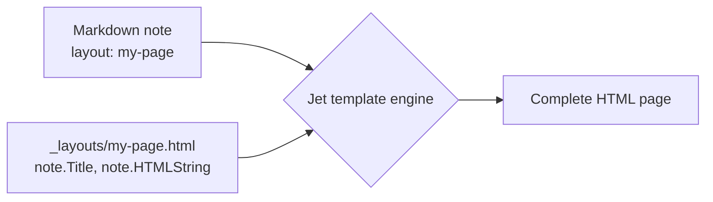

Templates control how your notes look — sidebar, header, footer, and layout.

A template is an HTML file stored in `_layouts/`. It receives the note's content and frontmatter, then produces a complete page. Your markdown stays clean; the template decides how it's presented.

> **Recommended structure:** build custom layouts from components: one `block` per file, called with `yield`, named with `@lid`, styled with BEM and imported automatically. See [[en/user/components|Components, auto-import and best practices]].

> **See one in action:** [[instaframes/_index|Instagram frames]] is a ready-made template that turns a markdown file into downloadable carousel images — a full example of a custom layout doing real work.

### How templates work

**Step 1.** Create a file in `_layouts/`, for example `_layouts/my-page.html`:

```jet
<!DOCTYPE html>
<html>
<head>
  <title>{{ note.Title() }}</title>
</head>
<body>
  <h1>{{ note.Title() }}</h1>
  {{ note.HTMLString() }}
</body>
</html>
```

**Step 2.** Assign the template in your note's frontmatter:

```yaml
---
layout: my-page
title: My page
---

Page content in markdown.
```

The page now uses your template.



### Default template layout properties

The built-in default template supports these frontmatter keys — no custom HTML required:

| Key | Purpose |
|-----|---------|
| `header: [[Navigation]]` | Note to use as site header (logo + nav) |
| `footer: [[Footer]]` | Note to use as site footer |
| `left_sidebar: [TOC, inlinks]` | Left sidebar widgets |
| `right_sidebar: [outlinks]` | Right sidebar widgets |
| `content: [selfcontent, magazine]` | Content blocks rendered in order |
| `magazine_include_property: featured` | Only show notes that have this frontmatter key |
| `magazine_sort_property: priority` | Sort magazine cards by this frontmatter key |
| `magazine_include_files: "posts/**/*.md"` | Glob pattern for magazine notes |

Set any sidebar to `false` to hide it. Set `left_sidebar: null` (or omit) for no sidebar.

#### Available sidebar widgets

- `TOC` — table of contents (JavaScript-enhanced, tracks active heading)
- `inlinks` / `Backlinks` — notes that link to this note
- `outlinks` — links from this note
- `[[Title]]` — embed another note by title
- `path/to/file.md` — embed a note by file path

#### Content block types

- `selfcontent` (or `self`) — this note's own article with `<h1>` + body
- `magazine` — multi-tier card layout (featured, grid, list)
- `[[Title]]` — embed a note by title
- `path/to/file.md` — embed a note by file path

### Magazine layout

The magazine layout shows child notes as cards in three tiers:

| Tier | Position | Visual |
|------|----------|--------|
| Featured | First note | Large full-width card |
| Grid | Notes 2–5 | Smaller cards, 4-column |
| List | Notes 6+ | Minimal, vertical list |

Activate it on an index note:

```yaml
---
content:
  - magazine
magazine_sort_property: priority
magazine_include_files: "posts/**/*.md"
---
```

### Header and footer from markdown

The header and footer are ordinary notes. The default template reads:
- **Logo** — the first image in the header note
- **Navigation** — the first list in the header note
- **Footer columns** — a nested list (top-level items become column headings)

Example header note `_nav.md`:

```markdown
---
title: Navigation
---


- [Home](/)
- [Docs](/docs)
  - [Getting started](/docs/start)
  - [Templates](/docs/templates)
- [About](/about)
```

Then reference it from any note:

```yaml
header: [[_nav]]
```

### Sidebar from a markdown file

Store navigation in a separate markdown file so you can update it without touching the template:

```markdown
---
title: Sidebar
---

### Section 1

- [Page 1](/docs/page-1)
- [Page 2](/docs/page-2)
```

Reference it as a sidebar widget:

```yaml
left_sidebar:
  - _sidebar.md
```

### What's available in a custom template

The Jet template engine provides these variables:

```jet
{{ note.Title() }}          — title from frontmatter
{{ note.HTMLString() }}     — full content as HTML
{{ note.Permalink() }}      — page URL
{{ note.ReadingTime() }}    — reading time in minutes
{{ note.CreatedAt() }}      — creation date
{{ note.M().GetString("author", "Unknown") }}  — frontmatter field
```

Access other notes via `nvs`:

```jet
{{ if sidebar := nvs.ByPath("/_sidebar.md"); sidebar }}
  {{ sidebar.HTMLString() }}
{{ end }}
```

A lookup that finds nothing — `nvs.ByPath`, `nvs.ByPermalink`, `nvs.ByWikilink`, a query's `.First()` or `.Last()`, `PartialRenderer().Section(...)`, `FirstList()` — returns `nil`. Both `{{ if x }}` and `{{ if x == nil }}` test it. (Older versions returned a value that `{{ if x }}` treated as empty while `x == nil` was false; templates written with `{{ if x }}` keep working.) Calling a method on it, like `x.Title()`, stops the render with an error, so test first. The form above declares and tests in one step: see [[en/user/templates#Assignment in if (Go-style)|Assignment in if]].

Load assets:

```jet
<link rel="stylesheet" href="{{ asset("style.css") }}">
```

Include HTML injections from site settings (analytics scripts, custom `<head>` tags):

```jet
{{ range i, injection := htmlInjectionsHead }}{{ injection.Content | unsafe }}{{ end }}
```

```jet
{{ range i, injection := htmlInjectionsBodyEnd }}{{ injection.Content | unsafe }}{{ end }}
```

Place `htmlInjectionsHead` inside `<head>` and `htmlInjectionsBodyEnd` before `</body>`. This is how Google Analytics and other site-wide scripts reach custom Jet layouts.

> **Tip:** If you use a custom Jet layout, add both variables so scripts configured in Admin → HTML Injections are automatically included:
> ```jet
> <head>
>   ...
>   {{ range i, injection := htmlInjectionsHead }}{{ injection.Content | unsafe }}{{ end }}
> </head>
> <body>
>   ...
>   {{ range i, injection := htmlInjectionsBodyEnd }}{{ injection.Content | unsafe }}{{ end }}
> </body>
> ```

### SEO tags in a custom layout

The default template writes `<link rel="canonical">`, `og:url`, `hreflang` and `<meta name="robots">` for you. A custom layout writes none of them. The only thing trip2g adds on its own is the `X-Robots-Tag: noindex` HTTP header for notes with `noindex: true`.

`publicURL` holds the main domain's address. On a [[en/user/multidomains|custom domain]] it is still the main domain, so build the canonical from the note's route:

```jet
<head>
  {{ if note.M().GetBool("noindex", false) }}<meta name="robots" content="noindex">{{ end }}
  {{ canonicalRoute := note.M().GetString("route", "") }}
  {{ if canonicalRoute != "" }}
  <link rel="canonical" href="https://{{ canonicalRoute }}">
  {{ else }}
  <link rel="canonical" href="{{ publicURL }}{{ note.Permalink() }}">
  {{ end }}
</head>
```

Keep the `noindex` default at `false`. With `GetBool("noindex", true)` every page without the property is marked `noindex` and the whole site drops out of search, while the HTTP headers look clean. The snippet expects `route` to be a full `domain/path`; adapt it if you use `routes` or main-domain aliases.

### Splitting content into sections

`PartialRenderer` breaks a markdown note into logical blocks — useful for landing pages, FAQs, and card grids:

```jet
{{ intro := note.PartialRenderer().Introduce() }}
<p class="lead">{{ intro.ContentHTML }}</p>

{{ range i, s := note.PartialRenderer().Sections(3) }}
  <details>
    <summary>{{ s.TitleHTML }}</summary>
    {{ s.ContentHTML }}
  </details>
{{ end }}
```

- `Introduce()` — content before the first heading
- `Sections(level)` — sections under headings of a given level
- `Section("Title")` — a specific section by heading text or anchor
- `FirstList()`, `Lists()` — the note's top-level lists as data
- `Images()` — every image of the note
- `CodeBlocks("lang")` — fenced code blocks, all of them for `""`

A section has `ID` (the heading's anchor), `Level` (2 for `##`), `Title` (plain text), `TitleHTML`, `ContentHTML`, and its own `Sections(level)` and `Section(...)` for the headings inside it.

`Section(x)` tries three things in order and returns the first heading that matches:

1. the exact heading text: `Section("Getting Started")`;
2. the heading text ignoring case and extra spaces: `Section("getting  started")`;
3. the heading's anchor, with or without `#`: `Section("getting_started")`, `Section("#pricing")`.

A `#` in front makes the anchor lookup safe from step 1 and 2: no heading text starts with `#`, so `Section("#" + h.ID)` always finds the heading with that id. Without `#`, `Section("intro")` finds a heading titled "Intro" before a heading whose anchor is `intro`.

### Headings, anchors and your own table of contents {#own-toc}

How headings get their ids and how to set one with `{#id}` is described in [[en/user/markdown#heading-anchors|Markdown syntax]]. In a template, `note.TOC()` returns the headings the default table of contents would show: each has `Text`, `ID` and `Level`. `Level` here is relative: the note's top heading level is 1, the next one used is 2, and so on. It returns nothing when the `toc` frontmatter field hides the table of contents (or `auto` decides against it).

A table of contents where each entry also shows the first lines of its section:

```jet
{{ pr := note.PartialRenderer() }}
<nav class="toc">
  {{ range i, h := note.TOC() }}
    <a class="toc__item toc__item--{{ h.Level }}" href="#{{ h.ID }}">{{ h.Text }}</a>
  {{ end }}
</nav>

{{ range i, s := pr.Sections(2) }}
  <section id="{{ s.ID }}">
    <h2>{{ s.TitleHTML }}</h2>
    {{ s.ContentHTML }}
  </section>
{{ end }}
```

`TOC()` entries, `Section(...).ID` and the `id` on headings in `note.HTMLString()` are the same string, so links built from any of them land on the heading.

### Lists and tasks

`FirstList()` and `Lists()` return lists as data: each item has `Text`, `URL` (when the item is a link), `Children`, and two task fields:

| Item | `Task` | `TaskMark` |
|---|---|---|
| `- plain` | `""` | `""` |
| `- [ ] open` | `"todo"` | `" "` |
| `- [x] done` or `- [X] done` | `"done"` | `"x"` / `"X"` |
| `- [/] started`, `- [-] dropped`, `- [>] moved` | `"done"` | `"/"`, `"-"`, `">"` |

Any character other than a space counts as `done`, the way Obsidian shows such a box as checked. `TaskMark` keeps the character itself, so a template can tell Obsidian's custom statuses apart. The published page renders only `[ ]`, `[x]` and `[X]` as checkboxes; `- [/] started` shows on the page as the text "[/] started", while `Text` holds just "started".

```jet
{{ if list := note.PartialRenderer().FirstList(); list }}
  <ul class="tasks">
    {{ range i, item := list.Items }}
      <li class="tasks__item tasks__item--{{ item.Task }}" data-mark="{{ item.TaskMark }}">{{ item.Text }}</li>
    {{ end }}
  </ul>
{{ end }}
```

### Images

`Images()` returns every image of the note in document order: Markdown images `` and Obsidian embeds `![[photo.png]]`, with the same URL the page uses (an attachment resolves to its uploaded file). Each has `URL`, `Alt` and `Title`. A size like `|300` or `|300x200` is not part of `Alt`. Videos, audio, documents and YouTube embeds are not images and are left out.

A gallery:

```jet
<div class="gallery">
  {{ range i, img := note.PartialRenderer().Images() }}
    <figure>
      
      {{ if img.Title }}<figcaption>{{ img.Title }}</figcaption>{{ end }}
    </figure>
  {{ end }}
</div>
```

### Code blocks

`CodeBlocks("lang")` returns the fenced code blocks of that language, in document order, including the ones inside lists and callouts; `CodeBlocks("")` returns all of them. Each has:

- `Lang` — the first word after the opening fence (`mychart`);
- `Info` — the whole line after the fence (`mychart {"height": 300}`);
- `Content` — the code itself, as written;
- `HTML` — the block as the page renders it.

Together with `parseJSON` a code block becomes data for your own widget. The note:

````markdown
```mychart
{"labels": ["Q1", "Q2", "Q3"], "values": [3, 5, 8]}
```
````

The template:

```jet
{{ range i, b := note.PartialRenderer().CodeBlocks("mychart") }}
  {{ if d := parseJSON(b.Content); d }}
    <ul class="bars">
      {{ range j, label := d.labels }}
        <li style="--value: {{ d.values[j] }}">{{ label }}</li>
      {{ end }}
    </ul>
  {{ else }}
    {{ b.HTML }}
  {{ end }}
{{ end }}
```

The block still appears in `note.HTMLString()` as code. To show only your widget, render the sections yourself, or hide the code with CSS.

### Parsing data: parseJSON, parseYAML, parseCSV {#parse-data}

Three functions turn a string into data a template can loop over:

- `parseJSON(s)` — objects become maps (`d.title` or `d["title"]`), arrays become lists, numbers are floats;
- `parseYAML(s)` — the same for YAML;
- `parseCSV(s)` — a list of rows, each row a list of strings. Rows may have different lengths. The first row is not treated as a header.

On invalid input they return `nil` and write the error to the server log; the render goes on. Test the result before using it: `{{ if d := parseJSON(b.Content); d }} … {{ else }} fallback {{ end }}`.

They work as filters in an output tag, `{{ b.Content | parseJSON }}`, but Jet allows filters only there: an assignment, `if` or `range` needs the call form, `d := parseJSON(b.Content)`.

A table from a ` ```csv ` block:

```jet
{{ if b := note.PartialRenderer().CodeBlocks("csv"); len(b) > 0 }}
  {{ if rows := parseCSV(b[0].Content); rows }}
    <table>
      {{ range i, row := rows }}
        <tr>{{ range j, cell := row }}<td>{{ cell }}</td>{{ end }}</tr>
      {{ end }}
    </table>
  {{ end }}
{{ end }}
```

Values from a note are the note author's text, and layouts escape them on output: a title such as `Q&A <draft>` reaches the page as text, not as tags. HTML the note renders to (`HTMLString()`, `TitleHTML`, `ContentHTML`, a code block's `HTML`) is printed as is.

### Organizing multiple templates

The recommended way is a file per component, imported automatically: see [[en/user/components|Components, auto-import and best practices]]. A single `blocks.html` with an explicit import also works.

For sites with shared header, footer, and styles, use a `blocks.html` file:

```
_layouts/
└── my-theme/
    ├── blocks.html   — shared header, footer, wrapper
    ├── page.html     — standard article page
    └── landing.html  — landing page
```

`blocks.html` defines reusable blocks; `page.html` imports and uses them:

```jet
{{ import "blocks" }}

{{ yield main_layout() content }}
  <article class="prose">
    <h1>{{ note.Title() }}</h1>
    {{ note.HTMLString() }}
  </article>
{{ end }}
```

### Assets across layout files

`asset()` looks up URLs in a single table that merges assets from every layout file. So a block defined in `cases.html` can call `asset("topo.svg")` and still resolve correctly when the page is rendered through `index.html` (for example via `yield`).

Keys are absolute paths (`_layouts/mesh/topo.svg`), so there are no collisions between layouts.

The engine walks `import` and yield chains to discover `asset()` calls automatically. If a dependency hides in a non-obvious place, hint the discovery walker with a comment:

```jet
{{ import "blocks" }}

<!-- {{ asset("style.css") }} -->

{{ yield main_layout() content }}
  ...
{{ end }}
```

The HTML comment stays in the page source (with the resolved URL inside), but visitors don't see it. The dependency is guaranteed to be picked up.

### Jet template syntax

Templates use the [Jet](https://github.com/CloudyKit/jet) engine:

```jet
{{ variable }}                        — output
{{ if condition }}...{{ end }}        — conditional
{{ range i, item := list }}...{{ end }} — loop (always capture both index and value)
{{ block name() }}...{{ end }}        — define a block
{{ yield name() }}                    — call a block
{{ include "path" data }}             — include a partial
{{ x := exec("lib/name", data) }}     — run another layout file, take the value it returns
{{ try }}...{{ catch err }}...{{ end }} — render a fallback if the inner part fails
{{ value | unsafe }}                  — output a string without escaping
{{ d := parseJSON(text) }}            — parse JSON, YAML or CSV into data
```

`parseJSON`, `parseYAML` and `parseCSV` are described in [[en/user/templates#parse-data|Parsing data]]. Every function and filter, including what trip2g adds, is in the [[en/user/jet-functions|Jet functions reference]].

Three Jet rules to remember:

1. Block parameters need default values or named arguments won't bind: `{{ block card(title="", body="") }}`
2. `content` is a reserved keyword — don't use it as a parameter name
3. **Single-variable range iterates indices, not values.** `{{ range item := list }}` gives `item = 0, 1, 2…` (the index). To get values, always use two variables: `{{ range i, item := list }}`, or `{{ range _, item := list }}` when you don't need the index

### Data from another layout: exec and return

`exec("path", data)` runs another layout file and gives you the value that file `return`s. Whatever the file prints is thrown away — only the returned value comes back. Inside the file, `data` is available as `.`, and the page's variables (`note`, `nvs`, …) work as usual.

Use it for **data**, not markup. A component (`{{ block }}` + `{{ yield }}`) produces HTML; an exec'd file produces a list, a map or a number that the caller then renders its own way. The typical case is a selection rule you want to define once: which notes are "featured" in a section, or what a section's stats are. Several layouts call the file, so the rule lives in one place.

**Featured notes, defined once.** `_layouts/lib/featured.html`:

```jet
{{ return nvs.ByGlob(. + "/*.md").Public().SortByMeta("order").Limit(3).All() }}
```

Any layout or page can now ask for a section's featured notes:

```jet
<ul class="featured">
{{ range _, post := exec("lib/featured", "blog") }}
  <li><a href="{{ post.Permalink() }}">{{ post.Title() }}</a></li>
{{ end }}
</ul>
```

Changing what "featured" means — a different sort, five instead of three, only notes with some frontmatter flag — is one edit in `lib/featured.html`.

**Section stats as a map.** `_layouts/lib/section_stats.html`:

```jet
{{ notes := nvs.ByGlob(. + "/*.md").Public().All() }}
{{ minutes := 0 }}
{{ range _, n := notes }}{{ minutes = minutes + n.ReadingTime() }}{{ end }}
{{ return map("count", len(notes), "minutes", minutes) }}
```

```jet
{{ stats := exec("lib/section_stats", "blog") }}
<p>{{ stats["count"] }} posts, {{ stats["minutes"] }} min of reading</p>
```

Rules worth knowing:

- **The path starts at `_layouts/` and has no extension.** `exec("lib/featured")` and `exec("/lib/featured")` both load `_layouts/lib/featured.html`, from whichever folder the caller lives in. `exec("lib/featured.html")` is *not found*. Only `.html` and `.html.json` files under `_layouts/` are layout files.
- **A missing file fails the render** with `template /lib/featured could not be found`. Wrap the call in `try` (below) if the page should survive it.
- **`return` only means something in an exec'd file.** In a page that is rendered normally it stops nothing and its value is not printed.
- **Components inside an exec'd file need an explicit import.** Auto-import covers the page itself; a file reached through `exec`, `include` or `extends` must `{{ import "/path/to/component" }}` the components it yields.
- **Each call runs the file.** `exec` is not cached: calling `lib/section_stats` in a loop over twenty sections runs twenty full queries on every render. For a value that depends only on the note itself, frontmatter is cheaper; for heavy computation across many notes, a Go helper is the better place.

### Isolating failures: try and catch

`{{ try }}…{{ catch err }}…{{ end }}` renders the inner part, and if anything in it fails, throws that output away and renders the `catch` part instead. The rest of the page renders normally. Without `catch`, a failed `try` renders nothing.

Use it around a widget whose input you don't control, so one bad note shows a fallback instead of an error page.

**A chart widget built from frontmatter.** If `chart` is missing or malformed, the reader sees a small card, not a broken page:

```jet
{{ try }}
  {{ chart := note.M().Get("chart") }}
  <figure class="chart">
    <figcaption>{{ chart["title"] }}</figcaption>
    {{ range _, v := chart["values"] }}<span class="bar" style="--v: {{ v }}"></span>{{ end }}
  </figure>
{{ catch err }}
  <div class="chart chart--broken">Chart unavailable: {{ err.Error() | html }}</div>
{{ end }}
```

**An optional related note.** The frontmatter field `related` may point to a note that was renamed or deleted. If the lookup or any call on it fails, the aside simply isn't there:

```jet
{{ try }}
  {{ related := nvs.ByPath(note.M().GetString("related", "")) }}
  <aside class="related">See also: <a href="{{ related.Permalink() }}">{{ related.Title() }}</a></aside>
{{ end }}
```

**A stats line from a helper file.** If `lib/section_stats` breaks, visitors see nothing and the site admin sees why:

```jet
{{ try }}
  {{ stats := exec("lib/section_stats", "blog") }}
  <p>{{ stats["count"] }} posts, {{ stats["minutes"] }} min of reading</p>
{{ catch err }}
  {{ if currentUser.IsAdmin() }}<p class="admin-error">lib/section_stats: {{ err.Error() | html }}</p>{{ end }}
{{ end }}
```

Things to keep in mind:

- **`catch` is for fallbacks, not for hiding bugs.** A `try` around half the page turns every mistake into silence. Wrap the smallest part that can legitimately fail, and show the error to admins (as above) so a broken widget gets noticed. Using `currentUser` makes the page personalized, so it is not served from the anonymous page cache.
- **Escape the message.** `err.Error()` can contain text from a note or a URL; pipe it through `html`. The filter escapes exactly once whether or not layout output is escaped by default.
- **`try` does not catch a layout that fails to load.** A syntax error or an `extends` in the wrong place stops the layout before anything renders; that shows up as a layout warning, not as a `catch`.

### Assignment in if (Go-style)

`if` can declare a variable and test it in one tag, like Go's `if x := f(); cond`:

```jet
{{ if name := expression; condition }}
  ...
{{ else }}
  ...
{{ end }}
```

The variable exists only inside this `if`, its `else if` branches and its `else`. After `{{ end }}` it is gone: using it there stops the render with `identifier "name" not available in current … scope`. A variable of the same name declared before the `if` is shadowed inside it and keeps its value after.

The usual case is a note that may not exist:

```jet
{{ if about := nvs.ByPermalink("/about"); about }}
  <a href="{{ about.Permalink() }}">{{ about.Title() }}</a>
{{ else }}
  <span>About page is not published yet</span>
{{ end }}
```

The condition can be any expression, not only the variable:

```jet
{{ if subtitle := note.M().GetString("subtitle", ""); subtitle != "" }}
  <p class="subtitle">{{ subtitle }}</p>
{{ else }}
  <p class="subtitle">{{ note.Title() }}</p>
{{ end }}

{{ if latest := nvs.ByGlob("blog/*.md").SortBy("CreatedAt").Desc().First(); latest }}
  Latest post: <a href="{{ latest.Permalink() }}">{{ latest.Title() }}</a>
{{ end }}

{{ if faq := note.PartialRenderer().Section("FAQ"); faq }}
  {{ faq.ContentHTML }}
{{ end }}
```

Each `else if` can declare its own variable, and still sees the ones declared before it:

```jet
{{ if header := nvs.ByPath("/blog/_header.md"); header }}
  {{ header.HTMLString() }}
{{ else if fallback := nvs.ByPath("/_header.md"); fallback }}
  {{ fallback.HTMLString() }}
{{ end }}
```

Two-value forms work too: `{{ if value, ok := someMap["key"]; ok }}`.

With `=` instead of `:=` the tag assigns a variable declared earlier, and the new value stays after `{{ end }}`.

**`range` is different.** `{{ range i, post := list }}` also declares variables scoped to the loop, but it takes no `; condition` — `{{ range p := list; p }}` is a parse error. The variables are the loop index and element, not the result of an expression: with one variable over a list you get the index. `{{ range … }}{{ else }}…{{ end }}` runs the `else` when the list is empty.

### Debugging templates

**`debug(value)`** — prints Go type, value, and available methods of any expression:

```jet
{{ debug(note.M()) }}
{* → *templateviews.Meta: &{raw:map[title:My Page extra_content:[a b]]}
      methods: [Debug Get GetBool GetInt GetString GetStrings Has Raw] *}

{{ debug(note.Title()) }}
{* → string: My Page *}
```

Always use parentheses: `debug(note.Title())` ✓ — `debug(note.Title)` ✗ (returns a function reference).

**`note.M().Debug()`** — compact JSON of all frontmatter keys:

```jet
{{ note.M().Debug() }}
{* → {"extra_content":["channels","prices"],"title":"My Page"} *}
```

To test templates interactively without uploading files, use `/_system/renderlayout` — see [[renderlayout]] and [[skills/check_templates]].

### Querying notes in templates

`nvs.ByGlob()` selects notes by path pattern and supports sorting and pagination:

```jet
{{ range i, post := nvs.ByGlob("blog/*.md").SortBy("CreatedAt").Desc().Limit(5).All() }}
  <a href="{{ post.Permalink() }}">{{ post.Title() }}</a>
{{ end }}
```

Methods: `SortBy("Title")`, `SortBy("CreatedAt")`, `SortByMeta("order")`, `.Desc()`, `.Asc()`, `.Public()`, `.Limit(n)`, `.Offset(n)`, `.All()`, `.First()`, `.Last()`

A query returns paid, sign-in-only and `_` system notes too; add `.Public()` on a public page. Without a sort, the order is random. See [[en/user/jet-functions|Jet functions reference]] for every method and how sorting behaves.

### See also

- [[en/user/components|Components, auto-import and best practices]] — how to structure a layout
- [[en/user/jet-functions|Jet functions reference]] — every Jet built-in and everything trip2g adds to templates
- [[en/user/jet-debugging|Debugging Jet templates]]
