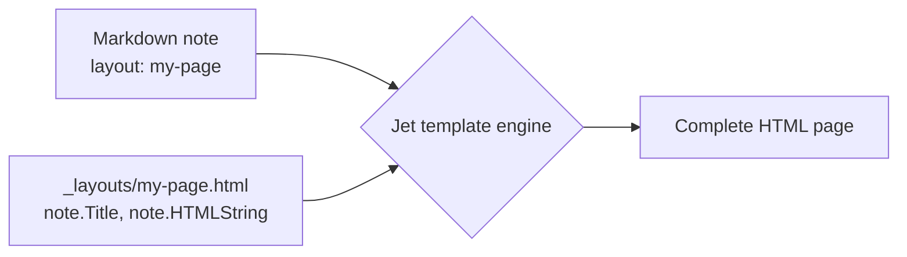

Templates control how your notes look — sidebar, header, footer, and layout.

A template is an HTML file stored in `_layouts/`. It receives the note's content and frontmatter, then produces a complete page. Your markdown stays clean; the template decides how it's presented.

> **See one in action:** [[instaframes/_index|Instagram frames]] is a ready-made template that turns a markdown file into downloadable carousel images — a full example of a custom layout doing real work.

### How templates work

**Step 1.** Create a file in `_layouts/`, for example `_layouts/my-page.html`:

```jet
<!DOCTYPE html>
<html>
<head>
  <title>{{ note.Title() }}</title>
</head>
<body>
  <h1>{{ note.Title() }}</h1>
  {{ note.HTMLString() | unsafe }}
</body>
</html>
```

**Step 2.** Assign the template in your note's frontmatter:

```yaml
---
layout: my-page
title: My page
---

Page content in markdown.
```

The page now uses your template.



### Default template layout properties

The built-in default template supports these frontmatter keys — no custom HTML required:

| Key | Purpose |
|-----|---------|
| `header: [[Navigation]]` | Note to use as site header (logo + nav) |
| `footer: [[Footer]]` | Note to use as site footer |
| `left_sidebar: [TOC, inlinks]` | Left sidebar widgets |
| `right_sidebar: [outlinks]` | Right sidebar widgets |
| `content: [selfcontent, magazine]` | Content blocks rendered in order |
| `magazine_include_property: featured` | Only show notes that have this frontmatter key |
| `magazine_sort_property: priority` | Sort magazine cards by this frontmatter key |
| `magazine_include_files: "posts/**/*.md"` | Glob pattern for magazine notes |

Set any sidebar to `false` to hide it. Set `left_sidebar: null` (or omit) for no sidebar.

#### Available sidebar widgets

- `TOC` — table of contents (JavaScript-enhanced, tracks active heading)
- `inlinks` / `Backlinks` — notes that link to this note
- `outlinks` — links from this note
- `[[Title]]` — embed another note by title
- `path/to/file.md` — embed a note by file path

#### Content block types

- `selfcontent` (or `self`) — this note's own article with `<h1>` + body
- `magazine` — multi-tier card layout (featured, grid, list)
- `[[Title]]` — embed a note by title
- `path/to/file.md` — embed a note by file path

### Magazine layout

The magazine layout shows child notes as cards in three tiers:

| Tier | Position | Visual |
|------|----------|--------|
| Featured | First note | Large full-width card |
| Grid | Notes 2–5 | Smaller cards, 4-column |
| List | Notes 6+ | Minimal, vertical list |

Activate it on an index note:

```yaml
---
content:
  - magazine
magazine_sort_property: priority
magazine_include_files: "posts/**/*.md"
---
```

### Header and footer from markdown

The header and footer are ordinary notes. The default template reads:
- **Logo** — the first image in the header note
- **Navigation** — the first list in the header note
- **Footer columns** — a nested list (top-level items become column headings)

Example header note `_nav.md`:

```markdown
---
title: Navigation
---


- [Home](/)
- [Docs](/docs)
  - [Getting started](/docs/start)
  - [Templates](/docs/templates)
- [About](/about)
```

Then reference it from any note:

```yaml
header: [[_nav]]
```

### Sidebar from a markdown file

Store navigation in a separate markdown file so you can update it without touching the template:

```markdown
---
title: Sidebar
---

### Section 1

- [Page 1](/docs/page-1)
- [Page 2](/docs/page-2)
```

Reference it as a sidebar widget:

```yaml
left_sidebar:
  - _sidebar.md
```

### What's available in a custom template

The Jet template engine provides these variables:

```jet
{{ note.Title() }}          — title from frontmatter
{{ note.HTMLString() }}     — full content as HTML
{{ note.Permalink() }}      — page URL
{{ note.ReadingTime() }}    — reading time in minutes
{{ note.CreatedAt() }}      — creation date
{{ note.M().GetString("author", "Unknown") }}  — frontmatter field
```

Access other notes via `nvs`:

```jet
{{ if sidebar := nvs.ByPath("/_sidebar.md"); sidebar }}
  {{ sidebar.HTMLString() | unsafe }}
{{ end }}
```

A lookup that finds nothing — `nvs.ByPath`, `nvs.ByPermalink`, `nvs.ByWikilink`, a query's `.First()` or `.Last()`, `PartialRenderer().Section(...)`, `FirstList()` — returns `nil`. Both `{{ if x }}` and `{{ if x == nil }}` test it. (Older versions returned a value that `{{ if x }}` treated as empty while `x == nil` was false; templates written with `{{ if x }}` keep working.) Calling a method on it, like `x.Title()`, stops the render with an error, so test first. The form above declares and tests in one step: see [[en/user/templates#Assignment in if (Go-style)|Assignment in if]].

Load assets:

```jet
<link rel="stylesheet" href="{{ asset("style.css") }}">
```

Include HTML injections from site settings (analytics scripts, custom `<head>` tags):

```jet
{{ range i, injection := htmlInjectionsHead }}{{ injection.Content | unsafe }}{{ end }}
```

```jet
{{ range i, injection := htmlInjectionsBodyEnd }}{{ injection.Content | unsafe }}{{ end }}
```

Place `htmlInjectionsHead` inside `<head>` and `htmlInjectionsBodyEnd` before `</body>`. This is how Google Analytics and other site-wide scripts reach custom Jet layouts.

> **Tip:** If you use a custom Jet layout, add both variables so scripts configured in Admin → HTML Injections are automatically included:
> ```jet
> <head>
>   ...
>   {{ range i, injection := htmlInjectionsHead }}{{ injection.Content | unsafe }}{{ end }}
> </head>
> <body>
>   ...
>   {{ range i, injection := htmlInjectionsBodyEnd }}{{ injection.Content | unsafe }}{{ end }}
> </body>
> ```

### SEO tags in a custom layout

The default template writes `<link rel="canonical">`, `og:url`, `hreflang` and `<meta name="robots">` for you. A custom layout writes none of them. The only thing trip2g adds on its own is the `X-Robots-Tag: noindex` HTTP header for notes with `noindex: true`.

`publicURL` holds the main domain's address. On a [[en/user/multidomains|custom domain]] it is still the main domain, so build the canonical from the note's route:

```jet
<head>
  {{ if note.M().GetBool("noindex", false) }}<meta name="robots" content="noindex">{{ end }}
  {{ canonicalRoute := note.M().GetString("route", "") }}
  {{ if canonicalRoute != "" }}
  <link rel="canonical" href="https://{{ canonicalRoute }}">
  {{ else }}
  <link rel="canonical" href="{{ publicURL }}{{ note.Permalink() }}">
  {{ end }}
</head>
```

Keep the `noindex` default at `false`. With `GetBool("noindex", true)` every page without the property is marked `noindex` and the whole site drops out of search, while the HTTP headers look clean. The snippet expects `route` to be a full `domain/path`; adapt it if you use `routes` or main-domain aliases.

### Splitting content into sections

`PartialRenderer` breaks a markdown note into logical blocks — useful for landing pages, FAQs, and card grids:

```jet
{{ intro := note.PartialRenderer().Introduce() }}
<p class="lead">{{ intro.ContentHTML | unsafe }}</p>

{{ range i, s := note.PartialRenderer().Sections(3) }}
  <details>
    <summary>{{ s.TitleHTML | unsafe }}</summary>
    {{ s.ContentHTML | unsafe }}
  </details>
{{ end }}
```

- `Introduce()` — content before the first heading
- `Sections(level)` — sections under headings of a given level
- `Section("Title")` — a specific section by heading text

### Organizing multiple templates

For sites with shared header, footer, and styles, use a `blocks.html` file:

```
_layouts/
└── my-theme/
    ├── blocks.html   — shared header, footer, wrapper
    ├── page.html     — standard article page
    └── landing.html  — landing page
```

`blocks.html` defines reusable blocks; `page.html` imports and uses them:

```jet
{{ import "blocks" }}

{{ yield main_layout() content }}
  <article class="prose">
    <h1>{{ note.Title() }}</h1>
    {{ note.HTMLString() | unsafe }}
  </article>
{{ end }}
```

### Assets across layout files

`asset()` looks up URLs in a single table that merges assets from every layout file. So a block defined in `cases.html` can call `asset("topo.svg")` and still resolve correctly when the page is rendered through `index.html` (for example via `yield`).

Keys are absolute paths (`_layouts/mesh/topo.svg`), so there are no collisions between layouts.

The engine walks `import` and yield chains to discover `asset()` calls automatically. If a dependency hides in a non-obvious place, hint the discovery walker with a comment:

```jet
{{ import "blocks" }}

<!-- {{ asset("style.css") }} -->

{{ yield main_layout() content }}
  ...
{{ end }}
```

The comment is stripped from the rendered HTML, but the dependency is guaranteed to be picked up.

### Jet template syntax

Templates use the [Jet](https://github.com/CloudyKit/jet) engine:

```jet
{{ variable }}                        — output
{{ if condition }}...{{ end }}        — conditional
{{ range i, item := list }}...{{ end }} — loop (always capture both index and value)
{{ block name() }}...{{ end }}        — define a block
{{ yield name() }}                    — call a block
{{ include "path" data }}             — include a partial
{{ value | unsafe }}                  — output HTML without escaping
```

Three Jet rules to remember:

1. Block parameters need default values or named arguments won't bind: `{{ block card(title="", body="") }}`
2. `content` is a reserved keyword — don't use it as a parameter name
3. **Single-variable range iterates indices, not values.** `{{ range item := list }}` gives `item = 0, 1, 2…` (the index). To get values, always use two variables: `{{ range i, item := list }}`

### Assignment in if (Go-style)

`if` can declare a variable and test it in one tag, like Go's `if x := f(); cond`:

```jet
{{ if name := expression; condition }}
  ...
{{ else }}
  ...
{{ end }}
```

The variable exists only inside this `if`, its `else if` branches and its `else`. After `{{ end }}` it is gone: using it there stops the render with `identifier "name" not available in current … scope`. A variable of the same name declared before the `if` is shadowed inside it and keeps its value after.

The usual case is a note that may not exist:

```jet
{{ if about := nvs.ByPermalink("/about"); about }}
  <a href="{{ about.Permalink() }}">{{ about.Title() }}</a>
{{ else }}
  <span>About page is not published yet</span>
{{ end }}
```

The condition can be any expression, not only the variable:

```jet
{{ if subtitle := note.M().GetString("subtitle", ""); subtitle != "" }}
  <p class="subtitle">{{ subtitle }}</p>
{{ else }}
  <p class="subtitle">{{ note.Title() }}</p>
{{ end }}

{{ if latest := nvs.ByGlob("blog/*.md").SortBy("CreatedAt").Desc().First(); latest }}
  Latest post: <a href="{{ latest.Permalink() }}">{{ latest.Title() }}</a>
{{ end }}

{{ if faq := note.PartialRenderer().Section("FAQ"); faq }}
  {{ faq.ContentHTML | unsafe }}
{{ end }}
```

Each `else if` can declare its own variable, and still sees the ones declared before it:

```jet
{{ if header := nvs.ByPath("/blog/_header.md"); header }}
  {{ header.HTMLString() | unsafe }}
{{ else if fallback := nvs.ByPath("/_header.md"); fallback }}
  {{ fallback.HTMLString() | unsafe }}
{{ end }}
```

Two-value forms work too: `{{ if value, ok := someMap["key"]; ok }}`.

With `=` instead of `:=` the tag assigns a variable declared earlier, and the new value stays after `{{ end }}`.

**`range` is different.** `{{ range i, post := list }}` also declares variables scoped to the loop, but it takes no `; condition` — `{{ range p := list; p }}` is a parse error. The variables are the loop index and element, not the result of an expression: with one variable over a list you get the index. `{{ range … }}{{ else }}…{{ end }}` runs the `else` when the list is empty.

### Debugging templates

**`debug(value)`** — prints Go type, value, and available methods of any expression:

```jet
{{ debug(note.M()) }}
{* → *templateviews.Meta: &{raw:map[title:My Page extra_content:[a b]]}
      methods: [Debug Get GetBool GetInt GetString GetStrings Has Raw] *}

{{ debug(note.Title()) }}
{* → string: My Page *}
```

Always use parentheses: `debug(note.Title())` ✓ — `debug(note.Title)` ✗ (returns a function reference).

**`note.M().Debug()`** — compact JSON of all frontmatter keys:

```jet
{{ note.M().Debug() }}
{* → {"extra_content":["channels","prices"],"title":"My Page"} *}
```

To test templates interactively without uploading files, use `/_system/renderlayout` — see [[renderlayout]] and [[skills/check_templates]].

### Querying notes in templates

`nvs.ByGlob()` selects notes by path pattern and supports sorting and pagination:

```jet
{{ range i, post := nvs.ByGlob("blog/*.md").SortBy("CreatedAt").Desc().Limit(5).All() }}
  <a href="{{ post.Permalink() }}">{{ post.Title() }}</a>
{{ end }}
```

Methods: `SortBy("Title")`, `SortBy("CreatedAt")`, `SortByMeta("order")`, `.Desc()`, `.Asc()`, `.Limit(n)`, `.Offset(n)`, `.All()`, `.First()`, `.Last()`
