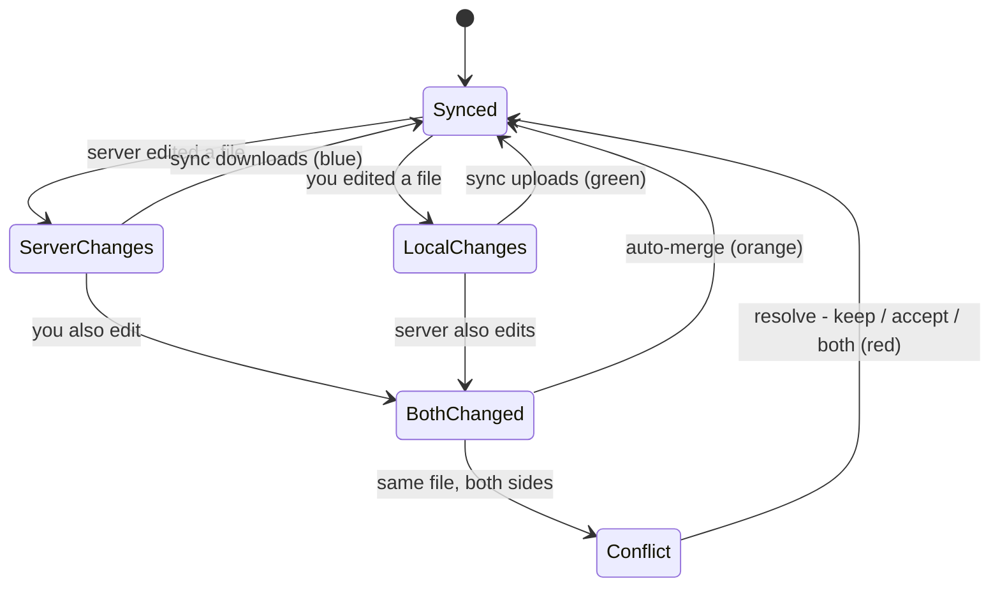

By default the plugin syncs one way: you write in Obsidian, changes go to the server. The server never modifies your files.

Two-way sync sends changes in both directions. If a file is updated on the server, the plugin downloads it to your vault automatically.

### When you need it

**Team editing** — multiple people edit the same knowledge base. Everyone sees each other's changes in real time.

**Server-side automation** — Telegram post imports, content generation, data processing. Results appear directly in your vault.

### Important

Two-way sync can modify your local files. The plugin tracks changes and resolves simple conflicts automatically.

If you and a colleague edit the same file simultaneously, the plugin shows a prompt:
- Keep your version
- Accept the server version
- Save both versions

Complex conflicts can be subtle. Set up backups before enabling.

### How to enable

1. Open trip2g sync plugin settings
2. Enable **Two-way sync**
3. Run sync — the plugin checks the server state

On the first sync, the plugin asks which version to treat as the source of truth: local or server.

### Status indicator

A colored dot on the sync icon shows the current state:

| Color | Meaning |
|-------|---------|
| 🔵 Blue | Server has changes |
| 🟢 Green | Local changes pending |
| 🟠 Orange | Both sides have changes |
| 🔴 Red | Conflicts detected |

