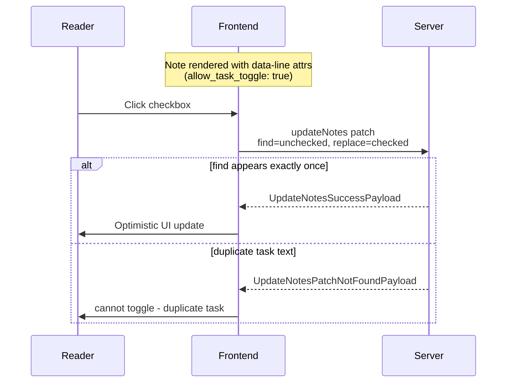
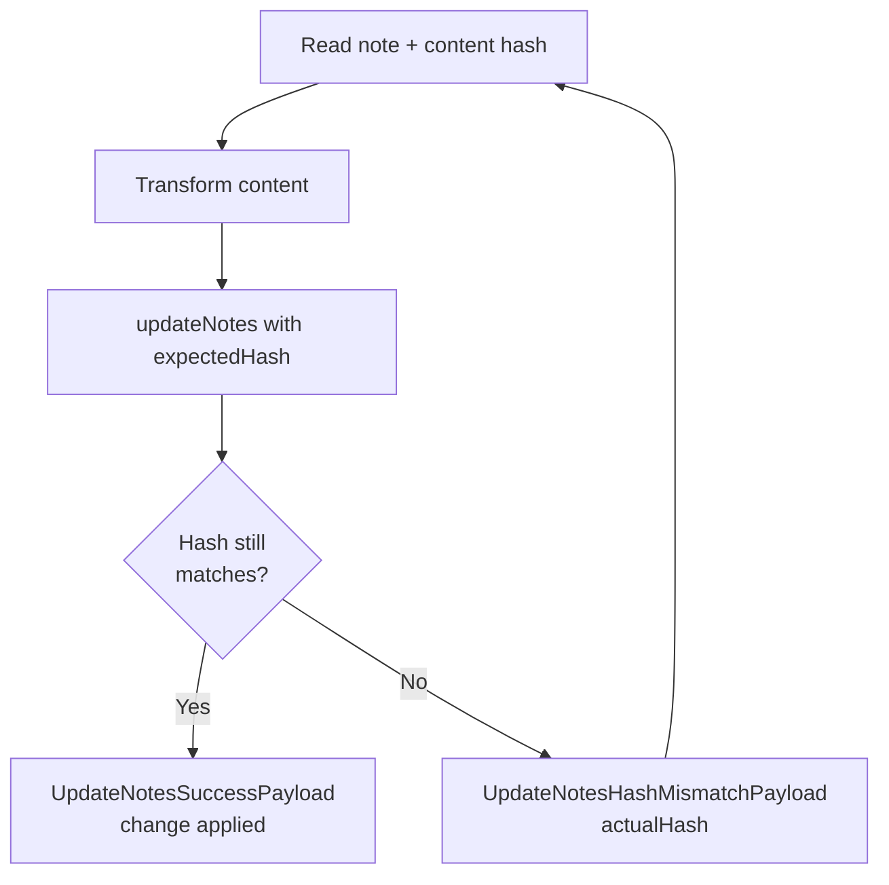

`updateNotes` is the GraphQL mutation for programmatically modifying note content. It handles three operations in a single call — create/replace (upsert), atomic find-and-replace (patch), and hiding a note from public view — and commits changes immediately without a separate `commitNotes` call.

Use `updateNotes` when you know exactly what to change. For a full vault sync from an Obsidian plugin, `pushNotes` + `commitNotes` remains the right path.

---

### Mutation signature

```graphql
mutation UpdateNotes($input: UpdateNotesInput!) {
  updateNotes(input: $input) {
    ... on UpdateNotesSuccessPayload { paths }
    ... on UpdateNotesHashMismatchPayload { path actualHash }
    ... on UpdateNotesPatchNotFoundPayload { path find }
    ... on ErrorPayload { message }
  }
}
```

**Variables:**

```json
{
  "input": {
    "changes": [ /* one or more NoteChangeInput objects */ ]
  }
}
```

---

### Operation types

Each item in `changes` is a `NoteChangeInput` with exactly one of three fields set.

#### upsert — create or fully replace a note

```json
{
  "upsert": {
    "path": "inbox.md",
    "content": "# Inbox\n\n- item"
  }
}
```

Creates the note if it does not exist; replaces content entirely if it does.

Optional `expectedHash`: sha256 of the current content, base64url-encoded. If the note has changed since you read it, the mutation returns `UpdateNotesHashMismatchPayload` instead of writing.

#### patch — atomic find-and-replace within a note

```json
{
  "patch": {
    "path": "todo.md",
    "find": "- [ ] buy milk",
    "replace": "- [x] buy milk"
  }
}
```

The server reads the current content, replaces the first (and only) occurrence of `find` with `replace`, and saves — all in one transaction.

Rules:
- `find` must appear exactly once. If absent or ambiguous, the mutation returns `UpdateNotesPatchNotFoundPayload` with the `path` and `find` string that failed.
- `find` is an exact string match, not a regex.
- If `find` equals `replace`, the note is unchanged and no new version is created.
- Empty `replace` is valid — it deletes the matched string.

Optional `expectedHash` works the same as for upsert.

#### hide — remove a note from public view

```json
{
  "hide": {
    "path": "draft.md"
  }
}
```

Marks the note as hidden without changing its content. The note remains in the vault but is no longer served to readers.

---

### Checkbox toggle (patch use case)

The patch operation is the standard mechanism for toggling task checkboxes from a page.

How it works:

1. The note is rendered with `allow_task_toggle: true` in its frontmatter. The renderer adds `data-line` attributes to checkbox list items containing the original markdown line.
2. When a reader clicks a checkbox, the frontend reads `data-line` from the element and calls `updateNotes` with:
   - `find`: the original line, e.g. `- [ ] buy milk`
   - `replace`: the toggled line, e.g. `- [x] buy milk` (or reverse to uncheck)
3. On success, the UI updates optimistically.



**Uniqueness requirement.** If the same task text appears more than once in the note, patch returns `UpdateNotesPatchNotFoundPayload`. The frontend should handle this by showing a "cannot toggle — duplicate task text" message rather than silently failing.

Enable checkbox toggling with frontmatter:

```yaml
allow_task_toggle: true
```

To enable it across all notes, use a [[frontmatter-patches|frontmatter patch]]:

```
* → { allow_task_toggle: true }
```

---

### Conflict detection with expectedHash

`expectedHash` is the sha256 hash of the note's current content, encoded as base64url.

When provided:
- The server checks the hash before applying the change.
- If the content has changed since you read it, the mutation returns `UpdateNotesHashMismatchPayload` with `path` and the current `actualHash`.
- Retry by re-fetching the note and repeating the operation with the new hash.



For checkbox toggles triggered directly from the UI, `expectedHash` is typically not needed — the `find` string itself acts as a guard. If the note changed and the line no longer exists exactly, the patch returns `PatchNotFound` instead of clobbering the new content.

Use `expectedHash` when your agent reads a note, transforms it, and writes back — and you need to guarantee no concurrent edit slipped in between.

---

### Batch operations

Send multiple changes in one call:

```json
{
  "input": {
    "changes": [
      {
        "patch": {
          "path": "todo.md",
          "find": "- [ ] buy milk",
          "replace": "- [x] buy milk"
        }
      },
      {
        "upsert": {
          "path": "log/2026-05-18.md",
          "content": "# Log\n\nTask completed."
        }
      }
    ]
  }
}
```

Each change is processed independently. The batch stops at the first error and returns the error payload — changes before the failed item are already applied. Empty `NoteChangeInput` objects `{}` are silently skipped.

---

### Error responses

| Payload | Meaning | Recommended action |
|---------|---------|-------------------|
| `UpdateNotesSuccessPayload` | All changes applied | Read `paths` for the list of affected note paths |
| `UpdateNotesHashMismatchPayload` | Note changed since last read | Re-fetch note, retry with `actualHash` |
| `UpdateNotesPatchNotFoundPayload` | `find` string not found or appears more than once | Show error to user, or re-fetch and retry with updated `find` |
| `ErrorPayload` | Validation or system error | Log `message`, fix input |

---

### Authentication

`updateNotes` requires an API key. Pass it as a header:

```
X-Api-Key: your-api-key
```

Or, for webhook agents, use the short-lived token from the webhook payload:

```
Authorization: Bearer eyJhbGc...
```

Write access is checked against the key's write patterns. If the target path is not covered by the key's write patterns, the mutation returns an `ErrorPayload`.

---

### Integration with webhooks

Webhook agents receive a temporary `api_token` in the request payload (when **Pass API key** is enabled). That token can be used directly with `updateNotes` to write back to the vault.

The agent response `changes[]` field also supports patch operations as an alternative to calling `updateNotes` directly — include `find` and `replace` instead of `content` in a change object. See [[webhooks]] for the full agent response format.

Cron webhooks can trigger agents on a schedule. A cron agent might, for example, check all `todo/**` notes for overdue tasks and patch their status fields — running nightly without any external infrastructure.

---

### Anchor-marker pattern

For append-style operations (inbox bots, log entries), place a marker string in the note and use patch to insert before or after it while keeping the marker in place:

Note content:
```markdown
# Inbox

$INBOX$
```

Agent call:
```json
{
  "patch": {
    "path": "inbox.md",
    "find": "$INBOX$",
    "replace": "## 2026-05-18 10:00\nNew message\n\n$INBOX$"
  }
}
```

Each call prepends a new entry above the marker. The marker stays in the note and serves as the insertion point for the next call. This pattern works without `expectedHash` because the marker string is unique by construction.

---

### Conditional invocation pattern

An agent should call `updateNotes` only when it has a concrete change to make:

```
receive webhook payload
if changes[] contains a note with a checkbox to toggle:
    call updateNotes with patch (find=unchecked line, replace=checked line)
    handle PatchNotFound (duplicate text) → return error to UI
    handle HashMismatch → re-fetch and retry
else:
    return {"status": "ok"}  # no-op, no write needed
```

The patch semantics enforce this naturally — if the `find` string is absent, the mutation returns an error rather than silently writing, so agents that call unconditionally also get correct behaviour.
