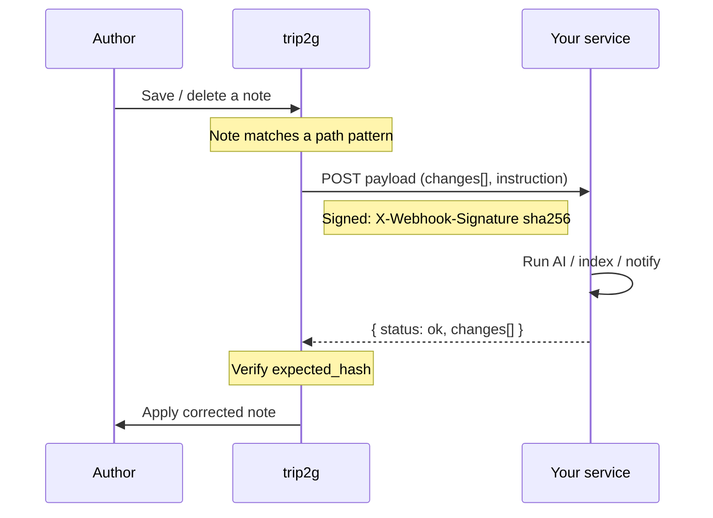
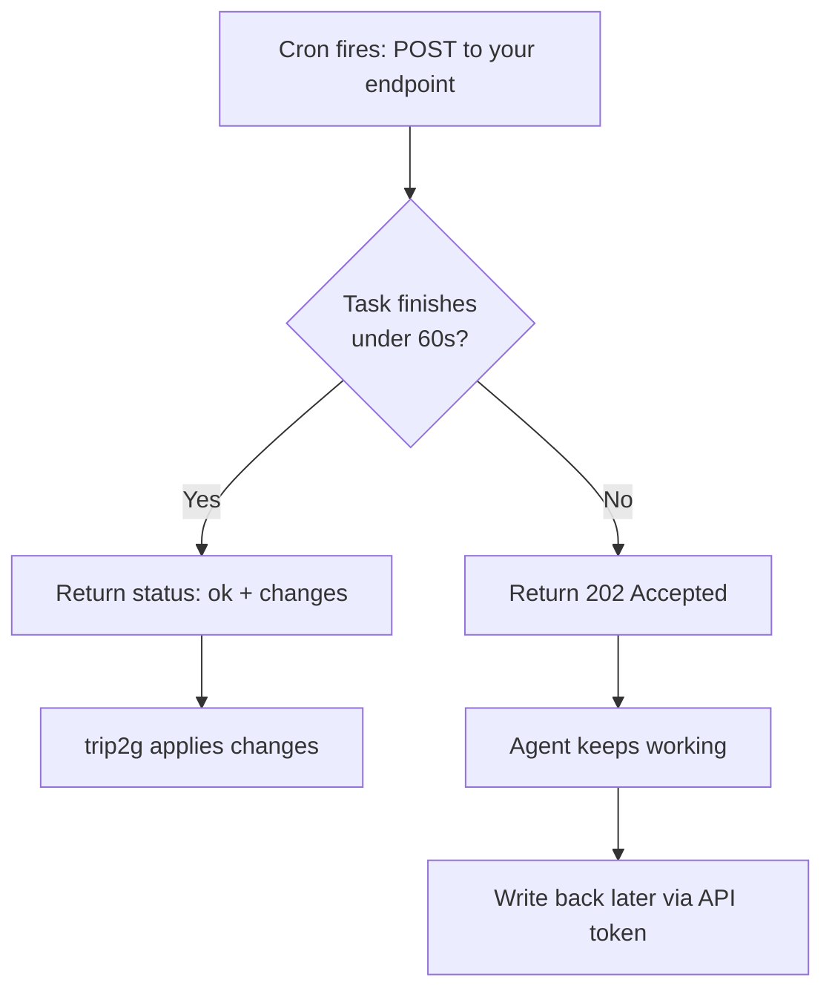

Webhooks let trip2g notify external services when notes change, or trigger actions on a schedule.

Two types are available: **change webhooks** fire when a note is created, updated, or deleted; **cron webhooks** fire on a schedule you define.

### Change webhooks

A change webhook sends a POST request to your URL whenever a matching note changes. Use it to update a search index, run an AI linter, post to Slack, or trigger any external automation.

#### Setup

1. Open the admin panel → **Webhooks** → **+ Add**
2. Enter your endpoint URL
3. Set path patterns for which notes to watch
4. Choose events: create, update, delete (all three by default)
5. Optionally add an instruction (a text hint passed to AI agents using this webhook)

#### Path patterns

Patterns use glob syntax:

| Pattern | Matches |
|---------|---------|
| `blog/*` | Files directly in `blog/` |
| `blog/**` | Files in `blog/` and all subfolders |
| `docs/**` | All files under `docs/` |
| `*` | All notes |

You can also set exclusions. A note triggers the webhook if it matches at least one include pattern and no exclude patterns.

#### Request payload

```json
{
  "id": 42,
  "instruction": "Check spelling and return corrections",
  "depth": 0,
  "changes": [
    {
      "path": "blog/my-post.md",
      "event": "update",
      "title": "My Post",
      "content": "# My Post\n\nNote content..."
    }
  ],
  "api_token": "eyJhbGc..."
}
```

Multiple notes changed in one commit arrive together in the `changes` array. `api_token` is included only when **Pass API key** is enabled.

#### Signature verification

Every request is signed with HMAC-SHA256. The `X-Webhook-Signature: sha256={hex}` header lets you confirm the request came from trip2g.

A secret is generated automatically when you create the webhook and shown once. You can regenerate it at any time.

Compute the HMAC from the raw request body (bytes), not from parsed JSON — any key reordering will break the signature.

#### Applying changes from your service

Your endpoint can return note changes in the response body; trip2g will apply them automatically:



```json
{
  "status": "ok",
  "changes": [
    {
      "path": "blog/my-post.md",
      "content": "# My Post\n\nCorrected content...",
      "expected_hash": "abc123"
    }
  ]
}
```

`expected_hash` is the hash of the note as received. It protects against conflicts: if the note changed while your service was processing, the write is rejected. Leave it empty for new files.

#### API token for agents

Enable **Pass API key** to give your service a temporary token scoped to the webhook's read/write patterns. By default the token can read everything and write nothing — set `write_patterns` explicitly if your service needs to create or update notes.

#### Recursion protection

If your service writes a note via the API, that triggers the webhook again. The `depth` field tracks chain depth:

- `max_depth: 1` (default) — webhook fires only on direct changes
- `max_depth: 2` — also fires on changes made by your service

For long-running operations, return `{"status": "ok"}` immediately and apply changes via the API separately — the server waits only a limited time for the response.

### Cron webhooks

A cron webhook fires on a schedule — no external server or cron daemon required.

#### Setup

1. Open the admin panel → **Cron** → **+ Add**
2. Enter your endpoint URL
3. Set a cron expression
4. Add an instruction (optional — passed to the agent in the payload)
5. Enable **Pass API key** if the agent needs to read or write notes

#### Schedule syntax

Standard five-field cron expressions, running in the project's configured timezone:

| Expression | When |
|-----------|------|
| `0 9 * * *` | Every day at 9:00 |
| `0 9 * * 1` | Every Monday at 9:00 |
| `0 */6 * * *` | Every 6 hours |
| `30 8 1 * *` | 1st of every month at 8:30 |
| `0 0 * * 5` | Every Friday at midnight |

Validate your expression at [crontab.guru](https://crontab.guru) before saving.

#### Request payload

```json
{
  "id": 42,
  "instruction": "Generate a digest from blog/ notes for the past 24 hours",
  "api_token": "eyJhbGc...",
  "response_schema": { ... }
}
```

`response_schema` hints at the expected response format.

#### Synchronous vs asynchronous responses



**Synchronous** — return the result directly in the response (within the timeout):

```json
{
  "status": "ok",
  "changes": [
    {
      "path": "digests/2026-03-13.md",
      "content": "# Digest for March 13\n\n...",
      "expected_hash": ""
    }
  ]
}
```

**Asynchronous** — return `202 Accepted` immediately and apply changes via the API token later:

```json
{"status": "accepted"}
```

Use async for tasks that take more than 60 seconds.

#### Common use cases

- **Daily digest** — every morning at 9:00, read recent posts and create `blog/digest.md`
- **Weekly report** — every Friday, generate an activity summary
- **Content generator** — weekly, create a batch of draft posts from an instruction
- **Monitor** — hourly, check metrics and update a dashboard note

### MCP server

trip2g exposes an MCP (Model Context Protocol) server so AI clients can query your knowledge base directly.

Connect it to Claude Desktop, Claude Code, Cursor, GitHub Copilot, Gemini CLI, or any MCP-compatible client. Once connected, the AI can call:

| Method | Purpose |
|--------|---------|
| `search(query)` | Vector search across the knowledge base |
| `note_html(path)` | Full content of a specific note |
| `similar(path)` | Notes similar to the given note |
| `instructions()` | Author-defined instructions for the AI |

#### Setting up MCP access

1. Create a note with instructions for the AI and add `mcp_method: instructions` to its frontmatter
2. Open site settings and enable the MCP server
3. Set access: open (everyone) or subscription-only (paying subscribers)

#### Privacy

- The MCP server returns only text from your knowledge base
- The server receives search queries but does not see your chat context, replies, or files
- No request history is stored

For more on automation and integrations, see [[en/user/advanced]].
