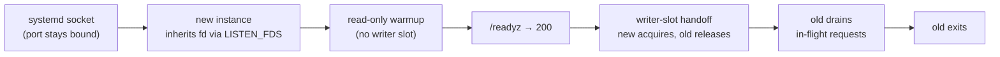

Shipping a new version of trip2g should not drop a single read. trip2g gives your orchestrator (or even a bare server with no load balancer) exactly the health signals and warmup behavior needed to swap versions while readers keep getting their pages.



*How the restart flows: the listening socket never drops, so the kernel queues connections while the new instance warms up.*

## The two health endpoints (you need BOTH)

trip2g serves these probes on its **internal port**: a *second* port (set by `--internal-listen-addr`, e.g. `:8081`), separate from the public web port that serves your site. Public visitors never reach it. **Every health check in the recipes below must target this internal port, not the public web port.** (The website is on, say, `:8080`; `/readyz` answers on `:8081`.) The two probes answer different questions, so both must be wired correctly.

### `/livez` (liveness, mandatory)

Returns **200 whenever the process can answer**, even while it is warming up or draining. It answers "is the process alive?". The orchestrator uses it to **restart a hung instance**. It must **never** return 503 during warmup. If it does, the orchestrator decides a perfectly healthy, still-warming instance is broken, kills it, and the instance never finishes warming.

### `/readyz` (readiness, mandatory)

Returns **200 only when the instance is fully ready to serve** (warmed up, writer slot acquired). Returns **503 while warming up and while shutting down**. The load balancer and the deploy gate use it to decide whether to **route traffic**. This is what keeps the old version serving until the new one is genuinely ready.

(`/healthz` is also served, kept for backward compatibility.)

## Why warmup matters

On boot trip2g builds its in-memory state (rendered note views, the search index) before it can serve a single page. That is seconds on a small vault, longer on a big one. If a deploy sends traffic to the new instance before that finishes, readers get errors. The fix: the new instance warms up **while the old one keeps serving**, and `/readyz` gates the switch so traffic only moves once the new instance is ready.

## The handoff knobs

- `--shutdown-grace-period`: on shutdown trip2g flips `/readyz` to 503 and keeps serving for this long before it actually stops. Set it **≥ your load balancer's unhealthy-detection window** (e.g. 5 s for a 1-2 s health-check interval) so the balancer drains the old instance before it dies. If it is too short, expect a few `502 Bad Gateway` at the cutover.
- `--simple-backup-on-shutdown=false`: skip the final backup during a rolling deploy; a peer is already taking over (see [[backup]]).
- `--vacuum-cron`: off by default; leave it off (see [[litestream]]).

## Recipes

### Managed: Fly.io

The simplest path. `fly launch` scaffolds a `fly.toml`; map its health checks to `/readyz` and `/livez`, and Fly's deploy gates on them automatically. For true zero-downtime SQLite you pair it with **LiteFS** (read replicas): Fly's bluegreen strategy cannot share a volume, and LiteFS sidesteps that by giving each machine its own replica. Read Fly's own write-ups: [Litestream VFS](https://fly.io/blog/litestream-vfs/), [Introducing LiteFS](https://fly.io/blog/introducing-litefs/), [LiteFS docs](https://fly.io/docs/litefs/), [Seamless deployments](https://fly.io/docs/blueprints/seamless-deployments/).

### Self-hosted: Nomad + Traefik + Consul

Measured to a clean **100 %** (zero dropped reads through a rolling canary deploy). Five parts:

1. **Consul service discovery** (`provider = "consul"`, not plain Nomad SD) with a Consul `check` on `/readyz` at the internal port. The catalog is health-gated, so a warming canary never gets traffic until `/readyz = 200`, removing every "route to a warming instance" 503.
2. **`--providers.consulcatalog.refreshInterval=5s`** on Traefik. The default is **15 s**, far too slow: it leaves a just-killed backend routable for up to 15 s, which is the main source of 502s.
3. **Traefik load-balancer active health-check** on `/readyz` (interval 1 s, `loadbalancer.healthcheck.port` = the internal port). This drops a draining backend within ~1 s, independent of catalog refresh.
4. **A retry middleware** (`retry.attempts = 4`): the safety net. An idempotent GET that still lands on a just-killed backend is retried on a live one, so the reader gets 200.
5. **App graceful drain**: `--shutdown-grace-period` ≥ the detection window (5-6 s), Nomad `kill_timeout` a little higher, so the old instance keeps serving 200 while the LB drains it.

Two rolling deploys measured **100 % (11 000 and 12 500 requests, zero errors)**, p99 ~4 ms. The invariant: *the old instance must keep serving until Traefik stops routing to it*. Tune either detection speed (low `refreshInterval` + 1 s health-check) or drain length (≥ the refresh window); they're equivalent, and the retry middleware makes 100 % robust to timing either way.

The full thing, copy-paste. Note the **two ports** and the health check pointed at the internal one:

```hcl
# nomad job — group
network {
  port "http"     { to = 8080 }   # public website
  port "internal" { to = 8081 }   # /livez, /readyz, /healthz
}

update {
  canary           = 1
  auto_promote     = true
  health_check     = "checks"
  min_healthy_time = "5s"
}

service {
  name     = "trip2g"
  port     = "http"
  provider = "consul"
  tags = [
    "traefik.enable=true",
    "traefik.http.routers.t.rule=Host(`example.com`)",
    "traefik.http.routers.t.middlewares=t-retry",
    "traefik.http.middlewares.t-retry.retry.attempts=4",
    "traefik.http.services.t.loadbalancer.healthcheck.path=/readyz",
    "traefik.http.services.t.loadbalancer.healthcheck.port=8081",   # internal port
    "traefik.http.services.t.loadbalancer.healthcheck.interval=1s",
  ]
  check {                 # Consul gate — also on the internal port
    type     = "http"
    port     = "internal"
    path     = "/readyz"
    interval = "2s"
    timeout  = "1s"
  }
}

task "trip2g" {
  driver       = "docker"
  kill_timeout = "15s"    # must exceed the shutdown grace below
  env {
    LISTEN_ADDR           = "0.0.0.0:8080"
    INTERNAL_LISTEN_ADDR  = ":8081"
    SHUTDOWN_GRACE_PERIOD = "6s"
  }
}
```

And start Traefik with `--providers.consulcatalog.refreshInterval=5s` (the one non-default flag; the rest is in the tags above).

### Self-hosted: Kubernetes / k3s

The cleanest 100 %, and what most enterprises already run. A `Deployment` with rolling updates, a `readinessProbe` on `/readyz` and a `livenessProbe` on `/livez`, both pointing at the **internal port**:

```yaml
strategy:
  rollingUpdate: { maxUnavailable: 0, maxSurge: 1 }
# ...
readinessProbe:
  httpGet: { path: /readyz, port: 8081 }
  periodSeconds: 2
livenessProbe:
  httpGet: { path: /livez, port: 8081 }
  periodSeconds: 5
```

Kubernetes never routes to a Pod until its readiness probe passes, and with `maxUnavailable: 0` it never removes an old Pod until the new one is ready, so the rollout is gated end to end with no extra tuning. Measured on k3s: **100 %** (7 000 requests, zero errors) through a `v1→v2` rollout. For read scaling / multi-node SQLite, pair it with LiteFS (see [[litestream]]).

### Self-hosted: Caddy (blue-green)

Run two trip2g instances (`trip2g@blue` / `trip2g@green`, on two machines or two container IPs) and list both as Caddy upstreams with an active health-check. Since `/readyz` is on the **internal port**, target it with `health_port`:

```
:80 {
	reverse_proxy blue:8080 green:8080 {
		health_uri  /readyz
		health_port 8081
		health_interval 1s
	}
}
```

Caddy routes only to upstreams whose `/readyz` returns 200. Deploy one colour at a time: bring the new one up, wait for its `/readyz`, then `SIGTERM` the old one. It flips `/readyz` to 503 while still serving 200 for its grace window; Caddy drops it within ~1 s and routes to the live colour. No reload required (and `caddy reload` is graceful if you do edit the Caddyfile). Measured **100 %** (9 000 requests, zero errors) through a blue→green flip.

### Bare server, one port, NO load balancer

trip2g can hand the listening port from the old process to the new one with no proxy at all, via **SO_REUSEPORT** (the new process binds the shared port only *after* it is warm, so the kernel routes to it only once it can serve) or socket fd-passing. The single-port path measured ~99.8 %; the tail is in-flight connections cut at the old process's exit, which a graceful drain removes.

## Measured numbers

All on a Hetzner **cpx32** (4 vCPU / 8 GB, x86, AMD), single SQLite writer, vegeta at 80-100 rps through a rolling deploy. Full method + per-run data in the developer research log.

| Deploy path | reads kept (200) |
|---|---|
| Naive (proxy not health-gated) | ~77 % |
| Traefik active `/readyz` health-check | ~98 % |
| Consul SD + app drain (partial) | ~99 % |
| **Nomad + Traefik + Consul** (full recipe above) | **100 %** |
| **Caddy** (health-gated upstreams) | **100 %** |
| **Kubernetes / k3s** (readiness-gated rollout) | **100 %** |
| SO_REUSEPORT, single port, no LB | ~99.8 % |

The pattern: a proxy that is not health-gated routes to the warming instance (503s) and to the dying instance (502s). Gate it on `/readyz` (Consul, the proxy's own health check, or k8s readiness) and give the app a real drain window, and dropped reads go to **zero**: all three orchestrated paths above hit a clean 100 %. The single-port SO_REUSEPORT path gets to 99.8 % (its tail is in-flight connections at process exit, not routing).
