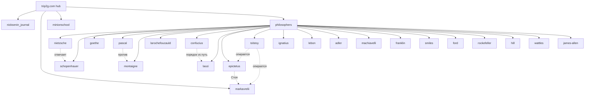

# Хаб

Базы знаний, подключённые к этому хабу через федерацию.

- [[ru/hub/nicksenin_journal|Журнал Ника Сенина]]
- [[ru/hub/markavrelii|Марк Аврелий — Размышления]]
- [[ru/hub/minionschool|Школа миньонов]]
- [[ru/hub/philosophers|Хаб философов]] — слой маршрутизации над 21 корпусом философов

## Текущая схема хаба

Корневой хаб подключает `philosophers` одним пиром; тот хаб уже федерирует
21 корпус. Пунктирные линии — связи влияния между корпусами: корпус указывает
на соседей, с которыми спорит, и агент может пройти по идее через базы.

Слепой веер с корневого хаба видит `philosophers` как **одну** базу. Чтобы дойти
до конкретного мыслителя, спрашивают хаб философов по `kb_id` его корпуса
(например, `federated_search(kb_id="nietzsche")` к `philosophers.2pub.me`).

Что такое федеративный поиск и как он работает — [[ru/user/federation|MCP Federation]].
