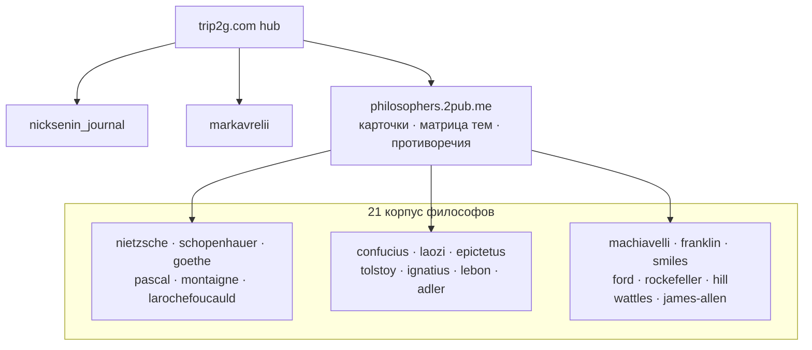

# Хаб

Базы знаний, подключённые к этому хабу через федерацию.

- [[ru/hub/nicksenin_journal|Журнал Ника Сенина]]
- [[ru/hub/markavrelii|Марк Аврелий — Размышления]]
- [Хаб философов](https://philosophers.2pub.me) — слой маршрутизации над 21 корпусом философов

## Текущая схема хаба

Слепой federated-веер с этого хаба видит хаб философов как **одну** базу
(его карточки и матрицу тем). Глубина корпусов достигается адресно через
составной id: `federated_search(kb_id="philosophers/<slug>")`.
