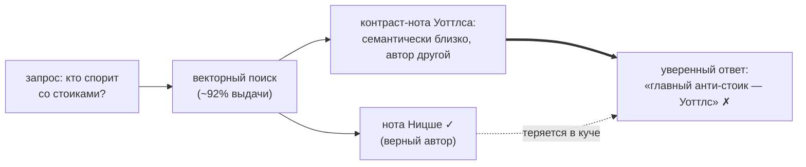
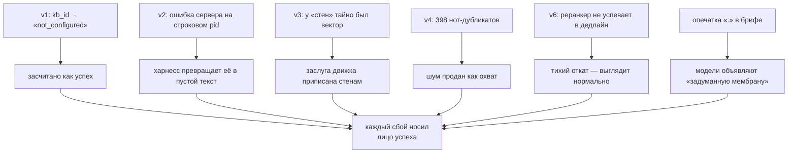

# Знание как цепочка поставок, а не свалка

**Коротко.** Я хотел проверить, действительно ли маленькая модель, получив
федеративный граф знаний через MCP, *использует* его — или только делает вид.
Исследование пришлось прогнать шесть раз: почти каждый прогон ломался по-новому,
а метрики оставались зелёными. Что выжило: модели надёжно и дёшево
**навигируют** по федеративному графу. Что не выжило: удобная мысль, что одно
большое векторное хранилище строго лучше. На плоской куче из 22 корпусов
философов чем лучше модель искала, тем увереннее она **путала авторов** —
вкладывала правильную мысль не в те уста. Стены между базами оправдали себя не
тем, что помогают модели *найти*, а тем, что держат ответ привязанным к тому,
*чей* он. Если вы строите на федеративном знании, в этом различии вся суть.

Сырые логи, сломанные прогоны и каждая поправка открыты — это эссе лишь
интерпретация, и я предпочёл бы, чтобы вы прочитали процесс, а не поверили
резюме: [federated_search_research](https://github.com/trip2g/federated_search_research_2026-07-10).
База под тестом: **22 корпуса философов, ~924 уникальные заметки, ~390 тыс.
слов** философии с дословными цитатами-якорями — Ницше, Шопенгауэр, Эпиктет,
Марк Аврелий, Конфуций, Лао-цзы, Паскаль, Монтень, Толстой и другие.

## Куча, которая гниёт

Дай агенту одну папку — работает. Положи в одну папку пятьдесят тем — гниёт:
никто не помнит, что где лежит, «единый источник истины» расползается, и каждый
ответ — гадание по каше. Тогда люди строят папку побольше. Она гниёт быстрее.

Федерация — другой ход: много маленьких ухоженных баз, каждая у того, кто
реально знает предмет, а запросы идут через одну точку. Базу философов ведёт
тот, кто читал философов. Базу HR — HR. Продуктовую базу партнёра — партнёр.
Агент не видит пятьдесят подключений: он говорит со своим хабом, а хаб
маршрутизирует по `kb_id`.

Это питч. Мне был нужен не питч, а проверка: держится ли это, когда читать
садится маленькая дешёвая модель.

## Ход первый: модель ответила по памяти, а метрика сказала «отлично»

Первый прогон смотрел на хаб, который на самом деле не резолвил `kb_id`
философов. **37 из 44** целевых запросов вернулись с
`federation not configured`. Модели пожали плечами и ответили из параметрической
памяти — а метрики («закончила?», «есть цитата?») радостно засчитали это как
успех. Поймало это ревью модели-скептика; я проверил и оставил сломанный прогон
в репозитории как улику.

Урок и есть результат, и он будет повторяться: **«модель выдала ответ» — не то
же самое, что «модель использовала знание»**. Бенчмарк знаний валиден ровно
настолько, насколько реально подключён эндпоинт.

## Ход второй: чтение вернулось пустым, и никто не заметил

Починили эндпоинт, перезапустили. Навигация выглядела уверенно: с хабом,
который резолвит id, каждая модель добиралась до нужного корпуса примерно 5 раз
из 6, по несколько десятых цента за вопрос. Выбрать правильную базу — не то
место, где маленькие модели спотыкаются.

Потом повторный аудит нашёл вторую дыру. Когда модель пыталась открыть полную
заметку по id, который ей выдал поиск, **128 из 130 таких чтений вернулись
пустыми** — и, что хуже, пустоту сфабриковали на *нашей* стороне: сервер
корректно отклонял id-строку, а харнес читал только поле `result` из JSON-RPC и
молча превращал ошибку в `text: ""`. Модель видела успешное пустое чтение.
Метрика не видела ничего плохого.

Тот же урок, вторая поверхность: провалившееся чтение, которое выглядит как
*успешное-но-пустое*, невидимо для всех чисел ниже по течению — и на стороне
эндпоинта, **и** на стороне харнеса. Проверяйте ошибку, а не только результат.
(Оба бага починены; фикс строкового id ушёл настоящим патчем.)

## Ход третий: я ошибался насчёт стен

Вот поправка, которая понравилась мне меньше всех, потому что она моя.
Сравнивая *огороженный* федеративный хаб с *плоской* кучей, я считал, что оба
ищут по ключевым словам, значит вся разница — «стены». Читатель возразил: а
разве хаб не на векторах?

На векторах. Один английский парафраз без единого общего слова — «the drive to
dominate and grow stronger» — вернул правильные *русские* заметки,
отранжированные, с id совпавших фрагментов. Так через языки умеют искать только
эмбеддинги. Значит, моё сравнение «стены против кучи» незаметно варьировало
**две** вещи сразу — стены и поисковый движок — и я был готов записать на счёт
стен то, что сделали векторы.

Это убило чистое сравнение и заставило сделать честное: дать **обеим** сторонам
один и тот же поиск с векторами и реранкером и посмотреть, что меняют сами
стены.

## Ход, который всё решил: досягаемость без атрибуции

Я собрал честную версию. Один локальный инстанс, вся плоская куча, настоящий
гибридный поиск — BM25 + векторы bge-m3, поверх кросс-энкодер-реранкер — те же
вопросы, тот же судья, против огороженного хаба.

Плоское гибридное хранилище **запутало модели сильнее всего, что мы
тестировали.** Жёсткие ошибки атрибуции на двенадцать прогонов на каждую руку:
наивный плоский поиск — **2**, огороженный хаб — **7**, плоский с векторами и
реранкером — **9**. Корректность — в обратную сторону: хаб 8/12, наивный
плоский 5/12, гибридный плоский 2/12.

Самое интересное — механизм. Семантический поиск *починил* главную проблему
кучи — досягаемость: векторы дали ~92% всего найденного, и модель выходила на
релевантный материал со второго вызова. И ровно это создало проблему атрибуции:
чем лучше досягаемость, тем больше в выдаче *концептуально близких, но чужих*
пассажей. В одном прогоне модель короновала второстепенного автора книг по
саморазвитию главным оппонентом стоиков — по заметке-сравнению, которая
действительно описывает этот спор, — и приписала тезис не тому мыслителю.
Досягаемость выросла; атрибуция упала.

Это переворачивает вопрос, *зачем* нужна стена `kb_id`. По плоскому хранилищу
модели ходят нормально. Ищут по нему даже лучше. Теряют они одно: *чья это была
мысль*. **Выжившая ценность стены — идентичность источника, а не навигация.**
Стена не помогает модели найти заметку — она держит ответ привязанным к базе и
владельцу, откуда он пришёл. Это эмпирический стержень всего, что дальше:
федерация окупается как **граница атрибуции** — она держит «кто это сказал»
пришитым к ответу, — а не как поисковая строка получше.

## Зеркало: меряем себя против qmd

Легко выглядеть хорошо на фоне соломенного чучела. Поэтому я загрузил ту же
кучу в [qmd](https://github.com/tobi/qmd) — автономный локальный гибридный
поисковик (BM25 + локальная модель эмбеддингов + LLM-реранкер) — и прогнал
через него те же вопросы.

Сравнение сразу поймало настоящий баг в *нашем* стеке, не в qmd. qmd адресует
по содержимому: одинаковые тексты хранятся и эмбеддятся один раз. Наш — нет:
там, где qmd видел **946 уникальных документов**, в нашем индексе было
**1 344**, потому что 398 из них — побайтово одинаковые дубликаты: папка
хаб-карточек, скопированная в каждый корпус. Мы платили за эмбеддинг одной и
той же заметки двадцать раз и потом двадцать раз отдавали её как шум в выдаче —
включая ту самую заметку-сравнение из ошибки атрибуции выше.

У стены есть и механическая причина работать там, где инструкции бессильны.
В плоском хранилище каждая граница — *логическая*: имя папки, префикс пути,
«черновики не использовать» в промпте. А логические границы — ровно то, что
модели нарушают легче всего: ретривал не читает ваших намерений, и модель
охотно смешает всё, что вернул индекс. Федерация переносит границу из
конвенции в *топологию*. Чтобы дотянуться до другой базы, модель должна
**сделать** действие — смаршрутизировать вызов, назвать `kb_id`; осознанное
усилие, которое не случается случайно. А раз пересечение — действие, оно
оставляет след: маршрут и есть журнал аудита. Не нужно верить рассказу модели
о том, какие источники питали ответ, — tool-вызовы *и есть* этот рассказ
(именно его, хоп за хопом, рисует [[search_visualizer|визуализатор]]). Плоский
индекс просит модель быть дисциплинированной; федерация делает дисциплину
единственным способом пройти в дверь — и печатает квитанцию. По этой оси
архитектура конкурента просто умнее, и я знаю это только потому, что померил
лоб в лоб. Фикс (схлопывать результаты с одинаковым содержимым; эмбеддить один
раз на хеш содержимого) описан и в работе; вскрыл это именно честный бенчмарк.

А потом сравнение окупилось по-крупному. На тех же вопросах qmd — совсем другой
движок (LLM-реранкер и LLM-переписыватель запроса вместо нашего
кросс-энкодера) — **выдал тот же провал.** Он тоже пустил корпуса успеха и
саморазвития в вопрос о воле и стремлении; тоже смешал заметки-сравнения; тоже
продвинул не того оппонента: где наш стек короновал второстепенного автора
главным анти-стоиком, qmd короновал *Толстого*. Та же форма ошибки, другое
неправильное имя. По точности задачи — вничью. Если что, qmd притащил *больше*
материала из чужих корпусов (около 30% выдачи против наших 19%) — и это при его
дедупликации содержимого.

Это самое сильное свидетельство во всём исследовании, и оно против удобной
версии. Путаница — **не артефакт нашего движка.** Другой, пожалуй даже более
навороченный гибридный стек над той же кучей теряет «кто это сказал» точно так
же. Проблема, которую решает стена, реальна и от движка не зависит.

Одна честная оговорка про сравнение: пайплайны не идентичны. Это «инструмент
против инструмента» в настройках по умолчанию, а не эксперимент с одной
переменной — рекомендованный путь qmd даже гоняет лишнюю стадию, которой у нас
нет: LLM переписывает запрос перед поиском. Асимметрия работает в пользу более
скромного инструмента, а не против: qmd принёс больше машинерии и всё равно
только сравнялся по точности, стоя сильно дороже. Чистая версия с одной
переменной — те же модели, изолируем реранкер — это и есть замена, о которой
дальше, и на этом железе она не поехала.

Где qmd и наш стек действительно разошлись — так это цена, и здесь не в пользу
qmd: его реранкер с LLM в петле работает ~150 секунд на некэшированный запрос
на CPU (наш кросс-энкодер укладывается примерно в одну секунду), 62 минуты на
пять вопросов, и прогон упал по OOM, не дойдя до конца. Точность и пропускная
способность тянули в разные стороны.

Потом я замкнул круг по-параноидальному: переключил *наш* движок на модели
qmd — его эмбеддинги и его LLM-реранкер — и перезапустил. Смена эмбеддингов
оказалась тихой продуктовой победой: переход с 1024 на 768 измерений
переиндексировался сам, без рук, потому что отпечаток модели входит в хеш
содержимого каждой заметки — все заметки автоматически встали в очередь заново,
а устаревшие векторы были пропущены. Реранкер — противоположность победы.
LLM-как-реранкер на CPU-only линуксовой виртуалке, где всё это крутилось,
примерно в 25 раз медленнее кросс-энкодера — около 3,5 секунды *на пассаж* — и
на нормальном наборе кандидатов вообще не возвращается в дедлайн запроса
сервера. Он не просто медленный: на этом железе он непригоден для
интерактивного поиска, тогда как кросс-энкодер отвечает примерно за секунду на
той же машине. (Честная оговорка: это вердикт для CPU. На GPU или Apple Silicon
с Metal LLM-реранкер был бы сильно быстрее и вполне мог бы успевать — суть не в
том, что «LLM-реранкеры бесполезны», а в том, что на обычном CPU прагматичный
выбор — кросс-энкодер.) А там, где точность вообще можно было сравнить, он не
купил ничего: на тех же вопросах LLM-реранкер повторил кросс-энкодер, включая
ошибку атрибуции.

Так скучный дефолт оказывается осознанным выбором. Кросс-энкодер вместо
LLM-реранкера — решение о *развёртываемости*: он считает на CPU, который у вас
уже есть, без GPU. Рекомендованный путь qmd ставит в петлю пару маленьких
языковых моделей (переписыватель запроса и LLM-реранкер); он блестит на Apple
Silicon, под который построен, и умеет деградировать до чистого BM25 или
векторного режима, если попросить, — но его полнокачественный дефолт фактически
закрыт для дешёвой безголовой коробки. Та же задача, противоположное допущение
о железе. Если ваша цель — скромный self-hosted сервер, реранкер без LLM —
единственный, который вообще запускается.

Позже я прогнал параноидальную версию этой оговорки — всё сравнение заново на
машине с Apple Silicon и Metal, тот же вульт, те же модели. CPU-вердикт
перевернулся ровно там, где ждёшь, и устоял везде остальном. На Metal разрыв
«qmd в 4.5× медленнее» схлопнулся до паритета на холодном запросе — Metal
поглощает его лишнюю LLM-ступень — а наш резидентный сервер оказался даже
*быстрее* на новом запросе (он платит за загрузку модели и расширение запроса
один раз, а не на каждый вызов). Значит, преимущество qmd никогда не было в его
моделях. Оно архитектурное — и его можно позаимствовать: `llm_cache` по
content-hash, из-за которого повторный или перефразированный поиск стоит пятую
долю секунды вместо десяти (агенты переспрашивают почти одно и то же
беспрерывно — я наблюдал это весь день); квантованная модель in-process на
llama.cpp, которая получает Metal бесплатно и не требует няньчить torch-аллокатор,
как наш стек; батч-эмбеддинг, индексирующий вульт за тридцать шесть секунд там,
где мы тратим пять минут на per-note HTTP-джобы. Ничто из этого — не повод менять
модели. Что и есть последняя находка, теперь замеренная, а не выведенная: пересадка
нашего движка на точный модельный стек qmd сдвинула точность на один прогон из
двадцати четырёх — шум — и оставила смешение нетронутым, если не чуть хуже.
Путаница не в модели. Это свойство плоского семантического ретривала над этим
корпусом — с чего всё эссе и началось. Зеркало сказало то же самое с новой
стороны: стена делает работу, которую модель не может.

Есть и более глубокая причина, почему простой стек держится: когда потребитель —
агент по MCP, слою поиска не нужно быть умным, потому что умный уже агент. В
бенчмарке модели делали от трёх до семи поисков на вопрос, переформулируя по
ходу чтения, — расширение запроса, адаптивное и в контексте. qmd зашивает
переписывающую запрос LLM прямо в движок; это оправдано для одноразового
CLI-запроса без модели в петле и избыточно, как только за рулём агент (в наших
прогонах переписывание отработало *дважды* — сначала qmd, потом сам агент — и
всё равно вышла только ничья). Урок обобщается: не дублируйте в слое поиска то,
что агент делает лучше уровнем выше. Держите базу чистым протоколом — искать,
читать, цитировать — а интеллект пусть живёт в петле, а не в индексе.

Итого один и тот же провал воспроизводится на **трёх независимых поисковых
стеках** над одной кучей: наш кросс-энкодер, LLM-реранкер qmd и наш движок,
одетый в модели qmd. Это закрывает последние удобные отговорки. Не наш движок,
не наши модели, не грязные данные. **Путаница — свойство плоского
семантического поиска по этому корпусу, точка.**

## Стена подешевле: заставить цитировать

Если плоское хранилище всегда теряет «кто это сказал», а огороженный хаб
держит, очевидный вопрос: нужны ли *стены* — или только атрибуция. Я прогнал
чистую кучу ещё одним способом: заставил модель цитировать. К каждому
утверждению — назвать заметку-источник и чей это корпус; потом детерминированно
проверить, что процитированная заметка реально была получена и что её автор
совпадает с утверждением.

Результат — самое обнадёживающее число во всём исследовании. **Каждая
проверяемая цитата — 45 из 45, и на английском, и на русском — назвала
правильного мыслителя.** Когда формат ответа заставляет утверждение нести свой
источник, маленькие модели перестают путать авторов. Проверка бесплатна, и,
поскольку сравнивает *пути*, а не прозу, работает на любом языке — она обошла
весь кросс-язычный бардак с граундингом, который победил метрику по подстрокам.
Ошибки атрибуции, которые судья ещё видел, жили в *нецитированных*
предложениях: модель смешивает, когда рассказывает свободно, и точна, как
только говорит под протокол.

Это в последний раз переопределяет стену. Стена — один способ сохранить
атрибуцию, структурный: идентичность базы едет с каждым результатом бесплатно.
Но не единственный. **Требовать — и проверять — цитаты — это самодельная
альтернатива.** Чего нельзя — это не иметь ни того, ни другого. Голое плоское
хранилище на «просто ответь» смешивает; дайте ему стену или дисциплину «цитируй
и проверяй» — и имена возвращаются правильными.

## База, которая отказывается врать

У цепочки поставок есть и происхождение, и **контроль качества**. В корпусах
философов — оба. Каждая цитата помечена статусом подлинности: `verified_primary`
— строка дословно есть в ингестированном источнике и несёт `unit_id`, который
можно проверить; `verified_secondary_only`, `popular_but_unverified`,
`misattributed` — значит нет.

Ворота чувствуешь ровно в тот миг, когда просишь что-то знаменитое, чего в тексте
нет. Я смотрел, как малая модель пытается процитировать ницшевское «Бог умер».
Ингестированный корпус Ницше — это «По ту сторону добра и зла», а эта фраза — из
«Весёлой науки». База вернула её с флагом `verified_secondary_only` — реальное
изречение, но не в этом первичном тексте, — и модель поступила честно: **отказалась
выдать её как дословную цитату и объяснила почему.** Ни выдуманной ссылки, ни
уверенной строки с чужой квитанцией. Спроси вместо этого о том, что *есть* в
корпусе, — о маске, что хранит глубину, — и она спускается от карты хаба к точному
афоризму и отдаёт адрес: `bge.278`, проверяй сам.

Эта пара — весь тезис в одном жесте. Свалка выдаст «Бог умер» со ссылкой на «По ту
сторону добра и зла» не моргнув, потому что у кучи нет понятия о том, что в ней на
самом деле лежит. Цепочка поставок различает строку, которую может обосновать, и
строку, которую не может, — и говорит об этом. Отказ здесь не ограничение; отказ и
есть продукт.

## Что на самом деле продают стены

Сложите ходы вместе — и продуктовая история переворачивается относительно того,
с чего обычно начинают.

Если ваша единственная цель — «отвечать на вопросы по моим документам», один
хорошо собранный гибридный индекс проще и обычно не хуже: от специализированного
локального индексатора вроде qmd *положено ожидать*, что он догонит или обгонит
платформу федерации в том единственном, на чём специализируется. Проданная как
«поиск поумнее», федерация проигрывает жирному индексу.

Но вот часть, которая важна, если вы уже на платформе с федерацией: за опцию,
которой не пользуетесь, вы не *платите*. Запустите нашу платформу как обычное
плоское хранилище — она сравнялась со специализированным индексатором по
точности и уверенно обошла по скорости (кросс-энкодер за секунду против
LLM-реранкера, который не смог закончить). Федерация опциональна; RAG под ней —
на уровне специализированного инструмента. Так что выбор не «хороший RAG *или*
федерация»: конкурентный плоский поиск вы получаете по умолчанию, а слой
владения и атрибуции — когда он действительно нужен, без штрафа за само наличие
возможности.

Федерация выигрывает по оси, куда жирному индексу не дотянуться:

- **Владение.** Проприетарная база партнёра, база HR, публичный справочник — их
  нельзя слить в один индекс. Разные владельцы, разные ритмы обновления, разные
  права.
- **Атрибуция.** Стена — то, что не даёт «Ницше сказал X» тихо превратиться в
  «заметка семантически рядом с Ницше сказала X». Эксперимент выше — квитанция.
- **Граница доверия.** Можно открыть агенту или партнёру *подграф* — не отдавая
  всё хранилище. Плоский индекс не умеет делиться выборочно.
- **Разные движки.** Одна база на векторах, одна на wiki-LLM, одна на обычном
  полнотекстовом поиске — за одним протоколом. Мы доказали это на своей шкуре:
  у стандартного сервера эмбеддингов нет сборки под ARM, и наш превратился в
  маленький самописный сервер с тем же wire-контрактом — и никто ниже по
  течению не заметил. Базу определяет протокол, а не движок.

Правило решения грубое: **если все ваши базы можно слить в одну — возможно, вы
перестроили лишнего: плоский индекс проще. Если слить нельзя — из-за владения,
доверия или атрибуции — федерация правильный и, может быть, единственный
ответ.**

## Постскриптум: что бывает совсем без задачи

Всё выше меряет модели под задачей. Мы прогнали и обратный зонд: выпустили
десять моделей в тот же граф без всякой цели, кроме любопытства, и посмотрели,
где они окажутся. Одинаковые модели разошлись; авторский мета-слой графа
оказался гравитационным колодцем; большая модель бродила как учёный, маленькие —
как аппетит. Этот эксперимент вырос в отдельный текст:
[[ru/thoughts/let-the-model-wander|Отпусти модель погулять]].

## Сквозная линия

Прогон за прогоном одна и та же картина: сломанный, деградировавший или
зашумлённый поиск в маске успешного. `not_configured`, засчитанный как успех.
Ошибка, отрисованная пустотой. Векторы, записанные на счёт стен. Двадцать
дубликатов, проданных как охват. Реранкер, не успевающий в дедлайн. Описание инструмента, обещающее форму чтения, которую сервер отвергает. Уверенное
предложение с чужим именем.

Вот настоящий аргумент за собственный, *инспектируемый* поиск в каждой базе.
Федеративному ответу можно верить, только если каждая база отказывает
**громко** — неправильный id даёт ошибку, отсутствующая заметка даёт ошибку,
источник назван и проверяем, — а не тихо стекает в правдоподобный абзац.
Знание, которому можно верить, — не свалка, по которой надо искать усерднее.
Это цепочка поставок: каждое утверждение прослеживается до базы и владельца,
откуда пришло.

*Один протокол. Сотня реализаций за ним. И имя на всём.*
