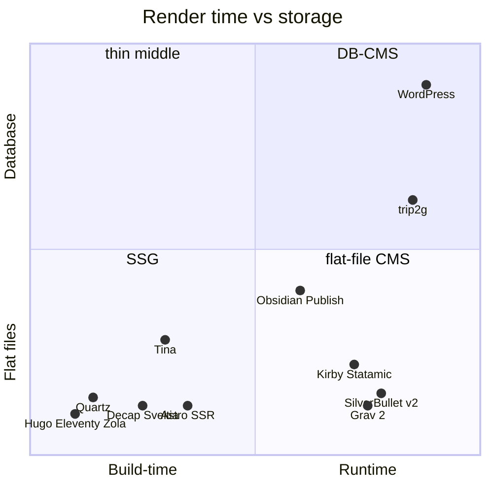
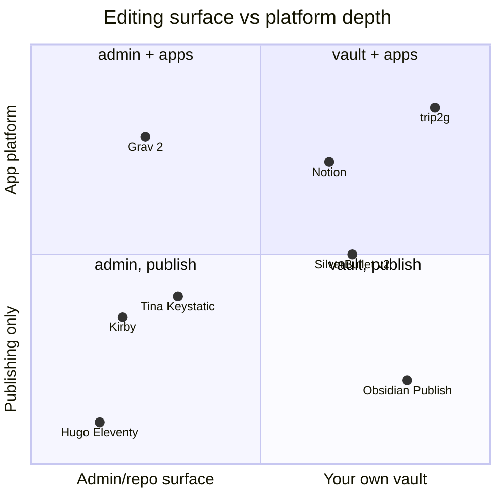
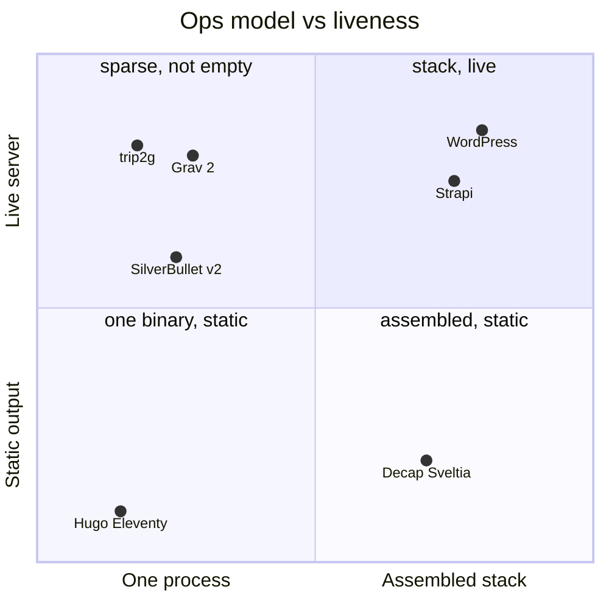
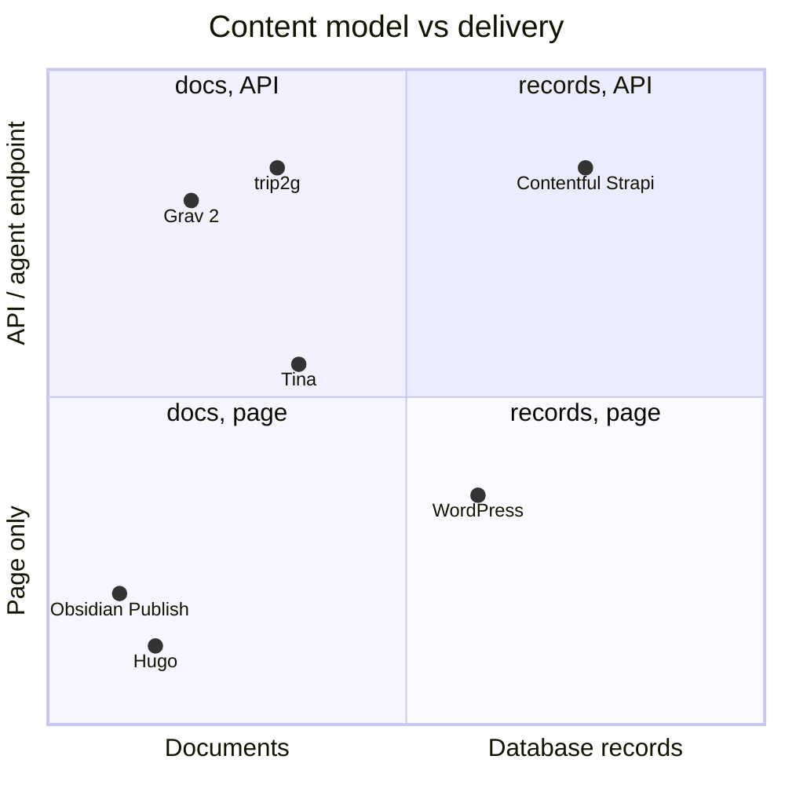
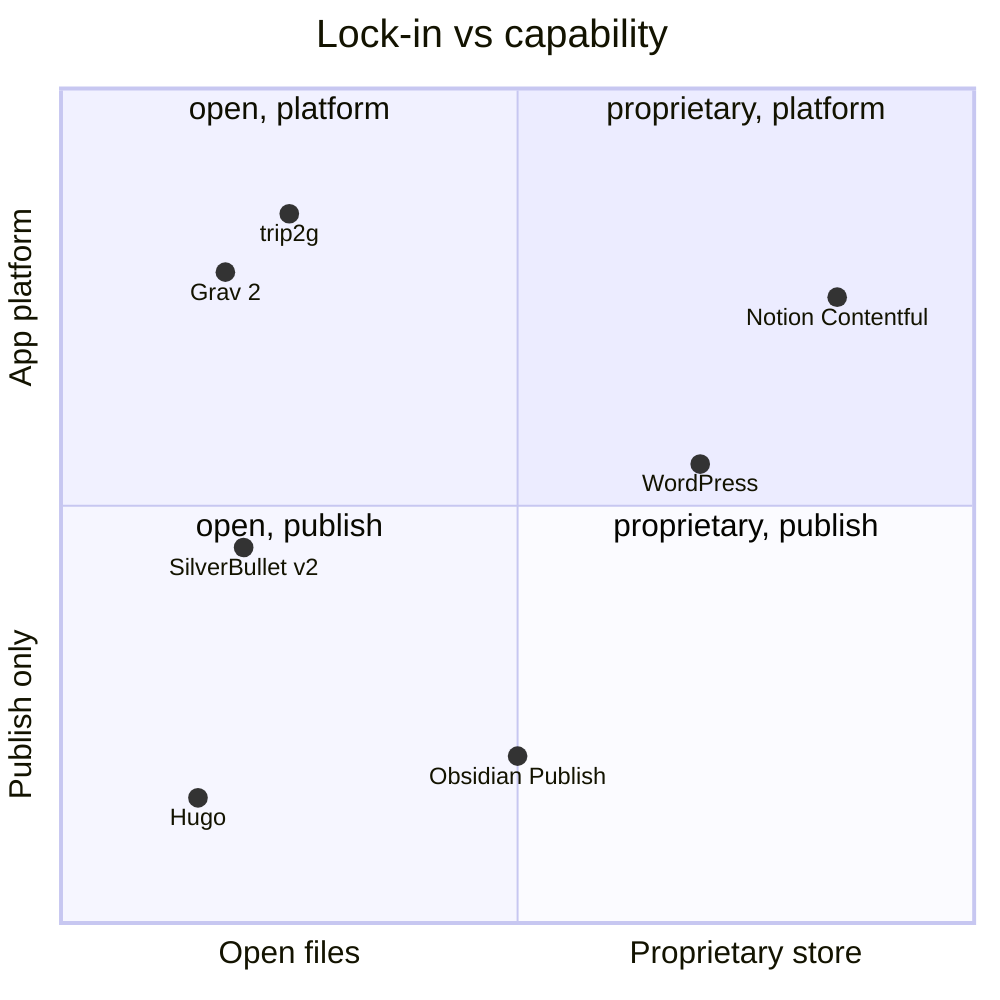
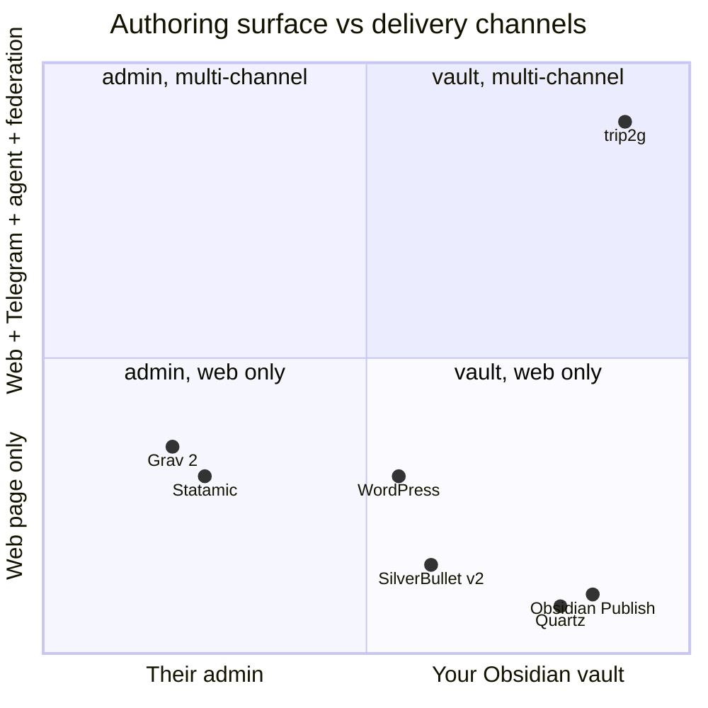

*О чём это: тот же вопрос, что и в первом эссе — в каком классе живёт trip2g и кто соседи, — но после сверки с реальностью июля 2026. Короткий ответ изменился. trip2g — не «пустая середина flat-file CMS»: середину уже занял Grav 2.0, причём честнее-плоский и с тем же MCP-сюжетом. Настоящая, узкая и защитимая ниша trip2g — пересечение двух вещей, которого больше нет ни у кого: **поверхность авторинга — твой личный Obsidian-vault с двусторонней синхронизацией**, а доставка — **веб + Telegram + агент (MCP) + федерация между хабами**, поверх канонической SQLite. Всё остальное — write-API, app-shell, MCP — с июня 2026 уже не отличия, а гигиена нового класса.*

Это разбор к [[ru/thoughts/flat-file-cms|первому эссе «Класс инструмента: живой сервер поверх Markdown-файлов»]]. v1 остаётся актуальным; здесь — что изменил Grav 2.0 и где trip2g стоит после этого изменения.

## Что изменилось против v1 / исправления

Короткий вывод: **тезис v1 наполовину устарел за месяц.** 22 июня 2026 вышел Grav 2.0 — и ровно те три вещи, которые эссе назвало «чего у соседей нет совсем» (MCP-эндпоинт, точечный write-API, выход за публикацию), Grav теперь делает из коробки, оставаясь при этом честнее-плоским, чем trip2g. «Середина почти пустая» — преувеличение: середина тонкая, но в ней уже сидит зрелый инструмент, который только что выкатил тот самый AI-сюжет, который trip2g считал своим козырем. Тезис выживает только если сузить нишу с «пустая середина flat-file CMS» до «твой личный Obsidian-vault как поверхность живого сервера с публикацией в несколько каналов и федерацией».

Исправления по убыванию влияния на аргумент:

### 1. Grav 2.0 (22.06.2026) убивает три «уникальных» отличия trip2g

Grav 2.0 вышел стабильным 22 июня 2026 и принёс:
- **первоклассный REST API в ядре** — CRUD по страницам (чтение, создание, правка, перемещение, копирование, удаление), фронтматтер, медиа, конфиг, юзеры, плагины; аутентификация по API-ключу / JWT / сессии; оптимистичная конкурентность через **ETag** (два клиента не затрут друг друга) — прямой аналог версионной защиты `updateNotes` в trip2g;
- **первоклассный MCP-сервер** — «AI-агент делает всё, что может человек в админке, через тот же API и те же права». Это дословно то, что v1 назвал «чего у соседей нет совсем»;
- **Admin Next** — SPA-админка на SvelteKit 5, целиком поверх API, с **real-time совместным редактированием**, тёмной темой, кастомным дашбордом;
- при этом **всё осталось плоским: файлы, никакой базы, никакого билд-шага, правка идёт в лайв мгновенно**.

Вывод, который бьёт по эссе:
- «MCP-эндпоинт — то, чего у соседей нет совсем» → **ложь** с 22.06.2026.
- «Точечный write-API» как отличие → **больше не отличие**: у Grav ядровый REST API с ETag-конкурентностью.
- «Из живого сервера с write-API следует app-shell, чего flat-file CMS не обещали» → **ослаблено**: Grav 2.0 сам построен api-first, headless/decoupled — first-class.
- Ирония: **Grav честнее-плоский, чем trip2g.** У Grav канонично файлы, базы нет вообще. У trip2g канонична SQLite. То есть на оси «настоящий flat-file» trip2g проигрывает Grav, а не наоборот.

Источники: getgrav.org/blog/grav-2-stable-released, /blog/grav-2-api, alternativeto.net (новость 06.2026).

### 2. «Середина почти пустая» — преувеличение

В середине (живой сервер + файлы + маленькие шаблоны) уже сидят: **Grav 2.0** (теперь ещё и с API+MCP), **Statamic** (Laravel-сервер, флат-файл по умолчанию), **SilverBullet** (self-hosted рантайм). Клетка «один процесс И живой сервер» на диаграмме C не пустая — там как минимум Grav (PHP без базы) и trip2g. Точнее: середина **тонкая, но не пустая**, и с июня 2026 в ней есть прямой конкурент по AI-сюжету.

### 3. Statamic — не чистый flat-file, а спектр «файлы ИЛИ база»

Statamic (v5, на Laravel) хранит контент **плоскими файлами по умолчанию, но умеет переключаться на базу** через Eloquent-драйвер. То есть «гибрид файлы/база» как выбор — уже существует у соседа, только через конфиг, а не через «файлы-снаружи / SQLite-внутри». Это подмывает подачу trip2g «наш компромисс уникален»: уникальна конкретная форма (файловая поверхность как представление канонической SQLite), а не сама идея жить между файлами и базой.

### 4. SilverBullet v2 — не сервер-рендер и не издательская платформа

Эссе ставит SilverBullet как «ближайшего соседа», «self-hosted Markdown-платформу с рантаймом» на оси «рантайм, плоские файлы». Реальность v2 (2025): **local-first / browser-first PWA** — ~90% логики (рендер, редактор, индекс, Space Lua) исполняется **в браузере**, сервер низведён до файлового хранилища. И это **приватный PKM, а не издалка сайтов** — публичной публикации из коробки нет. Значит: (а) рантайм переехал в клиент, а не на сервер; (б) как «издательский сосед» SilverBullet слабый — он записная книжка. Точку надо двигать и оговаривать.

### 5. Мелкие правки фактуры (не меняют аргумент, но нужны для честности)

- **Astro** больше не чисто билд-тайм: с адаптером даёт SSR / on-demand / server islands — то есть живой сервер. Пул «SSG = нет живого сервера» не чист, Astro сидит на границе.
- **TinaCMS** — не чисто git-коммиты: есть рантайм-слой данных (GraphQL над git+DB-индексом) и live-редактирование. Но публичный сайт всё равно отдаёт фреймворк, не Tina — так что «сами сайт не отдают» для семьи в целом остаётся верным.
- **Decap CMS** практически заморожен после передачи от Netlify (2023); живой преемник — **Sveltia** (v1.0 целят на начало 2026). Стоит обновить, чтобы не выглядело, будто Decap — актуальный лидер.
- **Эгея** в v1 описана верно (рантайм + база MySQL, свой редактор, зашитый дизайн) — правок не требует.
- **WordPress**: «файлы — экспортный артефакт, а не источник» — **подтверждено, честно** (контент в MySQL, Gutenberg-блоки — HTML с метаданными в комментариях внутри `post_content`).

---

## Разбор: где стоит trip2g

## Что случилось с исходным тезисом

v1 держался на четырёх опорах: (1) trip2g стоит в пустой середине между SSG и DB-CMS; (2) поверхность редактирования — Obsidian-vault, а не админка; (3) гибрид «файлы снаружи, база внутри»; (4) сверху то, «чего нет у соседей»: MCP, платный доступ, федерация.

Сверка с июлём 2026 оставила стоять две опоры из четырёх.

- **(1) пустая середина** — преувеличение. Grav 2.0, Statamic, SilverBullet уже там.
- **(4) MCP как отличие** — умерло 22 июня 2026: у Grav 2.0 первоклассный MCP-сервер поверх ядрового REST API.
- **(2) Obsidian-vault как поверхность** — **выжило целиком.** Ни один сосед не даёт редактировать через твой существующий локальный Obsidian-vault с двусторонней синхронизацией. У Grav — админка/SFTP/git, у SilverBullet — свой браузерный редактор, у Obsidian Publish — да, твой vault, но проприетарный хостинг, только публикация, без сервера и API у тебя.
- **(3) гибрид файлы/база** — выжило частично. Идея «жить между файлами и базой» уже есть у Statamic (файлы ИЛИ база по конфигу). Уникальна не идея, а форма: файловая поверхность как *представление* канонической SQLite с FTS, эмбеддингами, подписками. И у этой формы есть цена: на оси «настоящий flat-file» trip2g стоит дальше от файлов, чем Grav.

Отсюда разворот: отличия trip2g надо перенести с осей, где Grav 2.0 его теперь догнал (API, MCP, app-shell, платформенность), на оси, где он всё ещё один — **поверхность авторинга (свой vault) и каналы доставки (веб + Telegram + агент + федерация)**.

## Два полюса, тонкая — но не пустая — середина

Рынок по-прежнему расколот на два полюса.

**Полюс статических генераторов** — Hugo, Eleventy, Zola, Jekyll: тот же Markdown и шаблоны, но рендер на сборке, на выходе статика на CDN, живого сервера нет. Одна оговорка против v1: **Astro** уже не чисто билд-тайм — с адаптером у него SSR, on-demand-рендер и server islands, то есть настоящий рантайм. Граница полюса размылась именно здесь.

**Полюс CMS с базой** — WordPress и headless-платформы (Contentful, Strapi). Живой сервер есть, но контент в базе или в проприетарном облаке, редактор — веб-админка, файлы — экспортный артефакт. «Файлы — не источник» здесь точная характеристика: у WordPress пост — это строка в MySQL, у Gutenberg — HTML с блочными метаданными в комментариях внутри `post_content`. Это подтверждается, спора нет.

Середина — живой сервер, файлы на диске, маленькие шаблоны, правка на месте — по-прежнему тоньше полюсов. Но назвать её пустой уже нельзя. В ней:

- **Grav 2.0** (PHP, Markdown + Twig, флат-файл без базы) — и с 22.06.2026 это не «нишевый PHP-движок», а api-first CMS с REST API, MCP-сервером и SPA-админкой на SvelteKit. По AI-сюжету — прямой конкурент.
- **Statamic** (Laravel, Antlers/Blade) — флат-файл по умолчанию, но с переключением на базу; Control Panel, REST/GraphQL, headless.
- **Kirby** (PHP, txt-файлы, Panel) — платная, флат-файл, headless-режим.
- **SilverBullet** — self-hosted, но v2 переехал в браузер и это записная книжка, а не издалка.

Даже в этой середине никто не сделал главного хода trip2g: **поверхность редактирования — это не «файлы на сервере» и не собственная админка, а твой локальный Obsidian-vault, который синхронизируется в обе стороны.**

Соседи по другим осям (уточнено против v1):

**Git-based / headless file-CMS** — Decap, TinaCMS, Keystatic, Sveltia, PagesCMS. Правки: **Decap фактически заморожен** после передачи от Netlify, живой преемник — **Sveltia** (v1.0 к началу 2026). **TinaCMS** — не просто git-коммиты: есть рантайм-слой (GraphQL над git+DB-индексом) и live-редактирование. Но для всей семьи главное остаётся верным: **сайт они не отдают** — это прослойка-редактор поверх отдельного SSG/фреймворка.

**Markdown-рантаймы и вики** — SilverBullet (см. выше: v2 браузерный, PKM, не издалка), TiddlyWiki и DokuWiki (файлы + рантайм, но это вики), Obsidian Publish (твой vault, но проприетарный хостинг, только публикация) и Quartz (обычный SSG для vault'а, v4 на TS).

**Контрасты по источнику контента** — Notion→сайт (Super.so, Potion, Simple.ink): «хранилище становится сайтом», но источник проприетарный, контент заперт в Notion. Эгея (Илья Бирман): рантайм с MySQL, свой редактор, зашитый дизайн — однозадачный антипод.

## Карта A: render-time vs storage (исправленная)

Правки против v1: trip2g поднят по оси «база» (у него канонична SQLite — честнее ставить выше 0.55); Grav вынесен отдельной точкой, потому что после 2.0 он значим сам по себе; SilverBullet подписан как клиентский рантайм.

*Диаграмма A: когда рендерится страница и где живёт контент. trip2g — выше по оси «база», потому что у него канонична SQLite; Grav 2.0 — честнее-плоский сосед в правом-нижнем углу.*

## Карта B: где trip2g всё ещё один — поверхность авторинга

Именно тут отличие живёт после Grav 2.0. По оси «насколько инструмент — платформа» Grav 2.0 подскочил вверх (API + MCP + SPA-админка) и стоит теперь рядом с trip2g по высоте. Разводит их **горизонтальная ось — поверхность редактирования**: у Grav это админка/git, у trip2g — твой Obsidian-vault. Отличие переехало с оси «платформенность» на ось «где ты пишешь».

*Диаграмма B: где ты пишешь (чужая админка/репозиторий ↔ твой личный vault) и как далеко инструмент за публикацией. Grav 2.0 догнал trip2g по высоте (платформенность), но остался слева — пишешь всё равно у него. trip2g и Obsidian Publish — единственные справа; но Publish только публикует, а trip2g — платформа.*

## Карта C: ops vs liveness (клетка больше не пустая)

Клетка «один процесс И живой сервер» — не пустая. В ней Grav (PHP, без базы) и trip2g (один Go-бинарник). SilverBullet тоже около, но его рантайм теперь в браузере.

*Диаграмма C: сколько частей собирать и живой ли рантайм. Квадрант переименован из «empty cell» в «sparse, not empty»: рядом с trip2g теперь Grav 2.0. Отличие по операционной простоте сохранилось, но оно уже не «клетка пустая».*

## Карта D: content model vs delivery (MCP больше не только у trip2g)

Главная правка. v1 ставил trip2g в одиночестве у верхнего края «API/агент». С 22.06.2026 Grav 2.0 тоже там — у него REST API и MCP-сервер. Верхний край делят двое.

*Диаграмма D: документы ↔ записи базы и страница ↔ API/агент. Grav 2.0 поднят к верхнему краю рядом с trip2g: у него теперь тоже MCP+REST над документной моделью. «trip2g уникален тем, что отдаёт документ и агенту» больше не читается — это делает и Grav.*

## Карта E: lock-in vs capability (открытость+платформа — уже не только у trip2g)

Ещё одна правка. v1 держал верхний-левый угол (открытые файлы + платформа) за trip2g. Grav 2.0 туда же: открытые файлы, никакой базы, плюс API/MCP/SPA. Отличие сжалось.

*Диаграмма E: заперт ли контент и насколько инструмент — платформа. Grav 2.0 стоит прямо под trip2g в квадранте «open, platform». Открытость + платформенность больше не покупается только у trip2g.*

## Карта F (новая): чем trip2g действительно один

Пять карт v1 меряли то, где Grav 2.0 теперь догнал. Настоящее отличие — на осях, которых в v1 не было: **поверхность авторинга (чужая админка ↔ твой Obsidian-vault)** против **каналов доставки (только веб ↔ веб + Telegram + агент + федерация)**. Здесь trip2g стоит один в верхнем-правом углу.

*Диаграмма F: где пишешь и куда доставляешь. Это единственная карта, где trip2g стоит в углу один. Obsidian Publish и Quartz — тоже «твой vault», но доставляют только веб. Grav/Statamic — многоканальнее по API, но пишешь в их админке. Пересечение {свой vault} × {веб+Telegram+агент+федерация} — пустое, и его занимает trip2g.*

## Проверенная сравнительная таблица

Оси: **Рендер** (build ↔ runtime); **Хранилище** (файлы / база / проприетарное облако); **Поверхность правки**; **Механизм записи**; **За публикацию** (API/MCP/app); **Хостинг**.

| Инструмент | Рендер | Хранилище | Поверхность правки | За публикацию | Хостинг |
|---|---|---|---|---|---|
| **trip2g** | runtime | **SQLite канон + файлы-представление** | **локальный Obsidian-vault (2-way sync)** | write-API, MCP, app-shell, **Telegram, федерация** | self-host, 1 Go-бинарник |
| **Grav 2.0** | runtime | флат-файл, без базы | админка/SFTP/git | **REST API + MCP + SPA-админка** (с 06.2026) | self-host, PHP |
| **Statamic 5** | runtime | **флат-файл ИЛИ база (по конфигу)** | Control Panel | REST/GraphQL, headless | self-host, Laravel |
| **Kirby** | runtime | флат-файл (txt) | Panel | headless-режим | self-host, PHP (платный) |
| **SilverBullet v2** | **браузер (local-first)** | .md на сервере + IndexedDB | свой браузерный редактор | Space Lua, но это PKM | self-host |
| **WordPress** | runtime | **база (MySQL)** | wp-admin | REST API, headless | self-host/SaaS, PHP+DB |
| **Эгея** | runtime | **база (MySQL)** | свой редактор | нет (однозадачный) | self-host, PHP+DB |
| **Strapi** | — (headless) | база (PG/MySQL/SQLite) | админка | REST+GraphQL | self-host/SaaS, Node |
| **Contentful** | — (headless) | **проприетарное облако** | веб-админка | API-first | SaaS only |
| **Hugo/Zola/Jekyll** | **build-time** | файлы | свой редактор файлов | нет (статика) | любой CDN |
| **Astro** | build **или SSR** | файлы | свой редактор файлов | SSR/endpoints | CDN или сервер |
| **Decap (заморожен)/Sveltia** | нет (редактор) | файлы в git | панель→git-коммит | не отдаёт сайт | self-host |
| **TinaCMS** | нет (+рантайм-слой данных) | git + DB-индекс | live-редактор→git | GraphQL-слой, но сайт отдаёт фреймворк | SaaS/self-host |
| **Keystatic/PagesCMS** | нет (редактор) | файлы в git | панель→git-коммит | не отдаёт сайт | self-host |
| **Obsidian Publish** | облако Obsidian | локальный MD → их облако | твой vault | только публикация | **проприетарный SaaS** |
| **Quartz v4** | **build-time** | MD → статика | твой vault | нет (статика) | self-host/CDN |
| **Notion→сайт (Super/Potion)** | статика/облако | **Notion (проприетарное)** | Notion | только публикация | SaaS only |

## Самая узкая честная формула ниши

v1: «flat-file CMS в пустой середине, с MCP/write-API/app-shell, которых нет у соседей». Это больше не проходит проверку.

v2, узко и защитимо: **trip2g — это когда твой существующий локальный Obsidian-vault становится живым сервером, который публикует в несколько каналов (веб + Telegram), отдаёт write-API и MCP-инструменты агенту, хостит маленькие приложения и федерируется с другими хабами — поверх канонической SQLite, дающей поиск, версии и подписки.**

Что тут выдерживает адверсариальную проверку, а что — риторика:
- **Держит:** поверхность авторинга = твой Obsidian-vault с двусторонней синхронизацией (ни у кого больше); мультиканальность (Telegram-публикация + веб из одного источника); федерация между хабами; Obsidian-нативная семантика (wikilinks, embeds). Это и есть моат: скопировать его нельзя, не став Obsidian — контент живёт в твоём уже-установленном редакторе, а не в админке движка. И это НЕ «flat-file CMS»-фичи.
- **Больше не держит как отличие:** MCP-эндпоинт (у Grav 2.0 есть), точечный write-API (у Grav REST+ETag), app-shell/платформенность (Grav api-first), «гибрид файлы/база» как идея (Statamic — файлы-или-база).
- **Держит с оговоркой:** «один бинарник + живой сервер» — да, но рядом стоит Grav (PHP без базы), клетка не пустая. И «flat-file CMS» как самоназвание — слабое: канонично у trip2g база, он честнее описывается как **DB-CMS с файловой поверхностью авторинга**, а не как flat-file CMS.

Иначе: перестать продавать «пустую середину» и «уникальный MCP». Продавать пересечение, которого правда нет ни у кого — **пиши в своём Obsidian, отдавай в веб, в Telegram, агенту и в федерацию из одного живого сервера.**

---

## Источники

Grav 2.0:
- https://getgrav.org/ , https://getgrav.org/features
- https://getgrav.org/blog/grav-2-stable-released
- https://getgrav.org/blog/grav-2-api
- https://getgrav.org/blog/grav-2-admin-next
- https://alternativeto.net/news/2026/6/flat-file-cms-grav-2-0-launches-with-rest-api-new-admin-and-mcp-server-for-ai-integration/

Kirby / Statamic:
- https://getkirby.com/ , https://statamic.dev/ (Eloquent/DB driver, Antlers/Blade, Control Panel, REST/GraphQL)

SilverBullet v2 / вики / Obsidian:
- https://silverbullet.md/Architecture , https://v2.silverbullet.md/Architecture
- https://community.silverbullet.md/t/silverbullet-v2-the-path-forward/2036
- https://v2.silverbullet.md/Space%20Lua/Lua%20Integrated%20Query
- https://lwn.net/Articles/1030941/
- https://github.com/TiddlyWiki/TiddlyWiki5 , https://en.wikipedia.org/wiki/DokuWiki
- https://obsidian.md/pricing , https://obsidian.md/publish
- https://github.com/jackyzha0/quartz , https://quartz.jzhao.xyz

Git-CMS / SSG:
- https://github.com/decaporg/decap-cms , https://github.com/sveltia/sveltia-cms
- https://tina.io/docs/self-hosted/overview , https://keystatic.com/docs/reader-api , https://pagescms.org/docs/
- https://docs.astro.build/en/guides/on-demand-rendering/ , https://docs.astro.build/en/guides/server-islands/
- https://gohugo.io , https://www.11ty.dev , https://www.getzola.org , https://jekyllrb.com

WordPress / Notion / Эгея / headless:
- https://wordpress.org/about/requirements/ , https://developer.wordpress.org/block-editor/getting-started/fundamentals/markup-representation-block/
- https://super.so/ , https://potion.so/pricing , https://www.simple.ink/
- https://ilyabirman.ru/aegea/ , https://blogengine.ru/help/
- https://strapi.io/ , https://www.contentful.com/headless-cms/
