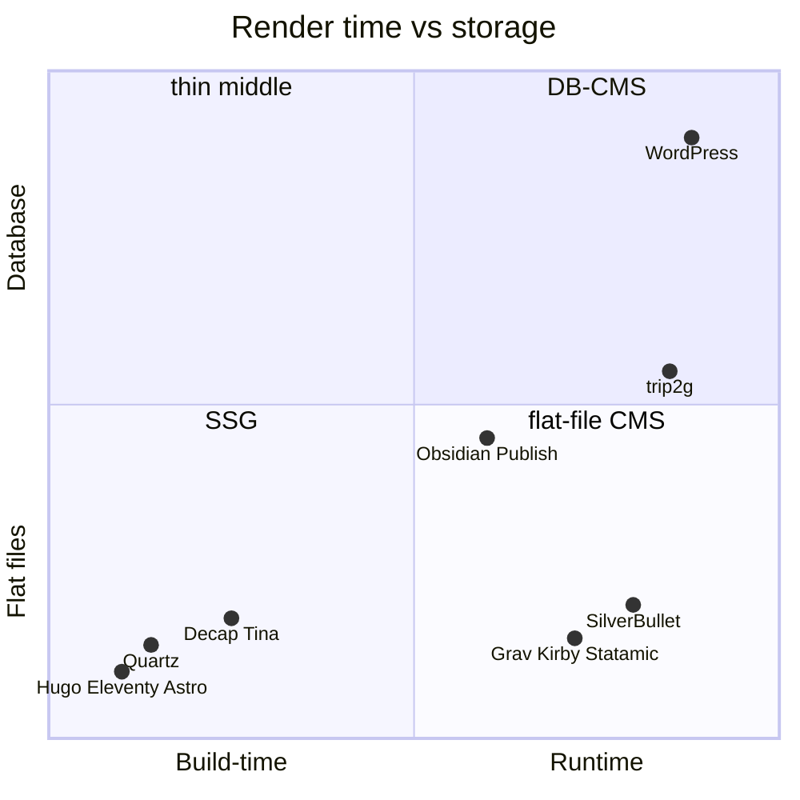
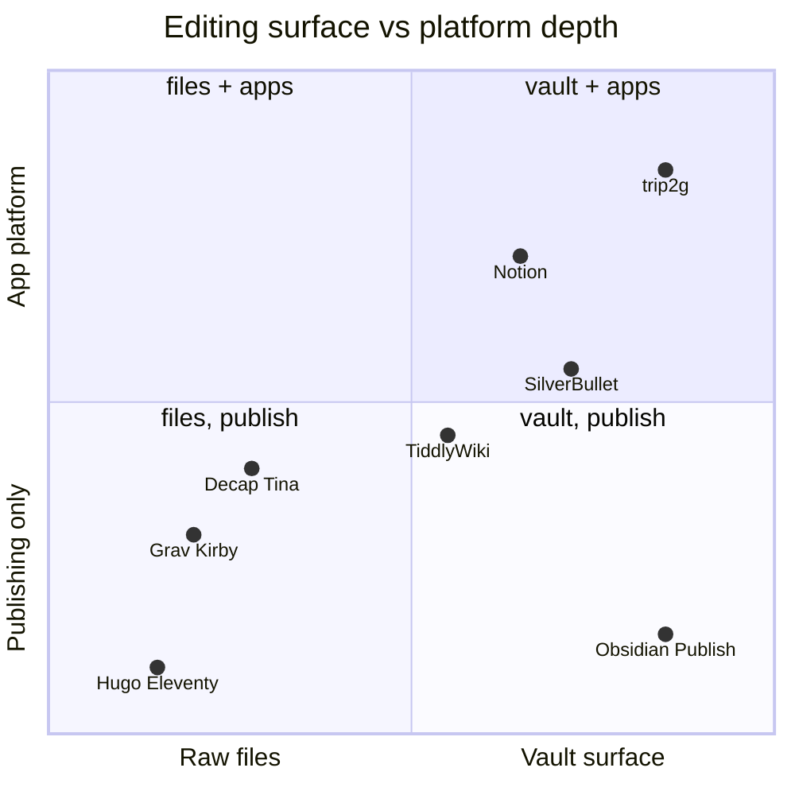
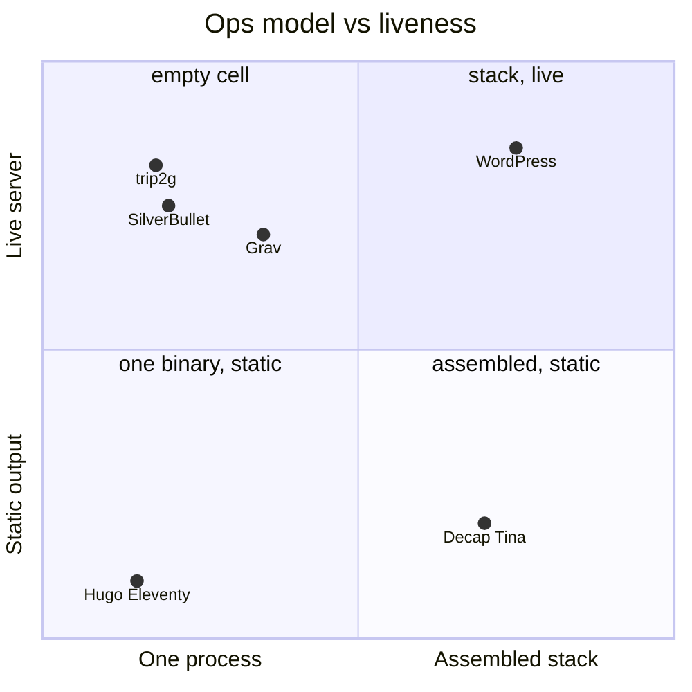
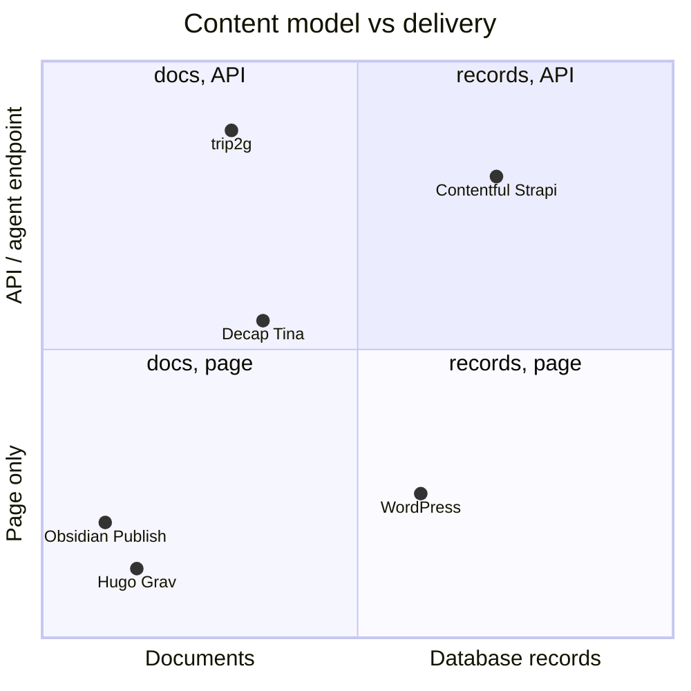
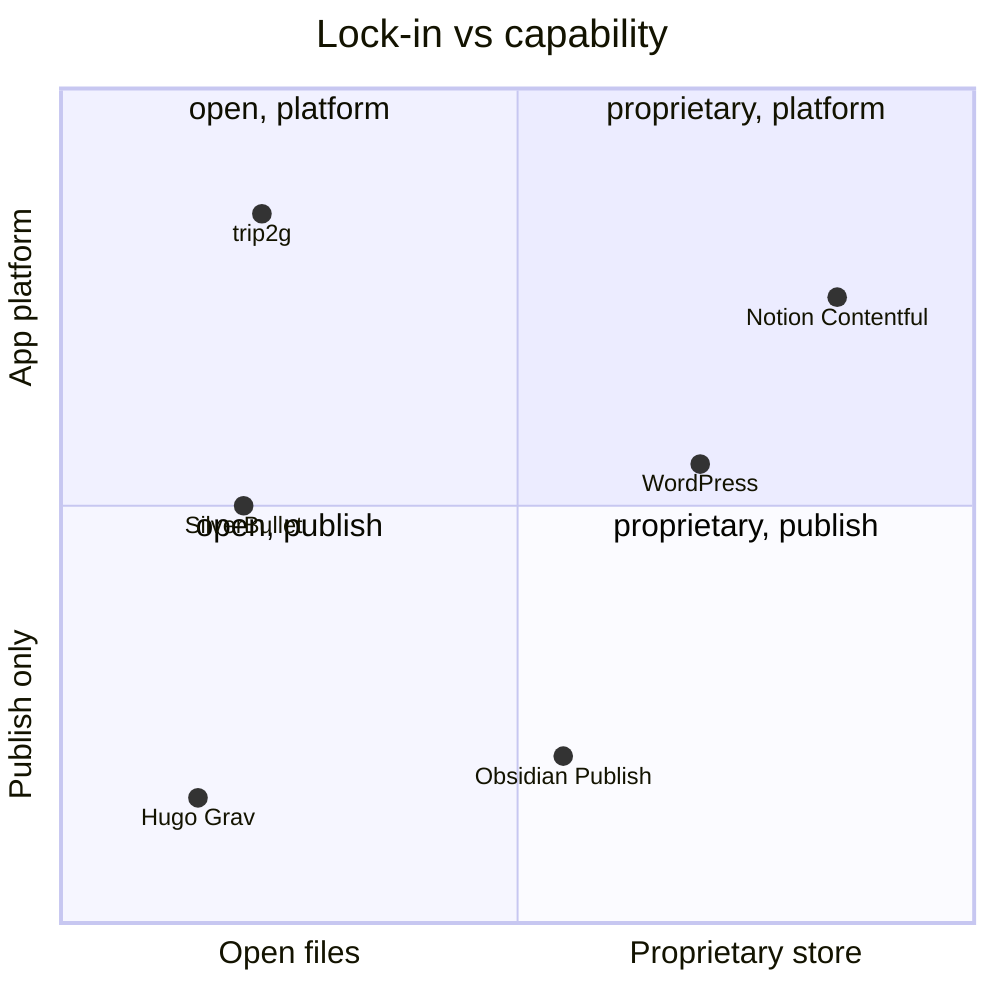

*О чём это: как называется класс, в котором живёт trip2g, кто соседи, и что в позиционировании честно, а что — маркетинг. Короткий ответ: это flat-file CMS — контент в файлах, рендер в рантайме, без отдельной базы-сервера. Ниша существует лет пятнадцать, но осталась тонкой: рынок разъехался на два полюса — статические генераторы и CMS с базой данных, — а середину почти никто не занял. trip2g стоит в этой середине, с двумя отличиями: поверхность редактирования — это локальный Obsidian-vault с синхронизацией, а под капотом не буквальные файлы, а SQLite. Гибрид: редактируешь как файлы, сервер работает как база.*

## Ощущение, с которого всё началось

Есть простая потребность, под которую годами не было простого инструмента: «сделать маленький сайт из HTML и шаблонов». Почти любой сайт — это заметки, страницы, немного навигации. Хочется что-то вроде nginx плюс API, который умеет точечно сохранять файлы. Положил Markdown — получил страницу. Поправил шаблон — страница изменилась. Без базы, без билд-пайплайна, без деплой-церемоний.

Инструменты под это есть. Класс называется flat-file CMS (ещё говорят database-less или file-based CMS): контент лежит в Markdown-файлах, шаблоны рендерятся в рантайме на сервере, редактирование — через панель или API, отдельной базы нет. Родословная: [**Grav**](https://getgrav.org) (PHP, Markdown + Twig), [**Kirby**](https://getkirby.com), [**Statamic**](https://statamic.com), и мельче — [Automad](https://automad.org), [WonderCMS](https://www.wondercms.com), [Bludit](https://www.bludit.com), [Pico](https://picocms.org), [HTMLy](https://www.htmly.com). Почти все — из PHP-эпохи: скинул папку на shared-хостинг, и работает.

Но класс остался нишевым. Почему — видно, если посмотреть, куда разъехался рынок.

## Два полюса, тонкая середина

Рынок публикации раскололся надвое.

**Полюс первый — статические генераторы**: [Hugo](https://gohugo.io), [Eleventy](https://www.11ty.dev), [Astro](https://astro.build), [Zola](https://www.getzola.org), [Jekyll](https://jekyllrb.com). Тот же Markdown, те же шаблоны, но рендер на этапе сборки. Результат — статика на CDN. Минус один, но структурный: нет живого сервера. Некому принять запись через API, некому проверить подписку, некому ответить агенту. Любое изменение — это пересборка и передеплой.

**Полюс второй — CMS с базой**: [WordPress](https://wordpress.org) и его наследники. Живой сервер есть, но контент живёт в базе, редактор — в веб-админке, файлы — экспортный артефакт, а не источник. Плюс отдельный процесс базы данных, который надо обслуживать.

Середина — живой сервер, файлы на диске, маленькие шаблоны, правка на месте — досталась той самой тонкой прослойке flat-file CMS. И даже внутри неё никто не сделал главного хода: **файлы — это не «файлы на сервере», а ваш локальный Obsidian-vault**, который синхронизируется. У Grav и Kirby поверхность редактирования — админ-панель или SFTP. Пишешь всё равно у них, а не у себя.

Есть ещё два семейства соседей по другим осям.

**Git-based / headless file-CMS**: [Decap](https://decapcms.org) (бывший Netlify CMS), [TinaCMS](https://tina.io), [Keystatic](https://keystatic.com), [Sveltia](https://github.com/sveltia/sveltia-cms), [PagesCMS](https://pagescms.org). Это ровно вторая половина формулы — «API, который сохраняет файлы»: панель редактирования коммитит Markdown в git. Но сами они сайт не отдают — это прослойка, приклеенная к фреймворку и SSG-пайплайну. Сервера, который рендерит, у них нет.

**Markdown-рантаймы и вики**: [**SilverBullet**](https://silverbullet.md) — ближайший сосед, self-hosted Markdown-платформа с рантаймом и шаблонизацией; [TiddlyWiki](https://tiddlywiki.com), [DokuWiki](https://www.dokuwiki.org) (тоже файлы + рантайм, но это вики, а не сайт-платформа); [Obsidian Publish](https://obsidian.md/publish) и [Quartz](https://quartz.jzhao.xyz) — публикация vault'а, но Publish — проприетарный хостинг без своего сервера у вас, а Quartz — обычный SSG.

Ещё два контраста — не соседи по классу, а его противоположность по источнику контента. **Notion→сайт** ([Super.so](https://super.so), [Potion](https://potion.so), [Simple.ink](https://simple.ink)) превращают Notion в сайт: ниша ровно как у trip2g — «хранилище становится сайтом», — но источник проприетарный, контент заперт в Notion, а не в твоих файлах. trip2g — открытая версия того же хода: Obsidian и `git clone` всего контента. **[Эгея](https://blogengine.ru)** (Илья Бирман) — вылизанный self-hosted блог-движок: рантайм с базой, свой браузерный редактор, один зашитый дизайн без тем. Она антипод сразу по двум осям: пишешь в её редакторе, а не в файлах, и без шаблонов. Обе точки показывают, чем берёт trip2g — не полировкой одной вещи, а открытостью файлов и правом шаблонировать что угодно.

Эта карта на одной картинке:

*Диаграмма A: когда рендерится страница (сборка ↔ рантайм) и где живёт контент (плоские файлы ↔ база). trip2g — в рантайме, на границе «файлы, но база».*

## Где стоит trip2g — и честная оговорка

trip2g собирает обе половины формулы в один процесс: живой сервер, который рендерит шаблоны в рантайме (как Grav), плюс точечный write-API (`updateNotes` — upsert, патч, find/replace по заметке), плюс синхронизация с локальным vault'ом. Один Go-бинарник, без отдельного процесса базы — по операционной простоте это ближе к nginx, чем к WordPress.

Теперь оговорка, без которой позиционирование было бы маркетингом. **trip2g — не чистая flat-file CMS.** Под капотом — SQLite, и канонична именно база: `note_versions`, полнотекстовый индекс, эмбеддинги, подписки. Файлы — это *поверхность авторинга*, а не физическое хранилище. Vault на вашем диске и git-зеркало — это представления базы, а не наоборот.

То есть это гибрид: **редактируешь как файлы — сервер работает как база.** UX плоских файлов (любой редактор, читаемые диффы, `git clone` всего контента) при надёжности и скорости базы (транзакции, индексы, версии, поиск). У чистых flat-file CMS всё наоборот: хранилище честно плоское, зато конкурентная запись, история и поиск — вечная боль, которую каждая решает костылями. trip2g выбирает другой компромисс и не притворяется, что файлы на сервере — буквальные.

## Второй разворот: app-shell

Из «живого сервера с write-API» следует вещь, которую flat-file CMS не обещали. Кастомный layout в trip2g — это полноценная HTML-страница с доверием админа. А значит, в неё можно положить SPA.

Это не гипотеза — так уже работают два компонента: канбан-доска и редактор темы. Оба — SPA внутри layout-заметки, которые ходят в GraphQL самого trip2g. Данные для такого приложения берутся двумя путями:

- **Из заметок.** Канбан хранит модель прямо в Markdown-заметках и сохраняет через `updateNotes`. Заметки становятся базой приложения — с версионированием и git-зеркалом бесплатно.
- **Из своего Postgres рядом.** Ставишь [PostGraphile](https://www.graphile.org/postgraphile/) или [PostgREST](https://postgrest.org), Caddy реверс-проксирует `/api`, мост для авторизации — и SPA внутри trip2g-layout работает с полноценной реляционной базой. Цена честная: теряется простота одного бинарника, стек снова собирается из частей.

Получается вторая формула позиционирования: trip2g — это ещё и app-shell. «Принеси своё SPA — я дам хостинг, авторизацию, роутинг, ассеты; данные — из моих заметок или из твоего Postgres». Плюс то, чего у соседей нет совсем: MCP-эндпоинт (те же заметки как инструменты для агента), платный доступ и федерация между хабами.

*Диаграмма B: что служит поверхностью редактирования (сырые файлы ↔ vault/заметки) и насколько инструмент выходит за публикацию (только сайт ↔ платформа с write-API и агентами). Notion — контрастная точка: похожая поверхность и платформенность, но проприетарное хранилище без файлов.*

## Ещё три оси

Позиция trip2g не читается с одной картинки — она держится сразу на нескольких осях, и на каждой отделяет его от разных соседей. Три диаграммы ниже дорисовывают то, чего не видно на A и B.

**Операционная модель.** Сколько процессов надо крутить и живой ли сервер. Здесь trip2g стоит рядом с SSG по простоте (один бинарник), но по «живости» — на стороне WordPress. Именно эта клетка — «один процесс И живой сервер» — почти пустая.

*Диаграмма C: сколько частей надо собрать (один процесс ↔ собранный стек) и живой ли рантайм (статика ↔ сервер). trip2g — «один бинарник И живой сервер», клетка, где почти пусто.*

**Модель контента и способ доставки.** Что внутри — документы или записи базы, — и как это отдаётся: страницей или программным интерфейсом. Классические CMS и SSG отдают страницы из документов. Headless-CMS отдают записи по API. trip2g уникален тем, что один и тот же документ отдаётся *и* страницей человеку, *и* инструментом агенту через MCP.

*Диаграмма D: что за контент внутри (документы ↔ записи базы) и как он отдаётся (только страница ↔ API/эндпоинт для агента). trip2g отдаёт один документ и страницей, и MCP-инструментом — верхний край при документной модели.*

**Замок и потолок.** Насколько контент заперт (открытые файлы ↔ проприетарный формат) против того, как далеко инструмент выходит за публикацию (только сайт ↔ платформа с приложениями). [Notion](https://www.notion.so) и [Contentful](https://www.contentful.com) дают платформенность ценой замка. SSG дают открытость без платформы. trip2g целит в верхний правый угол: открытые Markdown-файлы, `git clone` всего — и при этом app-shell.

*Диаграмма E: насколько заперт контент (открытые файлы ↔ проприетарное хранилище) и насколько инструмент — платформа (только публикация ↔ приложения). trip2g — открытые файлы плюс app-shell, тогда как платформенность обычно покупается замком.*

## Когда это не ваш инструмент

Честный список, чтобы позиционирование не превратилось в «подходит всем».

- **Чисто статический сайт без записи.** Если нужен блог раз в неделю и ничего живого — Hugo на CDN проще, дешевле и неубиваемее. Живой сервер — это то, что надо где-то крутить.
- **Нужен буквальный flat-file на сервере.** Если требование — «файлы на диске сервера и есть система», берите Grav или SilverBullet. У trip2g на сервере канонична SQLite; файлы — снаружи, у вас.
- **Большое приложение с реляционной моделью.** App-shell с Postgres рядом работает, но это уже собранный стек: Caddy, PostGraphile, auth-мост. На этой поляне честнее сравниваться с обычным веб-фреймворком — и часто он выиграет.
- **Команда без Markdown-культуры.** Поверхность редактирования — vault и файлы. Тем, кому нужен WYSIWYG-редактор для десяти редакторов сразу, привычнее классическая CMS.

## Итог

Формула класса: **flat-file CMS, у которой поверхность — локальный Obsidian-vault, а сервер — один бинарник с точечным write-API.** Гибрид «файлы снаружи, база внутри» — не компромисс, а выбор: UX файлов, надёжность базы. И поскольку сервер живой, а API пишет точечно, тот же инструмент оказывается app-shell'ом для маленьких приложений — от канбана на заметках до SPA с Postgres под боком. Середина между Hugo и WordPress пятнадцать лет стояла полупустой; занять её — это не изобретение новой категории, а достройка старой до конца.
