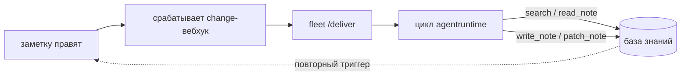

*О чём это: trip2g как буквальная операционная система. Заметки — файловая система, MCP — системные вызовы, федерация — сеть, агенты — процессы. Каждая строка в карте помечена «отгружено», «ветка» или «план», так что видно, где метафора заслужена, а где нет. Читать, если хотите решить, реальна ли «Markdown ОС» или это просто ярлык.*

trip2g начинался как способ превратить Obsidian-хранилище в сайт. По дороге он принял форму операционной системы. Заметки — это файловая система. MCP-эндпоинт — интерфейс системных вызовов, через который ходят агенты. Федерация — сетевой стек. Правка заметки может запустить агента. Большая часть этого уже работает в проде. Один кусок, на котором метафора и держится, — агенты как процессы — пока живёт в ветке. Это честная версия заявления: что отгружено, а что нет, помечено явно.

Рамку мы позаимствовали. Статья [«Markdown as an Operating System»](https://leverageai.com.au/markdown-as-an-operating-system/) формулирует мысль одной строкой: ваша ОС работает на бинарниках, а ваши ИИ-агенты должны работать на Markdown. Корень ещё старше — Unix, где «всё есть файл». Версия trip2g: всё есть заметка.

---

## Всё — заметка

Одно пространство имён, адресуемое по пути, общее для людей и агентов. Заметка — это markdown-файл. Фронтматтер — её метаданные, тело — содержимое. Нет второго хранилища, где лежат «настоящие» данные. Сайт, который читает человек, и ответ, который получает агент, — два представления одного файла.

Каждая правка фиксируется снимком в строку `note_versions` и зеркалится в git-репозиторий, который trip2g держит как ленивую копию, каноничную к базе. Поэтому история любой заметки — это дифф, который человек прочитает за пару секунд и откатит. В этом вся идея подложки: берём один формат, который уже понимают любой редактор, любой diff-инструмент и любая модель, и из него выводим сайт, ленту и журнал аудита.

---

## Карта

Слова из операционных систем здесь не для красоты. За каждым стоит конкретный механизм. Вот соответствие, с пометкой, насколько оно реально. «Отгружено» — работает на `main`. «Ветка» — на `feat/agent-runtime`. «План» — проектная заметка.

| Понятие ОС | Примитив trip2g | Статус |
|---|---|---|
| Файловая система | одно пространство имён заметок по пути | отгружено |
| Файлы | заметки: фронтматтер — метаданные, тело — содержимое | отгружено |
| Снимки | `note_versions` плюс git-зеркало, каноничное к базе | отгружено |
| Файловая система по git | clone, pull и push базы по git Smart HTTP (`/_system/git`) | отгружено |
| Системные вызовы | MCP-инструменты: `search`, `note_html`, `similar`, `federated_*` | отгружено |
| Сетевой стек | федерация, с TTL `max_depth` на каждом запросе | отгружено |
| Планировщик | cron-вебхуки плюс воркер-пулы goqite | отгружено |
| Диспетчер процессов | change-вебхуки: правка заметки шлёт событие POST'ом | отгружено |
| Права (люди) | сабграфы и доступ по подписке | отгружено |
| Права (агенты) | read/write-globы на вебхук в подписанном токене | отгружено |
| Хранилище секретов | зашифрованные секреты, AES-256-GCM | отгружено |
| Дисплейный сервер | сайт: default- и Jet-шаблоны, mermaid, datachart | отгружено |
| Цель вывода | публикация заметок в Telegram-канал, ссылки целы | отгружено |
| Стандартный ввод | формы во фронтматтере, отправки к заметке | отгружено |
| Пульт управления | заметка-канбан (`layout: kanban`) | отгружено (лейаут), ветка (привязка агента) |
| Исполнитель процессов | модельный цикл в заметке (`agentruntime`) | ветка |
| Менеджер пакетов | роль-как-заметка: `fleet` регистрирует агента | ветка |
| Лимиты ресурсов | жёсткие лимиты токенов и шагов на запуск | ветка |

Разбора стоят те строки, что делают реальную работу.

---

## Системные вызовы: MCP-сервер

Агент никогда не открывает базу. Он вызывает небольшой набор инструментов по [[ru/user/mcp|MCP]]: `search`, `note_html`, `similar` и варианты `federated_*`, которые разносят те же вызовы по соседним хабам. Инструмент `instructions` отдаёт заданный автором промпт. Доступ ограничен подпиской вызывающего, поэтому два агента, нацеленные на один хаб, видят разные заметки.

Свой инструмент можно описать во фронтматтере заметки через `mcp_method`. Это граница ядра: у базы знаний один контролируемый интерфейс, и всё, что делает агент, проходит через него.

---

## Сетевой стек: федерация

Хаб умеет [[ru/user/federation|пириться]] с другим хабом. `federated_search` на одном хабе выполняет запрос локально, пробрасывает его соседям и сливает результаты. Каждый хаб сам решает, по каждой базе, что именно показывать конкретному пиру.

Вызовы подписаны HMAC-SHA256 и несут короткоживущий токен. Циклы ограничены так же, как у IP-пакетов: каждый хаб сверяет `max_depth` со счётчиком глубины в заголовке `X-MCP-Federation-Depth` на каждый хоп, чтобы вопрос не гонялся по сети бесконечно. Запрос одного агента дотягивается до объединения всего, чем согласились делиться связанные хабы, и для этого никто не сливает базы.

Здесь старое имя trip2g — knowledge mesh — встаёт на место в новой рамке. Каждый хаб — это одна Markdown-ОС. Федерация — связь между ними, а mesh — сеть, которую эти связи образуют, как интернет — сеть между компьютерами. Форма за вами: звезда с центральным хабом и спутниками, цепочка, полная сетка, где все пирятся со всеми, или две звезды, соединённые одним мостом. Протокол не закладывает топологию, поэтому собрать можно любую.

---

## Планировщик и диспетчер процессов

Два механизма, оба на `main`. [[ru/user/change_webhooks|Change-вебхук]] срабатывает, когда заметку создают, меняют или удаляют: trip2g шлёт событие POST'ом агенту, агент пишет заметки обратно через API, glob-фильтр решает, какие заметки его запускают, HMAC подписывает доставку, а `max_depth` не даёт записи запустить саму себя по кругу.

Cron-вебхук запускает агента по расписанию. Им управляют колонка `next_run_at` и системный cron раз в минуту, а воркер-пул на goqite крутит задания с приоритетом и параллельностью по каждой очереди. Это та часть системы, что решает, когда что-то запускается. Что агент думает, она пока не решает.

---

## Userland: флот агентов

Это слой, который оправдывает слово «рантайм», и это слой, которого на `main` ещё нет. Он живёт на `feat/agent-runtime`.

Идея простая. Агент — это заметка. Её фронтматтер — конфигурация: какая модель, какие инструменты, `read_patterns` и `write_patterns`, что ограничивают доступ, `trigger_on`, что говорит, какие заметки его будят, `for_each`, `max_depth`, `timeout_seconds`. Тело — инструкция, написанная как Jet-шаблон, который умеет ссылаться на изменившуюся заметку. Демон `fleet` следит за папкой таких роль-заметок и регистрирует каждую как change-вебхук, направленный обратно в сам trip2g. Кладёшь заметку в папку — агент установлен. Удаляешь — его нет. Это и есть менеджер пакетов, а пакет — markdown-файл.

Когда отслеживаемая заметка меняется, вебхук срабатывает, и `fleet` запускает ограниченный цикл `agentruntime`. Модель получает инструкцию и контекст в пределах доступа и вызывает `search`, `read_note`, `write_note`, `patch_note` и `finish`. Чтение и запись сверяются с glob-шаблонами роли: агент, которому можно писать только в `reports/`, не тронет `roles/`. Потолок по токенам и шагам, который агент не может поднять, ограничивает запуск. `max_depth` исключает случай, когда собственная запись агента разбудила бы его заново. trip2g остаётся простым источником событий. Инструкция, границы и триггеры лежат в заметках, которые можно прочитать.

Обвязка под этим — вебхуки, ограниченные токены, задания доставки — отгружена. Модельный цикл в заметке и реконсайлер `fleet` — это то, что добавляет ветка.

---

## Дисплейный сервер: одна заметка, много рендереров

Одна и та же заметка рисуется для человека по-разному. Default-шаблон собирает страницу из фронтматтера, без кода. [[ru/user/templates|Кастомный Jet-шаблон]] берёт полный контроль и получает AST разметки: можно перебирать секции и верстать страницу до самого HTML. Поверх лежат расширения-рендереры, которые бэкенд подгружает на заметку только тогда, когда заметка их просит: [[ru/user/mermaid|mermaid]] для диаграмм, виджет [[ru/user/chartdata|datachart]], что превращает приложенный CSV в график, и остальной набор виджетов. Заметка объявляет, что ей нужно, и страница тащит только эти скрипты.

---

## Ещё один вывод: заметки как посты в Telegram

Сайт — не единственная цель рендера. Те же заметки публикуются в [[ru/user/telegram|Telegram-канал]], по расписанию или сразу, и trip2g держит граф ссылок целым через эту границу. Викилинк на заметку, у которой есть свой пост, ведёт на этот пост; заметка, которой поста ещё нет, откатывается на свою страницу на сайте, так что ссылка не висит мёртвой. Поправил заметку, пересинхронил — пост в канале обновился сам. Заметки — источник, канал — ещё одно их представление.

---

## Стандартный ввод: формы

Заметка умеет не только показывать данные, но и собирать их. Кладёшь блок [[ru/user/forms|`form:`]] во фронтматтер — trip2g рисует форму на странице, принимает отправки через GraphQL API и сохраняет каждую при заметке. Типы полей и валидаторы заданы во фронтматтере, публичные формы по умолчанию прикрывает Cloudflare Turnstile, а `can_submit` решает, кто может отправлять. Отправки попадают в админку и в API, на каждую уходит письмо админам базы. Это стандартный ввод заметки: контролируемый способ для внешнего мира записать данные в её входящие, ровно как остальная система даёт контролируемый вход агентам.

---

## Хранилище — это git-репозиторий

Есть ещё один вход в файловую систему. trip2g отдаёт всю базу знаний по git Smart HTTP на `/_system/git`, так что её можно `git clone`, тянуть и пушить. База остаётся каноном, а git-дерево не лежит готовым на диске: `gitapi` материализует его на лету в момент git-взаимодействия, и пуш применяется обратно в заметки. Это та же подложка со стороны разработчика: бэкап делаешь клоном, полную историю получаешь прямо в этом клоне, а правки вносишь коммитом вместо вызова API. И идея журнала аудита тут становится буквальной: то, что ты клонируешь, и есть настоящая история git.

---

## Пульт управления: канбан-доска

Доска — это заметка с [[ru/user/kanban|`layout: kanban`]]. Карточка — строка вида `- выпустить доки @status:doing @assigned:bob`. Правка карточки — это правка заметки, а значит тот же триггер, что запускает любого агента, может запустить агента-триажника: он читает доску и переписывает карточки на месте через `patch_note`. Заметка — одновременно то, что человек правит, чтобы рулить работой, и то, что агент читает и пишет.

Канбан-лейаут и отдельный `kanban_template` отгружены. Привязка доски к флоту — часть ветки.

---

## Один процесс и как его масштабировать

trip2g работает как один процесс на SQLite. Поднимать сервер БД не нужно, поэтому хаб одинаково стартует на ноутбуке, маленькой VM или в контейнере. Это осознанный размен: один процесс, который запускается где угодно. Когда одного процесса мало, путь масштабирования — read-only реплики: они берут на себя чтение, а записи идут через единственного лидера, что даёт высокую доступность без превращения хранилища в кластер. Работа над репликами живёт в ветке `feat/read-replica`.

---

## Где метафора ломается

Честная карта показывает свои края. trip2g — не редактор. Он оставляет редактирование на Obsidian и Telegram и берётся за дело только после того, как заметку сохранили. Так что если вы ждали операционную систему со своей оболочкой и окнами, парадная дверь — чужое приложение. Строка «менеджер пакетов» тоньше, чем звучит: пока это `fleet`, превращающий заметку в запись-вебхук, и только в ветке. Нет инструмента shell или exec для агентов, только чтение и запись, а проектная заметка, что его набрасывает, всё ещё только заметка. Есть и зазор между словом и железом: прод-хабы крутятся на одной небольшой VM, которой уже тесно, поэтому «гоняет процессы-агенты» — обещание, которое текущая коробка держит только на малом масштабе.

---

## Почему «операционная система», а не «платформа»

Слово рискованное. «ОС» истёрли за десять лет шаблоны для Notion и Obsidian, которые продают как «Life OS» или «Second Brain OS», где под ОС имеют в виду структуру папок и пару связанных страниц. Здесь заявление другое. Оно буквальное и проверяемое: есть общее пространство имён, контролируемый интерфейс вызовов, планировщик, сетевой стек с TTL, биты прав на каждого агента и модель процессов. На каждый пункт можно показать таблицу, миграцию, токен или цикл запуска. Метафору стоит брать только потому, что она проходит эту проверку, и проходит на каждой строке, кроме двух с пометкой «ветка» и «план».

Рамка — больше, чем переименование, и дело в сочетании, а не в отдельной фиче. Obsidian, Logseq, Foam, Dendron и org-mode — локальные редакторы. Quartz — статическая сборка. SilverBullet и TiddlyWiki на Node — живые серверы, но однопользовательские. Notion и Tana закрыты, не markdown-нативны и не умеют ни селф-хост, ни федерацию. trip2g — селф-хостед сервер, который держит много арендаторов, отдаёт MCP-интерфейс, федерируется между хабами, гоняет агентов на правках заметок и несёт в себе подписки и Telegram. Ни у кого из остальных нет больше двух пунктов разом. Рамка ОС — способ назвать этот набор точно.

---

## Три идеи, которые мы взяли

Из статьи и из Unix три строки сделали в проекте реальную работу.

Markdown — это подложка. Один файл, который уже читают любой инструмент и любая модель, а сайт, лента и история git выводятся из него, а не хранятся отдельно.

Файл — это интерфейс между процессами. Агент, записавший заметку, тем самым будит следующего агента. Координации не нужен API очереди, потому что сообщение — это сама заметка.

Дифф — это журнал аудита. Каждое изменение — это `note_version` и коммит. Действие агента приходит как проверяемый дифф под ограниченным токеном, а не строка в логе, которой надо верить.

Ничего из этого не требовало называть trip2g операционной системой. Но когда примитивы встали на места, слово уже описывало их.
