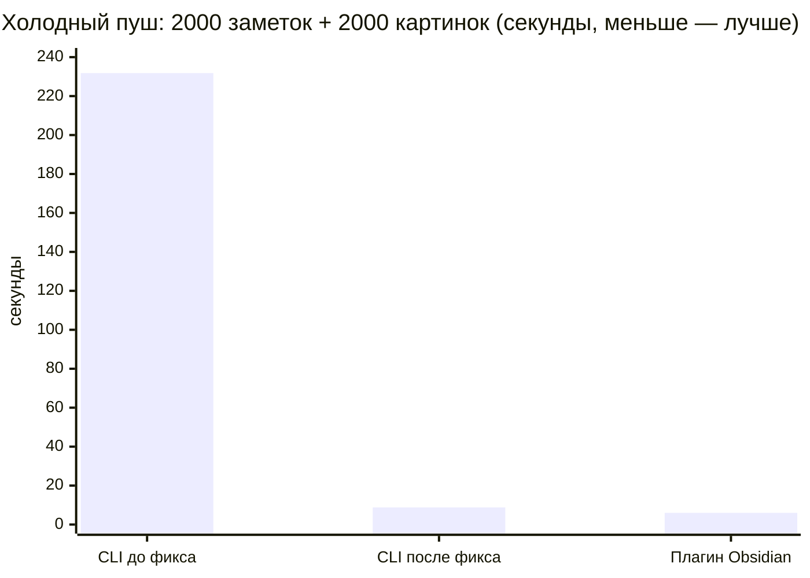
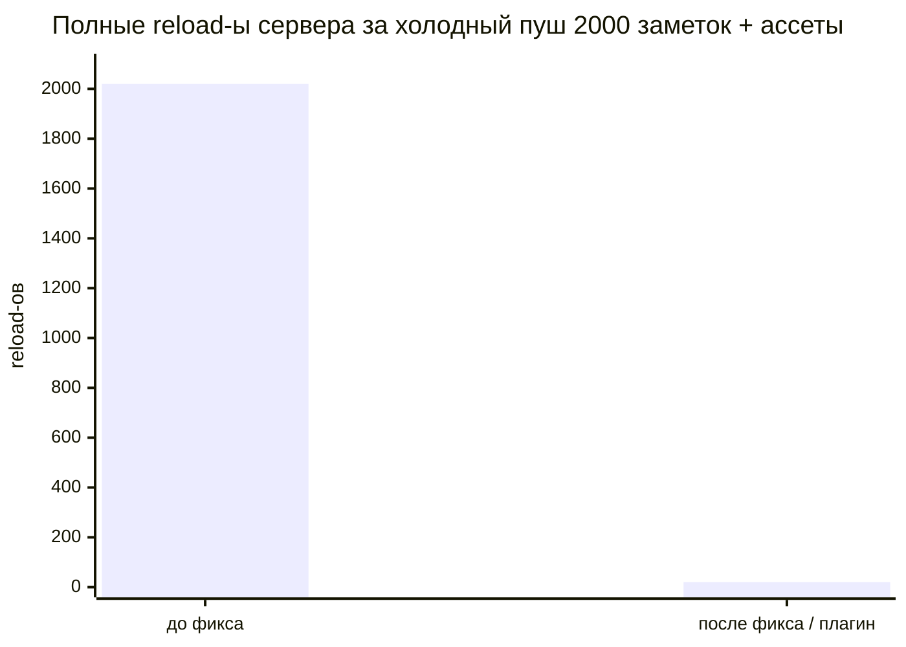

Мы пересматривали синхронизацию Obsidian в trip2g и собирались ускорить медленное хеширование. Потом построили бенчмарк и измерили. Тормозило в другом месте — один забытый флаг превращал пуш на 3 секунды в пуш на 4 минуты.

Главное число — холодный пуш 2000 заметок с 2000 маленьких картинок:

| Сценарий | Время |
|----------|-------|
| 2000 заметок, **без** ассетов | 3.3 с |
| 2000 заметок + 2000 картинок — **до** фикса | **231.8 с** |
| 2000 заметок + 2000 картинок — **после** фикса | **8.8 с** |
| То же, замер в живом плагине Obsidian | 6.0 с |

Все числа — с изолированного стенда (векторный поиск выключен, локальный сервер). История ниже.

---

## Стенд

Мы хотели знать, где синк реально тратит время, а не где мы это предполагаем. Собрали одноразовый стенд: сервер trip2g с выключенным векторным поиском, сгенерированный vault на 2000 детерминированных заметок и скрипт, который гоняет CLI-синк по реальным сценариям — холодный пуш, повторный синк без изменений, мелкая правка, двухсторонний. CLI использует ровно тот же код `classify`/`execute`, что и плагин, так что числа переносимы.

До измерений чтение кода выдало главного подозреваемого: кэш `mtime`/хешей, который читается, но никогда не пишется — значит каждый синк заново хеширует все 2000 файлов. Очевидно же узкое место. Так?

---

## Мёртвый кэш был — и почти ничего не стоил

Баг с кэшем реальный: запись действительно отсутствовала, и каждый холостой синк пере-хешировал все 2000 файлов. Мы ждали, что это и есть боль.

Потом замерили изолированно, без шума от старта процесса:

| Операция (2000 заметок) | Время |
|-------------------------|-------|
| Пере-хеш всех локальных файлов («мёртвый кэш») | **18 мс** |
| Полный classify 2000 (хеш + хеши сервера + сравнение) | 38 мс |
| Забрать все 2000 хешей с сервера (~80 КБ) | 10.5 мс |

Восемнадцать миллисекунд. Заметки мелкие, SHA-256 быстрый, 4 МБ текста хешируются мгновенно. «Очевидное» узкое место оказалось шумом. А ~0.4 с, которые CLI показывает на холостом синке, — это почти целиком старт процесса Node/`tsx`, чего долгоживущий плагин не платит вовсе.

Первый вывод: фикс кэша всё ещё стоит сделать (он растёт с размером заметок и важен по медленной сети), но он был далеко не на вершине списка. Мы это узнали только потому, что измерили.

---

## Настоящая цена: ассеты и один забытый флаг

Первый бенчмарк гонял на голых заметках. Синк был быстрым везде. Тогда мы сделали нагрузку реальной — дали каждой заметке крошечный PNG 1×1.

Холодный пуш вырос с 3.3 с до **231.8 с**.

Рост в 70 раз от 138 КБ картинок. Цена не в байтах — это ~116 мс чистого оверхеда **на каждый ассет**. Лог сервера всё объяснил: каждый вызов `uploadNoteAsset` запускал полный reload всех заметок (`PrepareLatestNotes`). Две тысячи загрузок — две тысячи полных reload-ов.

Причина — одно отсутствующее поле. Мутация загрузки принимает `skipCommit`, который батчит работу и откладывает reload до одного финального commit. Плагин Obsidian его слал. А **CLI и browser-sync — нет**, поэтому платили полный reload на каждый ассет.

Добавили `skipCommit: true` в загрузку CLI и browser. Холодный пуш: **231.8 с → 8.8 с**, ускорение в 26 раз. Число reload-ов упало с ~2020 до ~20 (по одному на батч из 100 заметок плюс финальный commit).

Самое важное: это был **баг CLI / bulk-синка, а не плагина**. Живой плагин Obsidian уже слал `skipCommit` и проходил те же 2000 ассетов за **6.0 с** — мы проверили напрямую, по логам сервера видно 20 reload-ов, а не 2000. Если ваша боль — `obsidian-sync` из командной строки или CI, вот ваши 26×. Если вы работаете в плагине интерактивно — у вас и так всё было в порядке.

---

## Краш, который прятался за фичей, которой ещё никто не пользовался

Пока подключали живой синк (ниже), нашли латентный краш в серверной in-process шине событий. На отписке она закрывала канал подписчика; публикация, гонящаяся с этим закрытием, давала `send on closed channel` и роняла **весь сервер**, а не только подписку.

Он не стрелял, потому что подписчиков ещё не было. Но как только реальный клиент начинает подключаться и отключаться регулярно, каждый дисконнект во время сохранения — это орёл-или-решка-паника.

Первая заплатка была однострочной (перестать закрывать канал). Финальный фикс — идиоматичный: отдельный `done`-канал на подписчика, на который `Publish` смотрит через `select`, так что он никогда не шлёт ушедшему подписчику и никогда не закрывает канал данных. Прогнали под нагрузкой с детектором гонок — чисто.

---

## Живой синк — честно, это про UX, а не про скорость

На бэкенде уже была подписка `noteChanges` через Server-Sent Events; плагин просто её не использовал. Мы дописали клиента: плагин держит живое соединение и подтягивает изменения с сервера в момент, когда они случились, а не ждёт до минуты следующего опроса.

Соблазнительно продать это как «быстрый синк». Это не так, и вот честная причина: запрос, который он заменил бы — `notePaths` — **не медленный**. Хеш контента, который он отдаёт, — это заранее посчитанная колонка в базе; забрать все 2000 — это чтение по индексу на ~10 мс и ~80 КБ. Живой синк заменяет **таймер, а не запрос**. Этот запрос всё равно нужен для холодного старта и для догона после обрыва связи.

Что живой синк реально даёт:

- **Мгновенные обновления** вместо лага до 60 секунд — настоящая ценность для нескольких устройств и правок агентами.
- **Меньше холостого трафика** — нет опроса на 80 КБ каждую минуту в сессии, которая может быть почти простаивающей.

Поэтому опрос мы оставили, просто реже: проверка раз в 60 секунд стала фоновой сверкой раз в 5 минут (шина может терять события под нагрузкой, так что периодическая полная сверка остаётся страховкой), а свежесть между ними несут живые события.

Всё проверили end-to-end, включая случаи, где можно потерять данные:

- **Конфликт** — правишь файл локально, на сервере его меняют иначе: локальная правка **не** перезаписывается, показывается окно конфликта.
- **Удаление** — заметку скрыли на сервере: локальный файл **не** удаляется сам, сначала спросят.
- **Без эхо-петли** — одно изменение на сервере даёт ровно одно событие; плагин тянет, не записывая обратно.
- **Фильтрация** — изменение вне ваших include-шаблонов не приходит.

---

## Что бы мы сделали иначе

Сначала строить бенчмарк. Статический разбор ошибся в оценке узкого места на два порядка — короновал фикс кэша на 18 мс и полностью пропустил путь ассетов на 231 секунду, потому что тесты на голых заметках ассеты не трогали. Реальные данные (картинки, и много) — вот что вскрыло настоящую цену.

И измеряйте то, что собираетесь «оптимизировать», до того как оптимизируете. Мы чуть не отправили переписывание кэша ради экономии 18 мс, пока выигрыш в 26× лежал в одном булевом поле мутации.
