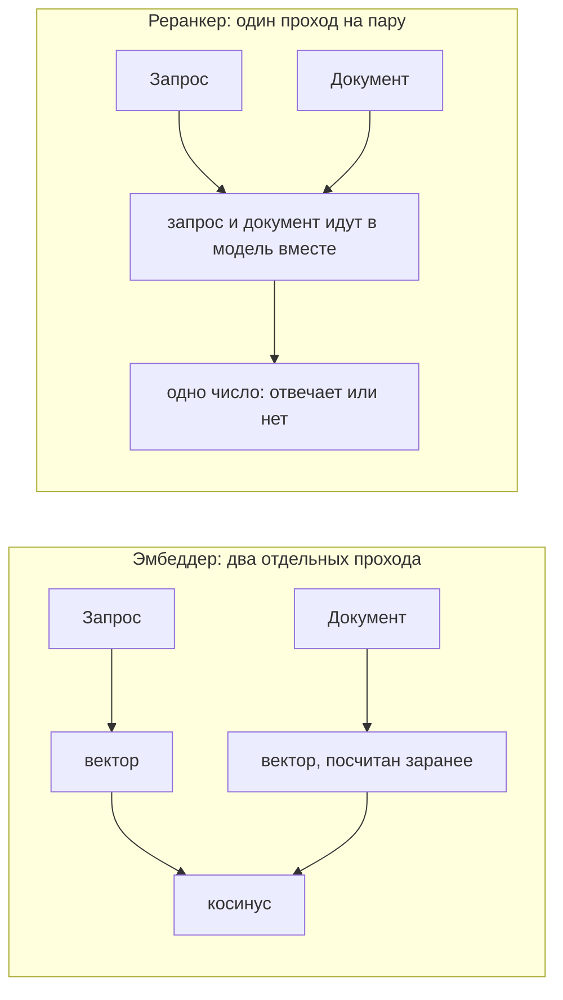
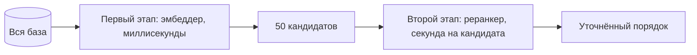

*О чём это: что такое реранкер, зачем он нужен поиску и как наш реранкер полтора месяца не работал на проде. 61 354 отказа из 61 359 запросов, и ни один из них никто не увидел. Заодно про то, почему мы его выключили, а не починили. Читать, если у вас гибридный поиск и вы думаете, добавлять ли вторую ступень.*

Поисковый эмбеддер кодирует запрос и документ по отдельности. Текст на входе, тысяча с небольшим чисел на выходе. Документ сжимался в этот вектор, когда о будущем вопросе никто ещё не знал. Отсюда и скорость, и грубость: векторы считаются заранее, поиск по миллионам занимает миллисекунды, а тонкую связь вопроса с ответом такая модель видит плохо.

Реранкер устроен иначе. Это cross-encoder: он берёт запрос вместе с документом и прогоняет их через модель за один проход, где токены вопроса видят токены документа. На выходе не вектор, а одно число: насколько этот текст отвечает на этот запрос.



Разница видна на глаз. На запрос «столица Франции» наш реранкер даёт тексту «Париж, столица Франции» оценку 0,9998, а тексту «Кошки любят рыбу» ставит 0,0000164.

Заранее такое не посчитаешь: пар из запроса и документа столько, сколько запросов, а запросы приходят в будущем. Поэтому реранкер работает вторым этапом. Дешёвый первый достаёт полсотни кандидатов из всей базы, дорогой второй уточняет их порядок.



Это стандартная схема retrieve-then-rerank, и мы внедрили её у себя.

---

## Мы внедрили осторожную версию, и она измерилась хорошо

Первая попытка провалилась: реранкер просто заменял порядок первого этапа своим, и на нашем корпусе это измерилось строго хуже. Мы её убрали и вернулись с blend-режимом, где оценка cross-encoder не заменяет порядок, а смешивается с ним. Сильный первый этап остаётся у руля, вторая ступень только подталкивает.

На голден-сете из 60 проверенных вручную двуязычных запросов blend дал nDCG@10 0,9491 против 0,9263 без него. Прибавка +0,023. Самая заметная часть пришлась туда, где первый этап был слабее всего: на кросс-язычное направление «английский запрос → русский документ», +0,057. Мы включили реранкер в конфиге пула 8 июля.

## Полтора месяца он возвращал ошибку на каждый запрос

Мы посмотрели его метрики 21 августа:

```
te_request_count{method="batch"}      61359
te_request_failure{err="batch_size"}  61354
te_request_success{method="batch"}        5
```

Пять успешных запросов из шестидесяти одной тысячи. Все пять были нашими тестовыми, сделанными за десять минут до этого замера.

Причина оказалась в одной цифре. Сервер, который обслуживает cross-encoder, запущен с ограничением `--max-client-batch-size 8`: не больше восьми документов в запросе. А в конфиге поиска стояло `top_n: 50`, и клиент честно отправлял все пятьдесят кандидатов одним запросом. Сервер отвечал `422 batch size 50 > maximum allowed batch size 8`. Код ловил ошибку, писал предупреждение в лог и возвращал порядок первого этапа, ровно так, как был написан.

Восьмёрку мы поставили сами, ради экономии памяти на боксе. Стенд, на котором мерили качество, запускал тот же сервер вообще без этих флагов, то есть на дефолтах, где лимит равен 32, и с `top_n: 20`. Двадцать меньше тридцати двух, поэтому на стенде всё работало. Никто не сравнил два набора флагов между собой.

## Почему это никто не поймал

Деградация была слишком мягкой. Поиск не падал, ответы приходили, качество просело на те самые две сотых nDCG, которые на глаз не видны. Отказ второй ступени выглядел точно так же, как обычная выдача.

Метрики сервера при этом существовали, те самые 61 354, но лежали на его основном порту, а Prometheus их не собирал. Счётчика, который отличал бы «реранк отработал» от «реранк отвалился», не было нигде. Мы прочитали эти цифры впервые через полтора месяца, и только потому, что полезли в сервер по другому делу.

Отсюда первый урок: у graceful degradation обязан быть счётчик. Запасной путь, неотличимый от успешного, будет прятать поломку столько, сколько вы его не проверяете.

## Операция линейно дорогая, и это главное про неё

Мы замерили цену на своём боксе. Пятьдесят документов по 326 токенов считались 48,5 секунды на CPU. Это примерно секунда на кандидата, и число растёт вместе с `top_n` линейно: двадцать кандидатов дают двадцать секунд.

Размер окна почти ни на что не влияет: при 4096 токенах те же пятьдесят документов считались 48,5 секунды, при 512 от 50 до 58. Cross-encoder на CPU всё равно считает по четыре пары за раз и упирается в арифметику, а не в память.

Двадцать секунд к каждому поисковому запросу означают не «дороговато», а другой продукт. Для агента, который ведёт исследование и готов ждать, размен приемлемый. Для человека, который набрал запрос в поисковой строке, он неприемлем. Мы покупали +0,023 nDCG за двадцать секунд ожидания.

## Что мы сделали

В публичной песочнице реранкер выключен. Он и так не работал, так что выключение не изменило ни одного результата поиска. Оно лишь убрало шестьдесят тысяч холостых HTTP-запросов и записало причину рядом с флагом, чтобы его не вернули вслепую.

Для тех, кто разворачивает trip2g у себя, мы сделали флаг двухуровневым. `enabled` теперь означает «сайдкар есть, просить можно», а не «ранжировать всегда». Появился отдельный параметр `rerank` в MCP-инструментах поиска и в GraphQL-поиске: агент или клиент решает для конкретного запроса, стоит ли ответ ожидания. Параметр не показывается вовсе, если реранкер не подключён. Аргумент, который инстанс не может выполнить, хуже отсутствующего: агент потратит ход, выясняя, что тот ничего не делает. В описании параметра указана цена в кандидатах и то, что будет, если ничего не передать.

Если вам нужны действительно точные ответы, подключайте реранкер на GPU. Модель та же, схема та же, меняется только арифметика: секунда на кандидата превращается в доли секунды, и размен из неприемлемого становится очевидным.

---

## Что мы забрали с собой

Стенд, на котором вы меряете качество, и прод должны совпадать по флагам запуска. Наш отличался двумя параметрами, и оба относились к тому, сколько данных влезает в один запрос.

`top_n` работает как размер запроса к серверу, а не только как ручка качества. У любого сервиса есть максимум; если `top_n` в него не влезает, не работает ничего.

И самое дорогое: цену фичи надо мерить в единицах пользователя. Мы обсуждали реранкер в терминах nDCG две попытки подряд. Стоило измерить его в секундах ожидания, и решение стало очевидным за один разговор.
