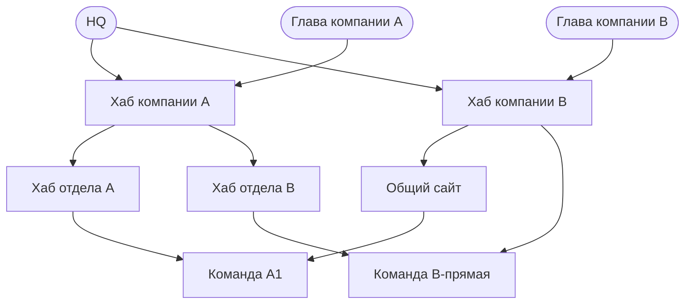

Любую границу — между компаниями, отделами, командами — вы задаёте двумя независимыми настройками: кто может искать у кого и что при этом видно. Federation-ребро даёт право искать у пира. Подграф решает, какие заметки этот поиск вернёт. Настройки независимы, поэтому каждая база держит свой приватный контекст закрытым — даже от родителя, у которого есть валидное ребро к ней.

Эта страница показывает приём на конкретном примере. За механикой — KB-заметки, входящие и исходящие секреты, scope подграфов — смотрите [[ru/user/federation]].

### Две независимые оси

Разделение контекста в trip2g держится на двух осях, которые настраиваются отдельно друг от друга.

**Ребро задаёт, кто может искать.** Federation-ребро — это направленная связь `A → B`. Она даёт агенту A право искать у B. Направление важно: `A → B` не даёт B права искать у A. Каждое ребро — это KB-заметка на стороне A (`mcp_federation_kb_url` указывает на B) и пара секретов с заданным scope, которыми стороны обмениваются один раз.

**Подграф задаёт, что видно при этом поиске.** Каждая заметка может нести метку `subgraph:`. Секрет ребра привязан к одному или нескольким подграфам, и пир возвращает только заметки из этих подграфов. Заметка в подграфе, который ребро не выдаёт, не вернётся никогда — даже по валидной, аутентифицированной связи.

Оси ортогональны — в этом весь смысл. Вы даёте право на поиск, но открываете только выбранный срез, а остальное запечатываете.

**Пример.** Дайте партнёру ребро к вашей базе и привяжите его секрет к подграфу `shared-research`. Партнёр может искать у вас и видит ваши исследовательские заметки — и больше ничего.

**Анти-пример.** Тот же партнёр запускает поиск, который совпал бы с вашей заметкой `client-contracts`. Заметка в приватном подграфе, который его ребро не включает. Партнёр получает пустой результат. Ребро валидно, заметка остаётся на месте.

«Ребро — кто может искать. Подграф — что видно при этом поиске».

### Разбор на примере организации

Возьмём организацию из двух компаний под общим владельцем. Десять баз знаний, одиннадцать направленных рёбер. Каждая база — отдельный инстанс trip2g со своим эндпоинтом `/_system/mcp`, своими заметками и своим администрированием.

Роли:

| База | Роль |
|------|------|
| HQ | Владелец — видит обе компании |
| Глава компании A | Топ-менеджмент A, входит сбоку |
| Глава компании B | Топ-менеджмент B, входит сбоку |
| Хаб компании A | Хаб компании A |
| Хаб компании B | Хаб компании B |
| Хаб отдела A | Хаб отдела под компанией A |
| Хаб отдела B | Хаб отдела под компанией A |
| Общий сайт | Общий сайт под компанией B |
| Команда A1 | Лист |
| Команда B-прямая | Лист |

Стрелки указывают направление поиска: `A → B` означает «A может искать у B».

**Легенда.** Стрелка `A → B` означает «A может искать у B». Каждая база держит 🔒 приватный контекст, в который не заходит ни одна стрелка.

Каждый узел также держит **приватную заметку** — свой внутренний контекст. Ни одно ребро в этом графе до неё не дотягивается. Это главная гарантия, а всё остальное на странице — её вариации.

### Что доступно каждой роли

| Роль | Достаёт | Не достаёт |
|------|---------|------------|
| HQ | Обе компании вплоть до листовых команд | Ничьего приватного контекста |
| Глава компании A | Всё дерево компании A | Компанию B; ничей приватный контекст |
| Глава компании B | Дерево компании B | Компанию A; ничей приватный контекст |
| Хаб отдела A | Команду A1 | Всё за пределами ветки; приватный контекст |
| Команда A1, Команда B-прямая | Ничего — это листья | Всё; приватный контекст |

Прочитайте таблицу сверху вниз — и одна строка повторяется в каждой: ничей приватный контекст недостижим. Охват расширяется или сужается по роли; приватная граница не сдвигается.

### Что показывает эта топология

**Боковой вход — частичная видимость по замыслу.** Глава компании A входит в граф через одно ребро в хаб компании A. Оттуда он достаёт всю компанию A и ничего из компании B. Вы не настраивали запрет на компанию B — там просто нет ребра. Видимость — это то, что вы выдаёте, а не то, что запрещаете.

**Ромбы — база может принадлежать нескольким контекстам.** Команда A1 достижима двумя путями: через хаб отдела A и через общий сайт. Команда B-прямая — через хаб отдела B и через хаб компании B. Одна база может находиться сразу в нескольких контекстах, не копируясь ни в один из них.

**Направление — поиск односторонний, пока вы не сделаете его двусторонним.** HQ ищет у компаний. Компании у HQ не ищут. Каждое ребро даёт ровно одно направление. Чтобы ребёнок мог запрашивать родителя, добавьте отдельное обратное ребро со своим секретом. Большинство организационных границ односторонние — это поведение по умолчанию.

**Приватная изоляция — гарантия, которая держит всю конструкцию.** Каждая база хранит приватную заметку, которую не вернёт ни одно ребро. Родитель с валидным аутентифицированным ребром к ребёнку всё равно не видит приватный контекст ребёнка. Ребро даёт доступ к публичному подграфу; приватный подграф в его scope не входит, поэтому поиск по ребру проходит мимо приватной заметки. Хаб отдела A может искать у команды A1 сколько угодно — и никогда не увидит её приватную заметку.

Каждая база остаётся автономной. Свои заметки, своё администрирование, свой приватный контекст. Федерация — это роутинг с заданным scope: общего индекса нет, между базами ничего не копируется.

### Как это настроить

Рёбра и подграфы из этого примера — обычная конфигурация федерации. Приём одинаков для каждого ребра `A → B`:

1. На стороне B (база, у которой ищут) добавьте входящий секрет и привяжите его scope только к публичному подграфу — приватный оставьте за рамками. Именно этот выбор запечатывает приватный контекст B.
2. На стороне A (тот, кто ищет) добавьте парный исходящий секрет и KB-заметку, где `mcp_federation_kb_url` указывает на `/_system/mcp` базы B.
3. Пометьте приватные заметки B подграфом, который входящий секрет не выдаёт.

Повторите для каждого из одиннадцати рёбер. Для ромбов у листа просто два входящих секрета — по одному на каждого родителя. Для обратного направления пройдите те же три шага в обратную сторону.

Точные шаги в администрировании, обмен секретами и панель scope — в [[ru/user/federation]]. Эта страница — карта, та — инструкция.

### Дополнительно

- [[ru/user/federation]] — механика: KB-заметки, секреты, scope подграфов, панель графа федерации
- [[ru/user/mcp]] — как работает локальный MCP-сервер и контроль доступа по подграфам
- [[ru/user/advanced]] — подграфы и управление доступом в продукте в целом
