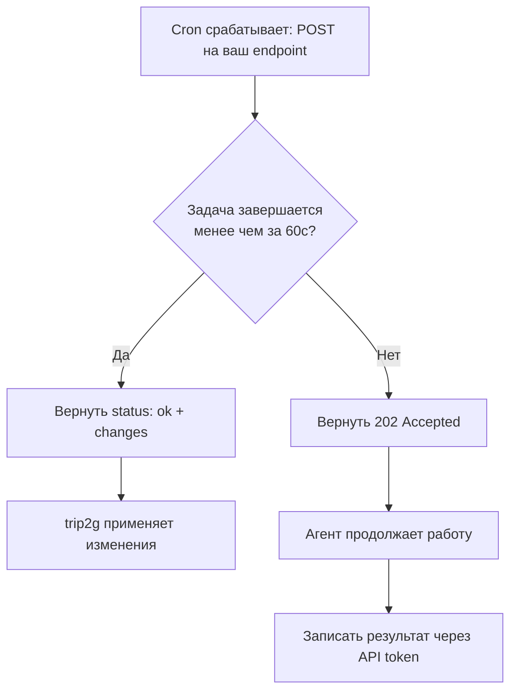

Запускайте AI-агентов и автоматизации по расписанию — без постоянного сервера.

Обычно для задач по расписанию нужен отдельный сервер с cron-демоном. Без него приходится запускать скрипты вручную: генерировать дайджесты, собирать отчёты, обновлять данные. Cron-вебхуки берут это на себя — вы задаёте расписание один раз, дальше всё работает само.

### Кому подходит

- Авторам блогов — автоматический дайджест новых постов каждое утро
- Командам — еженедельный отчёт по активности без ручной работы
- Проектам с регулярным контентом — серия заготовок для постов по расписанию
- Любому, кто повторяет одно и то же действие каждый день, неделю или месяц

### Как это работает

1. Создаёте cron вебхук: URL + расписание + инструкция
2. В назначенное время сервер отправляет POST
3. Агент выполняет задачу — генерирует контент, обновляет данные, делает отчёт

### Расписание

Используется стандартный cron-синтаксис:

| Выражение | Когда |
|-----------|-------|
| `0 9 * * *` | Каждый день в 9:00 |
| `0 9 * * 1` | Каждый понедельник в 9:00 |
| `0 */6 * * *` | Каждые 6 часов |
| `30 8 1 * *` | 1-го числа каждого месяца в 8:30 |
| `0 0 * * 5` | Каждую пятницу в полночь |

Расписание работает в timezone из настроек проекта.

### Что приходит в запросе

```json
{
  "id": 42,
  "instruction": "Сгенерируй дайджест за последние сутки из заметок в blog/",
  "api_token": "eyJhbGc...",
  "response_schema": { ... }
}
```

`response_schema` — подсказка агенту о формате ожидаемого ответа.

### Режимы работы агента



**Синхронно** — агент возвращает результат прямо в ответе (до истечения таймаута):

```json
{
  "status": "ok",
  "changes": [
    {
      "path": "digests/2026-02-23.md",
      "content": "# Дайджест за 23 февраля\n\n...",
      "expected_hash": ""
    }
  ]
}
```

Сервер применяет изменения автоматически. Для новых файлов `expected_hash` оставьте пустым.

**Асинхронно** — агент возвращает `202 Accepted` и работает через API-токен без ограничений по времени:

```json
{"status": "accepted"}
```

Используйте асинхронный режим для долгих задач или если нужно больше 60 секунд.

### API-токен

Включите **Pass API key** — агент получит временный токен для работы с API:

- Читать заметки для анализа
- Создавать новые заметки с результатами
- Доступ ограничен паттернами чтения и записи из настроек вебхука

По умолчанию: читать всё, писать ничего. Задайте `write_patterns` если агент должен создавать заметки.

### Что может пойти не так

**Неверный cron-синтаксис** — вебхук не запускается. Проверьте выражение на [crontab.guru](https://crontab.guru) перед сохранением.

**Расхождение временной зоны** — задача запускается не в то время. Убедитесь, что timezone в настройках проекта соответствует вашему региону.

**Таймаут в синхронном режиме** — агент не успевает за 60 секунд и возвращает ошибку. Переключитесь на асинхронный режим для долгих задач.

**Агент не создаёт файлы** — не задан `write_patterns`. Добавьте паттерн записи в настройках вебхука, например `digests/*`.

**Неожиданный формат ответа** — сервер не применяет изменения. Проверьте, что агент возвращает объект с полем `changes` и каждый элемент содержит `path` и `content`.

### Примеры использования

**Дайджест** — каждый день в 9:00 агент читает новые посты и создаёт сводку `blog/digest.md`.

**Недельный отчёт** — каждую пятницу генерирует отчёт по активности за неделю.

**Генератор контента** — раз в неделю агент получает инструкцию и создаёт серию заготовок для постов.

**Бекап** — раз в неделю читает все заметки и экспортирует в внешнее хранилище.

**Мониторинг** — каждый час проверяет метрики и обновляет дашборд-заметку.

**Рассылка** — каждое утро берёт «заметку дня» и отправляет подписчикам.
